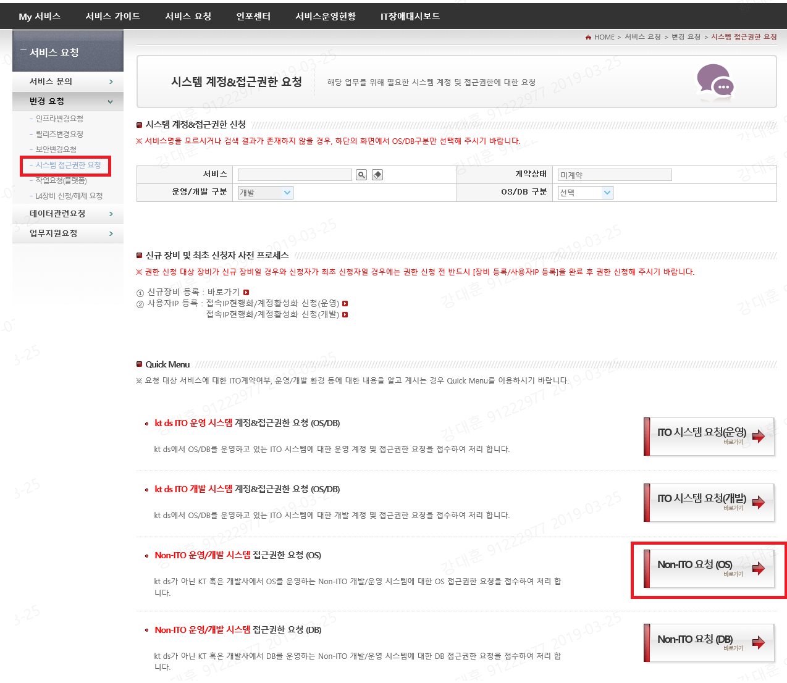

# 1. 목차
- [1. 목차](#1-%EB%AA%A9%EC%B0%A8)
- [2. 개정이력](#2-%EA%B0%9C%EC%A0%95%EC%9D%B4%EB%A0%A5)
- [3. 필수 방화벽 신청 가이드](#3-%ED%95%84%EC%88%98-%EB%B0%A9%ED%99%94%EB%B2%BD-%EC%8B%A0%EC%B2%AD-%EA%B0%80%EC%9D%B4%EB%93%9C)
  - [3.1. 개요](#31-%EA%B0%9C%EC%9A%94)
  - [3.2. 방화벽 및 OS접근제어 신청](#32-%EB%B0%A9%ED%99%94%EB%B2%BD-%EB%B0%8F-os%EC%A0%91%EA%B7%BC%EC%A0%9C%EC%96%B4-%EC%8B%A0%EC%B2%AD)
    - [3.2.1. 방화벽 신청](#321-%EB%B0%A9%ED%99%94%EB%B2%BD-%EC%8B%A0%EC%B2%AD)
      - [3.2.1.1. 방화벽 신청 양식](#3211-%EB%B0%A9%ED%99%94%EB%B2%BD-%EC%8B%A0%EC%B2%AD-%EC%96%91%EC%8B%9D)
      - [3.2.1.2. 방화벽 신청 부문](#3212-%EB%B0%A9%ED%99%94%EB%B2%BD-%EC%8B%A0%EC%B2%AD-%EB%B6%80%EB%AC%B8)
      - [3.2.1.3. 주요 방화벽 리스트](#3213-%EC%A3%BC%EC%9A%94-%EB%B0%A9%ED%99%94%EB%B2%BD-%EB%A6%AC%EC%8A%A4%ED%8A%B8)
      - [3.2.1.4. Hosts 파일 수정](#3214-hosts-%ED%8C%8C%EC%9D%BC-%EC%88%98%EC%A0%95)
    - [3.2.2. 사내 OS 접근 권한 신청](#322-%EC%82%AC%EB%82%B4-os-%EC%A0%91%EA%B7%BC-%EA%B6%8C%ED%95%9C-%EC%8B%A0%EC%B2%AD)
      - [3.2.2.1. 접속IP 현행화 / 계정 활성화](#3221-%EC%A0%91%EC%86%8Dip-%ED%98%84%ED%96%89%ED%99%94--%EA%B3%84%EC%A0%95-%ED%99%9C%EC%84%B1%ED%99%94)
      - [3.2.2.2. 사내 OS 접근 권한 신청 양식](#3222-%EC%82%AC%EB%82%B4-os-%EC%A0%91%EA%B7%BC-%EA%B6%8C%ED%95%9C-%EC%8B%A0%EC%B2%AD-%EC%96%91%EC%8B%9D)
      - [3.2.2.3. 사내 OS 접근 권한 신청 리스트 - DEV](#3223-%EC%82%AC%EB%82%B4-os-%EC%A0%91%EA%B7%BC-%EA%B6%8C%ED%95%9C-%EC%8B%A0%EC%B2%AD-%EB%A6%AC%EC%8A%A4%ED%8A%B8---dev)
      - [3.2.2.4. 사내 OS 접근 권한 신청 리스트 - PRD](#3224-%EC%82%AC%EB%82%B4-os-%EC%A0%91%EA%B7%BC-%EA%B6%8C%ED%95%9C-%EC%8B%A0%EC%B2%AD-%EB%A6%AC%EC%8A%A4%ED%8A%B8---prd)
  - [3.3. LAMP 관련 방화벽 신청](#33-lamp-%EA%B4%80%EB%A0%A8-%EB%B0%A9%ED%99%94%EB%B2%BD-%EC%8B%A0%EC%B2%AD)
    - [3.3.1. LAMP 관련 방화벽 list](#331-lamp-%EA%B4%80%EB%A0%A8-%EB%B0%A9%ED%99%94%EB%B2%BD-list)


# 2. 개정이력

|    날짜    | 변경내용  | 작성자 | 비고 |
| :--------: | :-------: | :----: | :--: |
| 2019.02.28 | 최초 작성 | 강대훈 |      |
|            |           |        |      |
|            |           |        |      |


# 3. 필수 방화벽 신청 가이드


## 3.1. 개요

개발 생산성 향상을 위한 외부 네트워크 제공 서비스(Nexus, Yum, Docker Registry 외부 3종의 유형과  Git) 및 프로젝트를 위한 특정 시스템의 사용 및 접속을 위해서는 본인 확인용 ID 외에 별도로 방화벽 신청과 각 시스템의 접근 제어 신청이 필요합니다. 


## 3.2. 방화벽 및 OS접근제어 신청

해당 신청은 KT ITSM(http://itsm.ktds.co.kr)의 '서비스 요청 > 변경요청 > 보안변경요청 > 보안관련 요청'에서 가능합니다. 방화벽 및 각종 접근제어 신청은 아래 링크의 도움말을 참고하시기 바랍니다. 

- 도움말 : http://ktacs.kt.com/custom/default/element/help_fw/help_fw.html

※ 본 영역은 개인과 서버간의 방화벽 및 OS접근제어에 대해서만 기술합니다. 만약 프로젝트 진행을 위해 신규 Node를 할당받고 LAMP에 Log를 전달해야 하는 경우라면 서버간의 방화벽 작업이 필요합니다. 이 부분은 3.3 LAMP 관련 방화벽 신청을 참고하시기 바랍니다.


### 3.2.1. 방화벽 신청

개발 생산성 향상을 위해 외부 네트워크 접근을 하기 위한 서비스(Nexus, Yum, Docker Registry 외부 3종의 유형과  Git) 및 프로젝트를 위한 특정 시스템의 사용 및 접속을 위해 방화벽 신청이 필요합니다.


#### 3.2.1.1. 방화벽 신청 양식

신청서에는 기관/소속, 성명, 연락처, 시스템명, IP정보, 요청시스템명, 요청 기관 등의 항목을 기입하여 제출합니다.

신청서 양식은 
"**서비스 요청 > 변경요청 > 보안변경요청 > 보안관련 요청 > 보안 템플릿 : KT\_보안\_방화벽 신청**" 화면에서 양식을 다운로드 하거나 아래의 링크에서 다운로드 가능합니다. 

- 샘플 :  03. Welcome Pack 구성 > [방화벽\_정책신청서\_XXX프로젝트_샘플.xlsx](http://gitlab.msa.kt.com/coe-istio-master/msa-bunker/blob/master/deliverables/03.%20Welcome%20Pack%20%EA%B5%AC%EC%84%B1/%EB%B0%A9%ED%99%94%EB%B2%BD_%EC%A0%95%EC%B1%85%EC%8B%A0%EC%B2%AD%EC%84%9C_XXX%ED%94%84%EB%A1%9C%EC%A0%9D%ED%8A%B8_%EC%83%98%ED%94%8C.xlsx) 


#### 3.2.1.2. 방화벽 신청 부문

개발 생산성 향상을 위한 외부 네트워크 제공 서비스(Nexus, Yum, Docker Registry 외부 3종의 유형과  Git) 와 주요 방화벽 신청 부문은 아래의 구성도 및 방화벽 리스트를 참고하시기 바랍니다. 


#### 3.2.1.3. 주요 방화벽 리스트

| Target IP      | Port | Protocol | 내용                        | 환경 |
| -------------- | ---- | -------- | --------------------------- | ---- |
| 10.217.59.19   | 80   | TCP      | Yum                         | DEV  |
| 10.217.59.19   | 443  | TCP      | Yum                         | DEV  |
| 10.217.59.19   | 5000 | TCP      | Docker Registry             | DEV  |
| 10.217.59.19   | 8000 | TCP      | Docker Registry Browser     | DEV  |
| 10.217.59.19   | 8001 | TCP      | Docker Registry Web         | DEV  |
| 10.217.59.19   | 8002 | TCP      | arbitrary                   | DEV  |
| 10.217.59.20   | 80   | TCP      | Git                         | DEV  |
| 10.217.59.20   | 443  | TCP      | Git                         | DEV  |
| 10.217.59.20   | 5000 | TCP      | arbitrary (Docker Registry) | DEV  |
| 10.217.59.20   | 8000 | TCP      | arbitrary                   | DEV  |
| 10.217.59.20   | 8001 | TCP      | arbitrary                   | DEV  |
| 10.217.59.20   | 8002 | TCP      | arbitrary                   | DEV  |
| 10.217.59.16   | 80   | TCP      | Master Node L4              | DEV  |
| 10.217.59.16   | 443  | TCP      | Master Node L4              | DEV  |
| 10.217.59.30   | 80   | TCP      | KTIS Infra Node L4          | DEV  |
| 10.217.59.30   | 443  | TCP      | KTIS Infra Node L4          | DEV  |
| 10.217.58.25   | 80   | TCP      | DMZ Infra Node L4           | DEV  |
| 10.217.58.25   | 443  | TCP      | DMZ Infra Node L4           | DEV  |
| 10.217.59.89   | 80   | TCP      | Nexus                       | DEV  |
| 10.217.59.89   | 443  | TCP      | Nexus                       | DEV  |
| 10.217.50.50   | 80   | TCP      | 컨테이너 포털               | DEV  |
| 10.217.50.50   | 443  | TCP      | 컨테이너 포털               | DEV  |
| 10.220.184.65  | 80   | TCP      | YUM                         | PRD  |
| 211.252.120.27 | 80   | TCP      | DMZ Ingress LB              | PRD  |
| 211.252.120.27 | 443  | TCP      | DMZ Ingress LB              | PRD  |
| 10.220.184.94  | 80   | TCP      | KTIS Ingress LB             | PRD  |
| 10.220.184.94  | 443  | TCP      | KTIS Ingress LB             | PRD  |
| 10.220.184.78  | 80   | TCP      | KTIS MASTER LB              | PRD  |
| 10.220.184.78  | 443  | TCP      | KTIS MASTER LB              | PRD  |

- 목적지 담당자

```xml
기관/소속 : 인프라서비스단 Cloud플랫폼담당 Cloud Transformation팀	
담당자    : 강희준	
전화번호  : 010-9777-9070
```

- 신청 : **KT ITSM(http://itsm.ktds.co.kr)**

- 메뉴 : **변경요청 > 보안변경요청 > 보안관련 요청 > 보안 템플릿 : KT보안_방화벽 신청**

  


#### 3.2.1.4. Hosts 파일 수정

방화벽 신청이 완료되면 Local PC의 C:\Windows\System32\drivers\etc\hosts  파일을 수정합니다.

```xml
#DEV
10.217.59.16      ktis-console.container.ipc.kt.com
10.217.59.20      gitlab.msa.kt.com
10.217.59.19      ktis-bastion01.container.ipc.kt.com
10.217.59.30      console.container.ipc.kt.com
10.217.59.30      registry-console-default.container.ipc.kt.com
10.217.59.30      webconsole-openshift-web-console.container.ipc.kt.com 

# devops
10.217.59.30      jenkins-dev.container.ipc.kt.com
10.217.59.30      mattermost.container.ipc.kt.com
 
# PRD
10.220.184.78     console.c01.cz.container.kt.co.kr
 
# devops
10.220.184.94     jenkins-devops.c01.cz.container.kt.co.kr

# kibana - DEV
10.217.59.30      kibana.container.ipc.kt.com

# grafana - DEV
10.217.59.30      grafana-openshift-monitoring.container.ipc.kt.com

# grafana - istio - DEV
10.217.59.30      grafana-istio-system.container.ipc.kt.com

# kiali - istio - DEV
10.217.59.30      kiali-istio-system.container.ipc.kt.com

# jaeger - istio - DEV
10.217.59.30      jaeger-query-istio-system.container.ipc.kt.com
```


### 3.2.2. 사내 OS 접근 권한 신청

개발 서버 운영을 위한 각 클러스터환경 및 Nexus 등 필요 서버에 대한 접근 허용권한을 위한 절차입니다. 


#### 3.2.2.1. 접속IP 현행화 / 계정 활성화

신청자가 최초 접속자인 경우는 접속IP 현행화 및 계정 활성화를 먼저 처리해야 합니다.<br>(최초 접속자가 아닌 경우는 이 단계를 SKIP합니다.)

해당 신청은 
"**서비스 요청 > 변경요청 > 시스템 접근권한 요청 > 신규 장비 및 최초 신청자 사전 프로세스 > 사용자IP 등록**" 에서 처리 가능합니다.


#### 3.2.2.2. 사내 OS 접근 권한 신청 양식

신청서에는 기관/소속, 성명, 연락처, 시스템명, IP정보, 요청시스템명, 요청 기관 등의 항목을 기입하여 제출합니다.

해당 접근권한을 위한 신청서 양식은 
"**'서비스 요청 > 변경요청 > 보안변경요청 > 보안관련 요청 > 보안 템플릿 : KT보안_접근제어**" 화면에서 양식을 다운로드 하거나 아래의 링크에서 다운로드 가능합니다.

- DEV 환경 샘플 :  03. Welcome Pack 구성 > [사내접근제어 OS접근권한 신청서\_XXX프로젝트_샘플 - DEV.xlsx](http://gitlab.msa.kt.com/coe-istio-master/msa-bunker/blob/master/deliverables/03.%20Welcome%20Pack%20%EA%B5%AC%EC%84%B1/%EC%82%AC%EB%82%B4%EC%A0%91%EA%B7%BC%EC%A0%9C%EC%96%B4%20OS%EC%A0%91%EA%B7%BC%EA%B6%8C%ED%95%9C%20%EC%8B%A0%EC%B2%AD%EC%84%9C_XXX%ED%94%84%EB%A1%9C%EC%A0%9D%ED%8A%B8_%EC%83%98%ED%94%8C%20-%20DEV.xlsx) 

- PRD 환경 샘플 :  03. Welcome Pack 구성 > [사내접근제어 OS접근권한 신청서\_XXX프로젝트_샘플 - PRD.xlsx](http://gitlab.msa.kt.com/coe-istio-master/msa-bunker/blob/master/deliverables/03.%20Welcome%20Pack%20%EA%B5%AC%EC%84%B1/%EC%82%AC%EB%82%B4%EC%A0%91%EA%B7%BC%EC%A0%9C%EC%96%B4%20OS%EC%A0%91%EA%B7%BC%EA%B6%8C%ED%95%9C%20%EC%8B%A0%EC%B2%AD%EC%84%9C_XXX%ED%94%84%EB%A1%9C%EC%A0%9D%ED%8A%B8_%EC%83%98%ED%94%8C%20-%20PRD.xlsx) 


OS 접근제어 신청이 완료되면 'STG클라이언트와 웹콘솔(아래 URL 참조)'에 접속 및 사용이 가능합니다. 

- DEV 환경 :  https://10.222.111.3
- PRD 환경 : https://ktacs.kt.com


#### 3.2.2.3. 사내 OS 접근 권한 신청 리스트 - DEV

| System IP    | Port | Protocol | Host              | 환경 | 비고             |
| ------------ | ---- | -------- | ----------------- | ---- | ---------------- |
| 10.217.58.22 | 22   | SSH/SFTP | p-kosdt-dd1-e08   | DEV  | DMZ Infranode#1  |
| 10.217.58.13 | 22   | SSH/SFTP | p-kosdt-dd1-e09   | DEV  | DMZ Infranode#2  |
| 10.217.58.23 | 22   | SSH/SFTP | p-kosdt-dd1-e10   | DEV  | DMZ node#1       |
| 10.217.59.23 | 22   | SSH/SFTP | p-kosdt-dk1-e01   | DEV  | KTIS Master#1    |
| 10.217.59.21 | 22   | SSH/SFTP | p-kosdt-dk1-e02   | DEV  | KTIS Master#2    |
| 10.217.59.26 | 22   | SSH/SFTP | p-kosdt-dk1-e03   | DEV  | KTIS Master#3    |
| 10.217.59.31 | 22   | SSH/SFTP | p-kosdt-dk1-e04   | DEV  | KTIS Infranode#1 |
| 10.217.59.13 | 22   | SSH/SFTP | p-kosdt-dk1-e05   | DEV  | KTIS Infranode#2 |
| 10.217.59.33 | 22   | SSH/SFTP | p-kosdt-dk1-e06   | DEV  | KTIS node#1      |
| 10.217.59.18 | 22   | SSH/SFTP | p-kosdt-dk1-e07   | DEV  | KTIS node#2      |
| 10.217.59.19 | 22   | SSH/SFTP | Bastion primary   | DEV  | Bastion          |
| 10.217.59.20 | 22   | SSH/SFTP | Bastion secondary | DEV  | Bastion          |
| 10.217.59.89 | 22   | SSH/SFTP | DEV KTIS Nexus    | DEV  | Nexus            |

- Infra 정책에 의해 Worker Node의 IP정보는 변경될 수 있습니다.

- 신청 : **KT ITSM(http://itsm.ktds.co.kr)**

- 메뉴 : **서비스 요청 > 변경요청 > 시스템 접근권한 요청 > Non-ITO 요청(OS)**

  

  

- 운영/개발 구분 : "개발"로 선택

- 권한 신청 : "+ 추가" => 장비 IP 검색 => 사용자ID 검색 해서 항목 추가

  > 해당 입력 내용을 기준으로 자동화 처리가 진행되므로 ***"필수"*** 로 입력 필요함

- 작성된 신청양식(엑셀파일)은 파일 추가 작업 후 저장처리


#### 3.2.2.4. 사내 OS 접근 권한 신청 리스트 - PRD

| System IP      | Port | Protocol | Host               | 환경 | 비고         |
| -------------- | ---- | -------- | ------------------ | ---- | ------------ |
| 211.252.120.17 | 22   | SSH/SFTP | DMZ Ingress01      | PRD  | 클러스터환경 |
| 211.252.120.19 | 22   | SSH/SFTP | DMZ Ingress02      | PRD  | 클러스터환경 |
| 211.252.120.37 | 22   | SSH/SFTP | DMZ-idppf-Worker01 | PRD  | 클러스터환경 |
| 211.252.120.30 | 22   | SSH/SFTP | DMZ-idppf-Worker02 | PRD  | 클러스터환경 |
| 10.220.184.13  | 22   | SSH/SFTP | KTIS Ingress01     | PRD  | 클러스터환경 |
| 10.220.184.103 | 22   | SSH/SFTP | KTIS Ingress02     | PRD  | 클러스터환경 |
| 10.220.184.22  | 22   | SSH/SFTP | KTIS Master01      | PRD  | 클러스터환경 |
| 10.220.184.15  | 22   | SSH/SFTP | KTIS Master02      | PRD  | 클러스터환경 |
| 10.220.184.83  | 22   | SSH/SFTP | KTIS Master03      | PRD  | 클러스터환경 |
| 10.220.184.51  | 22   | SSH/SFTP | KTIS Worker01      | PRD  | 클러스터환경 |
| 10.220.184.96  | 22   | SSH/SFTP | KTIS Worker02      | PRD  | 클러스터환경 |
| 10.220.184.91  | 22   | SSH/SFTP | KTIS-Worker03      | PRD  | 클러스터환경 |
|                |      |          |                    |      |              |

- Infra 정책에 의해 Worker Node의 IP정보는 변경될 수 있습니다.

- 신청 : **KT ITSM(http://itsm.ktds.co.kr)**  

- 메뉴 : **서비스요청 > 변경요청 > 보안변경요청 > 보안 템플릿 : KT보안_접근제어 > 변경유형 - 기타신청**

- 단, 협력사 직원의 경우 신청이 반려되며  해당 신청서를 작성하여 'KT 그룹사 직원'을 통하여 일괄 신청이 가능 합니다. 

  


## 3.3. LAMP 관련 방화벽 신청

프로젝트 진행을 위해 신규 Node를 할당받고 LAMP에 Log를 전달해야 하는 경우 해당 신규 Node와 LAMP간 방화벽 신청이 필요합니다.

LAMP 관련 자세한 사항은  [09. 로깅 가이드 라인](http://gitlab.msa.kt.com/coe-istio-master/msa-bunker/tree/master/deliverables/09.%20%EB%A1%9C%EA%B9%85%20%EA%B0%80%EC%9D%B4%EB%93%9C%20%EB%9D%BC%EC%9D%B8)을 참고하시고, 필요시 신청해야 하는 방화벽 list는 아래 목록을 참고하시기 바랍니다.

방화벽 신청전에 서버간 방화벽에 대한 보안성 검토를 진행 한 후에 방화벽을 신청하셔야 합니다.

신청은 KT ITSM(http://itsm.ktds.co.kr)의 '서비스 요청 > 변경요청 > 보안변경요청 > 보안관련 요청'에서 가능합니다. 


### 3.3.1. LAMP 관련 방화벽 list

| Node 위치       | LAMP Target IP | Port | Protocol | 내용              | 환경 |
| --------------- | -------------- | ---- | -------- | ----------------- | ---- |
| 사내망-DEV      | 10.217.235.61  | 9092 | TCP      | li0304.kt.com     | TB   |
|                 | 10.217.235.62  | 9092 | TCP      | li0305.kt.com     | TB   |
|                 | 10.217.235.63  | 9092 | TCP      | li0306.kt.com     | TB   |
| 사외망-DEV      | 147.6.1.127    | 9093 | TCP      | li0304.kt.com NAT | TB   |
|                 | 147.6.1.128    | 9093 | TCP      | li0305.kt.com NAT | TB   |
|                 | 147.6.1.129    | 9093 | TCP      | li0306.kt.com NAT | TB   |
| 사내/사외망-PRD | 10.220.136.90  | 9092 | TCP      | lampag01          | 상용 |
|                 | 10.220.136.91  | 9092 | TCP      | lampag02          | 상용 |
|                 | 10.220.136.92  | 9092 | TCP      | lampag03          | 상용 |

- DEV 환경은 Node의 구성 위치(사외망 / 사내망)에 따라 방화벽 Target 정보가 다릅니다.

  > 사외망인 경우 LAMP TB NAT IP 로 연동. 내부망은 LAMP TB로 연동.

- PRD 환경 - 사외/사내 상관없이 모두 상용서버로 연동합니다.

- 현재 STAGE Namespace는 PRD Cluster 환경에 구성이 되어 있어 LAMP의 TB 로 연동이 되어야 하나 운영서버와 개발서버간의 방화벽 이슈가 있어 확인 진행중입니다.


