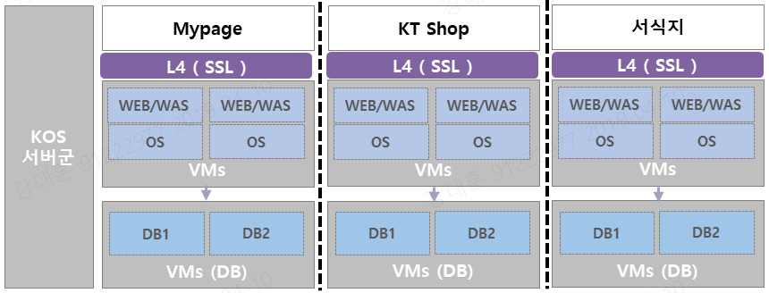
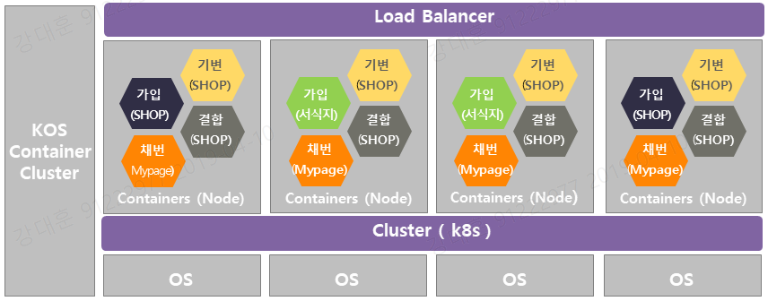
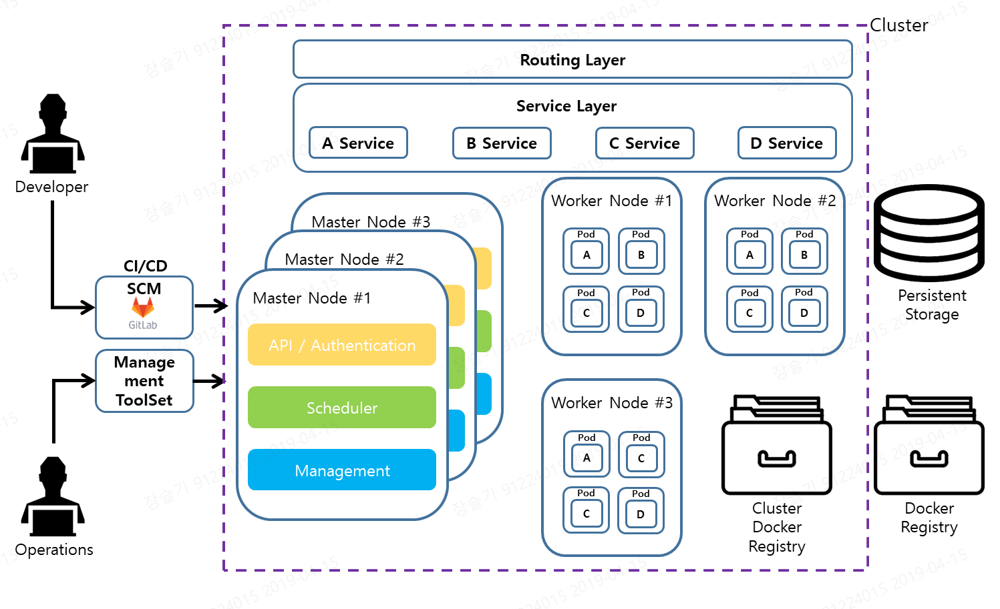
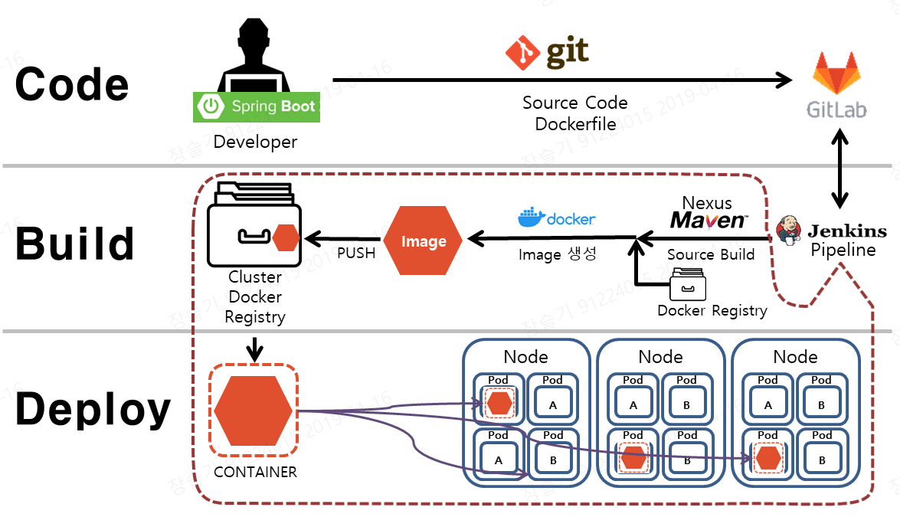

# 1. 목차
- [1. 목차](#1-%EB%AA%A9%EC%B0%A8)
- [2. 개정이력](#2-%EA%B0%9C%EC%A0%95%EC%9D%B4%EB%A0%A5)
- [3. 시스템 변화 방향 가이드](#3-%EC%8B%9C%EC%8A%A4%ED%85%9C-%EB%B3%80%ED%99%94-%EB%B0%A9%ED%96%A5-%EA%B0%80%EC%9D%B4%EB%93%9C)
  - [3.1. 개요](#31-%EA%B0%9C%EC%9A%94)
  - [3.2. 컨테이너 및 플랫폼 소개](#32-%EC%BB%A8%ED%85%8C%EC%9D%B4%EB%84%88-%EB%B0%8F-%ED%94%8C%EB%9E%AB%ED%8F%BC-%EC%86%8C%EA%B0%9C)
    - [3.2.1. 컨테이너](#321-%EC%BB%A8%ED%85%8C%EC%9D%B4%EB%84%88)
    - [3.2.2. Docker(도커) 컨테이너](#322-docker%EB%8F%84%EC%BB%A4-%EC%BB%A8%ED%85%8C%EC%9D%B4%EB%84%88)
    - [3.2.3. Kubernetes (쿠버네티스, K8s)](#323-kubernetes-%EC%BF%A0%EB%B2%84%EB%84%A4%ED%8B%B0%EC%8A%A4-k8s)
  - [3.3. 시스템 변화 사항](#33-%EC%8B%9C%EC%8A%A4%ED%85%9C-%EB%B3%80%ED%99%94-%EC%82%AC%ED%95%AD)
    - [3.3.1. 시스템 환경 변화](#331-%EC%8B%9C%EC%8A%A4%ED%85%9C-%ED%99%98%EA%B2%BD-%EB%B3%80%ED%99%94)
    - [3.3.2. 컨테이너 환경 시스템 구조](#332-%EC%BB%A8%ED%85%8C%EC%9D%B4%EB%84%88-%ED%99%98%EA%B2%BD-%EC%8B%9C%EC%8A%A4%ED%85%9C-%EA%B5%AC%EC%A1%B0)
    - [3.3.3. 컨테이너 환경 구성요소](#333-%EC%BB%A8%ED%85%8C%EC%9D%B4%EB%84%88-%ED%99%98%EA%B2%BD-%EA%B5%AC%EC%84%B1%EC%9A%94%EC%86%8C)
  - [3.4. 개발 환경 변화](#34-%EA%B0%9C%EB%B0%9C-%ED%99%98%EA%B2%BD-%EB%B3%80%ED%99%94)
    - [3.4.1. 컨테이너 기반의 개발 환경](#341-%EC%BB%A8%ED%85%8C%EC%9D%B4%EB%84%88-%EA%B8%B0%EB%B0%98%EC%9D%98-%EA%B0%9C%EB%B0%9C-%ED%99%98%EA%B2%BD)


# 2. 개정이력

| 날짜       | 변경내용 | 작성자 | 비고 |
| ---------- | -------- | ------ | ---- |
| 2019.03.06 | 최초작성 | 강대훈 |      |
|            |          |        |      |
|            |          |        |      |


# 3. 시스템 변화 방향 가이드


## 3.1. 개요

컨테이너 환경(K8s)에서의 프로젝트를 진행하게 되는 경우 아래의 시스템 및 개발 환경에 대한 변화를 숙지하고 진행해야 합니다.


## 3.2. 컨테이너 및 플랫폼 소개

변화된 시스템을 이해하기 위해서는 기본적으로 컨테이너(Container)에 대한 기본지식이 필요합니다.
또한 컨테이너에 특화된 Docker 와 Kubernetes 라는 플랫폼을 이해해야 합니다.


### 3.2.1. 컨테이너

- 컨테이너는 애플리케이션을 실제 구동 환경으로부터 추상화할 수 있는 논리 패키징 메커니즘을 제공
- 이러한 격리를 통해 어떤 환경으로든 컨테이너 기반 애플리케이션을 쉽게 지속적으로 배포할 수 있음
- VM과 다르게 운영체제 수준에서 가상화를 실시하여 다수의 컨테이너를 OS 커널에서 직접 구성하므로 훨씬 가볍고 시작도 빠르고 메모리도 적게 차지함


### 3.2.2. Docker(도커) 컨테이너

- 애플리케이션과 모든 의존성을 패키지 하는 표준 방법

- 하나의 애플리케이션이 동작하기 위해 필요한 모든 것을 담은 Docker 이미지로 부터 컨테이너를 생성함

- 이미지는 Dockeer Registry에 관리됨

- 어떠한 수정 없이 애플리케이션을 여러 환경으로 이동 및 실행가능

- 컨테이너는 OS, 사용자가 추가한 파일 및 메타데이터로 구성됨

- 밀리초 기동 시간

- 마이크로서비스 아키텍처(MSA) 장려

- 자세한 Docker에 대한 특징 및 사용법은 아래의 링크를 참조 

  > 참조 :  [http://gitlab.msa.kt.com/coe-istio-master/public-documents/tree/master/knowledge-asset/docker/](http://gitlab.msa.kt.com/coe-istio-master/public-documents/tree/master/knowledge-asset/docker)


### 3.2.3. Kubernetes (쿠버네티스, K8s) 

* 컨테이너 오케스트레이션 플랫폼

* 워크로드 컨테이너들의 배포, 배치, 생명주기를 관리

* 스케줄링, 스토리지, 네트워킹을 위한 플러그인을 제공하는 풍부한 에코시스템

* 특징

  - 클러스터관리
    - 다중호스트를 하나의 타겟으로 통합관리

  - 스케줄
    - 여러 노드들에 걸쳐 컨테이너를 분산

  - 서비스탐색
    - 컨테이너가 어디에 위치해 있는지 확인
    - 여러 컨테이너에 걸쳐 클라이언트 요청을 분산

  - 복제
    - 노드와 컨테이너의 개수를 보장

  - Health 관리
    - 비정상적인 컨테이너와 노드를 관리
  - 리눅스 재단에 의해 관리되는 오픈 소스 프로젝트
    - 구글의 경험과 내부시스템에 의해 영감받고 영향받음
    - Go언어로 작성된 100% 오픈소스
  - 배포 및 롤백 자동화
    - AP 변경시 전체 중단이 아닌 점진적으로 컨테이너에 적용(rolling update) 가능
    - 배포시점에 문제가 발생할 경우 자동으로 이전의 상태로 Rollback을 진행 가능


## 3.3. 시스템 변화 사항

### 3.3.1. 시스템 환경 변화

- 예시) AS-IS KOS 아키텍쳐 - VM기반

  

- 예시) TO-BE KOS 아키텍쳐 - 컨테이너 기반

  


### 3.3.2. 컨테이너 환경 시스템 구조




### 3.3.3. 컨테이너 환경 구성요소

- Master Node

  - 클러스터의 모든 상태를 저장/관리하는 역할

  1. Scheduler

     > 스케쥴러는 Pod, 서비스 등 각 리소스들을 적절한 노드에 할당하는 역할
     >
     > Pod 생성시에 Selector를 지정하므로써 마스터에 있는 스케쥴러가 어떤 Node에 Pod를 배포할지 결정할 수 있음

  2. Controller-manager

     > ReplicaSet, Deployment 등의 컨트롤러를 생성하고 이를 각 노드에 배포 및 관리
     >
     > ex) Replica controller : Pod가 지정된 개수 만큼 실행되고 있는지 모니터링하며 문제가 생겼을 경우 Pod를 재생성 함

  3. API Server

     > 모든 명령과 통신을 API를 통해서 하는데, 해당 역할이 되는 서버가 API서버이며 REST API로 제공하고 그에 대한 명령을 수행

- Worker Node

  - 컨테이너화된 애플리케이션을 실행하는 시스템 
  - 각 사용자가 생성한 Docker Image로  어플리케이션을 생성하면 Pod에 컨테이너화되어 Node에 배포됨

- Pod

  - Kubernetes의 가장 작은 배포 단위(Unit)로 1개의 Pod는 내부에 여러 개의 컨테이너를 가질 수 있지만 대부분 1~2개의 컨테이너로 구성함 
  - Pod 내부의 컨테이너들은 네트워크와 볼륨을 공유하기 때문에 localhost로 통신 가능함

- Service

  - Pod의 경우에 지정되는 IP가 랜덤하게 지정이 되고 재시작 할 때마다 변하기 때문에 고정된 엔드포인트로 호출이 불가함
  - 지정된 IP로 생성이 가능하고, 여러 Pod를 묶어서 로드 밸런싱이 가능하며, 고유한 DNS 이름을 가질 수 있음

- Routing layer

  - Routing layer는 외부요청과 서비스IP를 연결하여 내부의 Pod까지 연결시켜주는 역할
  - 서비스는 임의로 생성된 내부아이피를 가지기 때문에 이에 대한 쉬운 접근방법이 필요
  - 특정 도메인명을 내부아이피와 매핑해주는 역할
  - 외부 클라이언트는 이 Route를 통해서 내부의 Pod와 통신 가능함

- Persistent Storage

  - Pod는 휘발성이므로 Pod 내에서 새로 생성된 파일은 Pod 재기동시 소실됨
  - NAS처럼 Persistent Storage를 연결하여 사용함

- Docker Registry

  - 배포를 위한 Docker Image를 저장하는 장소
  - 정상 Build된 AP에 대해 Docker Image가 생성되고 PUSH를 통해 Docker Registry에 등록


최종적으로 개발자와 운영자의 관점에서 보면 개발자는 SCM으로 Git을, 그리고 CI/CD Tool로 Jenkins 를 이용하여 소스를 업데이트하고 새로운 이미지를 만들어서 쉽게 배포를 합니다. 운영자는 콘솔 또는 관리도구를 통해 관리할 수 있습니다.


## 3.4. 개발 환경 변화

아래 사항은 컨테이너 환경(K8s)에서 표준으로 지정된 개발 Tool인 Spring Boot와 함께 소스코드관리는 GitLab을 사용하기로 기준을 설정하였으며 이를 토대로 작성되었습니다.





### 3.4.1. 컨테이너 기반의 개발 환경

- 초기 프로젝트 환경구성 

  - Namespace 및 계정 할당

    - Container Portal을 통해 해당 프로젝트의 namespace 및 계정을 할당받아 진행

- CODE

  - 프로젝트에 맞는 패턴 Package 선택 및 설치

    - 개발도구 : Spring Boot (Java 환경 표준 개발 Tool) 

    - 유형별 패턴 Package는 아래 경로 참조

      > 참조 :  [공통기능정의.md](http://gitlab.msa.kt.com/coe-istio-master/msa-bunker/blob/master/deliverables/05.%20%EA%B0%9C%EB%B0%9C%20%EA%B5%AC%EC%B6%95%20%EA%B0%80%EC%9D%B4%EB%93%9C%20%EB%9D%BC%EC%9D%B8/06.%20%EA%B3%B5%ED%86%B5%20%EA%B8%B0%EB%8A%A5%20%EC%A0%95%EC%9D%98.md)

  - 사내 Nexus 연결

    - Local PC (경로:C:\Users\{window계정}\\.m2) 폴더에 settings.xml 생성

    - settings.xml

      ```xml
      <?xml version="1.0" encoding="UTF-8"?>
      <settings>
        <mirrors>
         <mirror>
            <id>public</id>
            <mirrorOf>*</mirrorOf>
            <url>http://10.217.59.89/nexus/content/groups/public</url>
          </mirror>
        </mirrors>
      </settings>
      ```

      > 계정없이 익명으로 접속시도시에 Read-Only로만 동작함

    - .m2 밑에 settings.xml 외의 디렉토리 삭제 후 Maven Build 수행

  - 프로젝트 요구사항에 부합되는 AP 개발 및 단위테스트

  - 형상관리도구 : Git을 이용해 GitLab에서 관리

    - Branch 전략(아래 링크 참조)에 맞는 CI 진행 

      > 참조 : [배포전략.md](http://gitlab.msa.kt.com/coe-istio-master/msa-bunker/blob/master/deliverables/08.%20%EB%B0%B0%ED%8F%AC%20%EA%B0%80%EC%9D%B4%EB%93%9C%20%EB%9D%BC%EC%9D%B8/%EB%B0%B0%ED%8F%AC%20%EC%A0%84%EB%9E%B5.md)

- BUILD & DEPLOY

  - CI/CD 관리 도구 : Jenkins  Pipeline 이용

    -  Git에 반영된 소스에 대해서는 push가 발생할 때 or 일정 시간단위(선택사항)에 따라 자동으로 Build 진행됨

    -  Docker Registry의 Base Image를 기반으로 구현된 AP Source에 대해서 Maven,Nexus를 이용하여 Build가 진행됨

    -  정상 Build 후 AP에 대한 Docker Image가 생성되고 PUSH를 통해 Cluster Docker Registry에 등록됨

    -  배포 : Cluster Docker Registry에 등록된 Build Image를 Work Node의 Pod에 컨테이너화 되어 배포

- TEST

  - 기능 테스트  

    - Local PC의 Docker 설치는 Container환경에서의 MSA 프로젝트에만 권장

      > Windows 10 Pro 이상 : 별도의 승인 없이 Docker for Window 사용 가능
      >
      > > DLP와 Windows 10 Pro 1803버전이 충돌로 인한 간헐적 오류 발생 (2019.05 DLP 조치예정)
      >
      > 그 외의 Windows OS : BPM으로 승인 처리 후 Docker Tool Box 사용 가능

    - 사내 Docker Registry 연결 - Local PC(경로:C:\Users\{window계정}\\.docker)에  config.json , daemon.json 변경

    - config.json

      ```json
      {
        "stackOrchestrator": "swarm",
        "auths": {
          "https://index.docker.io/v1/": {}
        },
        "credsStore": "wincred",
        "insecure-registries":["docker-registry-default.container.ipc.kt.com","ktis-bastion01.container.ipc.kt.com:5000"]
      }
      ```

    - daemon.json

      ```json
      {
        "registry-mirrors": [],
        "insecure-registries": ["docker-registry-default.container.ipc.kt.com","ktis-bastion01.container.ipc.kt.com:5000"],
        "debug": true,
        "experimental": false
      }
      ```

    - 구현된 AP는 Local PC의 가상화로 구성된 Docker 영역에서 DEV환경과 동일하게 테스트 가능

  - 그외 테스트

    - DEV 및 STAGE 환경에 배포 후 테스트

