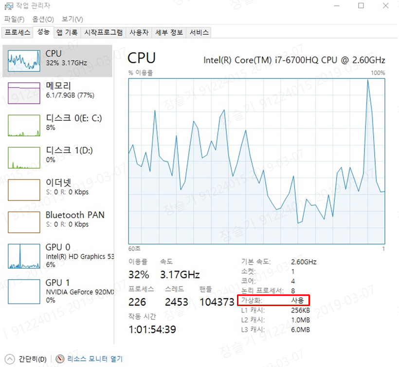
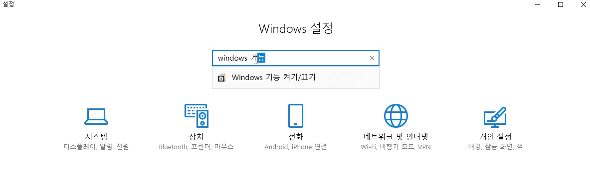
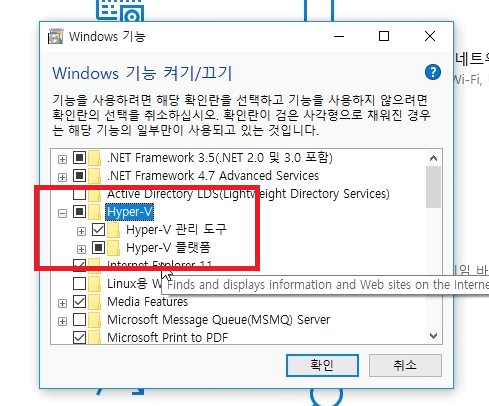

# 1. 목차
- [1. 목차](#1-%EB%AA%A9%EC%B0%A8)
- [2. 개정이력](#2-%EA%B0%9C%EC%A0%95%EC%9D%B4%EB%A0%A5)
- [3. 개발 환경 최소 사양 가이드](#3-%EA%B0%9C%EB%B0%9C-%ED%99%98%EA%B2%BD-%EC%B5%9C%EC%86%8C-%EC%82%AC%EC%96%91-%EA%B0%80%EC%9D%B4%EB%93%9C)
  - [3.1. 개발 PC 사양](#31-%EA%B0%9C%EB%B0%9C-pc-%EC%82%AC%EC%96%91)
    - [3.1.1. 가상화 확인 방법](#311-%EA%B0%80%EC%83%81%ED%99%94-%ED%99%95%EC%9D%B8-%EB%B0%A9%EB%B2%95)
    - [3.1.2. 최소 사양](#312-%EC%B5%9C%EC%86%8C-%EC%82%AC%EC%96%91)
    - [3.1.3. 권장 사양](#313-%EA%B6%8C%EC%9E%A5-%EC%82%AC%EC%96%91)

# 2. 개정이력

|    날짜    | 변경내용  | 작성자 | 비고 |
| :--------: | :-------: | :----: | :--: |
| 2019.03.08 | 최초 작성 | 강대훈 |      |
|            |           |        |      |

# 3. 개발 환경 최소 사양 가이드

## 3.1. 개발 PC 사양

개발 환경에서는 Docker 설치하여 개발이 이루어지므로, 개발 PC에서 가상화 지원은 필수이다.

### 3.1.1. 가상화 확인 방법

- Windows 7

  https://www.microsoft.com/en-us/download/detail.aspx?id=592 에서

  Hardware-Assisted Virtualization Detection Tool (가상화 지원 가능한 PC 확인 Tool) 을 다운로드 및 실행. 실행 결과로  "This computer is configured with hardware-assisted virtualization" 이란 메시지가 표시되면 사용 가능함.

- Windows 10 Pro 이상

  - 작업관리자 "성능" 탭에서 "가상화" 확인

    

  - 가상화가 "사용"으로 표기되어 있다면, "Windows 설정" - "Windows 기능 켜기/끄기" 에서 "Hyper-V" 기능을 활성화 한다.

    

    

가상화 지원이 안되는 경우는 하드웨어가 가상화를 지원하지 않는 경우 일 수도 있지만 컴퓨터 BIOS에서 가상화가 꺼져 있어 사용이 불가능한 경우도 있으니 컴퓨터의 BIOS에서 가상화(Virtualization) 관련 옵션이 있는지 확인하여 OFF로 되어 있다면 ON으로 설정하면 된다.

### 3.1.2. 최소 사양

  - OS : Windows 7 or Mac
  - RAM : 8GB
  - MAC : Docker for Mac 사용
  - Window : Docker Toolbox 사용

### 3.1.3. 권장 사양

 - OS : Windows 10 Pro 64비트 or Windows 10 Enterprise 64비트 
    - 버전 : 1803 이상으로 Update 필요
 - RAM : 16GB
 - CPU : SLAT-capable feature
 - Docker for Window 사용

