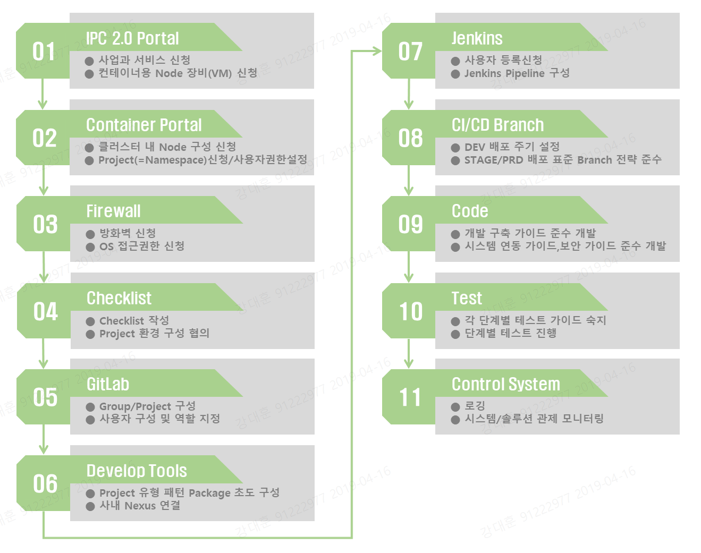
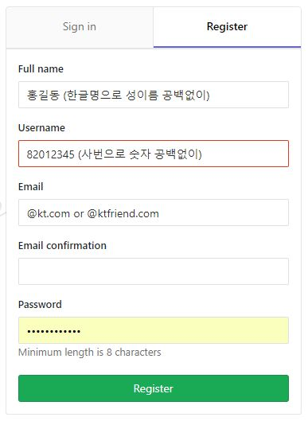
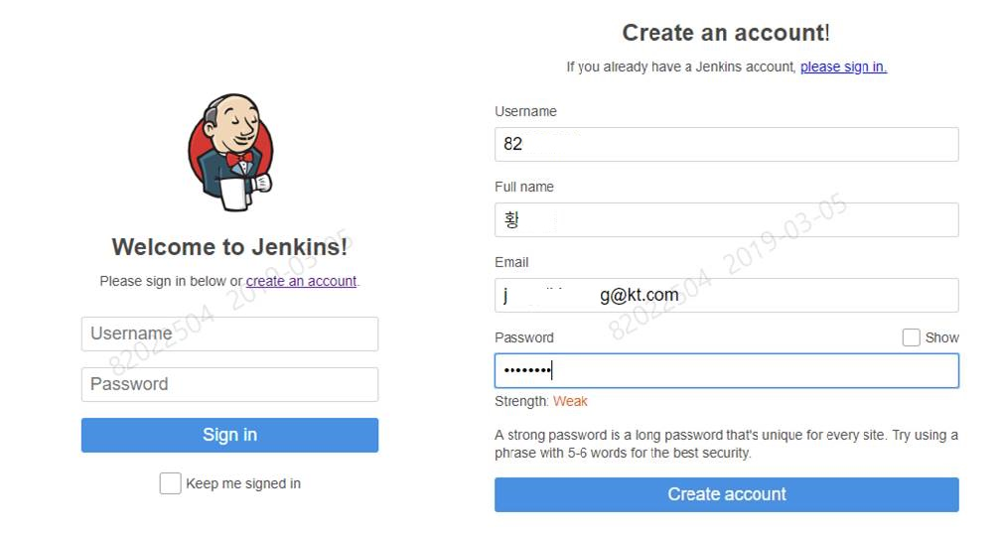

# 1. 목차
- [1. 목차](#1-%EB%AA%A9%EC%B0%A8)
- [2. 개정이력](#2-%EA%B0%9C%EC%A0%95%EC%9D%B4%EB%A0%A5)
- [3. Container Portal 연계 가이드](#3-container-portal-%EC%97%B0%EA%B3%84-%EA%B0%80%EC%9D%B4%EB%93%9C)
  - [3.1. 개요](#31-%EA%B0%9C%EC%9A%94)
  - [3.2. 프로젝트 진행 단계적 Flow](#32-%ED%94%84%EB%A1%9C%EC%A0%9D%ED%8A%B8-%EC%A7%84%ED%96%89-%EB%8B%A8%EA%B3%84%EC%A0%81-flow)
      - [3.2.1. IPC 2.0 Portal에서 VM 신청시 컨테이너 용도 추가 선택](#321-ipc-20-portal%EC%97%90%EC%84%9C-vm-%EC%8B%A0%EC%B2%AD%EC%8B%9C-%EC%BB%A8%ED%85%8C%EC%9D%B4%EB%84%88-%EC%9A%A9%EB%8F%84-%EC%B6%94%EA%B0%80-%EC%84%A0%ED%83%9D)
      - [3.2.2. Container Portal에서 적용 사항](#322-container-portal%EC%97%90%EC%84%9C-%EC%A0%81%EC%9A%A9-%EC%82%AC%ED%95%AD)
      - [3.2.3. 방화벽 신청/OS 접근제어 신청](#323-%EB%B0%A9%ED%99%94%EB%B2%BD-%EC%8B%A0%EC%B2%ADos-%EC%A0%91%EA%B7%BC%EC%A0%9C%EC%96%B4-%EC%8B%A0%EC%B2%AD)
      - [3.2.4. Checklist 작성](#324-checklist-%EC%9E%91%EC%84%B1)
      - [3.2.5. GitLab 정보 구성 (사용자/Group/Project)](#325-gitlab-%EC%A0%95%EB%B3%B4-%EA%B5%AC%EC%84%B1-%EC%82%AC%EC%9A%A9%EC%9E%90groupproject)
      - [3.2.6. 프로젝트 기본구조 초도 구성](#326-%ED%94%84%EB%A1%9C%EC%A0%9D%ED%8A%B8-%EA%B8%B0%EB%B3%B8%EA%B5%AC%EC%A1%B0-%EC%B4%88%EB%8F%84-%EA%B5%AC%EC%84%B1)
      - [3.2.7. Jenkins 관련 처리](#327-jenkins-%EA%B4%80%EB%A0%A8-%EC%B2%98%EB%A6%AC)
      - [3.2.8. CI/CD 관련 Branch 전략 검토 및 수립](#328-cicd-%EA%B4%80%EB%A0%A8-branch-%EC%A0%84%EB%9E%B5-%EA%B2%80%ED%86%A0-%EB%B0%8F-%EC%88%98%EB%A6%BD)
      - [3.2.9. 개발 (개발 가이드/시스템 연동 가이드 참고)](#329-%EA%B0%9C%EB%B0%9C-%EA%B0%9C%EB%B0%9C-%EA%B0%80%EC%9D%B4%EB%93%9C%EC%8B%9C%EC%8A%A4%ED%85%9C-%EC%97%B0%EB%8F%99-%EA%B0%80%EC%9D%B4%EB%93%9C-%EC%B0%B8%EA%B3%A0)
      - [3.2.10. 테스트](#3210-%ED%85%8C%EC%8A%A4%ED%8A%B8)
      - [3.2.11. 로깅 및 관제 모니터링](#3211-%EB%A1%9C%EA%B9%85-%EB%B0%8F-%EA%B4%80%EC%A0%9C-%EB%AA%A8%EB%8B%88%ED%84%B0%EB%A7%81)


# 2. 개정이력

| 날짜       | 변경내용 | 작성자 | 비고 |
| ---------- | -------- | ------ | ---- |
| 2019.03.11 | 최초작성 | 강대훈 |      |
|            |          |        |      |
|            |          |        |      |


# 3. Container Portal 연계 가이드


## 3.1. 개요

컨테이너 기반에서 프로젝트 진행시에 사전에 IPC 2.0 Portal과 Container Portal을 통해서  프로젝트 진행을 위한 장비에 대해 선정하고 진행해야 합니다. 이에 각 Portal에서 신청시에 추가 고려해야 하는 부분에 대한 가이드와 함께 프로젝트 진행에 필요한 단계적인 Flow를 개략적으로 설명합니다.


## 3.2. 프로젝트 진행 단계적 Flow




#### 3.2.1. IPC 2.0 Portal에서 VM 신청시 컨테이너 용도 추가 선택

- 투심에 의해 결정된 사업과 서비스에 해당 정보를 등록한다.

- VM 신청 단계 중 인프라사항에 ''**_컨테이너 용도_**" 추가로 선택한다.

  > 선택사항 : Master / Infra / Node

- 일반적인 경우는 Node만 추가하며 처리한다. 참고로, 별도 클러스터 환경 전체를 신규로 구성하는 경우는 위의 3가지 유형 다 선택 될수 있다.

- 좌측 메뉴 하단에 "_**Container Portal**_" 연계 링크 클릭해서 Container Portal로 연계한다.


#### 3.2.2. Container Portal에서 적용 사항

- 서비스 신청

  > IPC 2.0 포털에 신청한 단위서비스 기준으로 Region-Zone, 클러스터, VM,Project 등을 정의하고 신청한다. 신청 후 클러스터 Admin이 확인후 해당 node를 Cluster 구성 작업을 진행한다.

  - 클러스터내에 사용할 Node를 추가로 선택하고 신청함
  - 신청한 내용에 대해 클러스터 Admin이 확인 및 Cluster 구성 작업이 완료 된 이후 아래 작업 진행가능

- Container Portal 내에서의 Project 사용자 계정 정보 생성처리

  > Container Portal 에서의 Project 내 관련 권한 : Project Admin, Project Viewer

  - 위의 서비스신청을 진행한 계정에 대해 Container Portal 내의 Project Admin 계정을 할당해줌
  - 이후 Project Admiin계정에서 Project Viewer 계정을 추가 생성 가능함

- Project 생성 ( = Namespace 할당)

  > 해당 Project 기준으로 지정된 클러스터 환경내에 Namespace가 구성된다.

  - 서비스 신청에 대해 클러스터내에 구성이 추가 완료되면 Namespace가 할당되며 Selector를 기준으로 해당 Project는 신청된 Node에 대해서만 배포가 가능하도록 제어됨
  - Namespace는 기본적으로 3개가 할당되며 DEV / STAGE / PRD 용으로 각각 할당됨

  | 환경구분 | 생성 Cluseter 위치 | ex) 보험중계 부여 Namespace |
  | -------- | ------------------ | --------------------------- |
  | DEV      | DEV Cluster        | mmp                         |
  | STAGE    | PRD Cluster        | mmp-stage                   |
  | PRD      | PRD Cluster        | mmp                         |

- Namespace 내 룰 정보 생성 

  - Namespace 생성시 자동 생성됨

  |  룰   |                  권한                   | ex) 보험중계 부여 계정ID |
  | :---: | :-------------------------------------: | ------------------------ |
  | admin |      Namespace 전체 통제 권한 허용      | mmp-admin                |
  | edit  |      Namespace 내 리소스 수정 허용      | mmp-edit                 |
  | view  | Namespace 내 리소스 읽기 전용 접근 허용 | mmp-view                 |


#### 3.2.3. 방화벽 신청/OS 접근제어 신청

- 프로젝트 진행에 관련된 방화벽/OS접근제어 신청

  > 방화벽 신청에 대한 가이드는 03. Welcome Pack 구성 > [01. 필수 방화벽 신청 가이드](http://gitlab.msa.kt.com/coe-istio-master/msa-bunker/blob/master/deliverables/03.%20Welcome%20Pack%20%EA%B5%AC%EC%84%B1/01.%20%ED%95%84%EC%88%98%20%EB%B0%A9%ED%99%94%EB%B2%BD%20%EC%8B%A0%EC%B2%AD%20%EA%B0%80%EC%9D%B4%EB%93%9C.md) 참고


#### 3.2.4. Checklist 작성

- 컨테이너 환경에서의 프로젝트 진행에 대한 Guide를 받기 위한 목적으로 Checklist 사전 작성

  > Checklist : [컨테이너기반 Project CheckList](http://gitlab.msa.kt.com/coe-istio-master/msa-bunker/blob/master/deliverables/03.%20Welcome%20Pack%20%EA%B5%AC%EC%84%B1/%EC%BB%A8%ED%85%8C%EC%9D%B4%EB%84%88%EA%B8%B0%EB%B0%98%20Project%20CheckList.xlsx) 

- 작성된 Checklist 기준으로 프로젝트 진행을 위한 구성 등에 대한 협의 진행


#### 3.2.5. GitLab 정보 구성 (사용자/Group/Project) 

- GitLab 사용자 등록

  > GitLab :  [http://gitlab.msa.kt.com/](http://gitlab.msa.kt.com) 에서 등록한다.
  >
  > 해당 Project 내에 GitLab Owner 역할을 수행할 담당자부터 사용자를 등록한다.
  >
  > 사용자 등록시 입력 항목은 아래의 화면에 표기된 기준을 참조한다.

  

- GitLab 관리자에게 요청하여 Group과 Project를 할당받고 해당 Group 내 위의 계정에 대해 Owner 역할을 부여받는다.

- Owner 사용자 계정은 해당 프로젝트내에 Developer와 Maintainer의 역할을 구분하여 프로젝트 참여자 계정에 권한을 할당하여 사용한다.

  |   역할명   | 설명                                                         |
  | :--------: | :----------------------------------------------------------- |
  | Developer  | 개발 진행시 Master Branch에서 Feature Branch를 생성하여 개발을 진행<br/>개발 완료 후 Push 및 Master Branch로 Merge Request 요청 |
  | Maintainer | Merge Request 요청건에 대한 Code Review 진행<br/>Code에 문제 없을시 Branch Merge를 수행(Merge Request Complete 처리) |


#### 3.2.6. 프로젝트 기본구조 초도 구성

- 유형별 패턴 Package 중 진행하고자 하는 프로젝트에 맞는 패턴 Package 선택 및 기본구조를 구성한다.

  > 표준 개발 Tool로 정의된 SpringBoot 기준임

- 사내 Nexus를 연결하여 Maven Build가 Local에서 가능하도록 설정한다.

  - Local PC (경로:C:\Users\{window계정}\\.m2) 폴더에 settings.xml 생성

  - settings.xml

    ```xml
    <?xml version="1.0" encoding="UTF-8"?>
    <settings>
      <mirrors>
       <mirror>
          <id>public</id>
          <mirrorOf>*</mirrorOf>
          <url>http://10.217.59.89/nexus/content/groups/public</url>
        </mirror>
      </mirrors>
    </settings>
    ```

    > 계정없이 익명으로 접속시도시에 Read-Only로만 동작함

  - .m2 밑에 settings.xml 외의 디렉토리 삭제 후 Maven Build 수행


#### 3.2.7. Jenkins 관련 처리

- Jenkins 계정 생성

  - Jenkins :  [https://jenkins-dev.container.ipc.kt.com/](https://jenkins-dev.container.ipc.kt.com) 에서 계정 생성

    

  - 생성 룰은 아래의 화면 및 기준을 따름

    > Username  : 회사사번 (8~ or 9~)
    >
    > Full Name   : 이름
    >
    > Email           : 회사 이메일

  - 계정 생성 후 "**_Arsenal dev 파트_**" 로 필요한 Job의 권한 요청 (E-mail)

- 초도 구성되는 Pipeline에 대해 필요시 프로젝트에 맞게 수정한다.


#### 3.2.8. CI/CD 관련 Branch 전략 검토 및 수립

- 표준 정의된 CI/CD Branch 전략은 아래의 링크를 참조한다.

  > 08 배포 가이드 라인 >  [branch 전략](http://gitlab.msa.kt.com/coe-istio-master/msa-bunker/blob/master/deliverables/08.%20%EB%B0%B0%ED%8F%AC%20%EA%B0%80%EC%9D%B4%EB%93%9C%20%EB%9D%BC%EC%9D%B8/branch%20%EC%A0%84%EB%9E%B5.md) 을 참고한다.

- 개발 진행된 Code에 대해서 Developer는 개인의 Feature Branch를 생성후 개발을 진행한다. 개발 완료 후 Push 및 Master Branch로 Merge Request를 요청한다.

- Maintainer는 요청된 Merge Request를 검토하여 문제 없을시 Branch Merge를 수행한다.

- Merge된 Code에 대한 DEV 환경 배포는 GitLab에 Push가 발생된 시점 또는 일정시간 기준으로 선택하여 Build 및 배포를 진행 할 수 있다.

- 이후 STAGE 및 PRD 환경에 대한 배포 전략은 위의 Branch 전략 표준에 따른다.


#### 3.2.9. 개발 (개발 가이드/시스템 연동 가이드 참고)

- 제공되는 개발 가이드 및 시스템 연동 가이드를 참고해서 개발을 진행한다.

  > 개발 : [05. 개발 구축 가이드 라인](http://gitlab.msa.kt.com/coe-istio-master/msa-bunker/tree/master/deliverables/05.%20%EA%B0%9C%EB%B0%9C%20%EA%B5%AC%EC%B6%95%20%EA%B0%80%EC%9D%B4%EB%93%9C%20%EB%9D%BC%EC%9D%B8) 를 참고.
  >
  > 시스템 간 연동 : [06. 시스템 연동 가이드](http://gitlab.msa.kt.com/coe-istio-master/msa-bunker/tree/master/deliverables/06.%20%EC%8B%9C%EC%8A%A4%ED%85%9C%20%EC%97%B0%EB%8F%99%20%EA%B0%80%EC%9D%B4%EB%93%9C) 를 참고.


#### 3.2.10. 테스트

- 제공되는 테스트 가이드에 맞춰 각 단계별 테스트를 진행한다.

  > [07. 테스트 가이드 라인](http://gitlab.msa.kt.com/coe-istio-master/msa-bunker/tree/master/deliverables/07.%20%ED%85%8C%EC%8A%A4%ED%8A%B8%20%EA%B0%80%EC%9D%B4%EB%93%9C%20%EB%9D%BC%EC%9D%B8) 를 참고한다.


#### 3.2.11. 로깅 및 관제 모니터링 

- 로깅 가이드 및 시스템/솔루션 관제 모니터링 가이드를 참고하여 모니터링 한다. 자세한 사항은 아래의 링크를 참조한다.

  > 로깅 : [09. 로깅 가이드 라인](http://gitlab.msa.kt.com/coe-istio-master/msa-bunker/tree/master/deliverables/09.%20%EB%A1%9C%EA%B9%85%20%EA%B0%80%EC%9D%B4%EB%93%9C%20%EB%9D%BC%EC%9D%B8) 를 참고한다.
  >
  > 시스템/솔루션 관제 모니터링 : [10. 관제 모니터링 가이드 라인](http://gitlab.msa.kt.com/coe-istio-master/msa-bunker/tree/master/deliverables/10.%20%EA%B4%80%EC%A0%9C%20%EB%AA%A8%EB%8B%88%ED%84%B0%EB%A7%81%20%EA%B0%80%EC%9D%B4%EB%93%9C%20%EB%9D%BC%EC%9D%B8) 를 참고한다.


