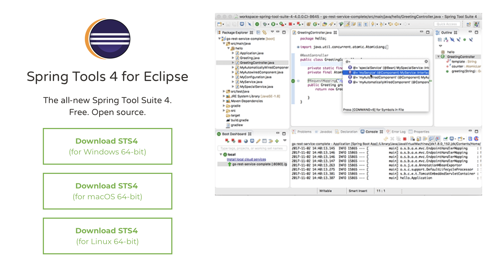
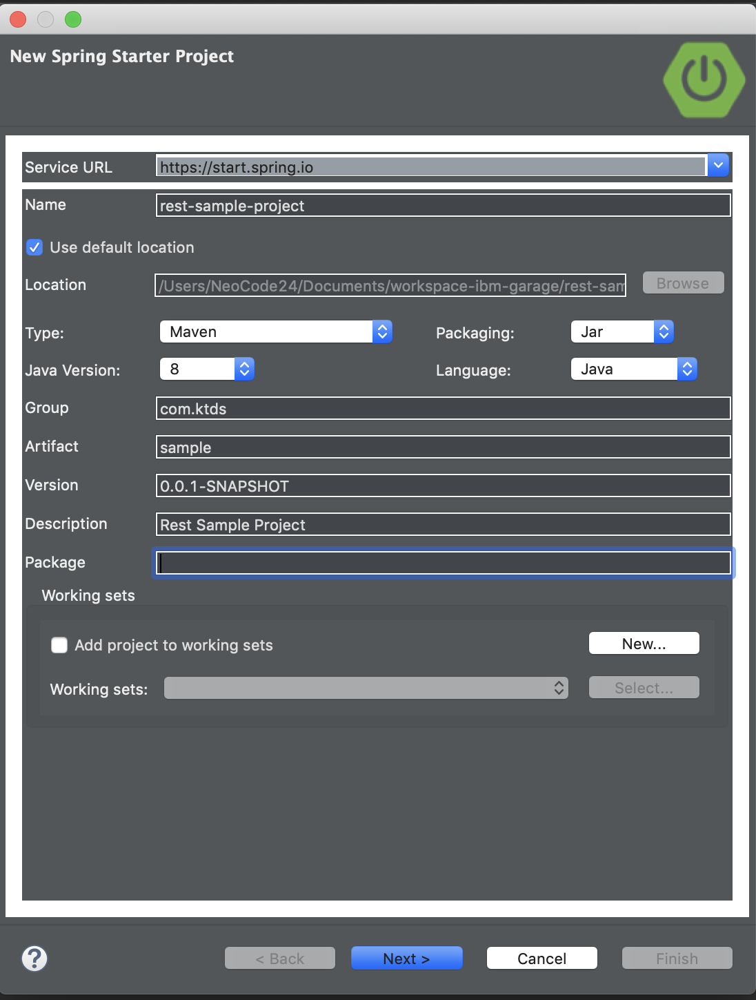

# 1. Spring Boot


## 1.1. 개정이력

|    날짜    | 변경내용  | 작성자 | 비고 |
| :--------: | :-------: | :----: | :--: |
| 2019.03.11 | 최초 작성 | 장종호 |      |
|            |           |        |      |
|            |           |        |      |


## 1.2. 목차

- [1. Spring Boot](#1-spring-boot)
	- [1.1. 개정이력](#11-%EA%B0%9C%EC%A0%95%EC%9D%B4%EB%A0%A5)
	- [1.2. 목차](#12-%EB%AA%A9%EC%B0%A8)
	- [1.3. Spring Boot ?](#13-spring-boot)
	- [1.4. Spring Boot 개발 툴 설치](#14-spring-boot-%EA%B0%9C%EB%B0%9C-%ED%88%B4-%EC%84%A4%EC%B9%98)
	- [1.5. Project 생성하기](#15-project-%EC%83%9D%EC%84%B1%ED%95%98%EA%B8%B0)
		- [1.5.1. Spring Starter Project 실행](#151-spring-starter-project-%EC%8B%A4%ED%96%89)
		- [1.5.2. Project 초기 설정](#152-project-%EC%B4%88%EA%B8%B0-%EC%84%A4%EC%A0%95)
		- [1.5.3. Project Dependencies 지정](#153-project-dependencies-%EC%A7%80%EC%A0%95)
	- [1.6. Project 기능 개발 하기](#16-project-%EA%B8%B0%EB%8A%A5-%EA%B0%9C%EB%B0%9C-%ED%95%98%EA%B8%B0)
		- [1.6.1. Project 탐색 하기](#161-project-%ED%83%90%EC%83%89-%ED%95%98%EA%B8%B0)
		- [1.6.2. 코드 생성하기](#162-%EC%BD%94%EB%93%9C-%EC%83%9D%EC%84%B1%ED%95%98%EA%B8%B0)
			- [1.6.2.1. Controller - BookController.java](#1621-controller---bookcontrollerjava)
			- [1.6.2.2. Model - Book.java](#1622-model---bookjava)
			- [1.6.2.3. Repository - BookRepository.java](#1623-repository---bookrepositoryjava)
			- [1.6.2.4. Properties - application.properties](#1624-properties---applicationproperties)
		- [1.6.3. Project 응용 하기](#163-project-%EC%9D%91%EC%9A%A9-%ED%95%98%EA%B8%B0)
			- [1.6.3.1. Controller - FrontController.java](#1631-controller---frontcontrollerjava)
			- [1.6.3.2. Model - Book.java](#1632-model---bookjava)
			- [1.6.3.3. Main - Application.java](#1633-main---applicationjava)
			- [1.6.3.4. Properties - application.properties](#1634-properties---applicationproperties)
	- [1.7. Maven 사용하기](#17-maven-%EC%82%AC%EC%9A%A9%ED%95%98%EA%B8%B0)
		- [1.7.1. Maven 설치](#171-maven-%EC%84%A4%EC%B9%98)
			- [1.7.1.1. MacOS](#1711-macos)
			- [1.7.1.2. 그 외 :](#1712-%EA%B7%B8-%EC%99%B8)
		- [1.7.2. Maven 명령어](#172-maven-%EB%AA%85%EB%A0%B9%EC%96%B4)
			- [1.7.2.1. `compile`](#1721-compile)
			- [1.7.2.2. `package`](#1722-package)
			- [1.7.2.3. `clean`](#1723-clean)
			- [1.7.2.4. `install`](#1724-install)
			- [1.7.2.5. `test`](#1725-test)
			- [1.7.2.6. `mvn clean package -DMaven.test.skip=true`](#1726-mvn-clean-package--dmaventestskiptrue)
	- [1.8. 실행 및 디버깅](#18-%EC%8B%A4%ED%96%89-%EB%B0%8F-%EB%94%94%EB%B2%84%EA%B9%85)
		- [1.8.1. STS 내부 실행](#181-sts-%EB%82%B4%EB%B6%80-%EC%8B%A4%ED%96%89)
		- [1.8.2. Console 실행](#182-console-%EC%8B%A4%ED%96%89)
	- [1.9. 참고](#19-%EC%B0%B8%EA%B3%A0)
		- [1.9.1. Java 8 New Feature](#191-java-8-new-feature)
			- [1.9.1.1. Lamda](#1911-lamda)
			- [1.9.1.2. Stream](#1912-stream)
			- [1.9.1.3. Optional](#1913-optional)
		- [1.9.2. Scala](#192-scala)
			- [1.9.2.1. basic sample](#1921-basic-sample)
			- [1.9.2.2. compile](#1922-compile)
			- [1.9.2.3. run](#1923-run)
			- [1.9.2.4. Java 와 병행 실행](#1924-java-%EC%99%80-%EB%B3%91%ED%96%89-%EC%8B%A4%ED%96%89)


## 1.3. Spring Boot ?

1. Web으로 제공
2. SpringFramework 은 이제 고인물
3. 좀더 쉽게 접근하자...
4. Web Application Server 의 기능이 모두 다 필요 할까?


## 1.4. Spring Boot 개발 툴 설치

1. Spring Tool Suite (이하 STS) 다운로드 및 설치

```
https://spring.io/tools
```




## 1.5. Project 생성하기

### 1.5.1. Spring Starter Project 실행


### 1.5.2. Project 초기 설정

- Name 지정하고, type으로 Maven 지정. Java 버전은 8로 함.
- Packaging은 Jar 또는 War 무관.



### 1.5.3. Project Dependencies 지정

- 주요 Spring Boot Starter 지정

- Web 기반에서는 Web만 지정.

- 그외 Starter 내용들

  - Actuator : Spring Boot Application 상태 관리 기능.

    ```
    https://supawer0728.github.io/2018/05/12/spring-actuator/
    ```

  - DevTools : 편리한 개발환경 세팅을 제공하기 위한 용도. automatic restart, livereload 기능 등..

    ```
    http://haviyj.tistory.com/11
    ```

  - Mybatis, PostgreSQL, RabiitMQ : DB 및 Queue 저장소 관련 기능

  - Security : 기존 Spring Security 관련한 인증 및 권한 기능

    ```
    http://heowc.tistory.com/4
    ```

  


## 1.6. Project 기능 개발 하기

### 1.6.1. Project 탐색 하기

- src/main/java : 개발 코드 위치

- src/main/resource : 정적 또는 설정 관련 파일 위치

- src/test/java : 테스트 코드 위치

- Maven Dependencies : pom.xml 에 기술된 필요 연관 Library등의 관계 확인. Project에서 실제 참조하고 있는 내용.

- mvnw : Maven Wrapper

- pom.xml : Project Object Model. 

  ```
  https://araikuma.tistory.com/447
  ```

- ***Application.java : Start Class


### 1.6.2. 코드 생성하기

#### 1.6.2.1. Controller - BookController.java

```java
package com.javasampleapproach.spring.postgresql.controller;

import java.util.ArrayList;
import java.util.List;
import java.util.Optional;

import javax.validation.Valid;

import org.springframework.beans.factory.annotation.Autowired;
import org.springframework.http.HttpStatus;
import org.springframework.http.ResponseEntity;
import org.springframework.web.bind.annotation.CrossOrigin;
import org.springframework.web.bind.annotation.DeleteMapping;
import org.springframework.web.bind.annotation.GetMapping;
import org.springframework.web.bind.annotation.PathVariable;
import org.springframework.web.bind.annotation.PostMapping;
import org.springframework.web.bind.annotation.PutMapping;
import org.springframework.web.bind.annotation.RequestBody;
import org.springframework.web.bind.annotation.RequestMapping;
import org.springframework.web.bind.annotation.RestController;

import com.javasampleapproach.spring.postgresql.model.Book;
import com.javasampleapproach.spring.postgresql.repo.BookRepository;

@CrossOrigin(origins = "http://localhost:8081")
@RestController
@RequestMapping("/api")
public class BookController {

	@Autowired
	BookRepository bookRepository;

	@GetMapping("/books")
	public List<Book> getAllBooks() {
		System.out.println("Get all Books...");

		List<Book> list = new ArrayList<>();
		Iterable<Book> customers = bookRepository.findAll();

		customers.forEach(list::add);
		return list;
	}

	@PostMapping("/books/create")
	public Book createBook(@Valid @RequestBody Book book) {
		System.out.println("Create Book: " + book.getTitle() + "...");

		return bookRepository.save(book);
	}

	@GetMapping("/books/{id}")
	public ResponseEntity<Book> getBook(@PathVariable("id") Long id) {
		System.out.println("Get Book by id...");

		Optional<Book> bookData = bookRepository.findById(id);
		if (bookData.isPresent()) {
			return new ResponseEntity<>(bookData.get(), HttpStatus.OK);
		} else {
			return new ResponseEntity<>(HttpStatus.NOT_FOUND);
		}
	}

	@PutMapping("/books/{id}")
	public ResponseEntity<Book> updateBook(@PathVariable("id") Long id, @RequestBody Book book) {
		System.out.println("Update Book with ID = " + id + "...");

		Optional<Book> bookData = bookRepository.findById(id);
		if (bookData.isPresent()) {
			Book savedBook = bookData.get();
			savedBook.setTitle(book.getTitle());
			savedBook.setAuthor(book.getAuthor());
			savedBook.setDescription(book.getDescription());
			savedBook.setPublished(book.getPublished());

			Book updatedBook = bookRepository.save(savedBook);
			return new ResponseEntity<>(updatedBook, HttpStatus.OK);
		} else {
			return new ResponseEntity<>(HttpStatus.NOT_FOUND);
		}
	}

	@DeleteMapping("/books/{id}")
	public ResponseEntity<String> deleteBook(@PathVariable("id") Long id) {
		System.out.println("Delete Book with ID = " + id + "...");

		try {
			bookRepository.deleteById(id);
		} catch (Exception e) {
			return new ResponseEntity<>("Fail to delete!", HttpStatus.EXPECTATION_FAILED);
		}

		return new ResponseEntity<>("Book has been deleted!", HttpStatus.OK);
	}
}

```

#### 1.6.2.2. Model - Book.java

```java
package com.javasampleapproach.spring.postgresql.model;

import java.io.Serializable;

import javax.persistence.Column;
import javax.persistence.Entity;
import javax.persistence.GeneratedValue;
import javax.persistence.GenerationType;
import javax.persistence.Id;
import javax.persistence.Table;

@Entity
@Table(name = "book")
public class Book implements Serializable {

	private static final long serialVersionUID = 1L;

	@Id
	@GeneratedValue(strategy = GenerationType.AUTO)
	private long id;

	@Column(name = "title")
	private String title;

	@Column(name = "author")
	private String author;

	@Column(name = "description")
	private String description;

	@Column(name = "published")
	private int published;

	protected Book() {
	}

	public long getId() {
		return id;
	}

	public String getTitle() {
		return title;
	}

	public void setTitle(String title) {
		this.title = title;
	}

	public String getAuthor() {
		return author;
	}

	public void setAuthor(String author) {
		this.author = author;
	}

	public String getDescription() {
		return description;
	}

	public void setDescription(String description) {
		this.description = description;
	}

	public int getPublished() {
		return published;
	}

	public void setPublished(int published) {
		this.published = published;
	}

	@Override
	public String toString() {
		return "Book [id=" + id + ", title=" + title + ", author=" + author + ", description=" + description
				+ ", published=" + published + "]";
	}

}

```

#### 1.6.2.3. Repository - BookRepository.java

```java
package com.javasampleapproach.spring.postgresql.repo;

import org.springframework.data.repository.CrudRepository;

import com.javasampleapproach.spring.postgresql.model.Book;

public interface BookRepository extends CrudRepository<Book, Long> {

}

```

#### 1.6.2.4. Properties - application.properties

```properties
spring.datasource.url=jdbc:postgresql://localhost/testdb
spring.datasource.username=postgres
spring.datasource.password=123
spring.jpa.generate-ddl=true

spring.jpa.properties.hibernate.jdbc.lob.non_contextual_creation=true

```

### 1.6.3. Project 응용 하기

이전 Project를 호출하는 BFF(Back-end for Front-end) 서비스 Project 새로 만들기

#### 1.6.3.1. Controller - FrontController.java

```
package com.javasampleapproach.spring.frontend.controller;

import com.javasampleapproach.spring.frontend.model.Book;
import org.springframework.beans.factory.annotation.Autowired;
import org.springframework.beans.factory.annotation.Value;
import org.springframework.web.bind.annotation.CrossOrigin;
import org.springframework.web.bind.annotation.GetMapping;
import org.springframework.web.bind.annotation.RequestMapping;
import org.springframework.web.bind.annotation.RestController;
import org.springframework.web.client.RestTemplate;

import java.util.List;

@CrossOrigin
@RestController
@RequestMapping("/api")
public class FrontController {

    @Autowired
    RestTemplate restTemplate;


    @Value("${target.service.name}")
    private String targetServiceName;


    @GetMapping("/books")
    public List<Book> getAllBooks() {
        System.out.println("Get all Books in FrontEnd");

        String url = "http://" + targetServiceName + "/api/books";

        System.out.println("Request Uri: " + url);

//        return restTemplate.postForObject(url, null, List.class);
        List<Book> resultList = restTemplate.getForObject(url, List.class);

        System.out.println("Response Data: " + resultList.toString());

        return resultList;
    }
}


```

#### 1.6.3.2. Model - Book.java

```
package com.javasampleapproach.spring.frontend.model;

import java.io.Serializable;

public class Book implements Serializable {

    private long id;

    private String title;

    private String author;

    private String description;

    private int published;

    protected Book() {
    }


    public long getId() {
        return id;
    }

    public String getTitle() {
        return title;
    }

    public void setTitle(String title) {
        this.title = title;
    }

    public String getAuthor() {
        return author;
    }

    public void setAuthor(String author) {
        this.author = author;
    }

    public String getDescription() {
        return description;
    }

    public void setDescription(String description) {
        this.description = description;
    }

    public int getPublished() {
        return published;
    }

    public void setPublished(int published) {
        this.published = published;
    }
}


```

#### 1.6.3.3. Main - Application.java

```java
package com.javasampleapproach.spring.frontend;

import org.springframework.boot.SpringApplication;
import org.springframework.boot.autoconfigure.SpringBootApplication;
import org.springframework.boot.web.client.RestTemplateBuilder;
import org.springframework.context.annotation.Bean;
import org.springframework.web.client.RestTemplate;

import java.time.Duration;

@SpringBootApplication
public class FrontendApplication {

	public static void main(String[] args) {
		SpringApplication.run(FrontendApplication.class, args);
	}


	@Bean
	public RestTemplate getRestTemplate(RestTemplateBuilder restTemplateBuilder) {

		return restTemplateBuilder.setConnectTimeout(Duration.ofSeconds(3 * 1000))
				.setReadTimeout(Duration.ofSeconds(30 * 1000))
				.build();
	}
}


```

#### 1.6.3.4. Properties - application.properties

```properties
target.service.name=spring-boot-1

```


## 1.7. Maven 사용하기

### 1.7.1. Maven 설치

#### 1.7.1.1. MacOS 

```
brew install maven

```

#### 1.7.1.2. 그 외 : 

`http://maven.apache.org/download.cgi` 설치 후 path 설정

```
https://zetawiki.com/wiki/윈도우_메이븐_설치

```

### 1.7.2. Maven 명령어

#### 1.7.2.1. `compile` 

​            컴파일 수행.

#### 1.7.2.2. `package` 

​            컴파일 결과를 패키징. pom 에 명시한 옵션에 따라 수행. ㅇㅇㅇ-0.0.1-SNAPSHOT.jar 로 생성 됨. 아래 내용 참조 함.

```xml
<groupId>com.javasampleapproach</groupId>
<artifactId>spring-boot-postgresql</artifactId>
<version>0.0.1-SNAPSHOT</version>
<packaging>jar</packaging>

```

#### 1.7.2.3. `clean` 

​            빌드되어 만들어진 산출물(결과)를 모두 제거 함.

#### 1.7.2.4. `install` 

​            로컬 저장소에 저장

#### 1.7.2.5. `test` 

​           테스트 클래스 실행

#### 1.7.2.6. `mvn clean package -DMaven.test.skip=true` 

​          이전 결과를 제거하고, 새로 빌드하지만, 테스트 수행은 생략 함.


## 1.8. 실행 및 디버깅

### 1.8.1. STS 내부 실행

- STS 출력에서 결과 제공
- `Debug As` 실행 시에는 Break point 설정으로 문제 원인 해결에 사용
- STS 에서 제공하는 다양한 Runtime 옵션등 사용


### 1.8.2. Console 실행

- 결과물 (ㅇㅇㅇ.jar 또는 ㅇㅇㅇ.war)에 대한 직접 실행하는 방법.

- 최종 결과물을 만들어서 실행하는 형태.

- -D 옵션으로 `application.properties` 내용을 실행 시점에 변경 할 수 있음. Docker Image 생성 이후에 전달 하는 방법에서 유용 할 것 으로 생각함.

  예) 원격 서비스명을 IP가 아닌 변수 처리 하여, kubenetes 서비스 명으로 대치.

  


## 1.9. 참고

### 1.9.1. Java 8 New Feature 

#### 1.9.1.1. Lamda

```java
List<Path> filesInFolder = Files.walk(directoryPath)
										.filter(Files::isRegularFile)
										.filter(f -> f.toString().endsWith(POST_FIX))
										.sorted()
										.limit(readCount)
										.collect(Collectors.toList());
...
...
Files.walk(directoryPath)
				.filter(f -> f.toString().endsWith(POST_FIX))
				.filter(f -> f.toString().indexOf(msg.getHeader().getTranId()) >= 0)
				.limit(1)
				.forEach(p -> {
					try {
						Files.delete(p);
					} catch (IOException e) {
						logger.warn("처리 완료된 저장정보를 삭제중에 오류가 발생했습니다. :", e);
					}
				});
```

#### 1.9.1.2. Stream

- 대용량 데이터 처리 방식에 새로운 접근 형태

```java
String[] arr = new String[]{"넷", "둘", "셋", "하나"};
 
// 배열에서 스트림 생성
Stream<String> stream1 = Arrays.stream(arr);
stream1.forEach(e -> System.out.print(e + " "));
System.out.println();
 
// 배열의 특정 부분만을 이용한 스트림 생성
Stream<String> stream2 = Arrays.stream(arr, 1, 3);
stream2.forEach(e -> System.out.print(e + " "));
```

#### 1.9.1.3. Optional

- NPE(NullPointerException) 개선하기 위한 새로운 방법

```
http://multifrontgarden.tistory.com/131
```

### 1.9.2. Scala

#### 1.9.2.1. basic sample

```scala
object HelloWorld {
  def main(args: Array[String]) {
    println("Hello, world!")
  }
}
```

#### 1.9.2.2. compile

```
> scalac HelloWorld.scala
```

#### 1.9.2.3. run

```
> scala -classpath . HelloWorld

Hello, world!
```

#### 1.9.2.4. Java 와 병행 실행

```java
import java.util.{Date, Locale}
import java.text.DateFormat
import java.text.DateFormat._

object FrenchDate {
  def main(args: Array[String]) {
    val now = new Date
    val df = getDateInstance(LONG, Locale.FRANCE)
    println(df format now)
  }
}
```