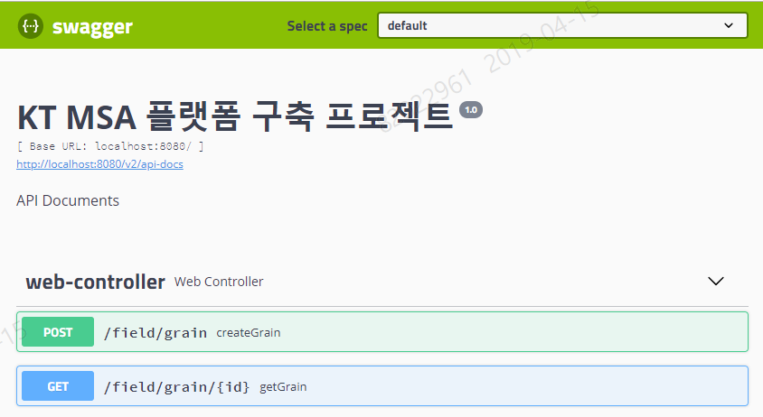
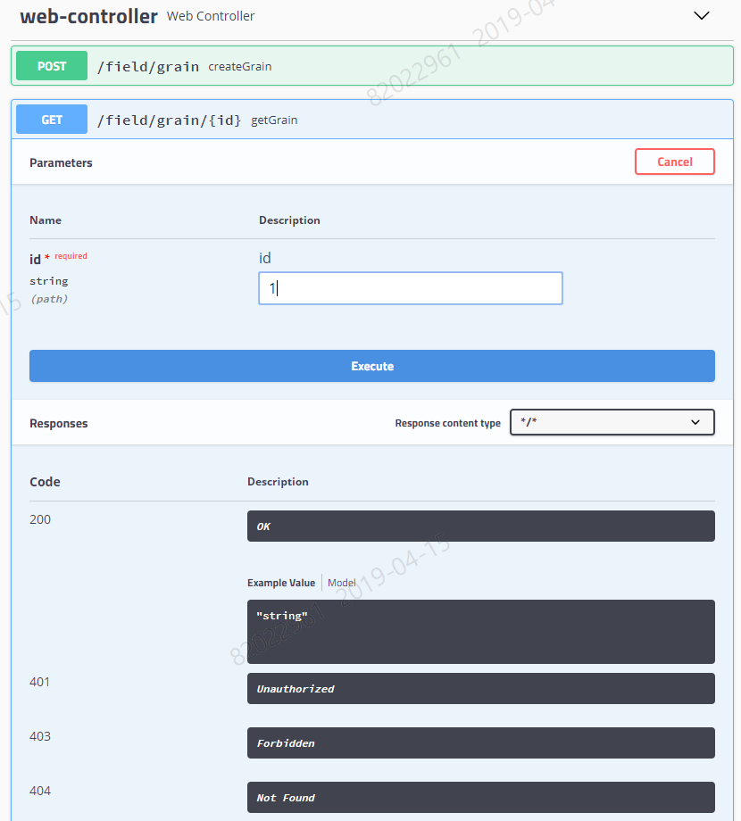
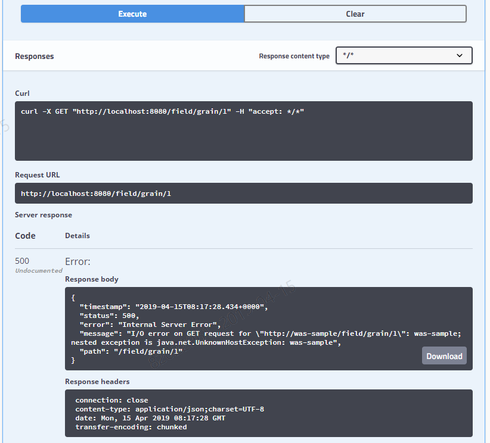

# 1. REST API 도출 방안 - Swagger


## 1.1. 개정이력

|    날짜    | 변경내용  | 작성자 | 비고 |
| :--------: | :-------: | :----: | :--: |
| 2019.02.19 | 최초 작성 | 장종호 |      |
|            |           |        |      |
|            |           |        |      |


## 1.2. 목차

- [1. REST API 도출 방안 - Swagger](#1-rest-api-%EB%8F%84%EC%B6%9C-%EB%B0%A9%EC%95%88---swagger)
  - [1.1. 개정이력](#11-%EA%B0%9C%EC%A0%95%EC%9D%B4%EB%A0%A5)
  - [1.2. 목차](#12-%EB%AA%A9%EC%B0%A8)
  - [1.3. API Expose 목적](#13-api-expose-%EB%AA%A9%EC%A0%81)
    - [1.3.1. Swagger API Expose 장점](#131-swagger-api-expose-%EC%9E%A5%EC%A0%90)
  - [1.4. 적용 방법](#14-%EC%A0%81%EC%9A%A9-%EB%B0%A9%EB%B2%95)
    - [1.4.1. 의존성 주입](#141-%EC%9D%98%EC%A1%B4%EC%84%B1-%EC%A3%BC%EC%9E%85)
    - [1.4.2. Config Class](#142-config-class)
  - [1.5. 사용 방법](#15-%EC%82%AC%EC%9A%A9-%EB%B0%A9%EB%B2%95)
    - [1.5.1. 접근방법](#151-%EC%A0%91%EA%B7%BC%EB%B0%A9%EB%B2%95)
    - [1.5.2. API 정보 식별 화면 - REST API](#152-api-%EC%A0%95%EB%B3%B4-%EC%8B%9D%EB%B3%84-%ED%99%94%EB%A9%B4---rest-api)
    - [1.5.3. API 테스트 화면](#153-api-%ED%85%8C%EC%8A%A4%ED%8A%B8-%ED%99%94%EB%A9%B4)
    - [1.5.4. 결과 확인](#154-%EA%B2%B0%EA%B3%BC-%ED%99%95%EC%9D%B8)


## 1.3. API Expose 목적

개발 진행 과정에서 생성 또는 변형되는 API를 상호 연관 관계에 있는 다른 팀과 효율적인 커뮤니케이션 방법으로 사용하기 위해서는 다양한 방법들이 존재할 수 있다. 

정형화된 문서 양식으로 정의서나 WIKI를 통해 작성하는 형태나, WebService에서 사용하는 WSDL 문서를 기반으로 상호 이해하면서, 클라이언트 Stub 까지 작성 가능한 방식등이 일반적이다.

REST 기반의 API 통신 방식에서는 자유도가 높은 특성에 따라, 다양한 방식들로 문서화를 제공하고 있으나, 개발 표준 프레임웍인 SpringBoot에서의 사용이 손쉽고, 작성 결과 내에서 별도 과정없이 손쉽게 API 별 테스트 및 점검이 우수한 ***`"Swagger"*** API Expose 를 활용한 방법을 정의 한다.


### 1.3.1. Swagger API Expose 장점

- 적용을 위한 코드 변경이 작음.
- API를 테스트 해 볼 수 있는 화면이 제공.
- 가독성 높은 UI 구성.


## 1.4. 적용 방법

### 1.4.1. 의존성 주입

swagger와 관련된 springfox-swagger2와 springfox-swagger-ui 2가지를 pom.xml 에 작성

```xml
<dependency>
	<groupId>io.springfox</groupId>
	<artifactId>springfox-swagger2</artifactId>
	<version>2.9.2</version>
</dependency>
				
<dependency>
	<groupId>io.springfox</groupId>
	<artifactId>springfox-swagger-ui</artifactId>
	<version>2.9.2</version>
</dependency>
```


### 1.4.2. Config Class

swagger 기능 설정을 위한 Configuration 설정 Class를 정의하고, API 기본정보를 정의.

```java
@Slf4j
@Configuration
@Profile("!prd")
@EnableSwagger2
public class SwaggerConfig {

    @Bean
    public Docket api() {

        return new Docket(DocumentationType.SWAGGER_2)
                    .select()
                    .apis(RequestHandlerSelectors.basePackage("com.kt"))
                    .paths(PathSelectors.ant("/**"))
                    .build()
                    .apiInfo(getApiInfo());
    }

    private ApiInfo getApiInfo() {

        return new ApiInfo(
            "KT MSA 플랫폼 구축 프로젝트",
            "API Documents",
            "1.0",
            null,
            null,
            null,
            null,
            Collections.emptyList()
        );
    }
}
```

- Spring Profile 특성을 활용하여, prd 환경이 아닌 profile에서만 동작하도록 함.
  - @Profile("!prd")
- 특정 패키지 기준의 API 에 대해 Expose 하도록 함.
  - RequestHandlerSelectors.basePackage("com.kt")
  - PathSelectors.ant("/**")
- 프로젝트 설정 정보 변경 - ApiInfo 정보를 프로젝트 정보에 맞춰 필수 변경 함.
  - Title -  "KT MSA 플랫폼 구축 프로젝트"
  - Description - "API Documents"
  - Version - "1.0"


## 1.5. 사용 방법

### 1.5.1. 접근방법

```
http://localhost:8080/swagger-ui.html
```


### 1.5.2. API 정보 식별 화면 - REST API




### 1.5.3. API 테스트 화면

제공된 API (파란라인)을 선택하여 "Try it out" 클릭하여, "key", "value" 입력 

"Execute" 클릭으로 REST API 호출 시도.




### 1.5.4. 결과 확인

