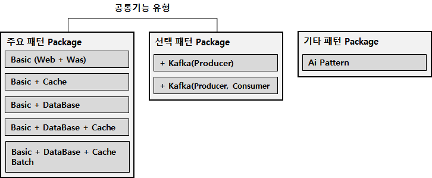
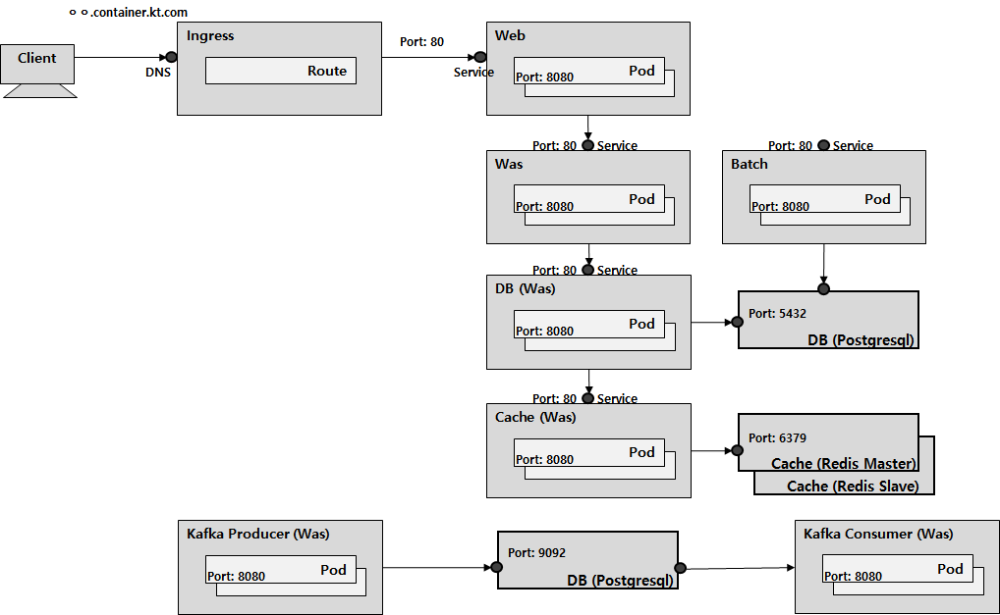

# 1. 공통 기능 정의


## 1.1. 개정이력

|    날짜    | 변경내용  | 작성자 | 비고 |
| :--------: | :-------: | :----: | :--: |
| 2019.03.29 | 최초 작성 | 장종호 |      |
|            |           |        |      |
|            |           |        |      |


## 1.2. 목차

- [1. 공통 기능 정의](#1-%EA%B3%B5%ED%86%B5-%EA%B8%B0%EB%8A%A5-%EC%A0%95%EC%9D%98)
  - [1.1. 개정이력](#11-%EA%B0%9C%EC%A0%95%EC%9D%B4%EB%A0%A5)
  - [1.2. 목차](#12-%EB%AA%A9%EC%B0%A8)
  - [1.3. 공통 기능 목적](#13-%EA%B3%B5%ED%86%B5-%EA%B8%B0%EB%8A%A5-%EB%AA%A9%EC%A0%81)
  - [1.4. 공통 기능 유형](#14-%EA%B3%B5%ED%86%B5-%EA%B8%B0%EB%8A%A5-%EC%9C%A0%ED%98%95)
    - [1.4.1. 주요 패턴 Package](#141-%EC%A3%BC%EC%9A%94-%ED%8C%A8%ED%84%B4-package)
      - [1.4.1.1. Simple01 (Web + Was)](#1411-simple01-web--was)
        - [1.4.1.1.1. Web 기능 정의](#14111-web-%EA%B8%B0%EB%8A%A5-%EC%A0%95%EC%9D%98)
        - [1.4.1.1.2. WAS 기능 정의](#14112-was-%EA%B8%B0%EB%8A%A5-%EC%A0%95%EC%9D%98)
      - [1.4.1.2. Simple02 (Web + Was + DB)](#1412-simple02-web--was--db)
        - [1.4.1.2.1. DB 기능 정의](#14121-db-%EA%B8%B0%EB%8A%A5-%EC%A0%95%EC%9D%98)
      - [1.4.1.3. Simple03 (Web + Was + Cache)](#1413-simple03-web--was--cache)
        - [1.4.1.3.1. Cache 기능 정의](#14131-cache-%EA%B8%B0%EB%8A%A5-%EC%A0%95%EC%9D%98)
      - [1.4.1.4. Simple04 (web + Was + DB + Cache)](#1414-simple04-web--was--db--cache)
        - [1.4.1.4.1. DB, Cache 기능 정의](#14141-db-cache-%EA%B8%B0%EB%8A%A5-%EC%A0%95%EC%9D%98)
      - [1.4.1.5. Simple05 (Web + Was + DB + Cache + Batch)](#1415-simple05-web--was--db--cache--batch)
        - [1.4.1.5.1. Batch 기능 정의](#14151-batch-%EA%B8%B0%EB%8A%A5-%EC%A0%95%EC%9D%98)
    - [1.4.2. 선택 패턴 Package](#142-%EC%84%A0%ED%83%9D-%ED%8C%A8%ED%84%B4-package)
      - [1.4.2.1. Complex01 (Web + Was + DB + Cache + Kafka(Producer))](#1421-complex01-web--was--db--cache--kafkaproducer)
        - [1.4.2.1.1. Kafka(Producer)](#14211-kafkaproducer)
      - [1.4.2.2. Complex02 (Web + Was + DB + Cache + Kafka(Producer) + kafka(Consumer))](#1422-complex02-web--was--db--cache--kafkaproducer--kafkaconsumer)
        - [1.4.2.2.1. Kafka(Consumer)](#14221-kafkaconsumer)
    - [1.4.3. 기타 패턴 Package](#143-%EA%B8%B0%ED%83%80-%ED%8C%A8%ED%84%B4-package)
      - [1.4.3.1. Ai01 (Python, Tensorflow)](#1431-ai01-python-tensorflow)
  - [1.5. 공통 기능 적용 방법](#15-%EA%B3%B5%ED%86%B5-%EA%B8%B0%EB%8A%A5-%EC%A0%81%EC%9A%A9-%EB%B0%A9%EB%B2%95)
    - [1.5.1. 공통 기능 구조(서비스간 호출 관계 및 Helm Tree)](#151-%EA%B3%B5%ED%86%B5-%EA%B8%B0%EB%8A%A5-%EA%B5%AC%EC%A1%B0%EC%84%9C%EB%B9%84%EC%8A%A4%EA%B0%84-%ED%98%B8%EC%B6%9C-%EA%B4%80%EA%B3%84-%EB%B0%8F-helm-tree)
    - [1.5.2. 공통 기능 적용 방법](#152-%EA%B3%B5%ED%86%B5-%EA%B8%B0%EB%8A%A5-%EC%A0%81%EC%9A%A9-%EB%B0%A9%EB%B2%95)
      - [1.5.2.1. 설정 파일 변경 (value.yaml)](#1521-%EC%84%A4%EC%A0%95-%ED%8C%8C%EC%9D%BC-%EB%B3%80%EA%B2%BD-valueyaml)
        - [1.5.2.1.1. 공통 - Label (Deployment)](#15211-%EA%B3%B5%ED%86%B5---label-deployment)
        - [1.5.2.1.2. 공통 - Label (Service)](#15212-%EA%B3%B5%ED%86%B5---label-service)
        - [1.5.2.1.3. Deployments](#15213-deployments)
        - [1.5.2.1.4. Service](#15214-service)
        - [1.5.2.1.5. Ingress](#15215-ingress)
        - [1.5.2.1.6. Route](#15216-route)
        - [1.5.2.1.7. Istio](#15217-istio)
        - [1.5.2.1.8. Batch](#15218-batch)
      - [1.5.2.2. 필수 변경 사항](#1522-%ED%95%84%EC%88%98-%EB%B3%80%EA%B2%BD-%EC%82%AC%ED%95%AD)
        - [1.5.2.2.1. DB 접속정보](#15221-db-%EC%A0%91%EC%86%8D%EC%A0%95%EB%B3%B4)
        - [1.5.2.2.2. Rest 호출 서비스 정보](#15222-rest-%ED%98%B8%EC%B6%9C-%EC%84%9C%EB%B9%84%EC%8A%A4-%EC%A0%95%EB%B3%B4)
        - [1.5.2.2.3. Ingress 정보](#15223-ingress-%EC%A0%95%EB%B3%B4)
      - [1.5.2.3. 공통 기능 적용](#1523-%EA%B3%B5%ED%86%B5-%EA%B8%B0%EB%8A%A5-%EC%A0%81%EC%9A%A9)
        - [1.5.2.3.1. 실행 및 실행 예제 화면](#15231-%EC%8B%A4%ED%96%89-%EB%B0%8F-%EC%8B%A4%ED%96%89-%EC%98%88%EC%A0%9C-%ED%99%94%EB%A9%B4)


## 1.3. 공통 기능 목적

Cluster 기반의 신규 환경에 진입하는 프로젝트들의 초기 진입과 이해 향상을 위해 Template 기반의 공통기능을 제공하여 손쉽게 진입할 수 있는 바에 목적을 두고, 프로젝트의 일반적으로 사용되는 기능 유형 7종을 정의하여, 활용할 수 있도록 제공한다.

제공되는 기능 유형은 Helm Chart 를 사용한 구성으로, 정의된 형태와 방식으로 제공하며, 향후 프로젝트 수행과정에서 작성되는 Image명칭과 일부 속성 항목을 교체하여 지속 사용될 수 있도록 구성되어 있다.


## 1.4. 공통 기능 유형

Web, Was 를 기반으로 DB, Cache 의 추가적인 역활구성만으로 패키징되어 제공하는 유형을 주요패턴 Packge 라고 명칭하고, 그 외 Queue(Kafka) 기반의 비동기식 처리 기능까지 포함한 패키징 유형은 선택패턴 Package 라고 세부 명칭되어 있다.





### 1.4.1. 주요 패턴 Package

Web, Was 기반의 유형으로 정적 기반의 Web과 동적 기반의 Was로 역활을 구분하고 DB 처리와 Cache 기능에 대한 유형으로 선택적으로 제공하는 패턴 유형이다.

조합하는 방식에 따라 유형이 세분하여 구성되어 있으며, 프로젝트의 목적에 맞춰 사용 가능하다. 또한, Was 역활에는 Session Clustering 를 제공하는 부분까지 사전 기능 제공으로 포함되어 있다.


#### 1.4.1.1. Simple01 (Web + Was)

Web - Was 구성으로 API 제공 기능등 간략한 서비스 기능을 수행하기 위한 유형.


##### 1.4.1.1.1. Web 기능 정의

- Java 1.8 - Spring Boot 2.x 기반
- Front - End Service 기능 제공 목적
- Swagger를 적용한 Service Expose 기능. (Spring Profile 설정으로 Production 을 제외한 환경에서만 제공)
- Lombok을 사용한 편리한 Code Style 제공
  - (Dependcy) Eclipse에 Lombok Plug-in 적용 필요.
- Actuator 적용으로 Service Health 및 모니터링 기능 적용
  - Prometheus Metric 기능 제공으로 JVM 모니터링 가능.
- Maven Docker Build
- 환경별(local, dev, stage, prd) yaml 파일로 구성된 prefix 내용 제공.
  - logback을 적용한 환경별 로깅 정책 기능(특정 크기와 일자로 파일 로테이션 제공 등)


##### 1.4.1.1.2. WAS 기능 정의

- (Web 기능 포함)
- Multi 구성을 대비한 Redis for Session Clustering 기능 제공.
  - /session/create, /session/remove 주소에서 기능 확인 가능.


#### 1.4.1.2. Simple02 (Web + Was + DB)

DataBase 를 기반으로 데이터 가공 및 제공의 기능을 수행하기 위한 유형.

DataBase는 현재까지의 Cluster 구성에서는 제공하지 않는 것으로 정책이 정의되어 있으나, 시스템별로 Quick Start 서비스를 제공하기 위해 초기 구성시에는 Postgresql을 Docker Image로 제공한다. 해당 부분은 시스템 구축시에 할당 되는 외부  VM 환경의 DB 정보로 대체하여 적용 및 사용 가능 하다.


##### 1.4.1.2.1. DB 기능 정의

- (Was 기능 포함)
- Spring JPA(Java Persistant Api) 기술 사용하여, SQL 없는 DB 제어(DML, DDL)
- 환경별로 정의 가능한 DB 접속 정보
- DB 접속 정보 암호화 기능 제공(Jasypt for Spring boot)


#### 1.4.1.3. Simple03 (Web + Was + Cache)

Redis 를 기반으로 데이터를 일정 크기(Buffer) 수준까지 정의된 형태로 Cache 기능을 수행하기 위한 유형.


##### 1.4.1.3.1. Cache 기능 정의

- (Was 기능 포함)
- Spring JPA(Java Persistant Api)  기술 사용하여, 손쉬운 Redis 제어(Put, Get -> Save, Find 방식)
- Redis ConfigMap 제공 (Redis Configuration 에 대한 항목은 Session Clustering 의 Redis 구성 참조)
  - Max Memory 설정
  - Max Memory Policy 설정


#### 1.4.1.4. Simple04 (web + Was + DB + Cache)

데이터 가공 및 제공의 기능을 수행하면서, Redis를 Cache로 사용하는 기능 수행 유형.


##### 1.4.1.4.1. DB, Cache 기능 정의

- 데이터 제공 시 Cache 적용 API 포함. 
- Cache TTL(Time-To-Live 정책 적용. default 60sec 이후 자동 Cache 만료.) 기능 적용.


#### 1.4.1.5. Simple05 (Web + Was + DB + Cache + Batch)

일정 주기에 따라 Batch 작업이 수행되어, 반복적인 작업에 대해 안정적으로 기능을 수행하는 유형.


##### 1.4.1.5.1. Batch 기능 정의

- (DB 기능 포함)
- Cronjob 기능으로 Cron 으로 지정한 작업 수행 기능 제공.
- 작업의 성공 실패 여부로 재시도 횟수 및 재수행(이전 작업에 대한 교차 수행 포함) 여부 정의 가능.


### 1.4.2. 선택 패턴 Package

Kafka를 기반으로 업무 처리의 연속성을 보장하기 위한 CQRS 방식으로 제공하는 패턴 유형이다.


#### 1.4.2.1. Complex01 (Web + Was + DB + Cache + Kafka(Producer))

사용자에게 요청에 대한 응답을 제공하고, 비동기식으로 추가 데이터 처리의 연속성을 진행하기 위한 유형.


##### 1.4.2.1.1. Kafka(Producer)

- Kafka Broekr 연결 기능
- 복제 구성 방식 설정으로 지정한 만큼(홀수)으로 Kafka, Zookeeper 구성
- 비동기식 데이터 전달


#### 1.4.2.2. Complex02 (Web + Was + DB + Cache + Kafka(Producer) + kafka(Consumer))

Kafka에 요청된 사용자 정보를 후속 진행하기 위한 유형


##### 1.4.2.2.1. Kafka(Consumer)

- (Kafka Producer 기능 포함)
- 데이터 인입 시점에 동작하는 이벤트식 데이터 수행


### 1.4.3. 기타 패턴 Package

일반적이지 않으나 Cluster 환경에서 사용이 필요할 수 있는 내용에 대해, 필요시 제공할 수 있는 패턴 유형이다.


#### 1.4.3.1. Ai01 (Python, Tensorflow)

Ai Serving 용도로 제공하는 유형. Web-WAS 를 기능은 포함함.


## 1.5. 공통 기능 적용 방법

### 1.5.1. 공통 기능 구조(서비스간 호출 관계 및 Helm Tree)



> 전체 기능 구조 흐름도. (Simple + Complex 기준)
>
> 유형별 호출 범위의 차이만 존재.


```t
.
├── charts
│   └── redis
│       ├── Chart.yaml
│       ├── templates
│       │   ├── configmap.yaml
│       │   ├── _helpers.tpl
│       │   ├── master-deployment.yaml
│       │   ├── master-service.yaml
│       │   ├── NOTES.txt
│       │   ├── slave-deployment.yaml
│       │   └── slave-service.yaml
│       └── values.yaml
├── Chart.yaml
├── templates
│   ├── deployment.yaml
│   ├── _helpers.tpl
│   ├── ingress.yaml
│   ├── NOTES.txt
│   └── service.yaml
└── values.yaml

```

>  Simple01의 Web - Was의 Tree 구조이며, 최상위 위치의 **value.yaml** 의 수정만으로 모든 항목에 설정 가능.

- 주요 설정 사항

  - Chart.yaml

    ```yaml
    apiVersion: v1
    appVersion: "1.0"
    description: A Helm chart for Kubernetes
    name: simple01
    version: 1.0.0
    
    ```

    - 제공되는 Simple01 Chart의 버전과 설명에 대한 내용 기술.
    - 공통 기능의 버전업에 따라 해당 Version은 Semantic 표기에 따름.

  - template/*

    - 자동으로 작성되는 K8S Deployment, Service, Ingress template 파일

  - charts/*

    - Sub Chart에 대한 내용으로, Redis, DataBase 등 종속속성의 제공 기능 유형
    - 명시되는 항목은 정의하여 제공될 사항으로 별도 수정 사항 없음.


### 1.5.2. 공통 기능 적용 방법

#### 1.5.2.1. 설정 파일 변경 (value.yaml)

프로젝트의 유형에 유사하게 일치하는 공통 기능을 선정하여, 설정 파일(value.yaml) 변경하여 적용하는 것으로 공통 기능의 적용은 동작 된다. 


##### 1.5.2.1.1. 공통 - Label (Deployment)

K8S에서 사용하는 Label에 대한 생성 규칙을 정의하여, 프로젝트에서 사용한 공통 기능의 형태를 식별하고, 배포 작업시에 사용할 이미지 등의 Release  정보를 확인하여, 다양한 목적으로 활용하기 위해 설정 한다.


```properties
## deployment 항목 (releaseName이 "simple"이고, image name이 "web" 일 경우)
  labels:
    app: simple                          --> {releaseName}
    version: 1.0.0                       --> {imageTag}
    chart: simple01-0.1.0                --> {chartName}-{chartVersion}
    release: simple                      --> {releaseName}
```

- appName : {releaseName} 으로 부여. 프로젝트 단위서비스 영문명과 동일. (gitlab Group Name)
- version : {imageTag} 으로 부여.
- chart : {chartName}-{chartVersion} 으로 부여. 제공되는 Chart의 명칭과 버전으로 부여
- release : 프로젝트에서 부여한 명칭(일반적으로 프로젝트 명칭). 프로젝트 단위서비스 영문명과 동일.


##### 1.5.2.1.2. 공통 - Label (Service)

```properties
## service 항목 (releaseName이 "simple"이고, image name이 "web" 일 경우)
  labels:
    app: simple                            --> {releaseName}
    version: 1.0.0                         --> {serviceTag}
    chart: simple01-0.1.0                  --> {chartName}-{chartVersion}
    release: simple                        --> {releaseName}
```

- appName : {releaseName} 으로 부여. 프로젝트 단위서비스 영문명과 동일. (gitlab Group Name)
- version : {serviceTag}는 service 항목에서 정의
- chart : {chartName}-{chartVersion} 으로 부여. 제공되는 Chart의 명칭과 버전으로 부여
- release : 프로젝트서 부여한 명칭(일반적으로 프로젝트 명칭). 프로젝트 단위서비스 영문명과 동일.


##### 1.5.2.1.3. Deployments

```properties
deployments:
  - image:
      repository: ktis-bastion01.container.ipc.kt.com:5000/millet/web-sample
      tag: 1.0.0
      pullPolicy: Always
    name: web
    ports:
      - name: http
        containerPort: 8080
        protocol: TCP
    replicaCount: 1
    env:
      dev:
        enabled: true
        spring.profiles.active: dev
        target.was.service.name: "simple01-was"
      stage:
        enabled: false
        spring.profiles.active: stage
        target.was.service.name: "simple01-was"
      production:
        enabled: false
        spring.profiles.active: prd
        target.was.service.name: "simple01-was"
    livenessProbe:
      httpGet:
        path: /actuator/health
        port: http
    readinessProbe:
      httpGet:
        path: /actuator/health
        port: http
    resources: {}
    nodeSelector: {}
    tolerations: []
    affinity: {}
  - image:
      repository: ktis-bastion01.container.ipc.kt.com:5000/millet/was-sample
      tag: 1.0.0
      pullPolicy: Always
    name: was
    ports:
      - name: http
        containerPort: 8080
        protocol: TCP
    replicaCount: 1
    istio:
      enabled: false
    env:
      dev:
        enabled: true
        spring.profiles.active: dev
        target.db.service.name: ""
        target.cache.service.name: ""
        spring.redis.host: simple01-redis-master
      stage:
        enabled: false
        spring.profiles.active: stage
        target.db.service.name: ""
        target.cache.service.name: ""
        spring.redis.host: simple01-redis-master
      production:
        enabled: false
        spring.profiles.active: prd
        target.db.service.name: ""
        target.cache.service.name: ""
        spring.redis.host: simple01-redis-master
    livenessProbe:
      httpGet:
        path: /actuator/health
        port: http
    readinessProbe:
      httpGet:
        path: /actuator/health
        port: http
    resources: {}
    nodeSelector: {}
    tolerations: []
    affinity: {}
```

- Simple01 유형 일 경우  Web, Was 2건의  Deployment 속성을 정의 하고, Simple01 유형 일 경우 Web, Was, Db 3건의  Deployment 속성을 정의 하는 방식으로 구성.
- image.repository : 배포에 적용할 이미지
- image.tag : 배포에 적용할 이미지 tag
- name : 작성명칭(실제 사용할 web 명칭으로 작성. default: web. 예, web, webApplication 등)
- ports : continaer 동작 port, springboot 일 경우 server.port 설정 사항과 동일
- replicaCount : pod 의 운용 개수
- istio.enable: istio 적용 여부. open shift 기준 pod별로 적용 설정 가능.
- env : 환경별 container 전달 parameter  설정.
  - dev, stage, production 각 enabled 값의 설정에 따라 하위 내용을 구성함.
  - 주의사항) pod 간 호출은 k8s service 를 통해 호출하며, 해당 정보는 springboot 코드에서 target.oo.service.name 형태에 지정한 k8s service 명칭으로 호출됨.
  - k8s service 명칭은 services values 작성에 따라 {releaseName}-{packageName}-{작성명칭}으로 생성됨.
  - 따라서, releaseName을 "abc"로 명칭한 경우 target.was.service.name 은 target.was.service.name: "abc-simple01-was" 로 기술해야 함.
- livenessProbe: Pod의 정상동작 상태를 확인하기 위함. springboot 일 경우 actuator/health 정보로 기술.
- readinessProbe: Pod의 준비 상태를 확인하기 위함. springboot 일 경우 actuator/health 정보로 기술.
- resource: 자원사용량 meta


##### 1.5.2.1.4. Service

```properties
services:
  - name: web
    tag: 1.0.0
    type: ClusterIP
    port: 80
  - name: was
    tag: 1.0.0
    type: ClusterIP
    port: 80
```

- 구성단위(web, was)의 pod 집합체에 대한 Groupping 설정.
- 작성한 services 명칭은, 실제적용시점에는 {releaseName}-{packageName}-{작성명칭}로 구성됨.
- name: 작성명칭
- tag: 배포 이미지 버전과 동일
- port: 기본 포트는 80. Pod에서 8080으로 지정되어있는 경우, Service에서 80으로 구성함.


##### 1.5.2.1.5. Ingress

```properties
ingress:
  enabled: true
  annotations: {}
  path: /
  serviceName: simple01-web
  hosts:
    - simple01-package.container.ipc.kt.com
  tls: []
```

- hosts : 외부로 expose 할 host명칭. 일반적으로 DNS 등록할 명칭으로 발급하여 정의 하나, 발급 전까지는 가칭으로 정의하여, 접근시에 hosts 에 개인별 설정으로 Inbound 수행 가능.


##### 1.5.2.1.6. Route

```properties
route:
  enabled: false
  annotations: {}
  path: /
  serviceName: simple01-web
  host: simple01-package.container.ipc.kt.com
  tls: []
```

- Ingress 와 Route 중에 하나만 선택해서 설정해야 하며, istio를 사용하는 경우 route만 설정해야 한다.
- 설정은 ingress와 동일 함.


##### 1.5.2.1.7. Istio

```properties
istio:
  enabled: false
  destination:
    host: simple02-web
    v1:
      version: 1.0.0
      weight: 50
    v2:
      version: 1.1.0
      weight: 50
    legacy:
      hosts:
        - simple02-was
        - simple02-postgresql
```

- istio 적용을 위한 설정
- destination 설정으로 Istio Traffic  설정을 Label 기준으로 적용될 수 있다.
- version은 host 에 명시하는 service 명칭을 기준으로 Image Tag 를 기준으로 동작된다.
- legacy 설정에는 Non-Istio 에 대한 Destination을 명시하여, Istio -> Non-Istio 서비스가 원활히 수행될 수 있게 생성한다.


##### 1.5.2.1.8. Batch

```properties
batches:
  - image:
      repository: ktis-bastion01.container.ipc.kt.com:5000/millet/batch-sample
      tag: 1.0.0
      pullPolicy: Always
    name: batch
    schedule: "*/5 * * * *"
    failedJobsHistoryLimit: 3
    concurrencyPolicy: Allow
    restartPolicy: Never
    env:
      dev:
        enabled: true
        spring.profiles.active: dev
        POSTGRES_ENV_IP: simple05-postgresql
        POSTGRES_ENV_PORT: 5432
        POSTGRES_ENV_DB: helm_sample
      stage:
        enabled: false
        spring.profiles.active: stage
        POSTGRES_ENV_IP: simple05-postgresql
        POSTGRES_ENV_PORT: 5432
        POSTGRES_ENV_DB: helm_sample
      production:
        enabled: false
        spring.profiles.active: prd
        POSTGRES_ENV_IP: simple05-postgresql
        POSTGRES_ENV_PORT: 5432
        POSTGRES_ENV_DB: helm_sample
    livenessProbe:
      httpGet:
        path: /actuator/health
        port: http
    readinessProbe:
      httpGet:
        path: /actuator/health
        port: http
    resources: {}
    nodeSelector: {}
    tolerations: []
    affinity: {}
```

- batch 실행 건이 여러건 있는 경우 복수로 구성 가능.
- k8s cronjob의 schedule(cron) 으로 동작하여, 지정된 정책에 따라 imageing running을 관리함.
- image.repository: 배포에 적용할 이미지
- image.tag: 배포에 적용할 이미지 tag
- name: 작성명칭(실제 사용할 batch 명칭으로 작성. default batch)
- env: 환경별 container 전달 parameter 설정.
  - dev, stage, production 각 enabled 값의 설정에 따라 하위 내용을 구성함.
- livenessProbe: Pod의 정상동작 상태를 확인하기 위함. springboot 일 경우 actuator/health 정보로 기술.
- readinessProbe: Pod의 준비 상태를 확인하기 위함. springboot 일 경우 actuator/health 정보로 기술.
- resource: 자원사용량 meta


#### 1.5.2.2. 필수 변경 사항

##### 1.5.2.2.1. DB 접속정보 

- batches, deployements 해당

- 환경별 설정되어 있는 DB 정보 현행화

  ```properties
  env:
    dev:
      enabled: true
      spring.profiles.active: dev
      POSTGRES_ENV_IP: mmp-postgresql
      POSTGRES_ENV_PORT: 5432
      POSTGRES_ENV_DB: helm_sample
  ```


##### 1.5.2.2.2. Rest 호출 서비스 정보

- deployements(was, db, cache) 해당

- 환경별 설정되어 있는 Rest 호출 서비스 정보 현행화

  ```properties
  env:
    dev:
      enabled: true
      spring.profiles.active: dev
      target.db.service.name: "mmp-db"
      target.cache.service.name: ""
      spring.redis.host: mmp-redis-master
  ```

  

##### 1.5.2.2.3. Ingress 정보

- Ingress에서 입력받을 host(DNS) 명칭과 Backward로 전달할 Servicename 에 해당

  ```properties
   serviceName: simple-web
    hosts:
      - simple-package.container.ipc.kt.com
  ```

  


#### 1.5.2.3. 공통 기능 적용

```
$simple04> helm install --name <project 지정 명칭> --namespace <namespace> .
```


##### 1.5.2.3.1. 실행 및 실행 예제 화면

```
[root@ktis-master01 simple05-mmp2]# helm install --name mmp2 --namespace millet .
NAME:   mmp2
LAST DEPLOYED: Wed Apr  3 21:00:41 2019
NAMESPACE: millet
STATUS: DEPLOYED

RESOURCES:
==> v1beta2/Deployment
NAME               DESIRED  CURRENT  UP-TO-DATE  AVAILABLE  AGE
mmp2-postgresql    1        1        1           0          1s
mmp2-redis-master  1        1        1           0          1s
mmp2-redis-slave   1        1        1           0          1s
mmp2-db            1        1        1           0          1s
mmp2-was           1        1        1           0          1s
mmp2-web           1        1        1           0          1s
mmp2-cache         1        1        1           0          1s

==> v1beta1/CronJob
NAME        SCHEDULE     SUSPEND  ACTIVE  LAST SCHEDULE  AGE
mmp2-batch  */5 * * * *  False    0       <none>         1s

==> v1beta1/Ingress
NAME           HOSTS                                  ADDRESS  PORTS  AGE
mmp2-simple05  simple05-package.container.ipc.kt.com  80       1s

==> v1/Pod(related)
NAME                               READY  STATUS   RESTARTS  AGE
mmp2-postgresql-75d565895-sm7m9    0/1    Pending  0         1s
mmp2-redis-master-64cd8b85b-z7c44  0/1    Pending  0         1s
mmp2-redis-slave-c6cf44769-kdm7h   0/1    Pending  0         1s
mmp2-db-8774d97ff-vmmqj            0/1    Pending  0         1s
mmp2-was-68868dc9-gpb57            0/1    Pending  0         1s
mmp2-web-85586c7ff6-t54lb          0/1    Pending  0         1s
mmp2-cache-67d46dcc74-mv4kt        0/1    Pending  0         1s

==> v1/ConfigMap
NAME               DATA  AGE
mmp2-redis-config  1     1s

==> v1/Service
NAME               TYPE       CLUSTER-IP      EXTERNAL-IP  PORT(S)   AGE
mmp2-postgresql    ClusterIP  172.30.111.136  <none>       5432/TCP  1s
mmp2-redis-master  ClusterIP  172.30.34.219   <none>       6379/TCP  1s
mmp2-redis-slave   ClusterIP  172.30.22.237   <none>       6379/TCP  1s
mmp2-web           ClusterIP  172.30.157.115  <none>       80/TCP    1s
mmp2-cache         ClusterIP  172.30.163.248  <none>       80/TCP    1s
mmp2-db            ClusterIP  172.30.134.6    <none>       80/TCP    1s
mmp2-was           ClusterIP  172.30.108.91   <none>       80/TCP    1s


NOTES:
1. Get the application URL by running these commands:
  http://simple05-package.container.ipc.kt.com/

```

