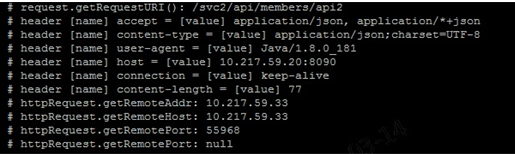

- [1. 개정이력](#1-%EA%B0%9C%EC%A0%95%EC%9D%B4%EB%A0%A5)
- [2. Audience](#2-audience)
- [3. 개요](#3-%EA%B0%9C%EC%9A%94)
- [4. 방화벽 작업](#4-%EB%B0%A9%ED%99%94%EB%B2%BD-%EC%9E%91%EC%97%85)
- [5. Openshift Egress Router 설정](#5-openshift-egress-router-%EC%84%A4%EC%A0%95)
  - [5.1. 개요](#51-%EA%B0%9C%EC%9A%94)
  - [5.2. 사전 준비](#52-%EC%82%AC%EC%A0%84-%EC%A4%80%EB%B9%84)
  - [5.3. Sample Router](#53-sample-router)
  - [5.4. Sample Router Service](#54-sample-router-service)
- [6. Istio ServiceEntry](#6-istio-serviceentry)
  - [6.1. 대외기관과의 TCP 통신 시 예제](#61-%EB%8C%80%EC%99%B8%EA%B8%B0%EA%B4%80%EA%B3%BC%EC%9D%98-tcp-%ED%86%B5%EC%8B%A0-%EC%8B%9C-%EC%98%88%EC%A0%9C)
  - [6.2. 대외기관과의 HTTP/HTTPs 통신 시 예제](#62-%EB%8C%80%EC%99%B8%EA%B8%B0%EA%B4%80%EA%B3%BC%EC%9D%98-httphttps-%ED%86%B5%EC%8B%A0-%EC%8B%9C-%EC%98%88%EC%A0%9C)
  - [6.3. 클러스터 외부의 DB서버와 TCP 통신 시 예제](#63-%ED%81%B4%EB%9F%AC%EC%8A%A4%ED%84%B0-%EC%99%B8%EB%B6%80%EC%9D%98-db%EC%84%9C%EB%B2%84%EC%99%80-tcp-%ED%86%B5%EC%8B%A0-%EC%8B%9C-%EC%98%88%EC%A0%9C)
- [7. Pod의 Outgoing traffic에 대한 관찰](#7-pod%EC%9D%98-outgoing-traffic%EC%97%90-%EB%8C%80%ED%95%9C-%EA%B4%80%EC%B0%B0)
- [8. 트래픽 연동에 대한 tcpdump 확인](#8-%ED%8A%B8%EB%9E%98%ED%94%BD-%EC%97%B0%EB%8F%99%EC%97%90-%EB%8C%80%ED%95%9C-tcpdump-%ED%99%95%EC%9D%B8)
- [9. Pod 내부에서 NodeIP 또는 PodIP를 환경변수로 전달하는 방법](#9-pod-%EB%82%B4%EB%B6%80%EC%97%90%EC%84%9C-nodeip-%EB%98%90%EB%8A%94-podip%EB%A5%BC-%ED%99%98%EA%B2%BD%EB%B3%80%EC%88%98%EB%A1%9C-%EC%A0%84%EB%8B%AC%ED%95%98%EB%8A%94-%EB%B0%A9%EB%B2%95)
- [10. IP가 아닌 도메인 정보로 외부 Service 호출 시](#10-ip%EA%B0%80-%EC%95%84%EB%8B%8C-%EB%8F%84%EB%A9%94%EC%9D%B8-%EC%A0%95%EB%B3%B4%EB%A1%9C-%EC%99%B8%EB%B6%80-service-%ED%98%B8%EC%B6%9C-%EC%8B%9C)
- [11. Pod의 hosts 파일 entry 추가](#11-pod%EC%9D%98-hosts-%ED%8C%8C%EC%9D%BC-entry-%EC%B6%94%EA%B0%80)
  - [11.1. 개요](#111-%EA%B0%9C%EC%9A%94)
  - [11.2. Sample](#112-sample)
- [12. HTTPs Client 인증서 설치 및 호출 방법](#12-https-client-%EC%9D%B8%EC%A6%9D%EC%84%9C-%EC%84%A4%EC%B9%98-%EB%B0%8F-%ED%98%B8%EC%B6%9C-%EB%B0%A9%EB%B2%95)
  - [12.1. Dockerfile 내 SSL 인증서를 설정하여 이미지화 하는 방법](#121-dockerfile-%EB%82%B4-ssl-%EC%9D%B8%EC%A6%9D%EC%84%9C%EB%A5%BC-%EC%84%A4%EC%A0%95%ED%95%98%EC%97%AC-%EC%9D%B4%EB%AF%B8%EC%A7%80%ED%99%94-%ED%95%98%EB%8A%94-%EB%B0%A9%EB%B2%95)


# 1. 개정이력

|    날짜    | 변경내용  | 작성자 | 비고 |
| :--------: | :-------: | :----: | :--: |
| 2019.03.08 | 최초 작성 | 전원호 |      |
|            |           |        |      |
|            |           |        |      |


# 2. Audience

- Openshift Container Platform 환경에서 외부로 서비스를 호출하고 싶은 자
- Openshift Container Platform 환경에서 Istio 솔루션을 적용하여 외부로 서비스를 호출하고 싶은 자
- 클러스터 외부 서비스 호출 시 도메인명으로 호출하고 싶은 자
- 클러스터 외부 서비스 HTTPS 호출하고자 서버 인증서 설정이 필요한 자


# 3. 개요

k8s, istio의 컨테이너 클러스터 환경에서 클러스터 내부에서 클러스터 밖의 Service를 호출하기 위해서는 크게 2가지의 방법이 존재한다. 

- 대상 Node IPs 방화벽 정책 설정 확인 후 Node 안의 모든 Pods에서 외부 서비스 접근이 가능하도록 하는 방법
- Egress controller, gateway, router Pods를 통해 static IPs 할당받아 해당 IPs 방화벽 정책 설정 확인 후 Pods의 외부 트래픽을 Egress controller, gateway, router Pods를 거쳐 접근하는 방법. 해당 방법이 기본 정책이 될 것이다.


# 4. 방화벽 작업

 크게 2가지 방법에 맞추어 대상 IPs에 대한 방화벽 정책 설정 확인은 진행한다.

- Node IPs
  - 다만, Infra Node의 경우 모든 Namespace가 공유하는 영역으로 특정 Namespace 대상의 Application Pods 배포를 금지하고 있다.
- Egress controller, gateway, router Pods의 static IPs


# 5. Openshift Egress Router 설정


## 5.1. 개요

- Pod 는 클러스터 노드에 고정적으로 위치하지 않으므로 Pod 가 외부로 나갈 때 nat 로 나가는 ip가 일정하지 않다. 하지만 Openshift Egress Router 를 통해 나갈경우 고정된 IP를 갖고 외부로 접근할 수 있다. 
- Openshift Egress Router Pod 는 타겟 서버로 나가는 outgoing 트래픽 전송을 담당하고 그 때 특정 소스 IP  주소를 가진다. 어플리케이션은 외부 실제 서비스를 직접 호출하는 것이 아니라  Egress Router 서비스를 호출하게 되고 이는 Egress Router Pod에 의해 재 전달되는 것이다.
- NodeSelector를 가지고 Namespace 단위로  Router를 배포하고 이 때 이미 할당된 static IP를 가지게 된다.
- Egress Router 가 모든 outgoing 트래픽을 위해 사용하는 것은 권고하지 않는다.  많은 Egress Router 의 생성은 네트워크 리소스의 제약을 가져온다.
- Egress Router 는 primary network interface에 IP를 추가하는 하는 방식이다. 이때의  IP는 노드 IP와 동일한  Subnet을 가져야 한다. Egress Router Pod에는 macvlan interface로 해당 IP가 설정된다.


## 5.2. 사전 준비

- 클러스터 관리자는 노드별 사용 가능한  static IPs를 할당한다.

```bash
$ oc patch hostsubnet <node_name> -p \
'{"egressIPs": ["<IP_address_1>", "<IP_address_2>"]}'
```

```bash
$ oc patch hostsubnet herasoo-dmz-infra-wokernode1 -p \
  '{"egressIPs": ["192.168.12.99", "192.168.12.100", "192.168.12.101"]}'
```

- 클러스터 관리자는 Namespace 별 사용 가능한 static IPs를 할당한다. 이는 특정 Namespace에서 나가는 트래픽을 쉽게 구분시켜 주는 장점이 있다.  

```bash
$ oc patch netnamespace <project_name> -p '{"egressIPs": ["<IP_address>"]}'
```

```bash
$ oc patch netnamespace herasoo -p '{"egressIPs": ["192.168.12.99"]}'
```

- 위와 같이 설정한다면 herasoo Namespace에 생성되는 Egress Router Pod는 herasoo-dmz-infra-wokernode1 Node에 배치되고 그 때  static IP 192.168.12.99를 가지게 된다. 이로써 Node별 static IPs, Namespace별 static IPs  관리되어 효율적인 관리와 가시적인 모니터링이 가능하다.


## 5.3. Sample Router

```yaml
apiVersion: apps/v1
kind: Deployment
metadata:
  name: deployment-egress-route-1
spec:
  selector:
    matchLabels:
      app: egress-route-1
  replicas: 1
  template:
    metadata:
      labels:
        app: egress-route-1
      annotations:
        pod.network.openshift.io/assign-macvlan: "true"
    spec:
      initContainers:
      - name: egress-router
        image: ktis-bastion01.container.ipc.kt.com:5000/openshift3/ose-egress-router:v3.11
        imagePullPolicy: Always
        env:
        - name: EGRESS_SOURCE
          value: 192.168.12.99
        - name: EGRESS_GATEWAY
          value: 192.168.12.1
        - name: EGRESS_DESTINATION
          #value: 203.0.113.25
          value: |
            80   tcp 203.0.113.25
            443	 tcp 203.0.113.25	
            8080 tcp 203.0.113.26 80
            8443 tcp 203.0.113.26 443
            #203.0.113.27
        - name: EGRESS_ROUTER_MODE
          value: init
        securityContext:
          privileged: true
      containers:
      - name: egress-router-wait
        image: ktis-bastion01.container.ipc.kt.com:5000/openshift3/ose-pod:v3.11
      #nodeSelector:
        #site: springfield-1
      nodeName: herasoo-dmz-infra-wokernode1
      restartPolicy: Always
```

- replicas: 1` 1이어야만 해당 소스IP 192.168.12.99를 가질 수 있다.

- `nodeName: herasoo-dmz-infra-wokernode1` 해당 노드에 192.168.12.99 static IP가 할당 되어 있다.

- `name: EGRESS_SOURCE value: 192.168.12.99` Router의 소스IP가 된다.

- `name: EGRESS_GATEWAY value: 192.168.12.1` herasoo-dmz-infra-wokernode1 의 GW IP정보와 같아야 한다.

- `name: EGRESS_DESTINATION`

  - redirect traffic rule을 작성한다.

  ```yaml
  80   tcp 203.0.113.25	  # Router에 80으로 들어오면 tcp 203.0.113.25 80으로 보낸다.
  443	 tcp 203.0.113.25	  # Router에 443으로 들어오면 tcp 203.0.113.25 443으로 보낸다.
  8080 tcp 203.0.113.26 80  # Router에 8080으로 들어오면 tcp 203.0.113.26 80으로 보낸다.
  8443 tcp 203.0.113.26 443 # Router에 8443으로 들어오면 tcp 203.0.113.26 443으로 보낸다.
  203.0.113.27			  # fallback IP로 위에 정해지지 않는 포트로 들어왔을 때 203.0.113.27의 포트로 보낸다. 설정되지 않았다면 Redirect가 거절된다.
  ```

- `value: init` initContainer 형태로 동작한다.


## 5.4. Sample Router Service

```yaml
apiVersion: v1
kind: Service
metadata:
  name: service-egress-route-1
spec:
  ports:
  - name: http-remote1	 # 192.168.12.99를 소스IP로 가지고 203.0.113.25 80으로 전송된다.
    port: 80
  - name: https-remote1	 # 192.168.12.99를 소스IP로 가지고 203.0.113.25 443으로 전송된다.
    port: 443
  - name: http-remote2	 # 192.168.12.99를 소스IP로 가지고 203.0.113.26 80으로 전송된다.
    port: 8080
  - name: https-remote2	 # 192.168.12.99를 소스IP로 가지고 203.0.113.26 443으로 전송된다.
    port: 8443
  type: ClusterIP
  selector:
    app: egress-route-1
```


# 6. Istio ServiceEntry

Service Mesh Istio 솔루션 적용 환경은 기본적으로 Service Mesh(컨테이너 클러스터) 외부와의 통신이 불가능하다. 이는 대외기관 뿐만 아니라 클러스터 외부에 존재하는 사내망 장비에도 동일하게 적용된다. ServiceEntry를 사용하여 명시적으로 외부 서비스를 등록함으로써 등록된 외부 서비스와 통신이 가능하다.


## 6.1. 대외기관과의 TCP 통신 시 예제

```yaml
apiVersion: networking.istio.io/v1alpha3
kind: ServiceEntry
metadata:
  name: medat-kbins
  labels:
    app: medat
    version: 1.0.0
    release: mmp
spec:
  hosts:
  - 10.221.30.2
  addresses:
  - 10.221.30.2/32
  ports:
  - number: 37503
    name: tcp
    protocol: TCP
  location: MESH_EXTERNAL
  resolution: NONE
```


## 6.2. 대외기관과의 HTTP/HTTPs 통신 시 예제

```yaml
kind: ServiceEntry
metadata:
  name: athn-kmc
  labels:
    app: athn
    version: 1.0.0
    release: mmp
spec:
  hosts:
  - "*.kmcert.com"
  - "kmcert.com"
  ports:
  - number: 80
    name: http
    protocol: HTTP
  - number: 443
    name: https
    protocol: HTTPS
  location: MESH_EXTERNAL
  resolution: NONE
```


## 6.3. 클러스터 외부의 DB서버와 TCP 통신 시 예제

```yaml
apiVersion: networking.istio.io/v1alpha3
kind: ServiceEntry
metadata:
  name: athn-postgresdb
  labels:
    app: athn
    version: 1.0.0
    release: mmp
spec:
  hosts:
  - 10.217.59.68
  addresses:
  - 10.217.59.68/32
  ports:
  - number: 5432
    name: tcp
    protocol: TCP
  location: MESH_INTERNAL
  resolution: STATIC
  endpoints:
    - address: 10.217.59.68
```


# 7. Pod의 Outgoing traffic에 대한 관찰

Pod에서 컨테이너 클러스터 외부로 나가는 트래픽에 대하여 외부의 타겟 서버에서 tcpdump 및 로그를 확인해보면 소스IP로 Pod가 배치된 Node IP가 확인된다. Openshift Egress Router 기능을 사용해도 결국 Node에 등록된 2nd IP로 할당되어 보여지는 것이다. 아래 예제에서 10.217.59.33이 소스IP이다.





# 8. 트래픽 연동에 대한 tcpdump 확인

컨테이너 클러스터 환경에서 특정 서비스 간 네트워크 이슈가 발생할 수 있다. Pods 로그가 있다면 다행이겠지만 그렇지 않을 경우 해당 현상 분석에 tcpdump를 활용한다. 단, Pods안에 들어가서 확인해야 하며 tcdump가 설치되어 있어야 한다.

```bash
$ tcpdump -i any -nnvXx host <pod_1_ip> and host <pod_2_ip>
$ tcpdump -i any -nnvXx host <pod_ip> and port <pod_port>
# and, or, not으로 여러가지 조합 가능 src <ip>, dst <ip>, src port <port>, dst port <port>
```


# 9. Pod 내부에서 NodeIP 또는 PodIP를 환경변수로 전달하는 방법

```yaml
spec:
  containers:
  - name: micro-svc-1
    env:
    - name: NODE_IP
      valueFrom:
        fieldRef:
          fieldPath: status.hostIP  # Node IP
          #fieldPath: status.podIP  # Pod IP
    - name: POD_NAMESPACE
      valueFrom:
        fieldRef:
          fieldPath: metadata.namespace
    - name: NODE_NAME
      valueFrom:
        fieldRef:
          fieldPath: spec.nodeName
```


# 10. IP가 아닌 도메인 정보로 외부 Service 호출 시

IP가 아닌 도메인 정보로 외부 Service를 호출하는 경우 클러스터 어드민 관리자에게 클러스터 DNS에 해당 도메인 주소와 IP를 등록하도록 한다. 이게 불가피할 경우 /etc/hosts 파일 추가하여 활용할 수 있다.


# 11. Pod의 hosts 파일 entry 추가


## 11.1. 개요

- 클러스터  DNS  및 네트워크 설정이  안 되어 있는 경우 PodSpec의 HostAliases를 활용하여 Pod의 /etc/hosts 파일 내 필요한 정보를 추가할 수 있다.
- HostAliases 기능이 아닌 /etc/hosts 파일의 수정은 권고하지 않는다.  Kubelet에 의해 Pod의 생성 및 재실행시 관리되고 있기 때문이다.


## 11.2. Sample

```yaml
apiVersion: v1
kind: Pod
metadata:
  name: hostaliases-pod
spec:
  restartPolicy: Never
  hostAliases:
  - ip: "127.0.0.1"
    hostnames:
    - "foo.local"
    - "bar.local"
  - ip: "10.1.2.3"
    hostnames:
    - "foo.remote"
    - "bar.remote"
  containers:
  - name: cat-hosts
    image: busybox
    command:
    - cat
    args:
    - "/etc/hosts"
```

```bash
$ kubectl logs hostaliases-pod

# Kubernetes-managed hosts file.
127.0.0.1	localhost
::1	localhost ip6-localhost ip6-loopback
fe00::0	ip6-localnet
fe00::0	ip6-mcastprefix
fe00::1	ip6-allnodes
fe00::2	ip6-allrouters
10.200.0.5	hostaliases-pod

# Entries added by HostAliases. 이 부분이 Pod 생성, 재실행 시 add 된다.
127.0.0.1	foo.local	bar.local
10.1.2.3	foo.remote	bar.remote
```


# 12. HTTPs Client 인증서 설치 및 호출 방법

컨테이너 클러스터 내부에 존재하는 Pod application에서 사용할 https client용도의 서버 인증서를 설정하는 방법이다.  크게 두 가지 방법이 존재하며 첫 번째 방법으로는 `11. 보안 가이드 라인-01. SSL 연동 가이드`를 참고한다.


## 12.1. Dockerfile 내 SSL 인증서를 설정하여 이미지화 하는 방법

Dockerfile

```dockerfile
FROM ktis-bastion01.container.ipc.kt.com:5000/admin/openjdk-millet:8-jdk-alpine

LABEL owner=mmp-project-team
ENV TZ Asia/Seoul

# ahtn ssl client certificate import
RUN mkdir -p /java.io/keystores
COPY src/main/resources/cert/kmcert1.cer /java.io/keystores
RUN keytool -import -alias kmcTrust -file /java.io/keystores/kmcert1.cer -keystore /java.io/keystores/truststore.jks -storepass mmpProject -noprompt

COPY target/*.jar app.jar
ENV JAVA_OPTS="-Xms1G -Xmx1G -XX:MetaspaceSize=128m -XX:MaxMetaspaceSize=256m"
ENV JAVA_OPTS="${JAVA_OPTS} -XX:+UseG1GC -XX:+UnlockDiagnosticVMOptions -XX:+G1SummarizeConcMark -XX:InitiatingHeapOccupancyPercent=35 -XX:G1ConcRefinementThreads=20"

# ahtn ssl client certificate ENV
ENV JAVA_OPTS="${JAVA_OPTS} -Djavax.net.ssl.trustStore=/java.io/keystores/truststore.jks -Djavax.net.ssl.trustStorePassword=mmpProject"

ENTRYPOINT ["sh","-c","java $JAVA_OPTS -Djava.security.egd=file:/dev/./urandom -jar /app.jar"]
```

- git Repository의 src/main/resources/cert/kmcert1.cer 인증서를 컨테이너 /java.io/keystores 에 복사하고 java keytool -import 명령어를 통하여 truststore.jks(Java Key Store) 파일로 생성한다.
- Java option 설정 값 Djavax.net.ssl.trustStore=/java.io/keystores/truststore.jks -Djavax.net.ssl.trustStorePassword=mmpProject 를 환경변수로 설정한다.

