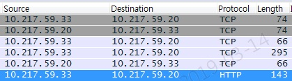
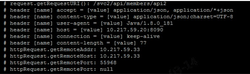

# 클러스터 외부 Service 호출 가이드


### 개요

k8s, istio의 컨테이너 클러스터 환경에서 클러스터 내부에서 클러스터 밖의 Service를 호출하기 위해서는 크게 2가지의 방법이 존재한다. 

- 대상 Node IPs 방화벽 정책 설정 확인 후 Node 안의 모든 Pods에서 외부 서비스 접근이 가능하도록 하는 방법
- Egress controller, gateway, router Pods를 통해 static IPs 할당받아 해당 IPs 방화벽 정책 설정 확인 후 Pods의 외부 트래픽을 Egress controller, gateway, router Pods를 거쳐 접근하는 방법


### 방화벽

 크게 2가지 방법에 맞추어 대상 IPs에 대한 방화벽 정책 설정 확인은 진행한다.

- Node IPs
  - 다만, Infra Node의 경우 모든 Namespace가 공유하는 영역으로 특정 Namespace 대상의 Application Pods 배포를 금지하고 있다.
- Egress controller, gateway, router Pods의 static IPs


### Openshift Egress Router 설정


#### 개요

- Pod 는 클러스터 노드에 고정적으로 위치하지 않으므로 Pod 가 외부로 나갈 때 nat 로 나가는 ip가 일정하지 않다. 하지만 Openshift Egress Router 를 통해 나갈경우 고정된 IP를 갖고 외부로 접근할 수 있다. 
- Openshift Egress Router Pod 는 타겟 서버로 나가는 outgoing 트래픽 전송을 담당하고 그 때 특정 소스 IP  주소를 가진다. 어플리케이션은 외부 실제 서비스를 직접 호출하는 것이 아니라  Egress Router 서비스를 호출하게 되고 이는 Egress Router Pod에 의해 재 전달되는 것이다.
- NodeSelector를 가지고 Namespace 단위로  Router를 배포하고 이 때 이미 할당된 static IP를 가지게 된다.
- Egress Router 가 모든 outgoing 트래픽을 위해 사용하는 것은 권고하지 않는다.  많은 Egress Router 의 생성은 네트워크 리소스의 제약을 가져온다.
- Egress Router 는 primary network interface에 IP를 추가하는 하는 방식이다. 이때의  IP는 노드 IP와 동일한  Subnet을 가져야 한다. Egress Router Pod에는 macvlan interface로 해당 IP가 설정된다.


#### 사전 준비

- 클러스터 관리자는 노드별 사용 가능한  static IPs를 할당한다.

```bash
$ oc patch hostsubnet <node_name> -p \
'{"egressIPs": ["<IP_address_1>", "<IP_address_2>"]}'
```

```bash
$ oc patch hostsubnet herasoo-dmz-infra-wokernode1 -p \
  '{"egressIPs": ["192.168.12.99", "192.168.12.100", "192.168.12.101"]}'
```

- 클러스터 관리자는 Namespace 별 사용 가능한 static IPs를 할당한다. 이는 특정 Namespace에서 나가는 트래픽을 쉽게 구분시켜 주는 장점이 있다.  

```bash
$ oc patch netnamespace <project_name> -p '{"egressIPs": ["<IP_address>"]}'
```

```bash
$ oc patch netnamespace herasoo -p '{"egressIPs": ["192.168.12.99"]}'
```

- 위와 같이 설정한다면 herasoo Namespace에 생성되는 Egress Router Pod는 herasoo-dmz-infra-wokernode1 Node에 배치되고 그 때  static IP 192.168.12.99를 가지게 된다. 이로써 Node별 static IPs, Namespace별 static IPs  관리되어 효율적인 관리와 가시적인 모니터링이 가능하다.


#### Sample Router

```yaml
apiVersion: apps/v1
kind: Deployment
metadata:
  name: deployment-egress-route-1
spec:
  selector:
    matchLabels:
      app: egress-route-1
  replicas: 1
  template:
    metadata:
      labels:
        app: egress-route-1
      annotations:
        pod.network.openshift.io/assign-macvlan: "true"
    spec:
      initContainers:
      - name: egress-router
        image: ktis-bastion01.container.ipc.kt.com:5000/openshift3/ose-egress-router:v3.11
        imagePullPolicy: Always
        env:
        - name: EGRESS_SOURCE
          value: 192.168.12.99
        - name: EGRESS_GATEWAY
          value: 192.168.12.1
        - name: EGRESS_DESTINATION
          #value: 203.0.113.25
          value: |
            80   tcp 203.0.113.25
            443	 tcp 203.0.113.25	
            8080 tcp 203.0.113.26 80
            8443 tcp 203.0.113.26 443
            #203.0.113.27
        - name: EGRESS_ROUTER_MODE
          value: init
        securityContext:
          privileged: true
      containers:
      - name: egress-router-wait
        image: ktis-bastion01.container.ipc.kt.com:5000/openshift3/ose-pod:v3.11
      #nodeSelector:
        #site: springfield-1
      nodeName: herasoo-dmz-infra-wokernode1
      restartPolicy: Always
```

- replicas: 1` 1이어야만 해당 소스IP 192.168.12.99를 가질 수 있다.

- `nodeName: herasoo-dmz-infra-wokernode1` 해당 노드에 192.168.12.99 static IP가 할당 되어 있다.

- `name: EGRESS_SOURCE value: 192.168.12.99` Router의 소스IP가 된다.

- `name: EGRESS_GATEWAY value: 192.168.12.1` herasoo-dmz-infra-wokernode1 의 GW IP정보와 같아야 한다.

- `name: EGRESS_DESTINATION`

  - redirect traffic rule을 작성한다.

  ```yaml
  80   tcp 203.0.113.25	  # Router에 80으로 들어오면 tcp 203.0.113.25 80으로 보낸다.
  443	 tcp 203.0.113.25	  # Router에 443으로 들어오면 tcp 203.0.113.25 443으로 보낸다.
  8080 tcp 203.0.113.26 80  # Router에 8080으로 들어오면 tcp 203.0.113.26 80으로 보낸다.
  8443 tcp 203.0.113.26 443 # Router에 8443으로 들어오면 tcp 203.0.113.26 443으로 보낸다.
  203.0.113.27			  # fallback IP로 위에 정해지지 않는 포트로 들어왔을 때 203.0.113.27의 포트로 보낸다. 설정되지 않았다면 Redirect가 거절된다.
  ```

- `value: init` initContainer 형태로 동작한다.


#### Sample Router Service

```yaml
apiVersion: v1
kind: Service
metadata:
  name: service-egress-route-1
spec:
  ports:
  - name: http-remote1	 # 192.168.12.99를 소스IP로 가지고 203.0.113.25 80으로 전송된다.
    port: 80
  - name: https-remote1	 # 192.168.12.99를 소스IP로 가지고 203.0.113.25 443으로 전송된다.
    port: 443
  - name: http-remote2	 # 192.168.12.99를 소스IP로 가지고 203.0.113.26 80으로 전송된다.
    port: 8080
  - name: https-remote2	 # 192.168.12.99를 소스IP로 가지고 203.0.113.26 443으로 전송된다.
    port: 8443
  type: ClusterIP
  selector:
    app: egress-route-1
```


### Pod의 Outgoing traffic에 대한 관찰

Pod에서 컨테이너 클러스터 외부로 나가는 트래픽에 대하여 외부의 타겟 서버에서 tcpdump 및 로그를 확인해보면 소스IP로 Pod가 배치된 Node IP로 확인된다. Openshift Egress Router 기능을 사용해도 결국 Node에 등록된 2nd IP로 할당되어 보여지는 것이다. 아래 예제에서 10.217.59.33이 소스IP이다.






### 트래픽 연동에 대한 tcpdump 확인

컨테이너 클러스터 환경에서 특정 서비스 간 네트워크 이슈가 발생할 수 있다. Pods 로그가 있다면 다행이겠지만 그렇지 않을 경우 해당 현상 분석에 tcpdump를 활용한다. 단, Pods안에 들어가서 확인해야 하며 tcdump가 설치되어 있어야 한다.

```bash
$ tcpdump -i any -nnvXx host <pod_1_ip> and host <pod_2_ip>
$ tcpdump -i any -nnvXx host <pod_ip> and port <pod_port>
# and, or, not으로 여러가지 조합 가능 src <ip>, dst <ip>, src port <port>, dst port <port>
```


### Pod 내부에서 NodeIP 또는 PodIP를 환경변수로 전달하는 방법

```yaml
spec:
  containers:
  - name: micro-svc-1
    env:
    - name: NODE_IP
      valueFrom:
        fieldRef:
          status.hostIP  # Node IP
          #status.podIP  # Pod IP
```


### Pod의 hosts 파일 entry 추가


#### 개요

- 사내  DNS  및 네트워크 설정이  안 되어 있는 경우 PodSpec의 HostAliases를 활용하여 Pod의 /etc/hosts 파일 내 필요한 정보를 추가할 수 있다.
- HostAliases 기능이 아닌 /etc/hosts 파일의 수정은 권고하지 않는다.  Kubelet에 의해 Pod의 생성 및 재실행시 관리되고 있기 때문이다.


#### Sample

```yaml
apiVersion: v1
kind: Pod
metadata:
  name: hostaliases-pod
spec:
  restartPolicy: Never
  hostAliases:
  - ip: "127.0.0.1"
    hostnames:
    - "foo.local"
    - "bar.local"
  - ip: "10.1.2.3"
    hostnames:
    - "foo.remote"
    - "bar.remote"
  containers:
  - name: cat-hosts
    image: busybox
    command:
    - cat
    args:
    - "/etc/hosts"
```

```bash
$ kubectl logs hostaliases-pod

# Kubernetes-managed hosts file.
127.0.0.1	localhost
::1	localhost ip6-localhost ip6-loopback
fe00::0	ip6-localnet
fe00::0	ip6-mcastprefix
fe00::1	ip6-allnodes
fe00::2	ip6-allrouters
10.200.0.5	hostaliases-pod

# Entries added by HostAliases. 이 부분이 Pod 생성, 재실행 시 add 된다.
127.0.0.1	foo.local	bar.local
10.1.2.3	foo.remote	bar.remote
```


