- [1. 단위 테스트 가이드](#1-%EB%8B%A8%EC%9C%84-%ED%85%8C%EC%8A%A4%ED%8A%B8-%EA%B0%80%EC%9D%B4%EB%93%9C)
  - [1.1. 개요](#11-%EA%B0%9C%EC%9A%94)
    - [1.1.1. 목적](#111-%EB%AA%A9%EC%A0%81)
    - [1.1.2. 범위](#112-%EB%B2%94%EC%9C%84)
    - [1.1.3. 이해관계자](#113-%EC%9D%B4%ED%95%B4%EA%B4%80%EA%B3%84%EC%9E%90)
    - [1.1.4. 용어사전](#114-%EC%9A%A9%EC%96%B4%EC%82%AC%EC%A0%84)
  - [1.2. pom.xml 의존성 주입](#12-pomxml-%EC%9D%98%EC%A1%B4%EC%84%B1-%EC%A3%BC%EC%9E%85)
  - [1.3. 디렉토리 구조](#13-%EB%94%94%EB%A0%89%ED%86%A0%EB%A6%AC-%EA%B5%AC%EC%A1%B0)
  - [1.4. 네이밍 규칙](#14-%EB%84%A4%EC%9D%B4%EB%B0%8D-%EA%B7%9C%EC%B9%99)
    - [1.4.1. 클래스명](#141-%ED%81%B4%EB%9E%98%EC%8A%A4%EB%AA%85)
    - [1.4.2. 메소드명](#142-%EB%A9%94%EC%86%8C%EB%93%9C%EB%AA%85)
  - [1.5. 테스트 코드](#15-%ED%85%8C%EC%8A%A4%ED%8A%B8-%EC%BD%94%EB%93%9C)
    - [1.5.1. 샘플 코드 및 설명](#151-%EC%83%98%ED%94%8C-%EC%BD%94%EB%93%9C-%EB%B0%8F-%EC%84%A4%EB%AA%85)
    - [1.5.2. 테스트 수행](#152-%ED%85%8C%EC%8A%A4%ED%8A%B8-%EC%88%98%ED%96%89)
    - [1.5.3. 테스트 결과](#153-%ED%85%8C%EC%8A%A4%ED%8A%B8-%EA%B2%B0%EA%B3%BC)
  - [1.6. 참고 링크](#16-%EC%B0%B8%EA%B3%A0-%EB%A7%81%ED%81%AC)
- [2. 기능 테스트 가이드](#2-%EA%B8%B0%EB%8A%A5-%ED%85%8C%EC%8A%A4%ED%8A%B8-%EA%B0%80%EC%9D%B4%EB%93%9C)
  - [2.1. 개요](#21-%EA%B0%9C%EC%9A%94)
    - [2.1.1. 목적](#211-%EB%AA%A9%EC%A0%81)
    - [2.1.2. 이해관계자](#212-%EC%9D%B4%ED%95%B4%EA%B4%80%EA%B3%84%EC%9E%90)
    - [2.1.3. 용어사전](#213-%EC%9A%A9%EC%96%B4%EC%82%AC%EC%A0%84)
  - [2.2. 테스트 항목](#22-%ED%85%8C%EC%8A%A4%ED%8A%B8-%ED%95%AD%EB%AA%A9)
  - [2.3. 도커/도커 컴포즈 방법](#23-%EB%8F%84%EC%BB%A4%EB%8F%84%EC%BB%A4-%EC%BB%B4%ED%8F%AC%EC%A6%88-%EB%B0%A9%EB%B2%95)
  - [2.4. 참고 링크](#24-%EC%B0%B8%EA%B3%A0-%EB%A7%81%ED%81%AC)
- [3. 통합 테스트 가이드](#3-%ED%86%B5%ED%95%A9-%ED%85%8C%EC%8A%A4%ED%8A%B8-%EA%B0%80%EC%9D%B4%EB%93%9C)
  - [3.1. 개요](#31-%EA%B0%9C%EC%9A%94)
    - [3.1.1. 목적](#311-%EB%AA%A9%EC%A0%81)
    - [3.1.2. 이해관계자](#312-%EC%9D%B4%ED%95%B4%EA%B4%80%EA%B3%84%EC%9E%90)
    - [3.1.3. 용어사전](#313-%EC%9A%A9%EC%96%B4%EC%82%AC%EC%A0%84)
  - [3.2. 테스트 항목](#32-%ED%85%8C%EC%8A%A4%ED%8A%B8-%ED%95%AD%EB%AA%A9)
  - [3.3. 참고 링크](#33-%EC%B0%B8%EA%B3%A0-%EB%A7%81%ED%81%AC)
- [4. 운영 테스트 가이드](#4-%EC%9A%B4%EC%98%81-%ED%85%8C%EC%8A%A4%ED%8A%B8-%EA%B0%80%EC%9D%B4%EB%93%9C)
  - [4.1. 개요](#41-%EA%B0%9C%EC%9A%94)
    - [4.1.1. 목적](#411-%EB%AA%A9%EC%A0%81)
    - [4.1.2. 이해관계자](#412-%EC%9D%B4%ED%95%B4%EA%B4%80%EA%B3%84%EC%9E%90)
    - [4.1.3. 용어사전](#413-%EC%9A%A9%EC%96%B4%EC%82%AC%EC%A0%84)
  - [4.2. 체크 항목](#42-%EC%B2%B4%ED%81%AC-%ED%95%AD%EB%AA%A9)
    - [4.2.1. 어플리케이션 Overview](#421-%EC%96%B4%ED%94%8C%EB%A6%AC%EC%BC%80%EC%9D%B4%EC%85%98-overview)
    - [4.2.2. 디플로이먼트 객체 확인](#422-%EB%94%94%ED%94%8C%EB%A1%9C%EC%9D%B4%EB%A8%BC%ED%8A%B8-%EA%B0%9D%EC%B2%B4-%ED%99%95%EC%9D%B8)
    - [4.2.3. 서비스 객체 확인](#423-%EC%84%9C%EB%B9%84%EC%8A%A4-%EA%B0%9D%EC%B2%B4-%ED%99%95%EC%9D%B8)
    - [4.2.4. 포드 객체 확인](#424-%ED%8F%AC%EB%93%9C-%EA%B0%9D%EC%B2%B4-%ED%99%95%EC%9D%B8)
      - [4.2.4.1. 포드 삭제 테스트](#4241-%ED%8F%AC%EB%93%9C-%EC%82%AD%EC%A0%9C-%ED%85%8C%EC%8A%A4%ED%8A%B8)
    - [4.2.5. 라우트 객체 확인](#425-%EB%9D%BC%EC%9A%B0%ED%8A%B8-%EA%B0%9D%EC%B2%B4-%ED%99%95%EC%9D%B8)
    - [4.2.6. 컨피그맵 객체 확인](#426-%EC%BB%A8%ED%94%BC%EA%B7%B8%EB%A7%B5-%EA%B0%9D%EC%B2%B4-%ED%99%95%EC%9D%B8)
  - [4.3. 참고 링크](#43-%EC%B0%B8%EA%B3%A0-%EB%A7%81%ED%81%AC)

# 1. 단위 테스트 가이드

## 1.1. 개요

### 1.1.1. 목적

본 문서는 개발이 완료된 소스에 대해 `로컬 개발 환경` 에서 이루어지는 단위 테스트에 대한 가이드를 제시한다. 기능 테스트(로컬 도커 환경) 도입 전 단위테스트는 필수로써 최대한 많은 테스트를 수행한 후 기능/통합 테스트를 수행하여야 한다.

단위 테스트는 가장 낮은 레벨의 테스팅 방법론으로 본 단계에서는 애플리케이션 내의 인터페이스, 구현 및 모듈에 초점을 맞춘 소스 레벨 수준의 테스트를 수행한다.

컨테이너 기반 표준 프레임워크인 `스프링 부트` 프로젝트의 경우 `junit` 을 기반으로 수행한다. 개발한 소스를 함수 단위로 테스트하는 것이 기본으로 삼고, 기능 테스트 시 문제가 없도록 철저히 점검해야 한다.

### 1.1.2. 범위

본 문서는 아래 주제들에 대해 다룬다.

- 필수 라이브러리 설치
- 네이밍 규칙
- 테스트코드의 디렉토리 구조
- 샘플 코드 및 테스트 결과
- 테스트 코드 작성에 참고할 만한 사이트 링크

### 1.1.3. 이해관계자

스프링 부트로 개발하는 모든 개발자 및 테스터 분들을 해당 가이드를 숙지해야 한다.

### 1.1.4. 용어사전

| 용어  | 정의                                 |
| --- | ---------------------------------- |
| TDD | Test Driven Development            |
| CI  | Continuous Integration             |
| CD  | Continuous Deliverable             |
| CLI | Command Line Interface             |
| IDE | Integrated Development Environment |
| XXX | xxx                                |


## 1.2. pom.xml 의존성 주입

스프링 부트는 애플리케이션 테스트를 위해 다양한 유틸리티나 어노테이션들을 지원한다. 이런 테스트 환경을 지원하는 것은 `spring-boot-test` 및 `spring-boot-test-autoconfigure` 모듈이다.

[start.spring.io](https://start.spring.io) 를 통해 프로젝트를 구성하면 `spring-boot-starter-test` 의존성이 기본적으로 추가된다. 해당 의존성을 추가하면 테스트에 필요한 필수 라이브러리들이 자동으로 설치가 된다.

필요 시 아래 의존성을 `pom.xml`에 명시하여 설치한다.

```xml
<dependency>
    <groupId>org.springframework.boot</groupId>
    <artifactId>spring-boot-starter-test</artifactId>
    <scope>test</scope>
</dependency>
```

> 위 라이브러리 외 프로젝트에 사용할 만한 타 라이브러리를 설치하여 사용하는 것도 가능함


**[ 설치되는 라이브러리 목록 ]**

| 라이브러리                                                                                                                       | 설명                                                                               |
| --------------------------------------------------------------------------------------------------------------------------- | -------------------------------------------------------------------------------- |
| [JUnit](http://junit.org/)                                                                                                  | 자바 표준 단위 테스트 프레임워크                                                               |
| [Spring Test](https://docs.spring.io/spring/docs/4.3.12.RELEASE/spring-framework-reference/htmlsingle/#integration-testing) | 스프링 부트 애플리케이션 테스트 지원을 위한 유틸리티                                                    |
| [AssertJ](https://joel-costigliola.github.io/assertj/)                                                                      | Java test를 위해 좀 더 풍부한 문법을 제공하고 메서드 체이닝을 통해 직관적인 테스트 흐름을 작성할 수 있도록 개발된 오픈소스 라이브러리 |
| [Hamcrest](http://hamcrest.org/JavaHamcrest/)                                                                               | 다양한 조건의 Match rule 을 손쉽게 작성하고 테스트 할 수 있는 라이브러리                                   |
| [Mockito](http://mockito.org/)                                                                                              | Mock 객체를 쉽게 제공하고 사용할 수 있는 프레임워크                                                  |
| [JSONassert](https://github.com/skyscreamer/JSONassert)                                                                     | JSON을 위한 assertion 라이브러리                                                         |
| [JsonPath](https://github.com/jayway/JsonPath)                                                                              | JSON 구조를 탐색할 때 유용한 라이브러리                                                         |


## 1.3. 디렉토리 구조

스프링 부트 기본 폴더 구조에 따라 `/src/test/java` 이하 패키지 구조에 맞게 작성한다.


## 1.4. 네이밍 규칙

### 1.4.1. 클래스명

클래스명은 스프링 부트 프로젝트의 기본 생성 규칙을 준수하여 작성한다.( `ClassName` + `Tests`)

**[ 예시 ]**

- HttpRequestTests
- BookControllerTests
- UsageDataControllerTests

### 1.4.2. 메소드명

단위 테스트 메소드명은 명확하고 일관되게 작성하되 테스트의 의도가 무엇인지를 반영할 수 있도록 명명한다.

`camelCase` 를 이용하여 모든 문자열은 붙여서 사용한다.

**[ 예시 ]**

- readyPageMustExist
- greetingMessageShouldBeHelloWorld
- nullIdShouldThrowException
- validIdShouldPass
- invalidIdShouldThrowMessage

권고사항은 아니나 메소드명에 한 해 `한글명`으로 작성하여도 무방하다.

**[ 예시 ]**

- 루트url호출시기본메시지가나와야함
- healthzUrl은반드시있어야함


## 1.5. 테스트 코드

샘플 코드 외 테스트 코드 작성법은 [junit docs](https://junit.org/junit5/docs/current/user-guide/#writing-tests) 를 참고하시기 바랍니다.

### 1.5.1. 샘플 코드 및 설명

```java
package hello;

import org.assertj.core.api.Assertions;
import org.junit.Test;
import org.junit.runner.RunWith;
(중략)

@AutoConfigureMockMvc
@RunWith(SpringRunner.class)
@SpringBootTest(webEnvironment = SpringBootTest.WebEnvironment.RANDOM_PORT)
public class HomeControllerTests {

    @Autowired
    HomeController homeController;

    @Test
    public void contextLoads() throws Exception {
        assertThat(homeController).isNotNull();
    }

    @LocalServerPort
    private int port;

    @Autowired
    private TestRestTemplate restTemplate;

    @Test
    public void 루트URL호출시기본메시지가나와야함() throws Exception {
        assertThat(this.restTemplate.getForObject("http://localhost:" + port + "/",
                String.class)).contains("Hello Agile World");
    }

    @Autowired
    private MockMvc mockMvc;

    @Test
    public void shouldReturnDefaultMessage() throws Exception {
        this.mockMvc.perform(get("/"))
                .andDo(print())
                .andExpect(status().isOk())
                .andExpect(content().string(containsString("Hello World")));
    }

    @Test
    public void healthzUrl은반드시있어야함() throws Exception {
        this.mockMvc.perform(get("/healthz"))
                .andDo(print())
                .andExpect(status().isOk());
    }
}
```

| 어노테이션                        | 설명                                                                                                                                          |
| ---------------------------- | ------------------------------------------------------------------------------------------------------------------------------------------- |
| @RunWith(SpringRunner.class) | **필수 어노테이션**                                                                                                                                |
|                              | 추가하지 않는다면 `@SpringBootTest` 어노테이션은 무시된다. 이 구문은 JUnit에게 스프링 테스트 지원 사항을 사용하겠다고 알려주는 구문이다. *SpringRunner* 는 SpringJunit4ClassRunner의 새로운 이름이다. |
| @SpringBootTest              | **필수 어노테이션**                                                                                                                                |
|                              | 스프링 부트 1.4 이후 `@SpringBootTest` 어노테이션 하나로도 일반적인 테스트가 가능하다.                                                                                  |
|                              | 해당 어노테이션은 스프링 부트에게 메인 클래스 (ex. `@SpringBootApplication` 어노테이션이 붙은 클래스) 를 찾아서 애플리케이션 컨텍스트를 시작하도록 지시한다.                                       |
| @AutoConfigureMockMvc        | `MockMvc` 자동 구성을 활성화하고 구성할 수 있는 어노테이션이다.                                                                                                    |

### 1.5.2. 테스트 수행

사용하는 IDE에서 직접 수행하거나 CLI을 이용한 명령어 수행도 가능하다.

```sh
$ mvn test
```

### 1.5.3. 테스트 결과

**[ 성공 케이스 ]**

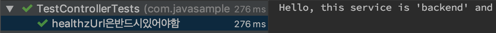

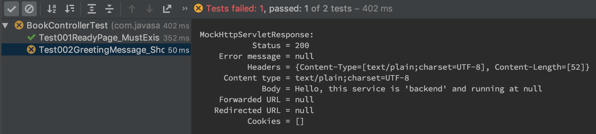

> Test001ReadyPage_MustExist 테스트의 경우 Response의 HTTP 상태코드(`status`)가 200 OK(`isOk`)로 성공하였음을 볼 수 있습니다.

**[ 실패 케이스 ]**

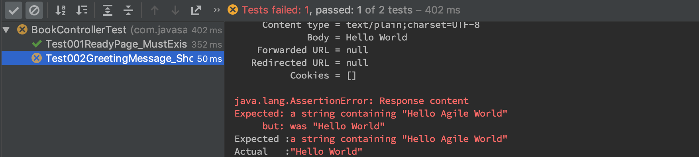

> Test002GreetingMessage_ShouldBeHelloWorld 테스트의 경우 Response의 Body (`content`)가 'Hello Agile World' 로 예상했으나 'Hello World' 였기에 실패하였음을 볼 수 있습니다.


## 1.6. 참고 링크

- [SPRING INITIALIZR](https://start.spring.io/)
- [JUnit5](https://junit.org/junit5/)


# 2. 기능 테스트 가이드

## 2.1. 개요

### 2.1.1. 목적

본 문서는 단위테스트(로컬 개발 환경)가 완료된 소스에 대해 개발자 PC 내 도커환경에서 수행하는 기능 테스트에 대한 가이드를 제시한다. 통합 테스트(쿠버네티스 환경) 도입 전 기능테스트는 필수로써 최대한 많은 테스트를 수행한 후 통합 테스트를 수행하여야 한다.

`도커 컨테이너를 기반` 으로 테스트 되는 단계가 바로 기능테스트 단계이다.

### 2.1.2. 이해관계자

Docker 컨테이너 환경 하에 개발하는 모든 개발자 및 테스터 분들을 해당 가이드를 숙지해야 한다.

### 2.1.3. 용어사전

| 용어  | 정의                     |
| --- | ---------------------- |
| GUI | Graphic User Interface |


## 2.2. 테스트 항목

기능 테스트 시 체크해야 하는 항목에는 아래와 같은 것들이 있다. 리스트에 있지 않더라도 비즈니스 적으로 확인해야 할 사항들을 모두 테스트한다.

- Docker containers 정상 기동 확인
- 내 모듈과 연관된 타 모듈과의 호출 테스트
  - Docker containers로 띄워진 각 서비스들 간의 통신이 정상적으로 되는지 체크한다.
    - curl / postman / GUI / etc.


## 2.3. 도커/도커 컴포즈 방법

Docker build / run 등으로 Image를 생성하고 컨테이너로 구동하여 컨테이너 간 서비스 호출을 확인한다.

도커 및 도커 컴포즈 사용 방법은 [05. 개발 구축 가이드 라인](http://gitlab.msa.kt.com/coe-istio-master/msa-bunker/tree/master/deliverables/05.%20%EA%B0%9C%EB%B0%9C%20%EA%B5%AC%EC%B6%95%20%EA%B0%80%EC%9D%B4%EB%93%9C%20%EB%9D%BC%EC%9D%B8) 내 `컨테이너화 가이드` 참조


## 2.4. 참고 링크

- [Docker](https://docs.docker.com)
- [Docker Compose](https://docs.docker.com/compose/)


# 3. 통합 테스트 가이드

## 3.1. 개요

### 3.1.1. 목적

본 문서는 기능 테스트(로컬 도커 환경) 완료 후 `쿠버네티스 환경`에서 포드로 띄워진 서비스(컨테이너)에 대한 테스트 가이드를 제시한다.

테스트 항목은 기능 테스트 때와 크게 다르지 않지만 쿠버네티스 환경에서 진행된다는 차이가 있다.

또한, kt 쿠버네티스 환경에는 DEV / STAGING 이렇게 두 개의 환경이 존재하고, 비즈니스 성격에 맞춰 각 환경에 맞는 테스트를 수행한다.

배포 환경은 DEV > STAGING > PROD 로 가는 구조이다.

본 가이드에서는 비즈니스 적 테스트는 최대한 배제한다.

### 3.1.2. 이해관계자

Kubernetes 환경 하에 개발하는 모든 개발자 및 테스터 분들을 해당 가이드를 숙지해야 한다.

### 3.1.3. 용어사전

| 용어 | 정의                   |
| ---- | ---------------------- |
| GUI  | Graphic User Interface |


## 3.2. 테스트 항목

- Kubernetes pods 정상 기동 확인

  - DEV / STAGING 환경 모두에서 정상 구동되는지 테스트를 수행한다.
- 포드 간 서비스 호출 테스트

  - 포드로 띄워진 각 서비스들 간의 통신이 정상적으로 되는지 체크한다.
    - curl / postman / GUI / etc.
- 외부 기관 연계 테스트


## 3.3. 참고 링크

- [Kubernetes.io](https://kubernetes.io)


# 4. 운영 테스트 가이드

## 4.1. 개요

### 4.1.1. 목적

본 문서는 모든 테스트 완료 후 `쿠버네티스 PRD 환경`에서 포드로 띄워진 서비스(컨테이너)에 대한 테스트 가이드를 제시한다.

실제 비즈니스 측면에서 이루어지는 업무-베이스 테스트는 최대한 배제하고 <u>오픈시프트 PRD 환경에 배포된 각종 리소스 등의 이상 유무를 체크하는 방법에 대해 기술</u>한다.


### 4.1.2. 이해관계자

Kubernetes PRD 환경에서 시스템을 운영하고 있는 부서 관계자분들을 해당 가이드를 숙지해야 한다.


### 4.1.3. 용어사전

| 용어  | 정의        |
| --- | --------- |
| oc  | OpenShift |


## 4.2. 체크 항목

### 4.2.1. 어플리케이션 Overview

- OpenShift Web-console 로그인 후 Application Console 화면에서 본인의 프로젝트를 선택 후 `Overview` 탭에서 시스템 전반적인 상태를 점검한다.

> 아래는 millet 프로젝트를 예시로 설명

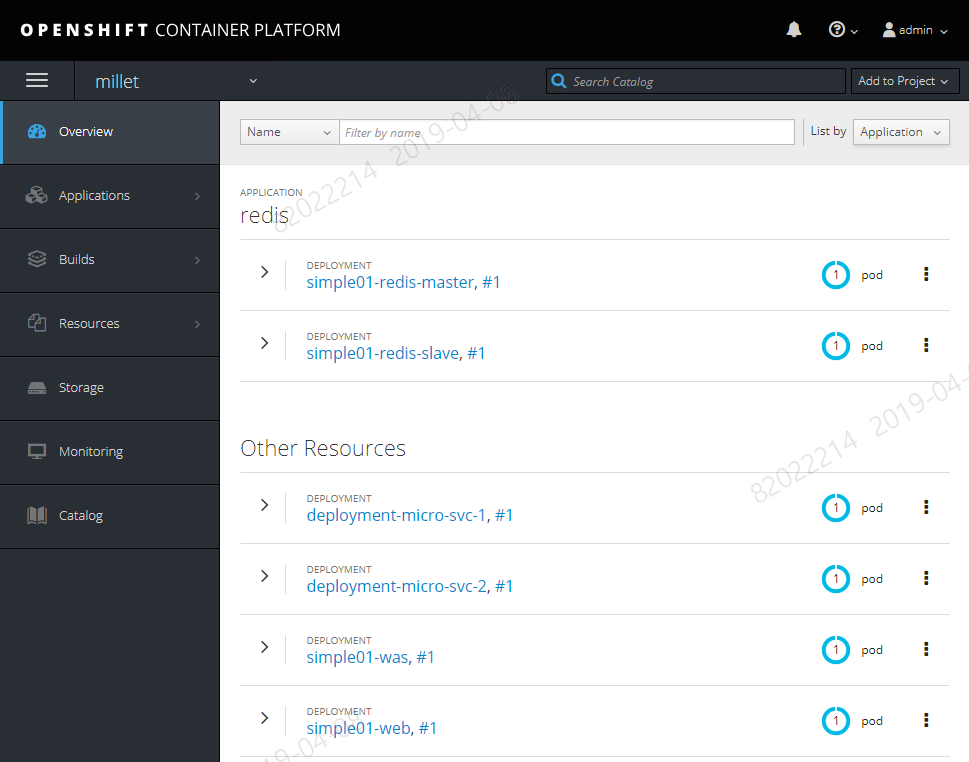

- 시스템을 구성하는 각 모듈들이 선언된 replicas 개수에 맞게 정상적으로 기동되어 있는지 확인한다.


### 4.2.2. 디플로이먼트 객체 확인

- OpenShift Web-console 로그인 후 Application Console 화면에서 본인의 프로젝트를 선택 후 Applications > `Deployments` 탭에서 선언된 yaml 파일에 맞게 각 디플로이먼트 객체가 생성되어 있는지 확인한다.

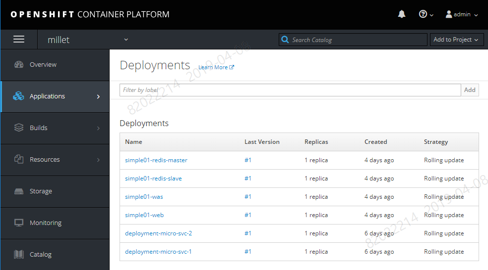


### 4.2.3. 서비스 객체 확인

- OpenShift Web-console 로그인 후 Application Console 화면에서 본인의 프로젝트를 선택 후 Applications > `Services` 탭에서 선언된 yaml 파일에 맞게 각 서비스 객체가 생성되어 있는지 확인한다.
- 각 서비스 별 지정된 Ports가 배정되어 있는지 확인한다.

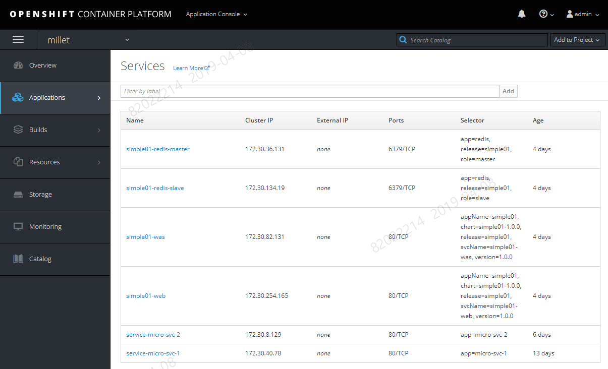


### 4.2.4. 포드 객체 확인

- OpenShift Web-console 로그인 후 Application Console 화면에서 본인의 프로젝트를 선택 후 Applications > `Pods` 탭에서 Deployments 에 선언된 replicas 개수에 맞게 각 포드 객체가 생성되어 있는지 확인한다.
- Status 가 Running 이 아닌 다른 상태의 경우 문제가 있는 것으로 각 포드로 들어가 Logs를 확인한다.

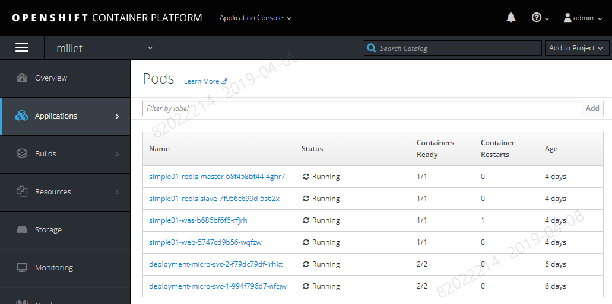


**[ 에러 예시 - Crash Loop Back-off ]**

- Status 가 Running 이 아닌 Crash Loop Back-off 로 표시되어 있다.

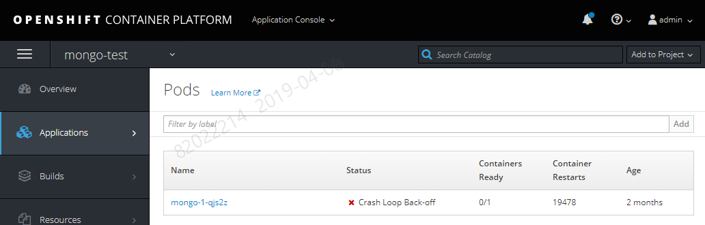


- 포드 내부의 Logs 탭을 확인하여 오류 원인을 파악하고 해소한다.

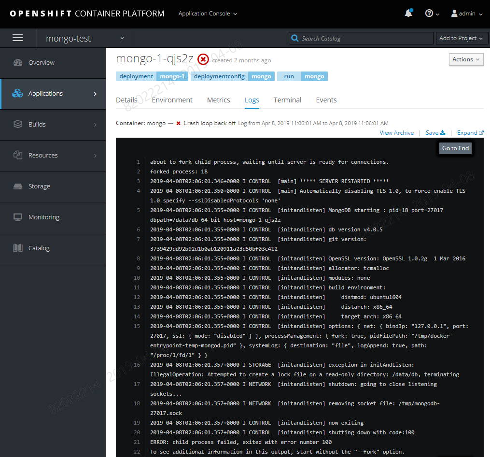


#### 4.2.4.1. 포드 삭제 테스트

KT 쿠버네티스 환경의 경우 포드 객체를 직접 생성하여 사용하지 않는다.

대부분 Deployments 객체를 생성해 (ReplicationController를 거쳐) Pod를 생성하는 구조이다.

포드가 정상 운영 상태에서 기존 포드를 삭제하면 즉시 새로운 포드를 띄우는 것이 쿠버네티스 매커니즘이므로 이를 테스트 한다.

[ 포드 삭제 ]

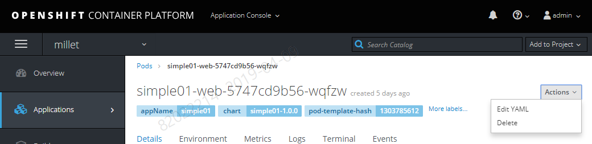

> Application > Pods 탭에 들어가 현재 떠 있는 포드 중 하나를 Actions > Delete 해서 삭제한다.


[ 삭제 확인 ]

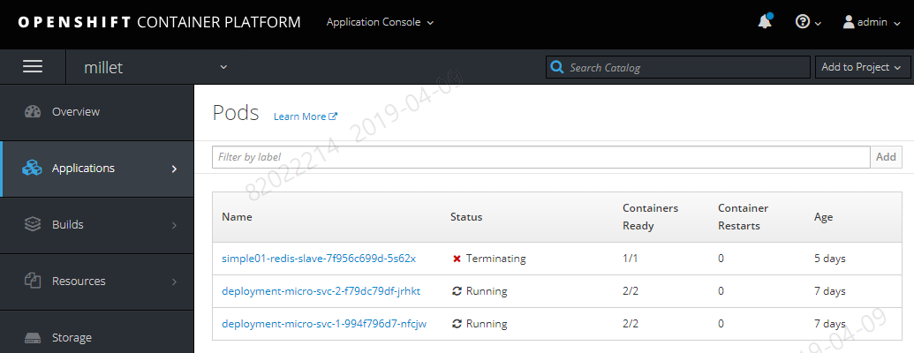

> 삭제 시 Status가 "Terminating"로 변경되고 잠시 후 목록에서 사라진다.


[ 새로운 포드 기동 확인 ]


> 새로 기동된 포드 리스트를 확인한다.


### 4.2.5. 라우트 객체 확인

- OpenShift Web-console 로그인 후 Application Console 화면에서 본인의 프로젝트를 선택 후 Applications > Routes 탭에서 선언된 라우트 객체가 생성되어 있는지 확인한다.

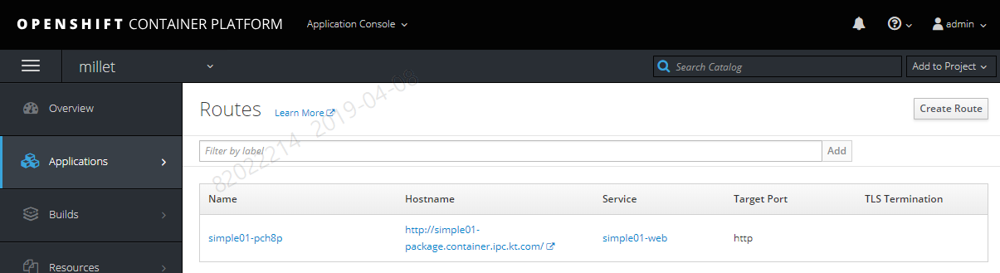


### 4.2.6. 컨피그맵 객체 확인

- OpenShift Web-console 로그인 후 Application Console 화면에서 본인의 프로젝트를 선택 후 Resources > Config Maps 탭에서 선언된 컨피그맵 객체가 생성되어 있는지 확인한다.

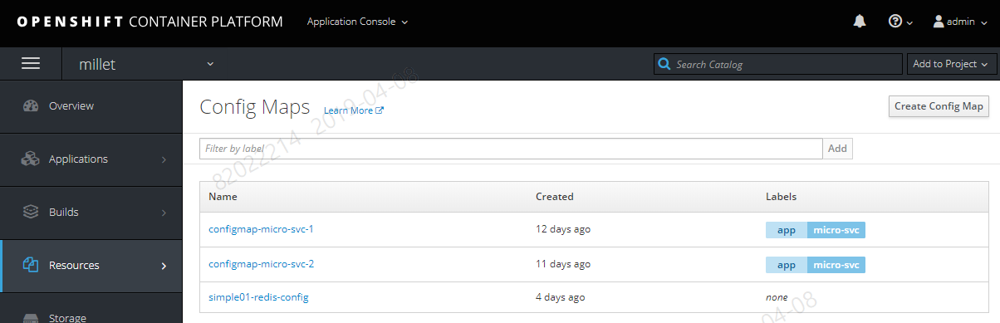


## 4.3. 참고 링크

- [Kubernetes.io](https://kubernetes.io)
