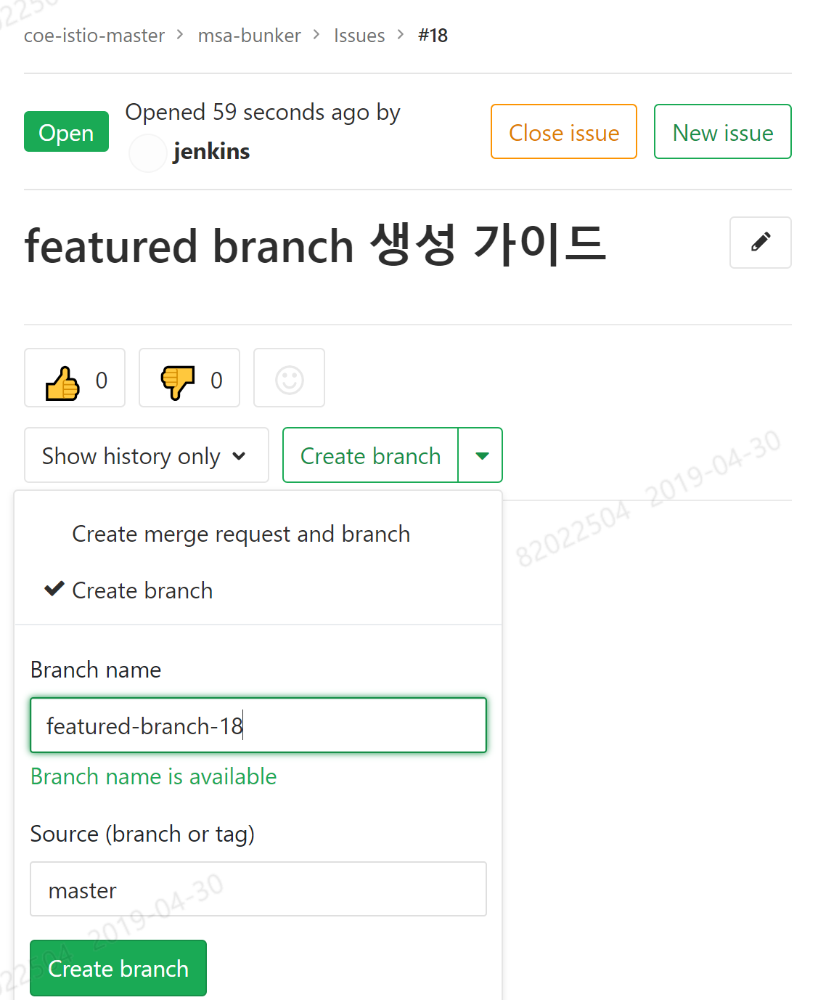
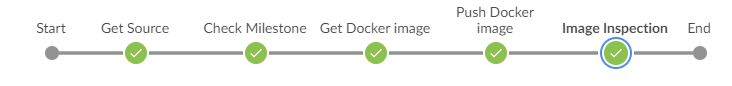

# 배포 전략
----

<!-- markdown-toc start - Don't edit this section. Run M-x markdown-toc-refresh-toc -->
**Table of Contents**

- [-](#-)
- [1. 개정이력](#1-개정이력)
- [2. 문서 목적](#2-문서-목적)
- [3. 배포 환경 구성](#3-배포-환경-구성)
    - [3.1. 환경 구성도](#31-환경-구성도)
        - [3.1.1. 컨테이너 환경 구성](#311-컨테이너-환경-구성)
        - [3.1.2. 배포 flow](#312-배포-flow)
    - [3.2. 솔루션 구성](#32-솔루션-구성)
        - [3.2.1. Jenkins](#321-jenkins)
        - [3.2.2. Docker registry](#322-docker-registry)
        - [3.2.3. Nexus](#323-nexus)
        - [3.2.4. gitlab](#324-gitlab)
- [4. 형상관리 배포 빌드 프로세스](#4-형상관리-배포-빌드-프로세스)
    - [4.1. 개요](#41-개요)
    - [4.2. 이슈 관리](#42-이슈-관리)
        - [4.2.1. 개요](#421-개요)
        - [4.2.2. 지원 기능](#422-지원-기능)
            - [4.2.2.1. Groups](#4221-groups)
            - [4.2.2.2. Project](#4222-project)
            - [4.2.2.3. Issue](#4223-issue)
                - [4.2.2.3.1. Issue 생성](#42231-issue-생성)
                - [4.2.2.3.2. Issue 종료](#42232-issue-종료)
                - [4.2.2.3.3. Issue 목록 및 조회](#42233-issue-목록-및-조회)
                - [4.2.2.3.4. Issue 삭제](#42234-issue-삭제)
                - [4.2.2.3.5. Issue Board](#42235-issue-board)
            - [4.2.2.4. Label](#4224-label)
                - [4.2.2.4.1. Label Priority](#42241-label-priority)
            - [4.2.2.5. Milestone](#4225-milestone)
                - [4.2.2.5.1. Milestone 생성](#42251-milestone-생성)
                - [4.2.2.5.2. Milestone 관리](#42252-milestone-관리)
    - [4.3 branch 전략](#43-branch-전략)
        - [4.3.1. branch 전략 Overview](#431-branch-전략-overview)
        - [4.3.2. 용어 설명](#432-용어-설명)
        - [4.3.3. 단계별 설명](#433-단계별-설명)
        - [4.3.4. 버그 픽스 방법](#434-버그-픽스-방법)
        - [4.3.5. Git 초기 설정 방법](#435-git-초기-설정-방법)
            - [4.3.5.1. Gitlab Repository 설정](#4351-gitlab-repository-설정)
            - [4.3.5.2. Gitlab User 설정](#4352-gitlab-user-설정)
        - [4.3.6. version 관리](#436-version-관리)
- [5. MSA 배포 전략](#5-msa-배포-전략)
    - [5.1. 개요](#51-개요)
        - [5.1.1. CI 정의](#511-ci-정의)
        - [5.1.2. CD 정의](#512-cd-정의)
    - [5.2. 배포 전략](#52-배포-전략)
        - [5.2.1. Rolling Update](#521-rolling-update)
        - [5.2.2. Canary Deploy (A/B Test)](#522-canary-deploy-ab-test)
    - [5.3. 배포 파이프라인 구성](#53-배포-파이프라인-구성)
        - [5.3.1 개요](#531-개요)
        - [5.3.2. 배포 파이프리안 설명](#532-배포-파이프리안-설명)
            - [5.3.2.1. CI 파이프라인 기본](#5321-ci-파이프라인-기본)
                - [5.3.2.1.1. 사용법](#53211-사용법)
                - [5.3.2.1.2. 설명](#53212-설명)
            - [5.3.2.2. CI 파이프라인 yaml](#5322-ci-파이프라인-yaml)
                - [5.3.2.2.1. 사용법](#53221-사용법)
                - [5.3.2.2.2. 설명](#53222-설명)
            - [5.3.2.3. CD 빌드 파이프라인](#5323-cd-빌드-파이프라인)
                - [5.3.2.3.1. 사용법](#53231-사용법)
                - [5.3.2.3.2. 설명](#53232-설명)
            - [5.3.2.4. CD Push Image 파이프라인](#5324-cd-push-image-파이프라인)
                - [5.3.2.4.1. 사용법](#53241-사용법)
                - [5.3.2.4.2. 설명](#53242-설명)
            - [5.3.2.5. CD 배포 파이프라인 기본](#5325-cd-배포-파이프라인-기본)
                - [5.3.2.5.1. 사용법](#53251-사용법)
                - [5.3.2.5.2. 설명](#53252-설명)
            - [5.3.2.6. CD 배포 파이프라인 yaml](#5326-cd-배포-파이프라인-yaml)
                - [5.3.2.6.1. 사용법](#53261-사용법)
                - [5.3.2.6.2. 설명](#53262-설명)
            - [5.3.2.7. Canary 배포 파이프라인](#5327-canary-배포-파이프라인)
                - [5.3.2.7.1. 사용법](#53271-사용법)
                - [5.3.2.7.2. 설명](#53272-설명)
- [6. Trouble shooting](#6-trouble-shooting)
    - [6.1 Gitlab](#61-gitlab)
        - [6.1.1 Git tag 로 복원](#611-git-tag-로-복원)

<!-- markdown-toc end -->

----

# 1. 개정이력

| 날짜       | 변경내용 | 작성자 | 비고 |
| ---------- | -------- | ------ | ---- |
| 2019.04.17 | 최초작성 | 황정필 |      |
|            |          |        |      |
|            |          |        |      |


# 2. 문서 목적 

- MSA 배포를 유지보수/운영을 위한 가이드 문서이다.
- 문서는 크게 아래와 같은 내용으로 구성된다. 
  - [3. 배포 환경 구성](#3-배포-환경-구성) : MSA 배포 환경 구성 및 사용 솔루션 정보 
  - [4. 형상관리 배포 빌드 프로세스](#4-형상관리-배포-빌드-프로세스) : 소프트웨어 개발 lifecycle 관리를 위한 프로세스 설명 및 scm(git) branch 전략
  - [5. MSA 배포 전략](#5-msa-배포-전략) : MSA 배포 시 사용할수 있는 배포 형태와 Jenkins에 구현된 파이프라인 구현부분


# 3. 배포 환경 구성 

## 3.1. 환경 구성도 

### 3.1.1. 컨테이너 환경 구성

> MSA 시스템 구성

### 3.1.2. 배포 flow

> 배포 관련 솔루션 구성 및 배포 flow

## 3.2. 솔루션 구성

### 3.2.1. Jenkins

- CI/CD 솔루션으로 maven/nexus/ant 등의 툴을 사용하여 빌드/배포를 진행한다. 
- 젠킨스는 빌드/배포 관련 plugin을 제공한다.
- 본 MSA 프로젝트에서는 scripted 문법의 pipeline을 사용하여 빌드 배포를 구성한다.
  - 젠킨스 배포 잡 Type은 freestyle, pipeline 등의 잡 형식을 제공한다. 
  - pipeline은 scripted, declarative 문법이 있다.
- pipeline은 Jenkinsfile로 설정이 저장되며 각 프로젝트 git repository에서 관리 및 유지 보수한다. 

### 3.2.2. Docker registry

- Docker Container 이미지를 관리하는 저장소이다. 
- 본 MSA 프로젝트 내에서는 두가지 종류의 Docker registry로 구성 된다.
  - bastian docker registry, cluster docker registry로 구성 되어 있다.
    - bastian docker registry는 openjdk, jboss, 와 같은 벤더에서 지원하는 기본 이미지를 저장한다.
    - cluster docker registry는 프로젝트의 빌드 산출물인 이미지를 저장한다. 

### 3.2.3. Nexus

- java library repository 솔루션
- 본 MSA 프로젝트에서는 외부 인터넷(공중망)의 중앙 java repository(repo.maven.org)를 proxy로 참조하여, 개발에 필요한 이미지를 동적으로 제공한다.

### 3.2.4. gitlab

- git 기반 프로그램 소스 저장소
- 본 MSA 프로젝트에서는 소스 저장소 및 이슈 관리 툴로 Gitlab을 사용한다.
  - 이슈관리 기능은 gitlab flow 기능을 사용한다.
  - 이슈 관리를 위해 gitlab flow의 mileston(버젼), issue 기능을 사용한다.

# 4. 형상관리 배포 빌드 프로세스 
## 4.1. 개요 

> 형상관리/배포/빌드 프로세스


## 4.2. 이슈 관리 

### 4.2.1. 개요

프로젝트 관리하는 방법에는 다양한 시스템 도구(JIRA, Redmine, Tracker, ...)를 활용하여 사용할 수 있으나, Gitlab 기반의 형상관리 기능을 제공하면서 병행적으로 제공하는 Task 관리 방법인 Issue Tracker와 릴리즈(Version)를 관리하는 방법의 Milestone 기능을 설명하여, 보다 더 효율적인 프로젝트 관리 방법을 안내한다.


### 4.2.2. 지원 기능

Gitlab의 기본 관리 기능인 "Groups"와 "Project" 기능 외에 특정 기간 동안 목표를 달성할 수 있도록 "Issue"와 "Label" 기능으로 소스코드와 함께 관리 할 수 있도록 제공하고 있다. 또한, 이 기능 들을 종합적으로 관리하여 프로젝트의 중요시점 마다의 진행을 관리 하는 Milestone 기능을 통해 Release Ticket으로 구성하여, 배포와 연계된 기능을 지원한다.


#### 4.2.2.1. Groups


> 개인은 Group에 포함되고, Group 은 단위 시스템 별로 생성됨. 따라서, 개인별 소속된 Group은 다수 일 수 있으며, 기본 속성은 공개(Internal)로 구성 됨.
>
> 문서에서는 관리 지원 기능을 설명하기 위해 "customer-5g-coe" Group을 예시로 함.
>
> (Groups에 대한 상세 내용은 Gitlab 가이드 참고)


#### 4.2.2.2. Project


> Project는 Group 하위 단위로써, 예시로 "microSvc1", "microSvc2"와 같이 명칭되어 있음.
>
> Code 공동 작업 및 호스팅을 하고, Issue Tracking등의 용도로 생성하여 사용할 수 있으며, 산출물 관리 Project등 단독으로도 생성하여 목적에 맞게 사용가능 함.
>
> 유형으로는 공개(Internal) 또는 비공개(Private)로 선택할 수 있으며, 수를 제한하지는 않음.
>
> (Project에 대한 상세 내용은 Gitlab 가이드 참고)


#### 4.2.2.3. Issue


> Gitlab에서 제공 하는 Issue는 단일 유형으로 제공하고 있으며, 기능 개발의 진행 관리 측면에서 사용하는 경우에는 Issue 항목을 기능 개발 Task 단위로 생성하여 담당자를 지정하는 방식으로 활용 할 수 있다.  
>
> 생성된 Issue 는 "Open", "Close" 2가지의 상태로 관리하며, 하나의 Issue에서 다양한 참여자들과 의견 교환을 할수 있도록 제공하고 있다.
>
> Issue는 소스 코드의 Commit 메시지와 연계되어 상태 제어가 가능하며, 모든 변경 사항은 이력으로 제공 된다.


##### 4.2.2.3.1. Issue 생성


> Issue 생성시 Markdown 문서를 지원하며, 담당자 및 Milestone 지정이 가능하여 종합적인 관리가 가능 함.
>
> - Title 명칭 방법
> - Issue 를 관리하는 명칭를 기술. 개발 진척을 관리 하는 경우 프로젝트의 기능 개발 해야 할 WBS Task 명칭이나 구체적인 개발 항목으로 기술 가능.
> - Description
> - 내용에 대한 설명을 기술
> - Markdown 지원
> - Assignee
> - 담당자
> - Due date
> - 종료일
> - Milestone
> - 다른 Issue와 함께 Release를 목적으로 정의한 Milestone 항목. (Milestone 설명 참고)
> - Label
> - Label 기능에서 정의한 Label를 복수로 선택 가능
> - 프로젝트 사용 유형에 따라, "요구사항", "Bugfix", "기능명 1", "기능명 2, ..." 등 다양한 명칭을 부여하여 관리 가능


##### 4.2.2.3.2. Issue 종료


> Issue는 Gitlab에서 종료하는 방식과 소스코드의 Commit 메시지를 사용하여 종료하는 2가지 방식으로 제공한다.
>
> - 소스 Commit 메시지를 활용한 제어 방법
>
> ```shell
> $ git commit -am "update code. close #1"
> $ git push -u origin <feature branch>
> ```
>
> - commit 메시지 안에 close <issue number> 를 포함
> - close 외에 다양한 keyword 가능 (아래 명시된 내용 모두 가능)
> - Close, Closes, Closed, Closing, close, closes, closed, closing
> - Fix, Fixes, Fixed, Fixing, fix, fixes, fixed, fixing
> - Resolve, Resolves, Resolved, Resolving, resolve, resolves, resolved, resolving
> - Implement, Implements, Implemented, Implementing, implement, implements, implemented, implementing
> - 복수의 Issue 번호인 경우에는 close #1, #2 등 (,)를 구분하여 사용 가능


##### 4.2.2.3.3. Issue 목록 및 조회


> 조회된 Issue는 Filter 기능으로 사용자의 조건에 따라 검색결과를 제공.
>
> Issue 마다 지정된 Lable도 검색조건에 사용 가능.


##### 4.2.2.3.4. Issue 삭제


> 생성된 Issue는 권한자에 의해 Issue 수정 페이지에 진입해서 삭제 가능.


> 우측하단의 `Delete` 버튼으로 Issue 삭제.
>
> 주의) 삭제된 Issue 는 복구되지 않음. 


##### 4.2.2.3.5. Issue Board


> Issue의 상태와 Label을 기준으로 전체적인 진행사항을 점검하고 관리할 수 있도록 제공.
>
> Release를 계획하기 전에 Issue를 전반적으로 확인하는 기능 용도로 사용.

<<<<<<< HEAD
#### 4.2.2.4. Label
=======
#### 4.2.2.4. featured branch

> git 에서 형상 변경은 각 branch를 통해서 변경하고, 이때 개발 issue에 따라 생성하는 branch를 featured branch라고 명칭한다.
> 변경 내역은 issue 번호를 featured branch에 기입하는 것으로 연동 시킬수 있다.
> branch 명이 {issue number}-브랜치명 , 브랜치명-{issue number} 인 경우에 issue와 branch 가 연동된다.
> 아래 예를 보면 issue번호가 18이기 때문에 , branch를 featured-branch-18 로 기입하였다.



> issue 하단에 'create merge request/create branch' 버튼을 클릭해 create brach를 선택하면 branch를 생성 항수 있다.
> 개발이 완료 된 후 merge request를 하면, 연동된 issue가 보이는 것을 볼수 있다.


#### 4.2.2.5. Label
>>>>>>> 519378df889a490b5cb01e3d0204e5c9202c9bad


> Label을 사용하며, Issue를 분류하거나 병합하는 용도로 사용 가능.
>
> 다양한 색상으로 1개 이상을 부여 가능하며, 검색조건으로도 활용 가능.
>
> Project 단위로 Label 을 생성할 수 있으나, Groups 수준에서 사용해야 하는 경우 Promotion 기능으로 공용 Label과 같이 사용 가능. 단, 한번 Promotion 된 Label은 다시 Project 단위로 수준 변경 불가 함.


##### 4.2.2.4.1. Label Priority


> Label은 별 표식과 순서 조정으로 우선 순위를 조정 가능 함.
>
> 우선 순위 Label에 따라 정렬등에 순위별로 표시 됨.
>
> - 정렬 기준
> - 최우선 순위가 높은 Label
> - 우선 순위가 없는 Label
> - 이하 임의 정렬


#### 4.2.2.5. Milestone


> Milestone 은 Group 또는 Project 수준에서 정의 가능하나 실제 Release  단위는 Project단위로 이루어 지기 때문에 Project 단위로 Milestone 관리 기능을 사용하여야 함.
>
> **Milestone은 배포를 위한 Ticket으로 사용되어, 빌드 테그로 사용 함.**


##### 4.2.2.5.1. Milestone 생성


> Milestone 생성은 우측 상단의 **New milestone** 를 선택해서 생성 가능 함.
>
> Description은  Markdown을 사용하여, 설명을 기술할 수 있으며, Start Date, Due Date등의 정보를 기술 가능.
>
> - Title 명칭 방법
>
> - Major.Minor.Bugfix (예, 1.0.0) : 형태로 지정하여 빌드 테그 규칙을 준 함.
>
> - 예1) 2.0.0 - 2번째 Major 배포.
>
> - 예2) 2.1.0 - 2번째 Major 배포 후, 추가 기능 건(긴급 배포 등)의 1번째 배포.
>
> - 예3) 2.1.2 - 추가 기능 건의 1번째 배포 이후 2번째의 Bugfix 배포.
>
>   (상세 내용은 배포 가이드 참고)


##### 4.2.2.5.2. Milestone 관리


> Milestone의 상태는 "Open", "Close"로 관리 되며, Release가 완료된 Milestone을 Close 할 경우, 추가로 Issue을 포함 시킬 수 없음.

## 4.3 branch 전략
### 4.3.1. branch 전략 Overview

- 이슈 / 버젼 관리는 gitlab 이슈 관리 기능을 사용한다.

- version명 정의 : 배포물의 버젼을 정의 하며, 버젼명은 gitlab 의 milestone으로 관리한다.
  x.y.z
  x: major version
  y: minor version
  z: bugfix version

  > 예로 1.2.3 은 major 변경 1번째, minor 변경 2번째, bugfix3번째 진행된 버젼이다.

- 브랜치 전략을 사용하기 위해서, gitlab의 프로젝트 branch 설정과 user별 권한 설정이 필요하다.

  > 브랜치 설정법은 `Gitlab Repository 설정`부분에서 설명 한다.
- bug fix는 release-x.y.z(ex release-1.2.3) 브랜치에서 진행하며, 운영 적용 완료 이후 master 브랜치에 merge작업이 필수적으로 필요하다.
- relase-* 브랜치에서 빌드시 git tag를 생성하며, git tag를 통해 배포 시점으로 복구가 가능하다.
### 4.3.2. 용어 설명
`branch 전략의 이미지에 대한 이해를 돕기 위해 기재된 용어를 설명한다.`

| 용어   | 설명                       |
|--------|----------------------------|
| branch | git에서 형상을 저장하는 방법으로 기본적으로 master branch가 기준이며, 용도에 맞게 branch를 사용하여 관리<br/>현 branch 전략에서는 codebase는 master이며, 배포시 release-{version명} 의 branch를 사용 |
| CI/CD| “ CI”는 개발자를 위한 자동화 프로세스인 지속적인 통합(Continuous Integration)을 의미합니다. CI를 성공적으로 구현할 경우 애플리케이션에 대한 새로운 코드 변경 사항이 정기적으로 빌드 및 테스트되어 공유 리포지토리에 병합되므로 여러명의 개발자가 동시에 애플리케이션 개발과 관련된 코드 작업을 할 경우 서로 충돌할 수 있는 문제를 해결할 수 있습니다. <br/> 지속적인 배포(또 다른 의미의 “CD”: Continuous Deployment)는 개발자의 변경 사항을 리포지토리에서 고객이 사용 가능한 프로덕션 환경까지 자동으로 릴리스하는 것을 의미합니다.. 이는 애플리케이션 제공 속도를 저해하는 수동 프로세스로 인한 운영팀의 프로세스 과부하 문제를 해결합니다. 지속적인 배포는 파이프라인의 다음 단계를 자동화함으로써 지속적인 제공이 가진 장점을 활용합니다.<br/> 주요 CI/CD의 기술적 차이점은 CD에서는 배포시 release될 형상을 최종 artifect로 배포를 하며, 배포 과정에서 운영 담당자의 confirm 하에서 배포가 진행 됩니다.|
|feature(feature branch)| 새로운 개발 진행시 생성하는 branch <br/> 개발자는 feature brach를 생성하여 개발, 개발이 완료 되면, 원 brach에 merge request를 통해 반영 한다.|
|merge request| branch /repository 간 변경 분을 반영하는(합치는) 과정|
|milestone|gitlab 에서 이슈를 묶는 단위이며, version 명으로 사용을 한다.|

### 4.3.3. 단계별 설명
|단계|행위자|작업 내용|
|------|-----------|----------|
|1|Local CM|배포 예정인 버젼을 정의한다.<br/> 정의된 버젼으로 gitlab milestone을 생성한다.|
|2|개발자|개발 진행시 master branch 에서 feature branch를 생성하여 개발을 진행한다.|
|3|개발자|개발 완료 후 dev환경에 반영 하기 위해 MergeRequest를 한다.|
|4|Senior개발자|maintenence로 등록된 senior개발자가 code review를 진행한다.<br/>code에 이상이 없는 경우 merge request를 complete한다.|
|5|CI Tool| master branch 형상으로 dev환경에 배포한다.|
|6|개발자|dev환경에서 Integration Test를 수행한다.|
|7|Local CM|배포 물량이 모두 개발 완료 된 후 master branch 기준으로 release-{mileston} branch를 생성한다.|
|8|Local CM|UAT  테스트를 진행하고 이상이 없는 경우에는 빌드된 이미지로 PRD환경에 배포 한다.|
|9|Local CM|PRD 환경 배포 이후 release-{milestone} branch를 master branch에 merge 한다.|
|10|Local CM|release-* branch는 hotfix 를 위해 다음번 PRD 배포가 완료 될때까지 유지한다. <br/>그 이후에는 운영 작업으로 branch를 정리 할 수 있다.|

### 4.3.4. 버그 픽스 방법 

`버그 픽스는 release branch 에서 수행 하며, 테스트 완료 시 master branch 에 merge한다.`

|단계|행위자|작업 내용|
|------|-----------|----------|
|1|Local CM|버그 픽스 버젼을 정의한다.<br/> 정의된 버젼으로 gitlab milestone을 생성한다.<br/>*ex: release-1.0.0 branch 에서 버그 픽스 일 경우 1.0.1 milestone을 생성한다.*|
|2|개발자|개발 진행시 release branch 에서 feature branch를 생성하여 개발을 진행한다.<br/>*ex: release-1.0.0 에서 feature branch를 생성한다.|
|3|개발자|개발 완료 후 release branch에 반영 하기 위해 MergeRequest를 한다.|
|4|Senior개발자|maintenence로 등록된 senior개발자가 code review를 진행한다.<br/>code에 이상이 없는 경우 merge request를 complete한다.|
|5|CI Tool| release-* branch 형상으로 uat환경에 배포한다.|
|6|개발자|테스트환경에서 UAT테스트를 수행한다.|
|7|Local CM|테스트가 모두 완료 된 경우 빌드된 이미지로 PRD환경에 배포 한다.|
|9|Local CM|PRD 환경 배포 이후 release-{milestone} branch를 master branch에 merge 한다.|
|10|Local CM|release-* branch는 hotfix 를 위해 다음번 PRD 배포가 완료 될때까지 유지한다. <br/>그 이후에는 운영 작업으로 branch를 정리 할 수 있다.|

### 4.3.5. Git 초기 설정 방법 

#### 4.3.5.1. Gitlab Repository 설정
1. Branch 설정
  - Protected Branch 설정
    1. gitlab 프로젝트를 선택한다.
    2. Settings>Repository를 선택한다.
    3. Protected Branch 옆에 `expand`를 클릭한다.
    4. branch 에 적용할 branch 명 , Allow to merge, Allow to push에 그룹명을 입력한다.
     4-1. master branch는 allow to merge: maintainers, Allow to push : maintainers를 입력 한다.
    4-2. release branch는 branch 명에 release-* 입력후 `Create wildcard release-*`를 선택 한다. allow to merge, allow to push에 maintainers를 선택 한다.
    5. 하단에 `Protect`버튼을 클릭한다.
    
  - 설정 예시
     </img> 
#### 4.3.5.2. Gitlab User 설정 
  - Maintainer 설정

  > Maintainer : 해당 Repository 의 관리 권한을 가진 유저를 뜻하며, 프로젝트의 Senior Programmer, Local CM을 의미한다. Merge, Push권한을 가진다.

   1. gitlab 프로젝트를 선택한다.
   2. Settings>Members를 선택한다.
   3. invite members에 유저 명을 입력하고, permission에 maintenance를 선택한다. 
   4. `Add to Project`버튼을 클릭하여 적용 한다.
   5. 3~4 과정으로 Maintenance 그룹을 설정 한다.
      

### 4.3.6. version 관리
- version명 정의 : 배포물의 버젼을 정의 하며, 버젼명은 gitlab 의 milestone으로 관리한다.
  x.y.z
  x: major version
  y: minor version
  z: bugfix version
  > 예로 1.2.3 은 major 변경 1번째, minor 변경 2번째, bugfix3번째 진행된 버젼이다.
  
# 5. MSA 배포 전략 

## 5.1. 개요

배포 전략으로 Rolling Update / Canary(A/B Test)  / Blue/Green Deploy 가 있으며, Blue/Green Deploy는 환경으로 2배수의 환경을 유지해야 하기 때문에 본 프로젝트에서는 Rolling update/ Canary(A/B Test) 로 배포 전략을 구성한다. 그리고, 프로젝트에 구현된 파이프라인에 대한 사용및 구현내용에 대해 설명한다.

### 5.1.1. CI 정의


**Continuous Integration ( 지속적인 통합 ) **
 개발자가 master branch 에 소스를 병합 한후 CI잡을 통해 개발환경에 반영을 수시로 (Webhook/scheduled/manual) 진행한다.
 CI 잡을 통해 master branch를 항상 배포 가능한 상태로 유지한다.
CI시에는 version 을 별도로 관리 하지 않으며, master branch의 snapshot 으로서 배포를 수행하여, master branch 에 버그가 있는지 빠르게 확인하는 용도로 사용한다. 

### 5.1.2. CD 정의


**Continuous Deployment ( 지속적인 배포 )**
개발이 완료된 소스를 운영 환경에 배포 하기 위해 Version으로 빌드 및 배포를 수행한다. 배포의 산출물인 Artifect는 버젼명으로 정의되며, 해당 산출물에 대해 Source/issue Tracking 이 가능해야 한다. 산출물은 추후 사용이 가능할수 있게 영구 적으로 관리  되어야 한다.


## 5.2. 배포 전략

- Rolling Update
- Canary Deploy (A/B Test)
> A/B Test는 배포 방법이라기 보다 테스트 방법론으로 A group B group 으로 두개의 서비스를 같이 서비스 하여 서비스의 사용자 만족도를 확인하는 방법이다. 기술 적으로는 Canary 배포 방식과 별다른 차이가 없기 때문에 본 프로젝트에서는 Canary 배포 로 갈음한다. 

### 5.2.1. Rolling Update

- 기본적으로 Rolling Update를 서비스 중단 없이 진행하기 위해서는 2개 이상의 pod가 서비스 해야 한다. 
- Rolling update 관련 yaml 정의
``` yaml
spec:
  strategy:
    rollingUpdate:
	  maxSurge: 1
	  maxUnavailable: 1
    type: RollingUpdate
```
|속성|설명|
|---|---|
|maxSurge| Rolling update 과정 중 deployment 의 replica set 보다 추가적으로 생성될 수 있는 pod수<br/> default 값은 25%이다.|
|maxUnavailable|Rolling update 과정 중 deployment 의 replica set 중 unavailable 상태인 pod수 <br/>(신규 pod가 생성 중일 경우는 unavailable 상태로, readiness check 이후 running으로 상태가 변경 된다.)<br/>기본값은 25%이다|


### 5.2.2. Canary Deploy (A/B Test)

- 일부 pod의 버젼을 기존 버젼과 신규 버젼을 상호 배치 하여 신규 버젼의 서비스 안정성을 확인하는 방법이다. 
2가지 종류의 서비스가 가능하다. 
1번째는 비율을 조정하는 방법으로 기존 버젼/신규 버젼의 비을을 조정하여 테스트 하는 방법이다.
2번째는 요청별로 식별자로 구분하여 Routing 하는 방법으로 이방법을 사용하기 위해서는 업무 요건을 식별하여 개발해야 하며, istio를 사용해야 구현이 가능하다.
> 예를 들어 IP 대역별 구분, ID별 구분, Group별 구분 등 사전에 업무팀 요건에 맞게 구성이 필요하며, header의 group 값이 KT인 경우 신규 버젼으로 그외는 기존 버젼으로 Routing 하게 할 수 있다. 


## 5.3. 배포 파이프라인 구성

### 5.3.1 개요 

> MSA / Legacy(KOS) CM 비교 


### 5.3.2. 배포 파이프라인 설명 

#### 5.3.2.1. CI 파이프라인 기본
- 잡설명: master branch를 기반으로 snapshot이미지를 개발환경에 배포한다.

##### 5.3.2.1.1. 사용법

| | 설명 |
|:---:|---|
| 설명 | 기본 개발 환경 배포 파이프라인으로 image build이후 pod의 이미지를 빌드한 이미지로 교체한다. |
|위치 | 개발 Jenkins |
|명칭 | CI-{프로젝트명}-{모듈명} |
| 잡 수행 방법| Build Now버튼 클릭 |


> 잡을 선택 후 "Build Now"버튼을 클릭한다.

##### 5.3.2.1.2. 설명 


|Stage|설명|
|----|-----|
|Get Source|Git 에서 소스를 가져온다.|

``` groovy
stage('Get Source') {
		git url: "http://10.217.59.20/imp/athn.git",
		    credentialsId: 'git-credentials',
		    branch: 'master'
		    commitId = sh(script: 'git rev-parse --short HEAD', returnStdout: true).trim()
	  }
```

|Stage|설명|
|----|-----|
|Unit Test|JUnit 테스트를 수행한다.|
``` groovy
	stage('Unit Test'){
	       container('maven') {	
		        def mvnSettings = 'devops/settings.xml'
		    	sh "mvn test --settings ${mvnSettings}"
		}
	}
```

|Stage|설명|
|----|-----|
|maven build project|maven 빌드를 수행한다.|

``` groovy
	stage('maven build project') {
	       container('maven') {
		        def mvnSettings = 'devops/settings.xml'
		    	sh "mvn clean install -DskipTests --settings ${mvnSettings}"
		}
	} 
```

|Stage|설명|
|----|-----|
|Build Docker image|도커 빌드 및 cluster docker registry 에 push한다.|
``` groovy
	  stage('Build Docker image') {
		container('docker') {
		  	docker.withRegistry("${dockerRegistry}", 'cluster-registry-credentials') {
				//sh "mvn clean package --settings ${mvnSettings} -DskipTests docker:build"
				sh "docker build -t ${image}:${tag} ."
				sh "docker push ${image}:${tag}"
				sh "docker tag ${image}:${tag} ${image}:latest"
				sh "docker push ${image}:latest"
			}
		}

	  }
```

|Stage|설명|
|----|-----|
|Deploy to Cluster|해당 deployment 의 이미지를 이번에 빌드한 이미지로 교체한다.|
``` groovy
	  stage( 'Deploy to Cluster' ) {
		container('oc') {
              /* rolling update */
       		sh "oc -n ${namespace} --record=true set image deployment ${selector} ${appname}=${image}:${tag}"
		sh "oc -n ${namespace} rollout status deployment ${selector}"       
		  
		}
	  }
```

#### 5.3.2.2. CI 파이프라인 yaml
- 잡 설명 : 프로젝트의 k8s 위치에 저장된 yaml 을 기반으로 배포를 수행한다. 초기 환경 구성시나, kubernetes manifest가 변경 되었을 경우에 사용한다.

##### 5.3.2.2.1. 사용법

| | 설명 |
|:---:|---|
| 설명 | 개발 환경 배포 파이프라인으로 초기 환경 구성 혹은 kubernetes manifest 설정이 변경 되었을 경우 수행한다.<br/>master branch의 형상으로 배포를 수행하며, 프로젝트의 k8s 디렉토리 하위에 있는 yaml 로 배포한다. |
|위치 | 개발 Jenkins |
|명칭 | CI-yaml-{프로젝트명}-{모듈명} |
| 잡 수행 방법| Build Now버튼 클릭 |


> 잡을 선택 후 "Build Now"버튼을 클릭한다.

##### 5.3.2.2.2. 설명 


> 기본 잡과 Deploy to Cluster 부분만 다르기 때문에 Stage설명은 Deploy to Cluster 부분만 설명 한다.

|Stage|설명|
|----|-----|
|Deploy to Cluster| k8s 하위의 yaml을 기반으로 배포를 수행한다. Deployment의 image는 지금 빌드한 이미지로 교체하여 수행한다.|
``` groovy
	stage( 'Deploy to Cluster' ) {
		container('oc') {
	          dir("k8s"){
             /* rolling update */
	         sh "echo ${env.STAGE_NAME}>current_stage"
		     buildStart= sh returnStdout: true, script: 'date'

		     //replace with image
		     // yaml-temp directory : temp directory for make temp yaml file
		     sh "mkdir yaml-temp"
		     sh "mkdir yaml-common-temp"
		     //rename yaml.env
		     sh "rename yaml.${deployenv} yaml *${deployenv}"
     		     sh "rename yml.${deployenv} yml *${deployenv}"

		     //Move temp directory		
		     sh returnStatus: true, script: "mv 600*yaml yaml-common-temp"
		     sh returnStatus: true, script: "mv 600*yml yaml-common-temp"
		     
		     sh returnStatus: true, script: "mv *yaml yaml-temp"
		     sh returnStatus: true, script: "mv *yml yaml-temp"

		     // replace image image: -> image:tag
		     sh "sed -i 's#image:.*#image: ${image}:${tag}#g' ./yaml-temp/400*"
		     
		     sh "echo '--------------------'"
 			 dir("yaml-common-temp"){
		        sh "cat ./*"
		        sh "oc -n istio-system apply -f ."
		    }
			
		     dir("yaml-temp"){
		        sh "cat ./*"
		        sh "oc -n ${namespace} apply -f ."
		        sh "oc -n ${namespace} rollout status deployment ${selector}"
		    }

		   
		     buildEnd= sh returnStdout: true, script: 'date'
		     sh '''echo "====================================================">>notification.temp'''
		     sh "echo ${env.STAGE_NAME}>>notification.temp"
		     sh "echo 'Start Time: ${buildStart}'>>notification.temp"
		     sh "echo 'End Time: ${buildEnd}'>>notification.temp"
		   }
		}
	  }

```

#### 5.3.2.3. CD 빌드 파이프라인

- 잡 설명 : Git milestone, branch를 기반으로 버젼으로 빌드한다. nexus 연동이 보안상의 이유로 개발 존에서만 가능하기 때문에 개발 Jenkins에서 수행한다.

##### 5.3.2.3.1. 사용법

| | 설명 |
|:---:|---|
| 설명 | CD 빌드 파이프라인으로 빌드시 버젼 명으로 gitlab milestone을 사용한다. |
|위치 | 개발 Jenkins |
|명칭 | CD-Build-{프로젝트명}-{모듈명} |
| 잡 수행 방법| Build with Parameters 버튼 클릭 > 빌드될 version의 branch 선택 > Build 버튼 클릭 |


> 잡을 선택 후, 좌측 탭에서  "Build with Parameters"를 선택한다.


> milestone에 해당하는 branch를 선택후, "Build" 버튼을 클릭한다.

##### 5.3.2.3.2. 설명 


|Stage|설명|
|----|-----|
|Get Source|Git 에서 소스를 가져온다.|


``` groovy
stage('Get Source') {
		git url: "http://10.217.59.20/imp/athn.git",
		    credentialsId: 'git-credentials',
		    branch: 'master'
		    commitId = sh(script: 'git rev-parse --short HEAD', returnStdout: true).trim()
	  }
```


|Stage|설명|
|----|-----|
|Check Milestone|Milestone 이 오픈되어있는지 확인한다.|
``` groovy
stage('Check Milestone'){
	    container('curl-jq'){
		withCredentials([string(credentialsId: 'gitlab-secret-token', variable: 'TOKEN')]){
        		sh """
        	        curl --header PRIVATE-TOKEN:$TOKEN ${gitMilestoneUrl}?state=active > ${tempFile}
        		jq -r '.[].title' ${tempFile} > ${tempFile2}
        		"""
        		result=sh returnStatus: true, script: """grep ${milestone} ${tempFile2}"""
        	           if ( result != 0 ){
        		   autoCancelled = true
        		   error('Error MileStone(version) is not opend')
        		}
		}
	    }
	}

```
|Stage|설명|
|----|-----|
|Unit Test|JUnit 테스트를 수행한다.|
``` groovy
	stage('Unit Test'){
	       container('maven') {	
		        def mvnSettings = 'devops/settings.xml'
		    	sh "mvn test --settings ${mvnSettings}"
		}
	}
```

|Stage|설명|
|----|-----|
|maven build project|maven 빌드를 수행한다.|

``` groovy
	stage('maven build project') {
	       container('maven') {
		        def mvnSettings = 'devops/settings.xml'
		    	sh "mvn clean install -DskipTests --settings ${mvnSettings}"
		}
	} 
```

|Stage|설명|
|----|-----|
|Build Docker image|도커 빌드 및 cluster docker registry 에 push한다.|
``` groovy
 stage('Build Docker image') {
		container('docker') {
		  	docker.withRegistry("${dockerRegistry}", 'cluster-registry-credentials'){
				//sh "mvn clean package --settings ${mvnSettings} -DskipTests docker:build"
				sh "docker build -t ${image}:${milestone} ."
				sh "docker push ${image}:${milestone}"
				sh "docker tag ${image}:${milestone} ${image}:latest"
				sh "docker push ${image}:latest"
			}
		}

	  }

```

|Stage|설명|
|----|-----|
|Image Inspection|이미지 검사를 수행한다. 보안쪽  이미지 검사 솔루션이 수용 되면 update될 예정|
``` groovy
stage('Image Inspection') {
		sh "echo 'Will be implement / VA || Fortify'"
	}

```

#### 5.3.2.4. CD Push Image 파이프라인
- 잡 설명 : 개발 Repository 에서 Docker image 를 가져와 운영 Docker registry 에 push 한다.

##### 5.3.2.4.1. 사용법

| | 설명 |
|:---:|---|
| 설명 | 운영 Cluster에서 개발 환경에 빌드된 이미지를 가져오는 파이프라인이다. <br/> 버젼명으로는 gitlab의 milestone을 사용하여 개발에 빌드되어 있는 이미지를 운영 cluster로 옮기는 파이프라인이다. |
|위치 | 운영 Jenkins |
|명칭 | CD-Pushimage-{프로젝트명}-{모듈명} |
| 잡 수행 방법| Build with Parameters 버튼 클릭 > 빌드될 version의 branch 선택 > Build 버튼 클릭 |


> 잡을 선택 후, 좌측 탭에서  "Build with Parameters"를 선택한다.


> milestone에 해당하는 branch를 선택후, "Build" 버튼을 클릭한다.

##### 5.3.2.4.2. 설명 



|Stage|설명|
|----|-----|
|Get Source|Git 에서 소스를 가져온다.|

``` groovy
stage('Get Source') {
		git url: "http://10.217.59.20/imp/athn.git",
		    credentialsId: 'git-credentials',
		    branch: 'master'
		    commitId = sh(script: 'git rev-parse --short HEAD', returnStdout: true).trim()
	  }
```

|Stage|설명|
|----|-----|
|Get Source|Git 에서 소스를 가져온다.|

``` groovy
stage('Check Milestone'){
	    container('curl-jq'){
		withCredentials([string(credentialsId: 'gitlab-secret-token', variable: 'TOKEN')]){
        		sh """
        	        curl --header PRIVATE-TOKEN:$TOKEN ${gitMilestoneUrl}?state=active > ${tempFile}
        		jq -r '.[].title' ${tempFile} > ${tempFile2}
        		"""
        		result=sh returnStatus: true, script: """grep ${milestone} ${tempFile2}"""
        	           if ( result != 0 ){
        		   autoCancelled = true
        		   error('Error MileStone(version) is not opend')
        		}
		}
	    }
	}

```

|Stage|설명|
|----|-----|
|Get Docker image|개발 Docker registry 에서 docker image를 가져온다.|
``` groovy
stage('Get Docker image') {
		  	docker.withRegistry("${dockerRegistry}", 'dev-registry-credentials') {
				sh "docker pull ${image}:${milestone}"
			}
		}


```
|Stage|설명|
|----|-----|
|Push Docker image|운영 Docker registry 에 docker image를 push 한다.|
``` groovy
stage('Push Docker image') {
				docker.withRegistry("${prddockerRegistry}", 'registry-credentials') {
				sh "docker tag ${image}:${milestone} ${prdimage}:${milestone}"
				sh "docker push ${prdimage}:${milestone}"
				sh "docker tag ${image}:${milestone} ${prdimage}:latest"
				sh "docker push ${prdimage}:latest"
			}
		}

```

#### 5.3.2.5. CD 배포 파이프라인 기본 
- 잡 설명 : 운영 pod의 이미지를 변경 한다.

##### 5.3.2.5.1. 사용법

| | 설명 |
|:---:|---|
| 설명 |기본 운영 환경 배포 파이프라인으로 image build이후 pod의 이미지를 빌드한 이미지로 교체한다. <br/>버전 명으로는 gitlab의 milestone을 사용한다.|
|위치 | 운영 Jenkins |
|명칭 | CD-Deploy-{프로젝트명}-{모듈명} |
| 잡 수행 방법| Build with Parameters 버튼 클릭 > 빌드될 version의 branch 선택 > Build 버튼 클릭 |


> 잡을 선택 후, 좌측 탭에서  "Build with Parameters"를 선택한다.


> milestone에 해당하는 branch를 선택후, "Build" 버튼을 클릭한다.

##### 5.3.2.5.2. 설명 


|Stage|설명|
|----|-----|
|Get Source|Git 에서 소스를 가져온다.|


``` groovy
stage('Get Source') {
		git url: "http://10.217.59.20/imp/athn.git",
		    credentialsId: 'git-credentials',
		    branch: 'master'
		    commitId = sh(script: 'git rev-parse --short HEAD', returnStdout: true).trim()
	  }
```


|Stage|설명|
|----|-----|
|Check Milestone|Milestone 이 오픈되어있는지 확인한다.|
``` groovy
stage('Check Milestone'){
	    container('curl-jq'){
		withCredentials([string(credentialsId: 'gitlab-secret-token', variable: 'TOKEN')]){
        		sh """
        	        curl --header PRIVATE-TOKEN:$TOKEN ${gitMilestoneUrl}?state=active > ${tempFile}
        		jq -r '.[].title' ${tempFile} > ${tempFile2}
        		"""
        		result=sh returnStatus: true, script: """grep ${milestone} ${tempFile2}"""
        	           if ( result != 0 ){
        		   autoCancelled = true
        		   error('Error MileStone(version) is not opend')
        		}
		}
	    }
	}

```
|Stage|설명|
|----|-----|
|Deploy to Cluster|대상 Pod의 이미지를 변경 한다.|
``` groovy
stage( 'Deploy to Cluster' ) {
		container('oc') {
              /* rolling update */
       		sh "oc -n ${namespace} --record=true set image deployment ${selector} ${appname}=${image}:${milestone}"
		sh "oc -n ${namespace} rollout status deployment ${selector}"       
		}
	  }


```

#### 5.3.2.6. CD 배포 파이프라인 yaml
- 잡 설명 : 프로젝트의 k8s 위치에 저장된 yaml 을 기반으로 배포를 수행한다. 초기 환경 구성시나, kubernetes manifest가 변경 되었을 경우에 사용한다.

##### 5.3.2.6.1. 사용법

| | 설명 |
|:---:|---|
| 설명 | 운영 환경 배포 파이프라인으로 초기 환경 구성 혹은 kubernetes manifest 설정이 변경 되었을 경우 수행한다.<br/>master branch의 형상으로 배포를 수행하며, 프로젝트의 k8s 디렉토리 하위에 있는 yaml 로 배포한다.<br/> 버전명으로는 gitlab의 milestone을 사용한다. |
|위치 | 운영 Jenkins |
|명칭 | CD-yaml-Deploy-{프로젝트명}-{모듈명} |
| 잡 수행 방법| Build with Parameters 버튼 클릭 > 빌드될 version의 branch 선택 > Build 버튼 클릭 |


> 잡을 선택 후, 좌측 탭에서  "Build with Parameters"를 선택한다.


> milestone에 해당하는 branch를 선택후, "Build" 버튼을 클릭한다.

##### 5.3.2.6.2. 설명 


> 기본 잡과 Deploy to Cluster 부분만 다르기 때문에 Stage설명은 Deploy to Cluster 부분만 설명 한다.

|Stage|설명|
|----|-----|
|Deploy to Cluster|k8 하위의 yaml을 기반으로 배포를 수행한다. Deployment의 image는 지금 빌드한 이미지로 교체하여 수행한다|
``` groovy
stage( 'Deploy to Cluster' ) {
		container('oc') {
	          dir("k8s"){
             /* rolling update */
	         sh "echo ${env.STAGE_NAME}>current_stage"
		     buildStart= sh returnStdout: true, script: 'date'

		     //replace with image
		     // yaml-temp directory : temp directory for make temp yaml file
		     sh "mkdir yaml-temp"
		     sh "mkdir yaml-common-temp"
		     //rename yaml.env
		     sh "rename yaml.${deployenv} yaml *${deployenv}"
     		     sh "rename yml.${deployenv} yml *${deployenv}"

		     //move temp directory		
		     sh returnStatus: true, script: "mv 600*yaml yaml-common-temp"
		     sh returnStatus: true, script: "mv 600*yml yaml-common-temp"
		     
		     sh returnStatus: true, script: "mv *yaml yaml-temp"
		     sh returnStatus: true, script: "mv *yml yaml-temp"

		     // replace image image: -> image:tag
		     sh "sed -i 's#image:.*#image: ${image}:${milestone}#g' ./yaml-temp/400*"
		     
		     sh "echo '--------------------'"

			dir("yaml-common-temp"){
		        sh returnStatus: true, script:"cat ./*"
		        sh returnStatus: true, script: "oc -n istio-system apply -f ."
		    }

		     dir("yaml-temp"){
		        sh returnStatus: true, script:"cat ./*"
		        sh returnStatus: true, script: "oc -n ${namespace} apply -f ."
		        sh "oc -n ${namespace} rollout status deployment ${selector}"
		    }

		    
			
		     buildEnd= sh returnStdout: true, script: 'date'
		     sh '''echo "====================================================">>notification.temp'''
		     sh "echo ${env.STAGE_NAME}>>notification.temp"
		     sh "echo 'Start Time: ${buildStart}'>>notification.temp"
		     sh "echo 'End Time: ${buildEnd}'>>notification.temp"
		   }
		}
	  }		


```

#### 5.3.2.7. Canary 배포 파이프라인 
- 잡 설명 : Deployment 가 기본과 Canary 로 구성되며, Canary Deployment 의 버젼을 선택한 버젼으로 변경 후 ReplicaSet과 weight를 조정한다.

##### 5.3.2.7.1. 사용법

| | 설명 |
|:---:|---|
| 설명 | Canary 배포 파이프라인이다. <br/>기본 Deployment와 Canary Deployment로 구성이 되어 있으며, <br/> Canary환경에 이미지를 배포하고, deployment 와 Canary환경의 replica set갯수 및 Network 인입량을 조정한다.<br/>Canary 테스트 이후에는 yaml 배포 파이프라인을 통해 네트워크 인입량 조정을 초기화 할 수 있다. |
|위치 | 운영 Jenkins |
|명칭 | Canary-Deploy-{프로젝트명}-{모듈명} |
| 잡 수행 방법| Build with Parameters 버튼 클릭 > 빌드될 version의 branch 선택 > Build 버튼 클릭 |


> 잡을 선택 후, 좌측 탭에서  "Build with Parameters"를 선택한다.


> milestone에 해당하는 branch를 선택후, Canary 빌드에 필요한 항목을 입력 후  "Build" 버튼을 클릭한다.
>
> Origin : Replicas	기존 Pod 갯수 설정
>
> ​              Weight	기존 Pod에 유입될 네트워크 가중치
>
> Canary : Replicas	Canary Pod 갯수 설정
>
> ​              Weight	Canary Pod에 유입될 네트워크 가중치

##### 5.3.2.7.2. 설명 


|Stage|설명|
|----|-----|
|Get Source|Git 에서 소스를 가져온다.|


``` groovy
stage('Get Source') {
		git url: "http://10.217.59.20/imp/athn.git",
		    credentialsId: 'git-credentials',
		    branch: 'master'
		    commitId = sh(script: 'git rev-parse --short HEAD', returnStdout: true).trim()
	  }
```


|Stage|설명|
|----|-----|
|Check Milestone|Milestone 이 오픈되어있는지 확인한다.|
``` groovy
stage('Check Milestone'){
	    container('curl-jq'){
		withCredentials([string(credentialsId: 'gitlab-secret-token', variable: 'TOKEN')]){
        		sh """
        	        curl --header PRIVATE-TOKEN:$TOKEN ${gitMilestoneUrl}?state=active > ${tempFile}
        		jq -r '.[].title' ${tempFile} > ${tempFile2}
        		"""
        		result=sh returnStatus: true, script: """grep ${milestone} ${tempFile2}"""
        	           if ( result != 0 ){
        		   autoCancelled = true
        		   error('Error MileStone(version) is not opend')
        		}
		}
	    }
	}

```
|Stage|설명|
|----|-----|
|Deploy to Cluster|Canary Deployment 의 이미지를 변경 하고,기본 Deployment와 Canary Deployemnt 의  Replicaset과 Routing Weight를 변경 한다. |
``` groovy
stage( 'Deploy to Cluster' ) {
		container('oc') {
		sh """
			#rolling update 
       			oc -n ${namespace} --record=true set image deployment ${canarySelector} ${appName}=${image}:${milestone}
			oc -n ${namespace} rollout status deployment ${canarySelector}
			#set Replicas
			oc -n ${namespace} scale deployments ${originSelector} --replicas=${params.OriginReplicas}
			oc -n ${namespace} scale deployments ${canarySelector} --replicas=${params.CanaryReplicas}

			#set Weight
			oc -n ${namespace} patch virtualservice ${virtualServiceName} --type json -p '[{"op": "replace", "path": ${orginWeightPath}, "value":${params.OriginWeight} },
			{"op": "replace", "path": ${canaryWeightPath}, "value":${params.CanaryWeight} }]'
             	
		"""
		}
	  }
```

# 6. Trouble shooting

## 6.1 Gitlab

### 6.1.1 Git tag 로 복원

- command 실행 방법

``` shell
# git checkout -b [branch명] [tag명]
git checkout -b trelease-1.2.0 v1.2.0

```
