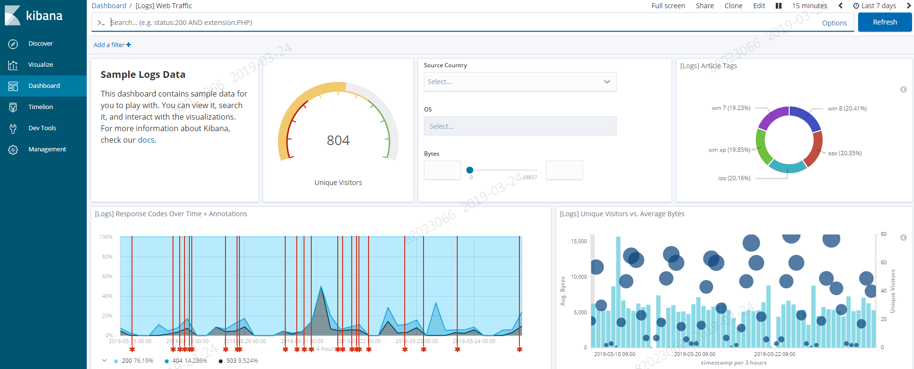

# 로그 종류별 소개

# 1. 목차

[TOC]

# 2. 개정이력

|    날짜    |      변경내용      | 작성자 | 비고 |
| :--------: | :----------------: | :----: | :--: |
| 2019.03.15 |     최초 작성      | 송양종 |      |
| 2019.04.15 | 목차 및  내용 수정 | 송양종 |      |
|            |                    |        |      |

# 3. 로그 종류별 소개

MSA 표준플랫폼에서의 로그는 아래와 같이 4가지로 구분 될 수 있다. 

| Log 종류      | 설명                                                         | 개발여부                     | 로그확인Tool       |
| ------------- | ------------------------------------------------------------ | ---------------------------- | ------------------ |
| LAMP          | KT 표준 로그 개인정보처리 및   트랜젝션 관련 로그 분석 시스템 | 표준포멧개발                 | LAMP               |
| Cluster EFK   | 어플리케이션에서 출력되는 stdout 로그를   이용하여 대쉬보드 개발 및 확인 | stdout 으로 개발불필요       | Kibana             |
| Namespace EFK | 별도의 로깅 시스템을 구축하여 대쉬보드   개발 및 확인        | 별도정의 포멧 개발(선택사항) | Kibana             |
| Container로그 | 어플리케이션에서 출력되는 로그를 실시간으로  확인            | 개발불필요                   | Container Platform |

## 3.1 LAMP 로그

LAMP는 KT 전사에서 발생되는 개인정보처리 및 트랜젝션 관련 로그를 모두 수집하여 분석하는 표준 로깅 모니터링 시스템이다.  LAMP에서 요구하는 표준 포멧으로 로그를 편집하여 전송 후 LAMP 에서 해당 로그를 검색 및 모니터할 수 있다. 

- LAMP 수집 범위

  - 개인정보처리 로그
    - 사용자접속로그 / 개인정보처리로그 / 개인정보취급자관리로그 / 개인정보 화면 노출	로그
  - 트랜젝션 로그
    - 어플리케이션 경계를 넘나드는 관련 로그

< LAMP 로그검색 화면 >

## 3.2. Cluster EFK 와 Namespace EFK

EFK는 ElasticSearch / Fluentd / Kibana 를 가르키는 용어로 강력한 로그분석 툴이다. 클라우드 환경에서는 beats까지 포함하여 Elastic Stack 이라고 부르기도 한다. EFK는 기본적으로 Cluster 위에 하나가 설치되어 관리된다.  데이터 수집 범위는 Container 에서 출력되는 stdout 데이터가 대상이며 Cluster 내 모든 Conatainer 의 stdout 데이터가 하나의 Elasticsearch 로 집결된다.  그러므로 **Application 개발시 stdout 으로 출력되는 로그에는 개인정보 등 민감 정보가 포함되지 않도록 주의** 해야 한다.

### 3.2.1. Cluster EFK

Cluster EFK 운영 주체인 인프라에서 프로젝트별로 오픈쉬프트 계정을 발급하여 프로젝트 팀에 부여한다.  프로젝트 사용자들은 해당 계정으로 Openshift Console, Grafana, EFK 등 통합 로그인이 가능하다. 또한 해당 계정으로 Kibana에 접속하여 다양한 로그를 확인 할 수 있다.

Kibana에서는 클러스터내 모든 로그가 포함 되어 있으므로  특정 프로젝트 운용자는 자신의 namespace를 filter 조건에 추가하여 조회해야 한다. Kibana 에서 사용방법 가이드는 "Cluster EFK 사용가이드(Kibana)" 문서를 참고한다.

### 3.2.2. Namespace EFK

Cluster EFK 를 제공함에도 불구하고 프로젝트 내에서 별도의 로그 관리를 원할 경우 특정 Namespace 에 EFK 를 별도 설치하여 운용자가 직접 대쉬보드를 관리 할 수 있다. 이때 데이터 수집 범위는 stdout 이 아닌 별도 지정한 로그 파일이 된다. Namespace EFK 를 구축하는 방법에 대해서는 "05. Namespace EFK 구축 가이드" 문서를 참고한다.

< EFK 중 Kibana 화면 >

## 3.3. Container 로그

Container 로그는 어플리케이션에서 출력되는 stdout, stderr 로그이다.  클러스터 환경에서는 서버 직접 접근을 허용하지 않고 있으므로 Container platform 에서 해당 로그를 확인해야 한다.  자세한 내용은 "Container 로그 확인 가이드" 문서를 참조한다.

< Container Platform 로그 검색 화면 >

