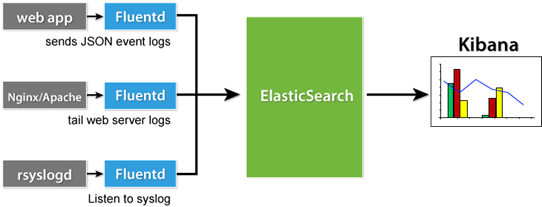
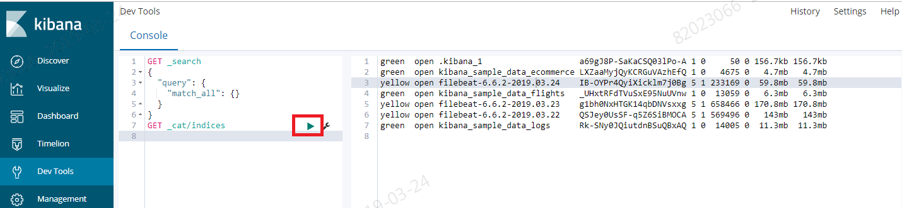
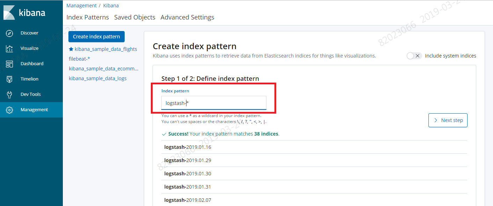
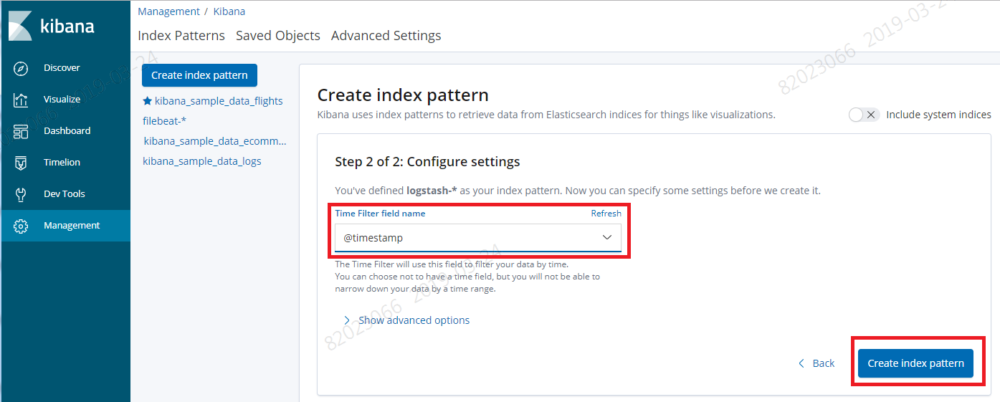
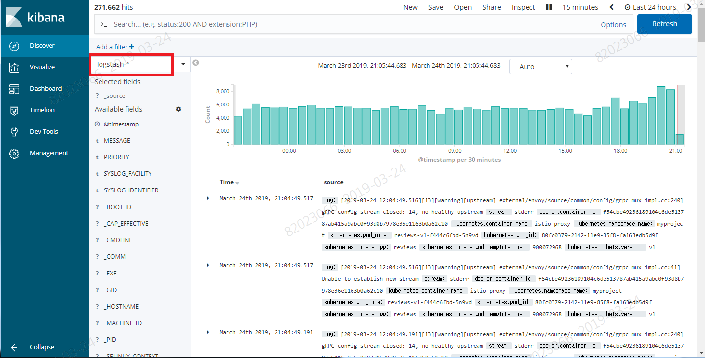
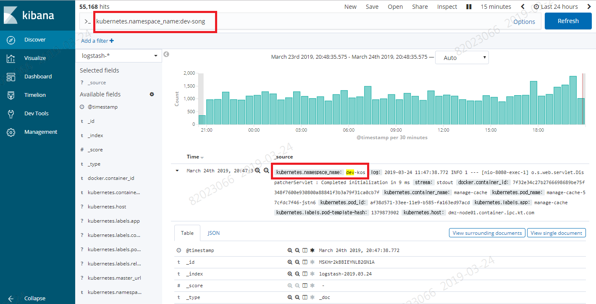
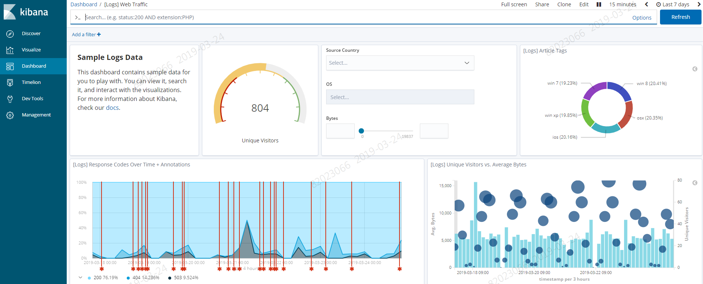

# EFK 사용 가이드(Kibana)


# 1. 목차

[TOC]


# 2. 개정이력

|    날짜    |      변경내용      | 작성자 | 비고 |
| :--------: | :----------------: | :----: | :--: |
| 2019.03.24 |     최초 작성      | 송양종 |      |
| 2019.04.15 | 목차 및  내용 수정 | 송양종 |      |
|            |                    |        |      |


# 3. EFK 개요


## 3.1. EFK 흐름도

FluentD 에 의해 수집된 로그들은 Elasticsearch 로 집결되고 kibana는 Elasticsearch 에 존재하는 데이터를 다양한 대쉬보드 형태(히스토그램, 선, 그래프, 원형차트 등)로 시각화하여 보여준다. 데이터의 흐름은 다음과 같다.





## 3.2. FluentD가 수집하는 로그들

클러스터 환경에서의 모든 어플리케이션 로그는 pod가 수행되는 worker node의 아래 디렉토리에 보관된다.

```
샘플디렉토리: 
/var/lib/docker/containers/997599971ee6366d4a5920d25b79286ad45ff37a74494f262e3bc98d909d0a7b

파일 : 997599971ee6366d4a5920d25b79286ad45ff37a74494f262e3bc98d909d0a7b-json.log
```

또한 kubelet 을 이용하여  /var/log/containers 에  symbolic link 를 만든다. 그러므로 각 worker node 의 /var/log/containers 위치의 로그를 수집하게 되면 모든 컨테이너 로그를 확인할 수 있게 된다. 로그를 수집하는 에이전트(fluentD)는 데몬셋으로 수행되므로 각 worker 노드의 로그를 수집하는 구조이다.  이러한 원리로 Elasticsearch에는 네임스페이스 내에서 수행되고 있는 모든 컨테이너 로그를 수집하여 보관하고 있다.  그러므로 Kibana에서는 클러스터에서 수행하는 모든 어플리케이션의 stdout, stderr 로그를 확인할 수 있다.

또한 각각의 로그들을 의미있는 필드로 parsing 해 준다. 예를 들면 컨테이네에서 아래와 같이 간단한 문장이 stdout 되었다면,

```
id=8, name=Mrs. Donny Collier, gender=M, image=/assets/image/cat3.jpg
```

실제로  확인가능한 로그는 해당 로그 뿐 아니라,  container_name, namespace, pidname, hostname, label 등을 추가로 확인 할 수 있다. 다음은 실제 로깅 예제이다.
```
{
  "_index": "logstash-2019.03.24",
  "_type": "_doc",
  "_id": "ty7ar2kBBIEYNLB21SU0",
  "_version": 1,
  "_score": null,
  "_source": {
    "log": "User [id=8, name=Mrs. Donny Collier, gender=M, image=/assets/image/cat3.jpg]\n",
    "stream": "stdout",
    "docker": {
      "container_id": "1cbe78482852b21b954f9b1b6e2e640d203fa39a67b9341129df6355b3977528"
    },
    "kubernetes": {
      "container_name": "userlist",
      "namespace_name": "dev-song",
      "pod_name": "userlist-854857c9dd-864kd",
      "pod_id": "7de48939-4548-11e9-9b74-fa163edb5d9f",
      "labels": {
        "app": "userlist",
        "pod-template-hash": "4104137588"
      },
      "host": "dmz-node01.container.ipc.kt.com",
      "master_url": "https://172.30.0.1:443/api",
      "namespace_id": "20a786da-214f-11e9-8dfe-fa163ed97acd"
    },
    "@timestamp": "2019-03-24T13:19:04.248511755+00:00",
    "tag": "kubernetes.var.log.containers.userlist-854857c9dd-864kd_dev-song_userlist-1cbe78482852b21b954f9b1b6e2e640d203fa39a67b9341129df6355b3977528.log"
  },
  "fields": {
    "@timestamp": [
      "2019-03-24T13:19:04.248Z"
    ]
  },
  "highlight": {
    "log": [
      "@kibana-highlighted-field@Donny@/kibana-highlighted-field@ @kibana-highlighted-field@Collier@/kibana-highlighted-field@, gender=M, image=/assets/image/cat3.jpg]"
    ]
  },
  "sort": [
    1553433544248
  ]
}
```


또한 request와 response가 포함되어 있다면 자동으로 parsing 하여 값을 리턴 한다.

```
{
  "_index": "logstash-2019.03.24",
  "_type": "_doc",
  "_id": "Ky28r2kBBIEYNLB2GvRg",
  "_version": 1,
  "_score": null,
  "_source": {
    "type": "response",
    "@timestamp": "2019-03-24T12:45:28Z",
    "tags": [],
    "pid": 1,
    "method": "get",
    "statusCode": 304,
    "req": {
      "url": "/ui/favicons/favicon-32x32.png",
      "method": "get",
      "headers": {
        "user-agent": "Mozilla/5.0 (Windows NT 6.1; Win64; x64) AppleWebKit/537.36 (KHTML, like Gecko) Chrome/70.0.3538.67 Safari/537.36",
        "accept": "image/webp,image/apng,image/*,*/*;q=0.8",
        "referer": "http://kibana-song.ipc.kt.com/app/kibana",
        "accept-encoding": "gzip, deflate",
        "accept-language": "ko-KR,ko;q=0.9,en-US;q=0.8,en;q=0.7",
        "if-none-match": "\"8e183c2e644fb050707d89402e1f7a120a95e4d2\"",
        "if-modified-since": "Wed, 13 Feb 2019 17:31:12 GMT",
        "host": "kibana-song.ipc.kt.com",
        "x-forwarded-host": "kibana-song.ipc.kt.com",
        "x-forwarded-port": "80",
        "x-forwarded-proto": "http",
        "forwarded": "for=10.225.135.96;host=kibana-song.ipc.kt.com;proto=http;proto-version=",
        "x-forwarded-for": "10.225.135.96"
      },
      "remoteAddress": "192.168.16.1",
      "userAgent": "192.168.16.1",
      "referer": "http://kibana-song.ipc.kt.com/app/kibana"
    },
    "res": {
      "statusCode": 304,
      "responseTime": 6,
      "contentLength": 9
    },
    "message": "GET /ui/favicons/favicon-32x32.png 304 6ms - 9.0B",
    "log": "{...}",
    "stream": "stdout",
    "docker": {
      "container_id": "aa9559f91e2bb6053560a12176faa9603f78643119b21a02f5e86ac53997494d"
    },
    "kubernetes": {
      "container_name": "kibana",
      "namespace_name": "dev-song",
      "pod_name": "kibana-547c4b9b46-wqx24",
      "pod_id": "6ff7938d-4e0f-11e9-908a-fa163e34173a",
      "labels": {
        "app": "kibana",
        "pod-template-hash": "1037065602",
        "release": "kibana"
      },
      "host": "ktis-node01.container.ipc.kt.com",
      "master_url": "https://172.30.0.1:443/api",
      "namespace_id": "20a786da-214f-11e9-8dfe-fa163ed97acd"
    },
    "tag": "kubernetes.var.log.containers.kibana-547c4b9b46-wqx24_dev-song_kibana-aa9559f91e2bb6053560a12176faa9603f78643119b21a02f5e86ac53997494d.log"
  },
```


## 3.3. Kibana URL 및 계정


### 3.3.1. Kibana URL

| DEV/PRD | 구분                 | URL                                      | hosts 파일                                 |
| ------- | -------------------- | ---------------------------------------- | ------------------------------------------ |
| DEV     | Cluster EFK kibana   | kibana.container.ipc.kt.com              | 10.217.59.30   kibana.container.ipc.kt.com |
| DEV     | Namespace EFK kibana | [TBD]                                    | [TBD]                                      |
| PRD     | Cluster EFK kibana   | https://kibana.c01.cz.container.kt.co.kr | N/A                                        |
| PRD     | Namespace EFK kibana | [TBD]                                    | N/A                                        |

- DEV 의 경우 DNS 가 없으므로 hosts 파일에 L4 IP 를 등록해서 사용해야 하지만 PRD 의 경우 DNS 에 등록되어 사용
- Namespace EFK 의 경우 Business 업무를 고려하여 별도 URL 를 구성할 수 있음.


### 3.3.2. 계정

프로젝트 별로 할당받은 openshift 계정을 사용하여 통합 로그인이 가능하다.


# 4. kibana 기본 설정 가이드


본 가이드는 kibana를 보기위한 기본 설정 자료이며 상세 대쉬보드 설명은  제작사 가이드 동영상을 참고한다.

동영상 가이드 : <https://www.elastic.co/kr/webinars/getting-started-kibana?baymax=rtp&elektra=products&storm=kibana&iesrc=ctr>


## 4.1. index patterns 설정

첫 kibana 설정시 elasticsearch 에 존재하는 index 들을 사용하도록 pattern 설정이 필요하다.  elasticsearc에 어떤 index 가 존재하는 조회 후 pattern 을 설정한다.

- elasticsearch 에 존재하는 index 조회

  ```
  위치 : Dev Tools > Console
  명령어 : GET _cat/indices 
  ```




- index patterns 설정

  ```
  위치: Management > Crete index pattern
  Index pattern : logstash-*
  Time Filter field name  : @timestamp 
  ```







## 4.2. Discover 확인 방법

- Discover 에서 pattern 확인




- 특정namespace 만 조회

  검색창에 아래와 같이 지정

  ```
  kubernetes.namespace_name:dev-song
  ```




## 4.3. Dashboard 확인

사용자가 직접 visualize 를 만들어 이들을 조함하여 대쉬보스를 생성할 수 있다. 아래는 샘플로 제공되는 대쉬보드이며 다양한 형태의 대쉬보를 제공한다.

