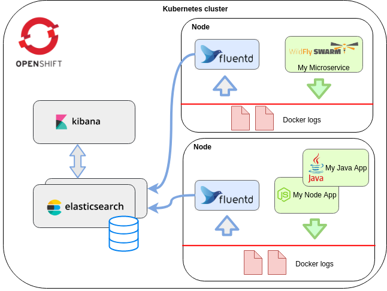

# Namespace EFK 구축 가이드

# 1. 목차

[TOC]

# 2. 개정이력

|    날짜    |      변경내용      | 작성자 | 비고 |
| :--------: | :----------------: | :----: | :--: |
| 2019.03.24 |     최초 작성      | 송양종 |      |
| 2019.03.28 |  Cluster EFK 정책  | 송양종 |      |
| 2019.04.15 | 목차 및  내용 수정 | 송양종 |      |


# 3. Namespace EFK 구축

## 3.1. 개요

LAMP로 보내는 로그나 Cluster EFK 에서 출력되는 로그 이외에 별도의 로그 관리를 원할 경우 Namespace 에 EFK 를 설치하여 운영 할 수 있다.  운영시 Kibana에서 어떤 대쉬보드가 필요한지 고려하여 로그 포멧을 사전에 설계한후 로그를 Elasticsearch 로 보낸다. 이후 운용자가 직접 대쉬보드를 설정하여 모니터링 할 수 있다. 


## 3.2. 사전 준비

### 3.2.1. helm chart fetch 및 압축해지
Helm은 쿠버네티스 패키지 관리 툴로써 다양한 템플릿을 제공하여 각 도메인별로 쉽게 설정 할 수 있다.  EFK 역시   템플릿을 제공하고 있이서 이를 다운로드 받아서 사용할 수 있다. 해당 파일들은 모두 tgz 파일 형태이며 tar 명령으로 압축해지해서 사용가능하다.

- helm fetch
> fetch 는 helm repogitory 연결 되어 있어야 함 

```bash
# helm fetch
helm fetch stable/elasticsearch
helm fetch stable/elasticsearch-curator
helm fetch stable/kibana
helm fetch stable/logstash

# 다운받은 파일들
elasticsearch-1.21.2.tgz
elasticsearch-curator-1.2.1.tgz
kibana-2.0.0.tgz
logstash-1.5.2.tgz
```


- 압축해지

```bash
tar -xzvf elasticsearch-1.21.2.tgz
tar -xzvf elasticsearch-curator-1.2.1.tgz
tar -xzvf kibana-2.0.0.tgz
tar -xzvf logstash-1.5.2.tgz
```


### 3.2.2. helm tiller 권한 부여

helm 클러스터에 Tiller라는 팟이 설치되고, 이 팟을 통해 Helm 패키지(이하 차트) 내부에 정의한 쿠버네티스 리소스들을 클러스터에 올릴 수 있다.

- 네임스페이스 RBAC 조정

특정 네임스페이스에 Helm Tiller 가 수행되도록 RBAC 조정한다.

```bash
$ cat > role-tiller.yaml
---
kind: Role
apiVersion: rbac.authorization.k8s.io/v1
metadata:
  name: tiller-manager
  namespace: tiller-world
rules:
- apiGroups: ["", "batch", "extensions", "apps"]
  resources: ["*"]
  verbs: ["*"]
---
kind: RoleBinding
apiVersion: rbac.authorization.k8s.io/v1
metadata:
  name: tiller-binding
  namespace: tiller-world
subjects:
- kind: ServiceAccount
  name: tiller
  namespace: tiller-world
roleRef:
  kind: Role
  name: tiller-manager
  apiGroup: rbac.authorization.k8s.io
---

$ kubectl create -f rolebinding-tiller.yaml
rolebinding "tiller-binding" created

# tiller 설치
$ helm init --service-account tiller --tiller-namespace tiller-world

# 샘플 install
$ helm install nginx --tiller-namespace tiller-world --namespace tiller-world

```


### 3.2.3. EFK image push

EFK 관련 이미지를 docker hub 에서 가져와서 사내 레지스트리로 push 해야 한다.

- docker image save

```bash
docker image save -o elasticsearch-curator.5.5.4.tar  quay.io/pires/docker-elasticsearch-curator:5.5.4
docker image save -o elasticsearch.6.6.1.tar          docker.elastic.co/elasticsearch/elasticsearch-oss:6.6.1
docker image save -o kibana.6.6.1.tar                 docker.elastic.co/kibana/kibana-oss:6.6.1
docker image save -o logstash.6.6.1.tar               docker.elastic.co/logstash/logstash-oss:6.6.1
```


- docker image load
```bash
docker image load -i elasticsearch-curator.5.5.4.tar
docker image load -i elasticsearch.6.6.1.tar
docker image load -i kibana.6.5.0.tar
docker image load -i kibana.6.6.1.tar
docker image load -i logstash.6.6.1.tar
```


- bastion 에 image push
```bash
# tag
docker tag quay.io/pires/docker-elasticsearch-curator:5.5.4        ktis-bastion01.container.ipc.kt.com:5000/elastic/docker-elasticsearch-curator:5.5.4
docker tag docker.elastic.co/elasticsearch/elasticsearch-oss:6.6.1 ktis-bastion01.container.ipc.kt.com:5000/elastic/elasticsearch-oss:6.6.1
docker tag docker.elastic.co/kibana/kibana-oss:6.6.1               ktis-bastion01.container.ipc.kt.com:5000/elastic/kibana-oss:6.6.1
docker tag docker.elastic.co/logstash/logstash-oss:6.6.1           ktis-bastion01.container.ipc.kt.com:5000/elastic/logstash-oss:6.6.1

# push
docker push ktis-bastion01.container.ipc.kt.com:5000/elastic/docker-elasticsearch-curator:5.5.4
docker push ktis-bastion01.container.ipc.kt.com:5000/elastic/elasticsearch-oss:6.6.1
docker push ktis-bastion01.container.ipc.kt.com:5000/elastic/kibana-oss:6.6.1
docker push ktis-bastion01.container.ipc.kt.com:5000/elastic/logstash-oss:6.6.1
```


## 3.3. elasticsearch

fetch 및 압축해지후 elasticsearch 디렉토리로 이동하게 되면 helm install 을 위한 몇몇 파일들이 존재한다.

이중 values.yaml 을 적절히 조정하여 install 한다.


### 3.1. values.yaml 조정

```yaml
# elastic image
image:
  repository: "ktis-bastion01.container.ipc.kt.com:5000/elastic/elasticsearch-oss"

#persistence 내용 수정
data:
  persistence:
    enabled: false  

# cluster mode 사용시 (master, client, data 등 여려개의 node 구성)
elastic-clustermode : true
```


### 3.2.  helm 처리

```bash
# sytax check
$ helm lint

# install 전 설치될 yaml 파일을 출력하여 사전 점검
$ helm install . --name elasticsearch --namespace dev-song --dry-run --debug > dry-run.yaml

# elasticsearch install
$ helm install . --name elasticsearch --namespace dev-song
$ helm ls

# elasticsearch delete
$ helm del --purge elasticsearch

# values.yaml 의 내용 수정 반영시
$ helm upgrade elasticsearch . --namespace song-lab
```

### 3.3.  설치 확인

```bash
# 설치 현황 확인
$ helm status elasticsearch

==> v1beta1/Deployment
NAME                  DESIRED  CURRENT  UP-TO-DATE  AVAILABLE  AGE
elasticsearch-client  1        1        1           1          1d

==> v1/Pod(related)
NAME                                   READY  STATUS   RESTARTS  AGE
elasticsearch-client-7994fd669f-smp48  1/1    Running  2         1d

==> v1/ConfigMap
NAME           DATA  AGE
elasticsearch  4     1d

==> v1/ServiceAccount
NAME                  SECRETS  AGE
elasticsearch-client  2        1d

==> v1/Service
NAME                  TYPE       CLUSTER-IP      EXTERNAL-IP  PORT(S)   AGE
elasticsearch-client  ClusterIP  172.30.215.144  <none>       9200/TCP  1d


# elasticsearch service 확인
$ curl elasticsearch-client:9200
{
  "name" : "2t4JPec",
  "cluster_name" : "elasticsearch",
  "cluster_uuid" : "YsDtLeeBSUSf8_roEJQcZA",
  "version" : {
    "number" : "6.6.1",
    "build_flavor" : "oss",
    "build_type" : "tar",
    "build_hash" : "1fd8f69",
    "build_date" : "2019-02-13T17:10:04.160291Z",
    "build_snapshot" : false,
    "lucene_version" : "7.6.0",
    "minimum_wire_compatibility_version" : "5.6.0",
    "minimum_index_compatibility_version" : "5.0.0"
  },
  "tagline" : "You Know, for Search"
}

# elasticsearch index 확인
$ curl localhost:9200/_cat/indices

yellow open filebeat-6.6.2-2019.03.20    LL7Y37oTTPqChnoCHnwXZw 5 1   1154 0 612.2kb 612.2kb
green  open .kibana_1                    ExpDndL0R7Wsgu9jt3Fj-Q 1 0     50 0 156.7kb 156.7kb
yellow open filebeat-6.6.2-2019.03.18    ziZpO03FRQGaOibkWu24Iw 5 1      3 0  23.1kb  23.1kb
green  open kibana_sample_data_ecommerce pQ9nabe9Q_2E24dPZ9XXsQ 1 0   4675 0   4.7mb   4.7mb
green  open kibana_sample_data_flights   lZlQD7qrS2ylOs6DZbjHow 1 0  13059 0   6.4mb   6.4mb
yellow open filebeat-6.6.2-2019.03.22    r3yBkDvkSZaohDKC7feKbg 5 1  14645 0   5.7mb   5.7mb
yellow open filebeat-6.6.2-2019.03.21    YJUqLfxtTiKUrUgSxrWPHA 5 1 439045 0 109.2mb 109.2mb
green  open kibana_sample_data_logs      ojBFjTFORJuBAJFZsKreaQ 1 0  14005 0  11.4mb  11.4mb

```


## 3.4. fluentd

fluentd는 다양한 소스에서 발생하는 여러 포멧의 데이터를 단일포멧(json)으로 리포멧하여 Elasticsearch 로 보내는 데이터 수집기이다.  설정이 간단하고 처리속도가 빠르며 풍부한 플러그인이 제공된다.


### 3.4.1. 흐름도




### 3.4.2. values.yaml 조정

```yaml
# vi ./fluentd-elasticsearch/values.yaml

# image
image:
  repository: ktis-bastion01.container.ipc.kt.com:5000/elastic/fluentd-elasticsearch
  tag: v2.3.2


# elasticsearch 설정
elasticsearch:
  host: 'elasticsearch-client'
  port: 9200
  scheme: 'http'
  ssl_version: TLSv1_2
  buffer_chunk_limit: 2M
  buffer_queue_limit: 8
  logstash_prefix: 'logstash'


# hostpath등 을 처리할 수 있는 권한 필요
rbac:
  create: true

serviceAccount:
  create: true
  
podSecurityPolicy:
  enabled: true

# input log file 설정
configMaps:
  containers.input.conf: |-
    <source>
      @id fluentd-containers.log
      @type tail
      path /var/log/EFK/*.log
      pos_file /var/log/fluentd-containers.log.pos
      time_format %Y-%m-%dT%H:%M:%S.%NZ
      tag raw.kubernetes.*
      format json
      read_from_head true
    </source>

```


### 3.4.3.  hostpath 처리권한 필요

```bash
oc adm policy add-scc-to-user privileged -z fluentd-elasticsearch -n dev-song       
oc adm policy add-scc-to-user hostmount-anyuid -z fluentd-elasticsearch -n dev-song
```


### 3.4.4.  helm 처리

```bash
# sytax check
$ helm lint

# dry-run
$ helm install . --name logstash --namespace dev-song --dry-run --debug > dry-run.yaml

# logstash install
$ helm install . --name logstash --namespace dev-song
$ helm ls

# logstash delete
$ helm del --purge logstash

# values.yaml 의 내용 수정 반영시
$ helm upgrade logstash . --namespace dev-song
```

### 3.4.5.  설치 확인

```bash
# 설치 현황 확인
$ helm status fluentd-elasticsearch
==> v1/ConfigMap
NAME                   DATA  AGE
fluentd-elasticsearch  6     2d

==> v1/ServiceAccount
NAME                   SECRETS  AGE
fluentd-elasticsearch  2        2d

==> v1/ClusterRoleBinding
NAME                   AGE
fluentd-elasticsearch  2d

==> v1beta1/Role
NAME                   AGE
fluentd-elasticsearch  2d

==> v1beta1/PodSecurityPolicy
NAME                   DATA  CAPS      SELINUX   RUNASUSER  FSGROUP   SUPGROUP  READONLYROOTFS  VOLUMES
fluentd-elasticsearch  true  RunAsAny  RunAsAny  MustRunAs  RunAsAny  false     configMap,emptyDir,hostPath,secret

==> v1/ClusterRole
NAME                   AGE
fluentd-elasticsearch  2d

==> v1beta1/RoleBinding
NAME                   AGE
fluentd-elasticsearch  2d

==> v1/DaemonSet
NAME                   DESIRED  CURRENT  READY  UP-TO-DATE  AVAILABLE  NODE SELECTOR  AGE
fluentd-elasticsearch  9        2        2      2           2          <none>         2d

==> v1/Pod(related)
NAME                         READY  STATUS   RESTARTS  AGE
fluentd-elasticsearch-k584d  1/1    Running  2         2d
fluentd-elasticsearch-ng6t2  1/1    Running  0         2d


```


## 3.5. kibana

kibana는 elasticsearch 에 존재하는 데이터를 다양한 대쉬보드 형태로 보여준다. kibana 대쉬보드 사용법에 대해서는 제작사 가이드 동영상을 참고한다.

동영상 가이드 : <https://www.elastic.co/kr/webinars/getting-started-kibana?baymax=rtp&elektra=products&storm=kibana&iesrc=ctr>

 

### 3.5.1. values.yaml 조정

```yaml
# vi ./kibana/values.yaml

# elasticsearch 설정
files:
  kibana.yml:
    ## Default Kibana configuration from kibana-docker.
    server.name: kibana
    server.host: "0"
    elasticsearch.url: http://elasticsearch-client:9200

# hosting 을 위한 ingress 설정
# kibana domain 을 설정한다.
ingress:
  enabled: true
  hosts:
    - kibana-song.ipc.kt.com
```

- kibana domain address 명명규칙
  ```
  kibana-[NAMESPACE].ipc.kt.com
  ```


### 3.5.2.  helm 처리

```bash
# sytax check
$ helm lint

# dry-run
$ helm install . --name kibana --namespace dev-song --dry-run --debug > dry-run.yaml

# kibana install - ingress 관련 오류 발생시 troble shooting 참조할것
$ helm install . --name kibana --namespace dev-song
$ helm ls

# kibana delete
$ helm del --purge kibana

# values.yaml 의 내용 수정 반영시
$ helm upgrade kibana . --namespace dev-song

# 접근 가능여부 확인

# kibana 파드에서 확인
curl http://localhost:5601/
curl http://localhost:5601/app/kibana#/ 

# kibana 외 다른 파드에서 확인
curl http://kibana/app/kibana#/

```

### 3.5.3.  설치 확인

```bash
# 설치 현황 확인
$ helm status kibana
==> v1/Pod(related)
NAME        READY  STATUS   RESTARTS  AGE
logstash-0  1/1    Running  3         1d

==> v1/ConfigMap
NAME               DATA  AGE
logstash-patterns  0     1d
logstash-pipeline  2     1d

==> v1/Service
NAME      TYPE       CLUSTER-IP      EXTERNAL-IP  PORT(S)   AGE
logstash  ClusterIP  172.30.239.150  <none>       5044/TCP  1d

==> v1beta2/StatefulSet
NAME      DESIRED  CURRENT  AGE
logstash  1        1        1d
```


### 3.5.4. route 추가

현재는 ingress 를 이용하여 hosting 하고 있다.   ingress 대신 route 를 사용해야 한다면 아래 스크립트를 참조한다.

```yaml
# cat kibana-song-route.yaml
---
apiVersion: route.openshift.io/v1
kind: Route
metadata:
  annotations:
    openshift.io/host.generated: 'true'

    ##### sticky session
    # haproxy.router.openshift.io/balance: sticky
    # haproxy.router.openshift.io/disable_cookies: 'false'

    ##### roundrobin session
    # haproxy.router.openshift.io/balance: roundrobin
    # haproxy.router.openshift.io/disable_cookies: 'true'
  labels:
  name: kibana-song-route
  # namespace: istio-system
spec:
  host: kibana-song.ipc.kt.com
  #path: /
  #port:
  #  targetPort: http
  to:
    kind: Service
    # name: istio-ingressgateway
    name: kibana
    #weight: 100
  #wildcardPolicy: None

```


## 3.6. curator

디스크 공간을 적절히 관리하기 위해 Elasticsearch 의 오래된 데이터를 주기적으로 삭제해야 한다. curator 는 elasticsearch 공간을 적절히 관리하는 역할 을 수행한다.  기본값으로 7일분을 보관하도록 설정되어 있지만 각 AP 별로 disk size 와 로그의 증가량을 고려하여 적절히 변경할 수 있다.

### 3.6.1. values.yaml 조정

```yaml
# vi ./kibana/values.yaml

# linux 에서 사용하는 기본 cronjob 과 유사함
cronjob:
  # At 01:00 every day
  schedule: "0 1 * * *"
  failedJobsHistoryLimit: "1"
  successfulJobsHistoryLimit: "3"
 
# 보관주기 최장 7일로 셋팅
  action_file_yml: |-
    ---
    actions:
      1:
        action: delete_indices
        description: "Clean up ES by deleting old indices"
        filters:
        - filtertype: age
          unit: days
          unit_count: 7

# elasticsearch 설정
  config_yml: |-
    ---
    client:
      hosts:
        - elasticsearch-client
      port: 9200
```

- schedule: "0 1 * * *": 매일 새벽1시에 수행
- successfulJobsHistoryLimit: 3   (default 3)
  성공적으로 종료된 pod 는 최종 3개까지만 보관하며 4번째 생성이되면 가장 오래된 pod 가 delete 된다.

- failedJobsHistoryLimit: 1
  실패로 종료된 pod의 보관 갯수 이다.


### 3.6.2.  helm 처리

```bash
# sytax check
$ helm lint

# dry-run
$ helm install . --name elasticsearch-curator --namespace dev-song --dry-run --debug > dry-run.yaml

# elasticsearch-curator install
$ helm install . --name elasticsearch-curator --namespace dev-song
$ helm ls

# elasticsearch-curator delete
$ helm del --purge elasticsearch-curator

# values.yaml 의 내용 수정 반영
# 예를들면, schedule: "0 1 * * *" 내용 조정후 upgrade 로 반영할 수 있다.
$ helm upgrade elasticsearch-curator . --namespace dev-song

```

### 3.6.3.  설치 확인

```bash
# 설치 현황 확인
$ helm status elasticsearch-curator

==> v1/ConfigMap
NAME                          DATA  AGE
elasticsearch-curator-config  2     6h

==> v1beta1/CronJob
NAME                   SCHEDULE   SUSPEND  ACTIVE  LAST SCHEDULE  AGE
elasticsearch-curator  0 1 * * *  False    0       5h             6h

```


## 3.7. trouble shooting

### 3.7.1. helm install시 기본 권한 오류 이슈

helm install 명령을 내리면 클러스터 내부에서 tiller 라는 sa 가 installation 작업을 수행한다. 그러므로 tiller 가 특정 namespace 에 작업할 적절한 권한이 있어야 한다. 만약 권한이 존재하지 않으면 아래와 같은 오류가 발생한다.  이럴 경우  아래와 같이 rbac 권한을 부여한다.

- 오류내용

```bash
# 기본 권한 오류
Error: release logstash      failed: namespaces "dev-song" is forbidden: User "system:serviceaccount:tiller:tiller" cannot get namespaces in the namespace "dev-song": no RBAC policy matched
Error: release elasticsearch failed: roles.rbac.authorization.k8s.io is forbidden: User "system:serviceaccount:tiller:tiller" cannot create roles.rbac.authorization.k8s.io in the namespace "dev-song": no RBAC policy matched
```
※ dev-song 은 사용자 namespace 명임.


- 솔루션

```bash
$ rolebinding-tiller.yaml
---
kind: Role
apiVersion: rbac.authorization.k8s.io/v1
metadata:
  name: tiller-manager
  namespace: dev-song
rules:
- apiGroups: ["", "batch", "extensions", "apps"]
  resources: ["*"]
  verbs: ["*"]
---
kind: RoleBinding
apiVersion: rbac.authorization.k8s.io/v1
metadata:
  name: tiller-binding
  namespace: dev-song
subjects:
- kind: ServiceAccount
  name: tiller
  namespace: dev-song
roleRef:
  kind: Role
  name: tiller-manager
  apiGroup: rbac.authorization.k8s.io
---

# 실행
$ oc create -f rolebinding-tiller.yaml
```


### 3.7.2. helm install 시 cluster rolebinding 권한 이슈
특정 리소스의 경우(예를 들면 Route/Ingress) 상위 권한을 요구하기도 한다. 필요시 아래와 같이 cluster 권한을 tiller 에게 부여하여 사용해야 한다.


- 오류내용

```bash
# ingress 관련 오류
[bsscoe@ktis-master01 kibana]$ helm install . --name kibana --namespace dev-song
Error: release kibana failed: ingresses.extensions "kibana" is invalid: spec.rules[0]: Forbidden: you do not have permission to set host fields in ingress rules

# route 관련 오류
[bsscoe@ktis-master01 kibana]$ helm install . --name kibana --namespace dev-song
Error: release kibana failed: routes.route.openshift.io is forbidden: User "system:serviceaccount:tiller:tiller" cannot create routes.route.openshift.io in the namespace "dev-song": no RBAC policy matched

```


- 솔루션

```bash
kubectl create clusterrolebinding tiller-crbd \
   --clusterrole cluster-admin \
   --serviceaccount=tiller:tiller
```


### 3.7.3. EFK  image  version 선정시 주의할 점

EFK 에서 사용되는 image들은 서로 동일하거나 유사해야 한다. 그렇지 않으면 Kibana Server 기동되지 않는 경우가 발생할 수 있다.

- 기동되지 않는 image 버젼 조합 사례

  ```
  ElasticSearch Ver: 5.6.10
  Kibana Ver: 6.5.4
  ```

- 성공 사례

  ```bash
  # 5.6 버젼
  ElasticSearch Ver: 5.6.10
  Kibana Ver: 5.6.14
  
  # 6.6 버젼
  ElasticSearch Ver .6.6.1
  Kibana Ver: 6.6.1
  ```


# 4. 어플리케이션에서 로그 기록


## 4.1. 어플리케이션에서 로그 생성시 준수 사항

로그는 아래와 같이 로그위치, 파일명, 보관주기 등의 규칙을 준수하여 저장해야 한다.

| 로그종류 | 로그 위치     | 파일명                | 보관주기 | 파일포멧 |
| -------- | ------------- | --------------------- | -------- | -------- |
| ELK      | /var/log/EFK/ | hostname-YYYYMMDD.log | 3일      | 사전정의 |

- 로그 저장위치

  ```
  < EFK >
  /var/log/EFK/
  ```
- 파일명

  ```
  hostname-YYYYMMDD.log
  ```

  파일은 일단위로 저장해야 하며 파일명에 hostname과 년월일이 포함되도록 설정한다. pod 내에서는 hostname이 podname 으로  인식된다. 그러므로 scale 되는 경우라도 파일명 중복을 피할 수 있다.

- 로그 파일 포멧

   Kibana 에서 어떻게 대쉬보드를 구성할 것인지를 사전 설계하여 사전에 정의된 포멧으로 로그를 남겨야 한다. 

- 보관주기

  로그가 발생하는 즉시 에이전트(fluentd) 가 일정 주기로 읽어가는 구조이다. 그러므로 local(pod) 에서는 로그를 오랫동안 보관할 필요가 없다.  하지만 보관주기가 1일인 경우 하루가 변경되는 시점에 에이전트가 로그를 읽기전에 이전 파일이 삭제되는 리스크가 있을 수 있다. 그러므로 3일정도 보관하는 것이 적절할 것이다.

  /var/log 가 속해 있는 파일 시스템 가용 용량보다 로그파일의 총합 사이즈가 over 되어 full 이 발생할 가능성이 있는 경우에는 보관주기조건 뿐 아니라 로그파일 용량제한을 추가하는 등의 별도 조치가 필요하다.


## 4.2. POD 실행시 Volume Mount 설정 방식

어플리케이션 이미지 실행시 Volume hostpath type 으로 수행한다. 아래는 busybox 를 이용한 예제이며 실제 반영시 busybox 이미지 대신 어플리케이션의 이미지를 지정하여 사용한다.

```yaml
cat > busybox_volume.yaml
---
apiVersion: v1
kind: Pod
metadata:
 name: busybox0
 labels:
   app: busybox0
spec:
 containers:
 - image: ktis-bastion01.container.ipc.kt.com:5000/busybox:latest
   command: ["sleep", "3600"]
   imagePullPolicy: IfNotPresent
   name: busybox
   volumeMounts:
   - mountPath: /var/log/LAMP/
     name: lamp-volume
   securityContext:
     privileged: true
 volumes:
 - name: lamp-volume
   hostPath:
     # directory location on host
     path: /var/log/dev-song/LAMP/
     # this field is optional
     type: DirectoryOrCreate

```

- volumeMounts 와 volumes

  어플리케이션에서 사용되는 path 는 volumeMounts 에 기록하고 각각의 node(host) 에 저장될 path는 volumes 에 기록 한다.  volume 에 기록될 path는 아래와 같은 규칙으로 지정한다.

- Log file 위치

  - Application 의 내부 위치

    ```
    /var/log/EFK/hostname_YYYYMMDD.log
    ```

  - Worker node 위치

    ```
    /var/log/[NAMESPACE]/EFK/hostname_YYYYMMDD.log
    ```

- securityContext

  어플리케이션에서 로그를 작성할 수 있는 권한(privileged) 부여한다.


