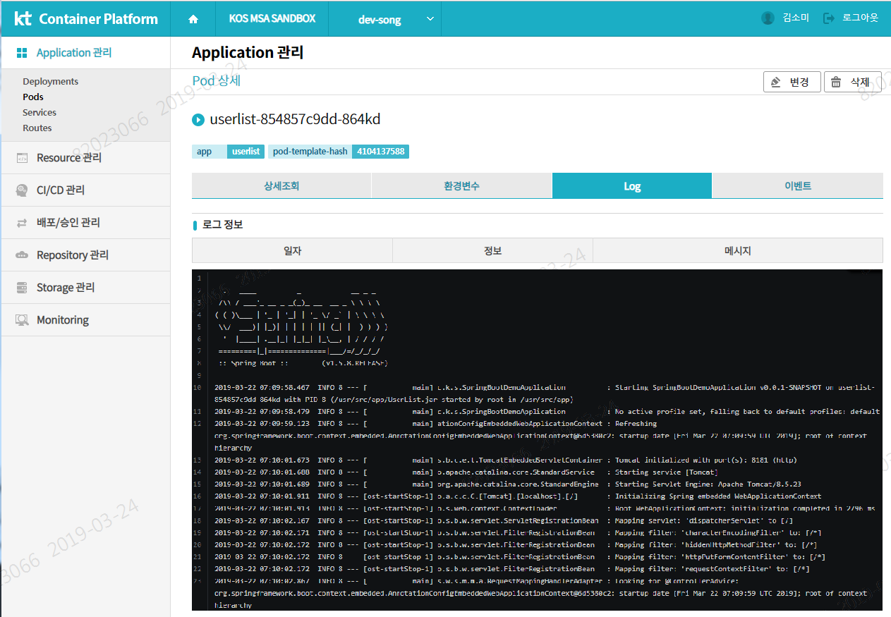

# 서버 로그 확인 가이드

# 1. 목차

[TOC]

# 2. 개정이력

|    날짜    |      변경내용      | 작성자 | 비고 |
| :--------: | :----------------: | :----: | :--: |
| 2019.03.15 |     최초 작성      | 송양종 |      |
| 2019.04.15 | 목차 및  내용 수정 | 송양종 |      |
|            |                    |        |      |

# 3. 컨테이너 로그 확인 가이드

어플리케이션에서 특정 이슈 발생시 해당 어플리케이션에서 출력되는 로그를 확인해야 하는 상황이 존재한다.  기존 VM 환경의 경우 운영자들이 운영 서버에 직접 접근하여 해당 로그들을 확인했을 것이다.  하지만 클러스터 환경에서는 KT보안정책상 운용자가 직접 접근 하는 것을 허용하지 않고 있다. 운영자들은 Kt Container Platform 에서 제공하는 console 을 이용하여 로그를 확인할 수 있다.  클러스터 환경에서는 모든 어플리케이션들이 POD 형태로 수행되며 운영자들은 KT Container Platform 에서  POD들의 로그를 확인 할 수 있다. 

그럼  로그인 과정부터 특정 POD 의 로그를 확인하는 방법을  살펴보자. 

## 3.1. 로그인 

## 3.2. 프로젝트 선택

"나의  프로젝트 목록"을 지정하여 접근하는 방법도 있으니 참고하자.

## 3.3 해당 POD 에서 로그 확인

- POD 선택

- POD 로그 선택

해당 POD 를 선택하면 아래와 같이 POD 기본정보 등 다양한 상세내역을 조회 할 수 있다.

그 중 Log Tab을 선택하자.

- POD로그 확인

기타 Kt Container Platform 사용법에 대한 가이드는 자체 홈페이지를 참고한다.

링크 : http://10.217.50.50/ipccp/login

