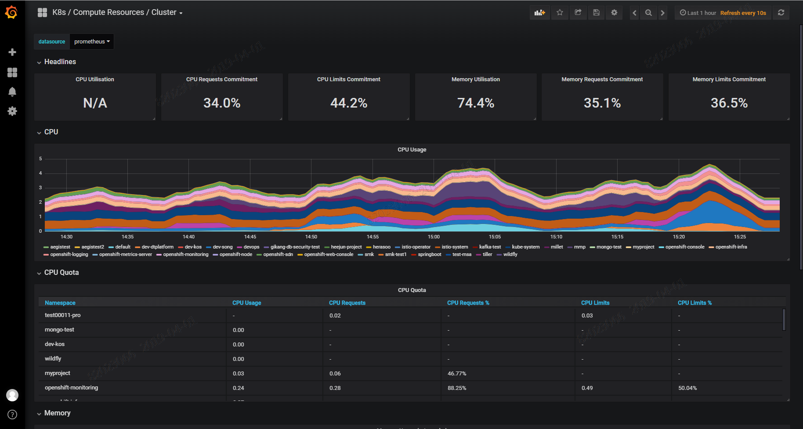
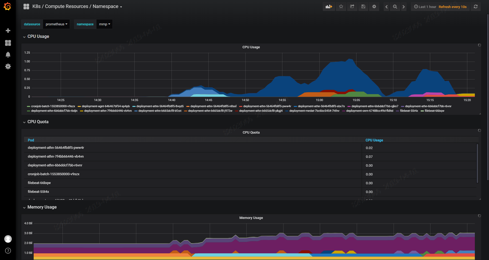
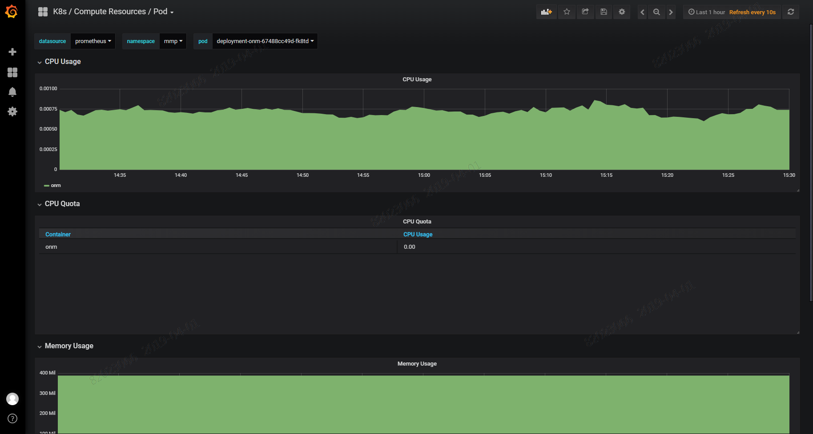
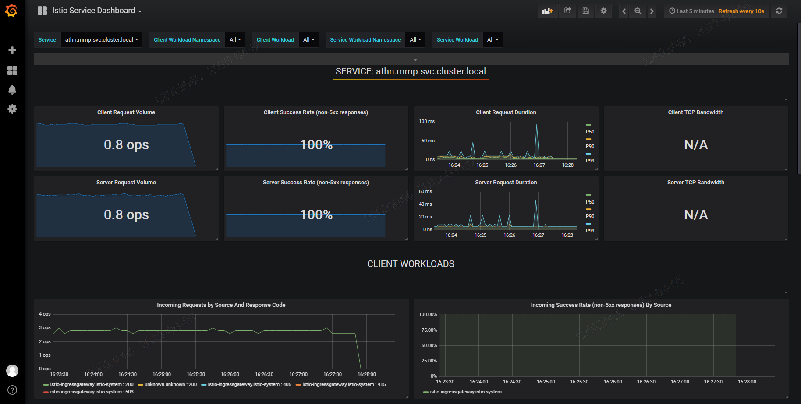
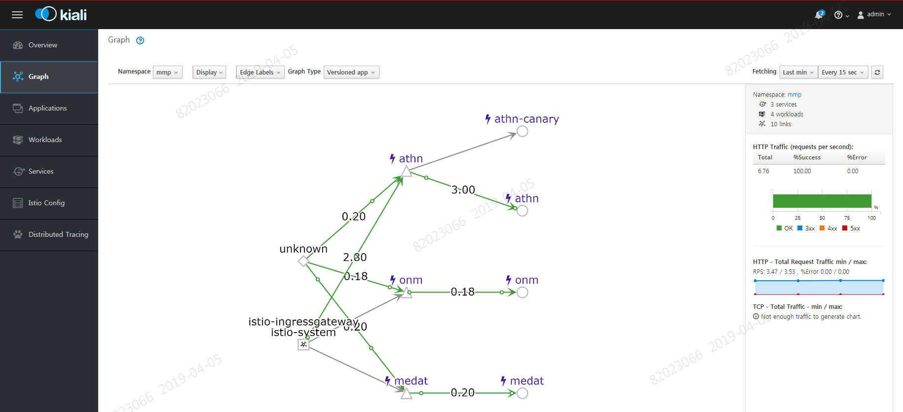
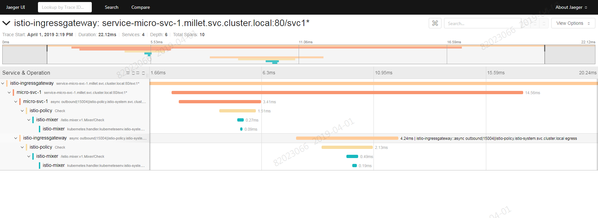

# Cluster 관제 가이드

# 1. 목차

[TOC]

# 2. 개정이력

|    날짜    |      변경내용      | 작성자 | 비고 |
| :--------: | :----------------: | :----: | :--: |
| 2019.04.01 |     최초 작성      | 송양종 |      |
| 2019.04.15 | 목차 및  내용 수정 | 송양종 |      |
|            |                    |        |      |

# 3. Cluster 관제에서 사용되는 툴 가이드

Cluster 관제 툴은 인프라에서 기본적으로 제공하는 모니터링 툴이다. 그러므로 클러스터가 세팅되면 인프라팀에서 Openshift 계정을 발급하며 프로젝트 팀에서는 해당 계정을 이용하여 로그인 후 아래 툴들을 사용할 수 있다.

## 3.1. 접근 URL 

각 관제 tool 별 접근 URL 은 아래와 같다. 

| 관제 Tool       | URL                                                          |
| --------------- | ------------------------------------------------------------ |
| kibana          | https://kibana.c01.cz.container.kt.co.kr                     |
| grafana         | https://grafana-openshift-monitoring.c01.cz.container.kt.co.kr |
| grafana - istio | http://grafana-istio-system.c01.cz.container.kt.co.kr        |
| kiali - istio   | https://kiali-istio-system.c01.cz.container.kt.co.kr         |
| jaeger - istio  | https://jaeger-query-istio-system.c01.cz.container.kt.co.kr  |

## 3.2. grafana(prometheus)

클러스터별, 네임스페이스별, 파드별로 CPU/ Memory 사용량 등의 관제가 가능하다.

- 클러스터 관제

- 네임스페이스 관제

- 파드 관제

## 3.3. istio-grafana

istio service mesh 에서 수집된 정보를 기반으로 각종 지표를 확인할 수 있다.  아래 화면은 특정 서비스에서 발생되는 request 에 대해서 현재의 volume 및 request duration 정보 등을 확인하는 화면이다.

## 3.4. istio-kiali

kiali 는 istio 에서 제공하는 모니터링 툴이다.  envoy 에서 수집된 각종 지표를 기반으로 서비스간의 흐름도를 시각해서 보여준다.  또한 각종 지표, 처리량, 정상여부, 응답시간 등을 확인할 수 있다.

## 3.5. istio-jaeger

jaeger 는 클러스터내 여러 서비스들 간에 발생하는 트렌젝션을 추적 및 응답시간을 확인할 수 있는 툴이다. jaeger 는 istio 환경에서 pod 를 구동하면 파드안의 envoy 를 통해 자동으로 서비스를 추적하여 아래와 같이 시각화 해준다.  시각화 화면을 통해 어느 구간에서 병목현상이 생기는지 추적이 가능하다.

