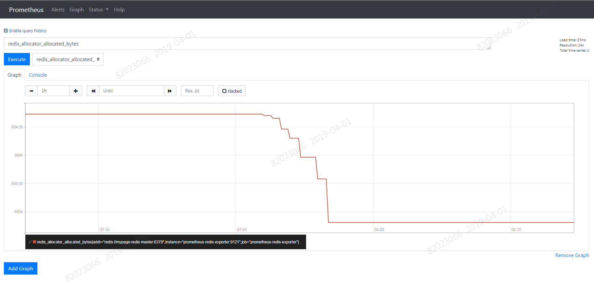
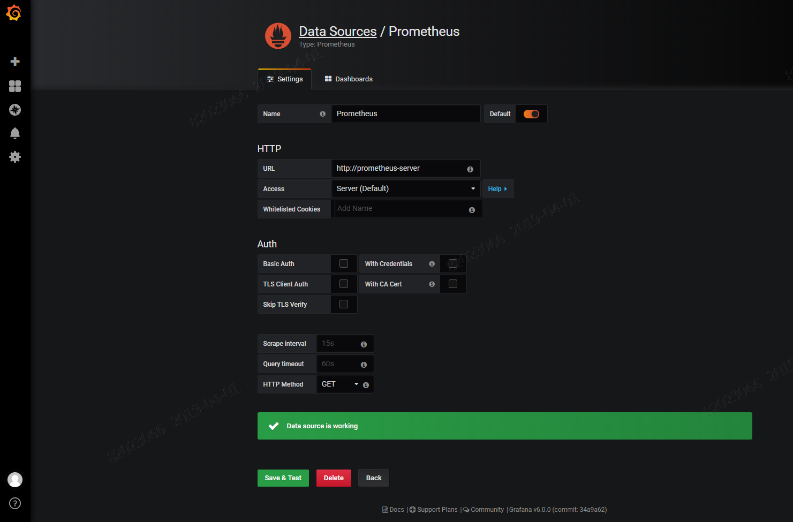

# Namespace 관제 가이드

# 1. 목차

[TOC]


# 2. 개정이력

|    날짜    |          변경내용           | 작성자 | 비고 |
| :--------: | :-------------------------: | :----: | :--: |
| 2019.04.01 |          최초 작성          | 송양종 |      |
| 2019.04.15 |     목차 및  내용 수정      | 송양종 |      |
| 2019.04.24 | 개념 추가 및 일부 내용 보정 | 송양종 |      |


# 3. Namespace 관제

이전 챕터에서 설명한 Cluster 관제는 인프라에서 기본적으로 제공하는 모니터링 툴이며 customizing 이 불가능하다.  하지만 특정 프로젝트에서만 존재하는 솔루션들에 대한 지표를 확인해야 할 상황이 있을 수 있다. 예를 들면 kafka, redis, 각종 DB 와 같은 솔루션들이다. 만약 이런 솔루션들에 대해 추가 관제가 필요할때는 Namespace 에 별도 모니터링 툴을 설치하여 운영해야 한다.  이때는 툴이 사용할 저장공간 및 성능을 고려해야 한다.

아래 가이드는 네임스페이스내에서 grafana 모니터링 툴을 셋팅하는 부분에 대한 내용이다. Helm chart를 이용하므로 helm 에 대한 사전 이해가 있어야 한다. 참고로 아래에서 언급된 chart 들은 모두 gitlab 을 통해서 down받을 수 있다. 


## 3.1. Grafana & Prometheus 개념


프로메데우스는 모니터링을 목적으로 각종 metric 을 수집한다. 데이터 수집시 모니터링 대상이 되는 자원이 지표정보를 프로메데우스로 보내는 것이 아니라, 프로메데우스가 주기적으로 모니터링 대상에서 지표를 읽어 오는 pulling 모델을 사용한다. 그러므로 target 시스템의 부하를 줄일 수 있다. target 시스템이 prometheus 포멧을 지원할 경우 바로 읽으 수 있으나 지원하지 않는다면 별도의 에이전트(exporter)를 설치해서 지표를 읽어올 수 있다.  다양한 target 시스템에서 수집된 지표 정보들은 프로메테우스 내부의 시계열 데이터베이스에 저장되고 grafana 에서 다양한 대쉬보드로 시각화 할 수 있다.


## 3.2. Prometheus 셋팅

Helm Chart 를 이용해서 간단히 설치가 가능하다.  Chart 는 GitLab 에서 다운로드 받을 수 있으며 압축해지한 다음 values.yaml 파일에서 내용을 조정한후 install 한다.


### 1) Helm 으로 설치

- helm chart download

  - [Chart download URL](<<http://gitlab.msa.kt.com/coe-istio-master/msa-bunker/tree/master/helm-logging_monitoring/charts/prometheus>>)

  - helm repository 이용시

    ```yaml
    # helm fetch
    helm fetch stable/prometheus
    
    # 압축해지
    tar -xvzf prometheus-8.9.0.tgz
    ```

- values.yaml 조정

```yaml
# 권한
rbac:
  create: true

# sa 설정
serviceAccounts:
  alertmanager:
    create: false
    name:
  kubeStateMetrics:
    create: true
    name:
  nodeExporter:
    create: false
    name:
  pushgateway:
    create: false
    name:
  server:
    create: true
    name:

# Prometheus server container name
server:
  name: server
  image:
    repository: ktis-bastion01.container.ipc.kt.com:5000/prom/prometheus
    tag: v2.8.0
    pullPolicy: IfNotPresent
  # ingress 설정
  ingress:
    ## If true, Prometheus server Ingress will be created
    ##
    enabled: true
    hosts:
      - prometheus-song.ipc.kt.com

  # pv 는 사용하지 않는것이 기본값이나 size 가 커질경우 별도 설정해야 함.
  persistentVolume:
    enabled: false

# exporter 설정 : 필요한 exporter 들 추가
serverFiles:
  prometheus.yml:
    scrape_configs:
      - job_name: 'prometheus-redis-exporter'
        static_configs:
        - targets: ['prometheus-redis-exporter:9121']
...
      - job_name: 'springactuator-exporter'
        metrics_path: /actuator/prometheus
        scheme: http
        static_configs:
        - targets:
          - simple03-package.container.ipc.kt.com:80
        - targets:
          - simple04-package.container.ipc.kt.com:80
```

- helm 처리

```bash
# sytax check
$ helm lint

# 사전 점검
$ helm install . --name prometheus --namespace dev-song --dry-run --debug > dry-run.yaml

# prometheus install
$ helm install . --name prometheus --namespace dev-song
$ helm ls

# prometheus delete
$ helm del --purge prometheus

# values.yaml 의 내용 수정 반영시
$ helm upgrade prometheus . --namespace song-lab
```

- 설치 확인

```bash
# 설치 현황 확인
$ helm status prometheus

==> v1beta1/ClusterRole
NAME                           AGE
prometheus-server              4d

==> v1beta1/ClusterRoleBinding
NAME                           AGE
prometheus-server              4d

==> v1/Service
NAME                           TYPE       CLUSTER-IP     EXTERNAL-IP  PORT(S)  AGE
prometheus-server              ClusterIP  172.30.106.40  <none>       80/TCP   4d

==> v1beta1/Deployment
NAME                           DESIRED  CURRENT  UP-TO-DATE  AVAILABLE  AGE
prometheus-server              1        1        1           1          4d

==> v1beta1/Ingress
NAME               HOSTS                       ADDRESS  PORTS  AGE
prometheus-server  prometheus-song.ipc.kt.com  80       4d

==> v1/Pod(related)
NAME                                           READY  STATUS   RESTARTS  AGE
prometheus-server-6574dcbcd7-s6pq4             2/2    Running  2         4d

==> v1/ConfigMap
NAME               DATA  AGE
prometheus-server  3     4d

==> v1/ServiceAccount
NAME                           SECRETS  AGE
prometheus-server              2        4d

```


### 2) Promethus 확인

- url 확인

http://prometheus-song.ipc.kt.com/




### 3) 운영을 위한 설정

운영을 위한 다양한 설정들이 있지만 그 중 중요한 몇몇들을 살펴보자.

```
--storage.tsdb.path: db를 어디에 저장할지 결정한다. Default 는 ~/data/ 이다.

--storage.tsdb.retention.time: 오래된 데이터를 언제 삭제할지 결정한다. 
Defaults to 15d. Overrides storage.tsdb.retention if this flag is set to anything other than default.

--storage.tsdb.retention.size: [EXPERIMENTAL] This determines the maximum number of bytes that storage blocks can use (note that this does not include the WAL size, which can be substantial). The oldest data will be removed first. Defaults to 0 or disabled. This flag is experimental and can be changed in future releases. Units supported: KB, MB, GB, PB. Ex: "512MB"

--storage.tsdb.retention: This flag has been deprecated in favour of storage.tsdb.retention..time.
```

deployment 실행시 옵션으로 실행할 수 있다.(대부분 기본값으로 유지하는 것을 권장한다.)

```

        - name: prometheus-server
          image: "ktis-bastion01.container.ipc.kt.com:5000/prom/prometheus:v2.8.0"
          imagePullPolicy: "IfNotPresent"
          args:
            - --config.file=/etc/config/prometheus.yml
            - --storage.tsdb.path=/data
            - --web.console.libraries=/etc/prometheus/console_libraries
            - --web.console.templates=/etc/prometheus/consoles
            - --web.enable-lifecycle

```


## 3.3. Grafana 셋팅

Helm Chart 를 이용해서 간단히 설치가 가능하다.  Chart 는 GitLab 에서 다운로드 받을 수 있으며 압축해지한 다음 values.yaml 파일에서 내용을 조정한후 install 한다.


### 1) Helm 으로 설치

- helm chart download

  - [Chart download URL](<<http://gitlab.msa.kt.com/coe-istio-master/msa-bunker/tree/master/helm-logging_monitoring/charts/prometheus>>)

  - helm repository 이용시

    ```yaml
    # helm fetch
    helm fetch stable/grafana
    
    # 압축해지
    tar -zvxf grafana-2.2.5.tgz
    ```

- values.yaml 조정

```yaml

# image
image:
  repository: ktis-bastion01.container.ipc.kt.com:5000/prom/grafana
  tag: 6.0.0
  pullPolicy: IfNotPresent

# ingress host
ingress:
  enabled: true
  annotations: {}
    # kubernetes.io/ingress.class: nginx
    # kubernetes.io/tls-acme: "true"
  labels: {}
  path: /
  hosts:
    - grafana-song.ipc.kt.com
    #- chart-example.local

# 초기 user/password
adminUser: admin
adminPassword: admin
```

- helm 처리

```bash
# sytax check
$ helm lint

# 사전 점검
$ helm install . --name grafana --namespace dev-song --dry-run --debug > dry-run.yaml

# grafana install
$ helm install . --name grafana --namespace dev-song
$ helm ls

# grafana delete
$ helm del --purge grafana

# values.yaml 의 내용 수정 반영시
$ helm upgrade grafana . --namespace song-lab
```

- 설치 확인

```bash
# 설치 현황 확인
$ helm status grafana

==> v1beta1/Role
NAME     AGE
grafana  7d

==> v1beta2/Deployment
NAME     DESIRED  CURRENT  UP-TO-DATE  AVAILABLE  AGE
grafana  1        1        1           1          7d

==> v1/ConfigMap
NAME     DATA  AGE
grafana  1     7d

==> v1/ServiceAccount
NAME     SECRETS  AGE
grafana  2        7d

==> v1/ClusterRole
NAME                 AGE
grafana-clusterrole  7d

==> v1/Service
NAME     TYPE       CLUSTER-IP     EXTERNAL-IP  PORT(S)  AGE
grafana  ClusterIP  172.30.221.92  <none>       80/TCP   7d

==> v1beta1/Ingress
NAME     HOSTS                    ADDRESS  PORTS  AGE
grafana  grafana-song.ipc.kt.com  80       7d

==> v1beta1/PodSecurityPolicy
NAME     DATA   CAPS      SELINUX   RUNASUSER  FSGROUP   SUPGROUP  READONLYROOTFS  VOLUMES
grafana  false  RunAsAny  RunAsAny  RunAsAny   RunAsAny  false     configMap,emptyDir,projected,secret,downwardAPI,persistentVolumeClaim

==> v1/Pod(related)
NAME                      READY  STATUS   RESTARTS  AGE
grafana-7f86c7c988-dz4gg  1/1    Running  2         7d

==> v1/Secret
NAME     TYPE    DATA  AGE
grafana  Opaque  3     7d

==> v1/ClusterRoleBinding
NAME                        AGE
grafana-clusterrolebinding  7d

==> v1beta1/RoleBinding
NAME     AGE
grafana  7d
```


### 2) grafana 확인


- Data Source 에 Prometheus 설정




