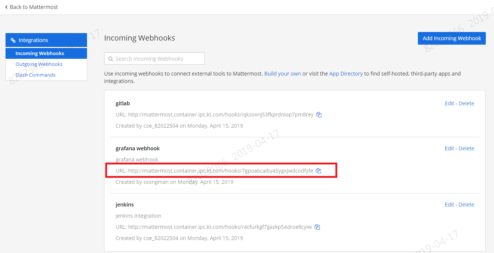

# Grafana Alert 설정 with Mattermost


# 1. 목차

[TOC]

# 2. 개정이력

|    날짜    | 변경내용  | 작성자 | 비고 |
| :--------: | :-------: | :----: | :--: |
| 2019.04.22 | 최초 작성 | 송양종 |      |
|            |           |        |      |


# 3. 개요

grafana 에서 알림 기능을 이용하기 위해서는 Alert rule과 Notification 을 각각 설정해야 한다.   Alert rule 의 경우 정상과 비정상의 기준인 임계치를 설정하는 단계이며 Notification 은 기설정된 metric이 임계치를 넘어 비정상일 경우 알려주는 기능을 설정하는 단계이다.  

grafana 는 Email, Slack, LINE, Webhook 등 다양한 Type 의 notification 을 제공한다. Email 의 경우 stmp 설정 등 각 Type별로 인증 절차가 선행되어야 하겠다.

기업 커뮤니케이션 툴 중 Slack 을 많이 사용하는데 대외적으로 공개하기 어려운 폐쇄망에서는 Slack 과 매우 유사하나 직접 설치해서 사용할 수 있는 Mattermost 툴을 많이 사용한다.  MSA 표준플랫폼에서도 Mattermost 를 제공한다.

특정 metric 을 이용해 Grafana 에서 그래프로 시각화 하고 alert rule 및 Mattermost notification을 설정한 다음 Curl 로 request 를 유발시키는 테스트를 진행해 보자.


# 4. Mattermost webhook 설정

Mattermost는 Slack 과 매우 유사하나 사내에서 직접 설치해서 사용하는 커뮤니케이션 툴이며 대외적으로 오픈되어 있지 않아 보안성이 좋다.   Mattermost 에서 webhook 을 설정해 보자.

먼저 integration 메뉴의 incoming Webhook 항목에서 title 과 description 등을 설정하고 저장(update)를 누른다.


저장이 되면 webhook 을 받을 수 있는 고유한 주소가 생성되며 이 주소를 복사하여 grafana 에서 사용한다.




# 5. Grafana 설정

Grafana 에서 원할하게 테스트 할 수 있는 metric 설정을 한 후 임계치 설정인 alerting , notification 을 설정해 보자.   dev-song namespace 의 userlist 라는 사용자관리프로그램에 request 를 유발시키고 이를 grafana 에서 그래픽으로 표현후 mattermost 로 연동해 보자.


## 5.1. Grafana 테스트용 metric 설정(istio_requests_total)

클라이언트로 부터 요 청받은 request 개수를 이용하여 그래프를 설정한다.


istio 환경이므로 istio_requests_total 이라는 metric 을 아래와 같은 script 로 기술한다.

```
round(sum(irate(istio_requests_total{connection_security_policy!="mutual_tls", destination_workload_namespace=~"dev-song", destination_service_name="userlist-svc", reporter="destination"}[30s])) by (destination_workload, destination_workload_namespace, response_code), 0.001)
```

한번의 사용자 콜이 1ops 로 표현된다.


## 5.2. Grafana altert config

현재기준으로 과거1분동안 request 값이 1ops 이상이멸 alerting 되도록 설정한다.


- 평가주기 : 60초에 한번씩 평가

- condition : request 갯수가 1 ops 이상이면 alert 


## 5.3.  Grafana notification setting


mattermost 에서 생성된 고유한 webhook 주소를 URL 에 입력한다.  이때 주의할 점은 URL 이 grafana pod 내에서 인식가능해야 한다는 점이다.  

recipient 에는 masttermost 내에서 이미 만들어진 채널명을 적는다.

mention 에는 발송 메세지 앞 부분에 자동으로 붙는 prifix 이므로 적절한 멘트를 적는다.


# 6. 테스트

## 6.1. curl 을 이용한 Request 발생

curl 명령을 이용하여 사용자 call 을 유도해 보자.

아래 설정은 0.5초에 한번씩이므로 1초에 두번! 즉 2ops 로 설정한 script 이다.

```
while true;do  curl userlist.ipc.kt.com/users/1 ;  sleep 0.5; echo; done
```


## 6.2. 확인

### 1) Grafana 확인

Grafana 에서 curl 명령으로 보내는 Request 를 그래프로 확인해 보자.


alert 의 기준점은 1ops 이상이므로 선홍색 영역이 이상지점 영역에 해당한다. 빨간색 새로선이 임계치 초과시점 alert 메세지이며 녹색 새로선이 정상복귀 시점 해소 메세지이다.


### 2) Mattermost 확인

Masttermost 에서 받은 메세지를 확인해 보자. 


alert 발생 메세지와 해소 메세지가 잘 도착했다.

