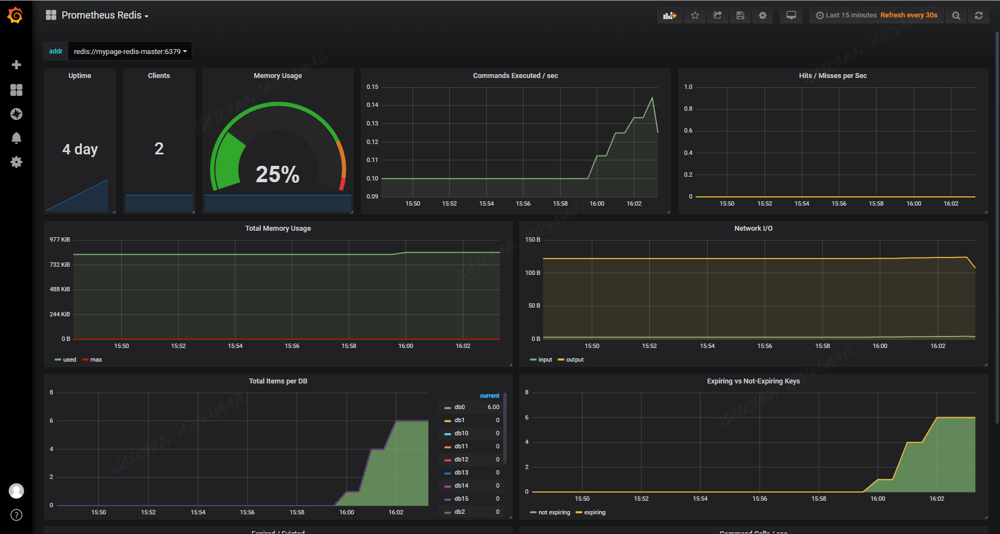
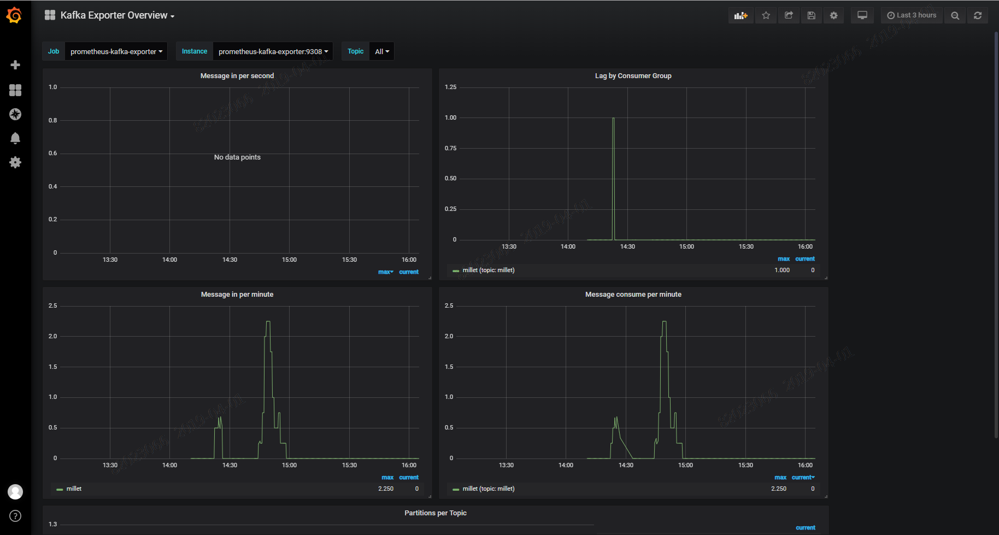
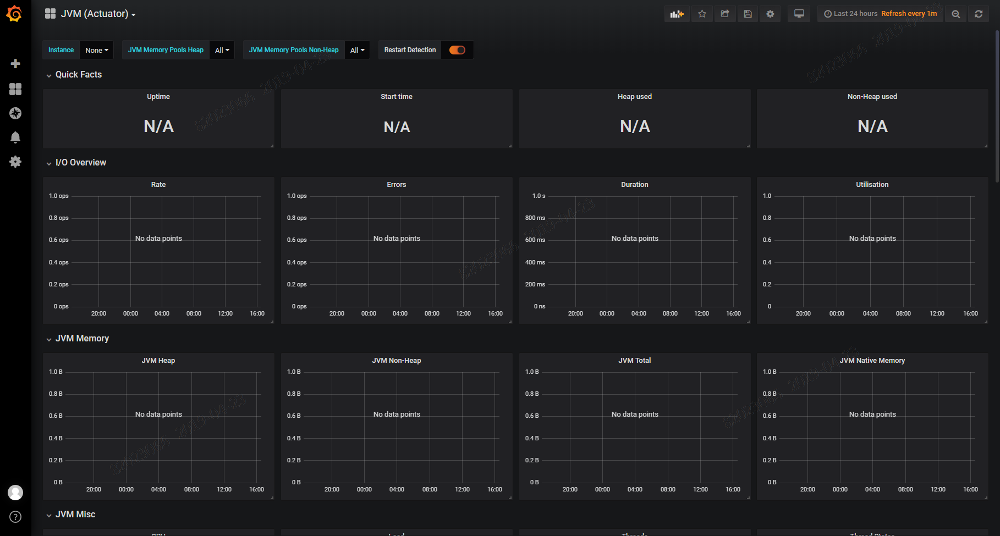

# 솔루션 Exporter 설정

# 1. 목차

[TOC]

# 2. 개정이력

|    날짜    | 변경내용  | 작성자 | 비고 |
| :--------: | :-------: | :----: | :--: |
| 2019.04.23 | 최초 작성 | 송양종 |      |
|            |           |        |      |


# 3. 솔루션 Exporter 설정

AP에서 사용되는 특정 솔루션(Redis, Kafka 등) 에 대해서 관제가 필요할 경우 관련 Exporter 를 설치 하여 관제할 수 있다. 각 솔루션별로 설정하는 방법을 알아보자.  

일부 exporter의 경우 helm chart를 이용하므로 helm 에 대한 이해가 필요하다. Helm 이 설치되어 있지 않다면 아래 가이드를 참고하여 설치한다. [namespace별 helm 설치하기](<http://gitlab.msa.kt.com/coe-istio-master/msa-bunker/blob/master/deliverables/13.%20Tech%20Support/kubernetes/namespace%EB%B3%84%20helm%20%EC%84%A4%EC%B9%98%ED%95%98%EA%B8%B0.md>)


## 3.1. Redis exporter 셋팅

Helm Chart 를 이용해서 간단히 설치가 가능하다.  Chart 는 GitLab 에서 다운로드 받을 수 있으며 압축해지한 다음 values.yaml 파일에서 내용을 조정한후 install 한다.


### 1) exporter 설치


- helm chart download

    - [Chart download URL](<http://gitlab.msa.kt.com/coe-istio-master/msa-bunker/tree/master/helm-logging_monitoring/charts/prometheus-redis-exporter>)

    - helm repository 이용시

      ```yaml
      # helm fetch
      helm fetch stable/prometheus-redis-exporter
      
      # 압축해지
      tar -zvxf prometheus-redis-exporter-1.0.2.tgz
      ```


- values.yaml 조정

```yaml
# Redis addr
redisAddress: redis://mypage-redis-master:6379

env:
   - name: REDIS_PASSWORD
     value: "admin"

# redis password secret 이 존재할 경우 아래와 같이 set
env:
  # - name: REDIS_PASSWORD
  #   valueFrom:
  #     secretKeyRef:
  #       key: redis-password
  #       name: redis-config-0.0.2
```

- helm 처리

```bash
# sytax check
$ helm lint

# 사전 점검
$ helm install . --name prometheus-redis-exporter --namespace dev-song --dry-run --debug > dry-run.yaml

# prometheus-redis-exporter install
$ helm install . --name prometheus-redis-exporter --namespace dev-song
$ helm ls

# prometheus-redis-exporter delete
$ helm del --purge prometheus-redis-exporter

# values.yaml 의 내용 수정 반영시
$ helm upgrade prometheus-redis-exporter . --namespace song-lab
```

- 설치 확인

```bash
# 설치 현황 확인
$ helm status prometheus-redis-exporter

==> v1/Service
NAME                       TYPE       CLUSTER-IP      EXTERNAL-IP  PORT(S)   AGE
prometheus-redis-exporter  ClusterIP  172.30.176.130  <none>       9121/TCP  4d

==> v1beta2/Deployment
NAME                       DESIRED  CURRENT  UP-TO-DATE  AVAILABLE  AGE
prometheus-redis-exporter  1        1        1           1          4d

==> v1beta1/PodSecurityPolicy
NAME                       DATA   CAPS      SELINUX   RUNASUSER  FSGROUP   SUPGROUP  READONLYROOTFS  VOLUMES
prometheus-redis-exporter  false  RunAsAny  RunAsAny  RunAsAny   RunAsAny  false     configMap,emptyDir,projected,secret,downwardAPI

==> v1/Pod(related)
NAME                                        READY  STATUS   RESTARTS  AGE
prometheus-redis-exporter-6dcd8774b9-l7zsl  1/1    Running  1         4d

==> v1/ServiceAccount
NAME                       SECRETS  AGE
prometheus-redis-exporter  2        4d

==> v1beta1/Role
NAME                       AGE
prometheus-redis-exporter  4d

==> v1beta1/RoleBinding
NAME                       AGE
prometheus-redis-exporter  4d
```


### 2) Prometheus yaml 파일 수정

Redis exporter 에서 보내주는 metric 을 prometheus 에 적용해야 한다.   "03. Namespace 관제 가이드.md" 파일을 참고하여 yaml 파일을 수정한 다음 helm upgrade 수행한다.

  ```yaml
  ...
  # exporter 설정
  serverFiles:
    prometheus.yml:
      scrape_configs:
        ...
        - job_name: 'prometheus-redis-exporter'
          static_configs:
          - targets: ['prometheus-redis-exporter:9121']        
  ```

  yaml 파일 수정후 아래와 같이 prometheus upgrade 적용

  ```sh
$ helm upgrade prometheus . --namespace dev-song
  ```


### 3) Grafana Dashboard 설정

이미 작성된 Json 파일을 import 한다. 

- Dashboard import

  grafana 메뉴 위치 : Dashboard / Manage / import

  파일명 : grafana_dashbaord_jsonfile/grafana_prometheus_redis_dashboard.json

- Dashboard 확인




## 3.2. Kafka exporter 셋팅

Kafka exporter 는 아래 yaml 파일을 이용해서 설치가 가능하다.  yaml 수행전 kafka_exporter docker image 가 존재하는지 확인하자.


### 1) exporter 설치

- yaml 

```yaml
$ cat > prometheus-kafka-exporter_v2.yaml
---
apiVersion: v1
kind: Service
metadata:
  name: prometheus-kafka-exporter
  labels:
    app: prometheus-kafka-exporter
  annotations:
    {}
spec:
  type: ClusterIP
  ports:
    - name: kafka-exporter
      port: 9308
      targetPort: exporter-port
      protocol: TCP
  selector:
    app: prometheus-kafka-exporter
    release: prometheus-kafka-exporter
---
apiVersion: apps/v1beta2
kind: Deployment
metadata:
  name: prometheus-kafka-exporter
  labels:
    app: prometheus-kafka-exporter
    chart: prometheus-kafka-exporter-1.0.2
    release: prometheus-kafka-exporter
    heritage: Tiller
spec:
  replicas: 1
  selector:
    matchLabels:
      app: prometheus-kafka-exporter
      release: prometheus-kafka-exporter
  template:
    metadata:
      annotations:
        {}
      labels:
        app: prometheus-kafka-exporter
        release: prometheus-kafka-exporter
    spec:
      containers:
        - name: prometheus-kafka-exporter
          image: "ktis-bastion01.container.ipc.kt.com:5000/prom/kafka_exporter:v1.2.0"
          imagePullPolicy: IfNotPresent
          args:
          - --kafka.server=complex02-kafka.millet.svc.cluster.local:9092
          ports:
            - name: exporter-port
              containerPort: 9308
          livenessProbe:
            httpGet:
              path: /
              port: exporter-port
          readinessProbe:
            httpGet:
              path: /
              port: exporter-port
          resources:
            {}
---
```

- kafka.server 설정

```
kafka.server=complex02-kafka.millet.svc.cluster.local:9092
```


### 2) Prometheus yaml 파일 수정

exporter 에서 보내주는 metric 을 prometheus 에 적용해야 한다.   "03. Namespace 관제 가이드.md" 파일을 참고하여 yaml 파일을 수정한 다음 helm upgrade 수행한다.

```yaml
  ...
  # exporter 설정
  serverFiles:
    prometheus.yml:
      scrape_configs:
        ...
        - job_name: 'prometheus-kafka-exporter'
          static_configs:
          - targets: ['prometheus-kafka-exporter:9308']  
```

  yaml 파일 수정후 아래와 같이 prometheus upgrade 적용

```sh
$ helm upgrade prometheus . --namespace dev-song
```


### 3) Grafana Dashboard 설정

이미 작성된 Json 파일을 import 한다. 

- Dashboard import

  grafana 메뉴 위치 : Dashboard / Manage / import

  파일명 : grafana_dashbaord_jsonfile/kafka-exporter-overview_rev5.json

- Dashboard 확인




## 3.3 Spring Boot Actuator 셋팅

Spring boot 에서는 자체적으로 제공하는 actuator 기능을 이용하여 App에 대한 모니터링을 수행할 수 있다. 특별한 개발을 하지 않고 라이브러리만 등록하는 수준으로 쉽게 사용할 수 있다.  Actuator가 제공하는 여러 Enpoint 중 prometheus 를 이용하여 grafana 에서 시각화 해보자.


### 1) spring boot actuator 설정

- pom.xml 에 actuator 관련설정 2가지를 추가

  ```xml
  ...
                 <dependency>
                         <groupId>org.springframework.boot</groupId>
                         <artifactId>spring-boot-starter-actuator</artifactId>
                 </dependency>               
                 <dependency>
                         <groupId>io.micrometer</groupId>
                         <artifactId>micrometer-registry-prometheus</artifactId>
                 </dependency>
  ...
  ```

- application.yml에 actuator expose 명시

  ```yaml
  # spring boot - actuator expose
  management:
    endpoints:
      web:
        exposure:
          include: health, prometheus
  ```

- AP 컴파일 및 배포


### 2) Prometheus yaml 파일 수정

actuator가 포함된 AP에 접근 가능한 URL 을 확인한다.  MSA 표준플랫폼에서 제공하는 패턴중 하나인 simple03 의 경우 아래와 같다.

```sh
curl simple03-package.container.ipc.kt.com:80/actuator/prometheus
```

prometheus 가 해당 메트릭 정보를 읽을 수 있도록 yaml 파일에 등록한다.  "03. Namespace 관제 가이드.md" 파일을 참고하여 yaml 파일을 수정한 다음 helm upgrade 수행한다.

```yaml
  ...
  # 설정
  serverFiles:
    prometheus.yml:
      scrape_configs:
        ...
        - job_name: 'springactuator-exporter'
          metrics_path: /actuator/prometheus
          scheme: http
          static_configs:
          - targets:
            - simple03-package.container.ipc.kt.com:80
          - targets:
            - simple04-package.container.ipc.kt.com:80          
```

  yaml 파일 수정후 아래와 같이 prometheus upgrade 적용

```sh
$ helm upgrade prometheus . --namespace dev-song
```


### 3) Grafana Dashboard 설정

이미 작성된 Json 파일을 import 한다. 

- Dashboard import

  grafana 메뉴 위치 : Dashboard / Manage / import

  파일명 : grafana_dashbaord_jsonfile/jvm-actuator_rev1.json

- Dashboard 확인




