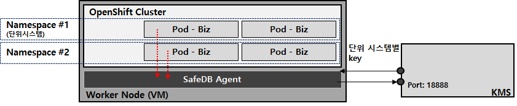
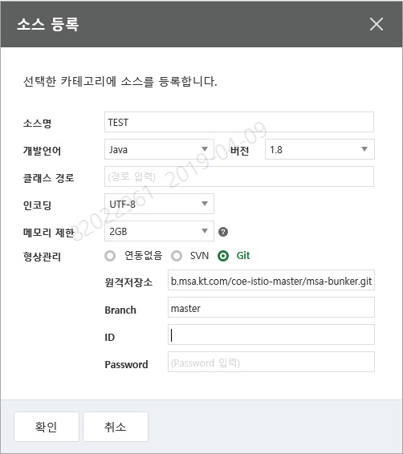

# 1. 사내 필수 보안 프로그램 연동 가이드


## 1.1. 개정이력

|    날짜    | 변경내용  | 작성자 | 비고 |
| :--------: | :-------: | :----: | :--: |
| 2019.03.13 | 최초 작성 | 장종호 |      |
|            |           |        |      |
|            |           |        |      |


## 1.2. 목차

- [1. 사내 필수 보안 프로그램 연동 가이드](#1-%EC%82%AC%EB%82%B4-%ED%95%84%EC%88%98-%EB%B3%B4%EC%95%88-%ED%94%84%EB%A1%9C%EA%B7%B8%EB%9E%A8-%EC%97%B0%EB%8F%99-%EA%B0%80%EC%9D%B4%EB%93%9C)
  - [1.1. 개정이력](#11-%EA%B0%9C%EC%A0%95%EC%9D%B4%EB%A0%A5)
  - [1.2. 목차](#12-%EB%AA%A9%EC%B0%A8)
  - [1.3. 가이드 목적](#13-%EA%B0%80%EC%9D%B4%EB%93%9C-%EB%AA%A9%EC%A0%81)
  - [1.4. 필수 보안 프로그램 유형](#14-%ED%95%84%EC%88%98-%EB%B3%B4%EC%95%88-%ED%94%84%EB%A1%9C%EA%B7%B8%EB%9E%A8-%EC%9C%A0%ED%98%95)
    - [1.4.1. SafeDB](#141-safedb)
      - [1.4.1.1. deployment yaml 설정 추가 사항](#1411-deployment-yaml-%EC%84%A4%EC%A0%95-%EC%B6%94%EA%B0%80-%EC%82%AC%ED%95%AD)
      - [1.4.1.2. Java Code 환경 변수 접근](#1412-java-code-%ED%99%98%EA%B2%BD-%EB%B3%80%EC%88%98-%EC%A0%91%EA%B7%BC)
      - [1.4.1.3. SafeDB API 사용](#1413-safedb-api-%EC%82%AC%EC%9A%A9)
    - [1.4.2. InisafeNet](#142-inisafenet)
    - [1.4.3. 서버백신](#143-%EC%84%9C%EB%B2%84%EB%B0%B1%EC%8B%A0)
    - [1.4.4. 웹 쉘](#144-%EC%9B%B9-%EC%89%98)
    - [1.4.5. 웹 방화벽](#145-%EC%9B%B9-%EB%B0%A9%ED%99%94%EB%B2%BD)
    - [1.4.6. SMP](#146-smp)
      - [1.4.6.1. 소스 자산등록](#1461-%EC%86%8C%EC%8A%A4-%EC%9E%90%EC%82%B0%EB%93%B1%EB%A1%9D)
      - [1.4.6.2. 진단 실행](#1462-%EC%A7%84%EB%8B%A8-%EC%8B%A4%ED%96%89)
      - [1.4.6.3. 진단결과 확인](#1463-%EC%A7%84%EB%8B%A8%EA%B2%B0%EA%B3%BC-%ED%99%95%EC%9D%B8)


## 1.3. 가이드 목적

Cluster 환경에서 KT 프로젝트 수행에 필요한 필수 보안 프로그램들에 대한 적용 시, 유의사항에 대한 안내를 위한 내용을 목적으로 한다.


## 1.4. 필수 보안 프로그램 유형

### 1.4.1. SafeDB



SafeDB는 WorkerNode 단위로 설치하여 운용되며, 각 Pod 에서 동작되는 WorkerNode정보에 접근하여, KMS (키관리 시스템)과 통신하여 수행된다.

각 Pod에서는 SafeDB에 접근하기 위해 현재 동작중인 Worker Node의 IP 를 획득하여 설정하는 과정이 필요하다.


Cluster 환경에서 SafeDB Agent가  Worker Node 단위로 운용되는 정책에 따라, Worker Node 에 동작되는 Pod의 단위 시스템이 서로 다를 수 있으며, 단위 시스템별로 사용되는 Key는 SafeDB Agent에 집합된다.

Key의 활용 용도와 기능은 시스템별 업무 유형에 따라 정의 하며, 연동 목적(DB 또는 타켓 시스템)에 정의된 상호 관계에서만 동작되지만, SafeDB Agent에는 집합된 Key가 존재 할 수 있다.


#### 1.4.1.1. deployment yaml 설정 추가 사항

```yaml
containers:
-  env:
   - name: NODE_IP
     valueFrom:
       fieldRef:
         status.hostIP
```

- NODE_IP 환경변수로 위와 같이 deployment yaml 를 통해 획득이 가능하고 AP Code(Java 기준)에서 아래와 같이 획득 가능하다.


#### 1.4.1.2. Java Code 환경 변수 접근

```java
System.getProperty("NODE_IP");
```


#### 1.4.1.3. SafeDB API 사용

```java
SimpleSafeDB safedb = SimpleSafeDB.getInstance();

// safedb API를 통한 Agent IP 변경.
safedb.setAgentIP(System.getProperty("NODE_IP"));
		
boolean loginResult = false;
if(!safedb.login()){
	loginResult = safedb.getSafeDBConfigMgr().isLoginCheck();
}
```

*※해당 사항은 현재 safeDB 벤더 이니텍에서 현재 개선될 내용으로, 방법이 일부 변경 될 수 있습니다.*


### 1.4.2. InisafeNet

InisafeNet의 Cluster 환경에서의 사용 관점에서 특별히 적용해야 할 안내 사항은 없으나, 운용환경에 적용되는 License 정책에 일부 변화가 있다. 

현재까지는 IP 기반의 License 발급 방식이었으나, Cluster 환경방식에서는 "Domain명칭 또는 단위시스템"명칭으로 Key를 발급하여 적용될 예정이다. 관련된 절차는 BPM 에서 발급되는 양식에 항목이 추가되는 형태로 제공된다.

*※ 해당 사항은 현재 진행중인 사항으로, 위와 같은 방식으로 발급되기 전까지는 기한 방식의 License로 대체 적용 될 예정입니다*


### 1.4.3. 서버백신

 특이 사항 없음. Worker Node(VM 또는 Dedicated Server) 단위로 설치 방식 동일.

단, Worker Node에서 검출되는 POD 정보는 UUID 명칭으로 확인되어 실제 발생 주체는 수동으로 식별 해야 함.


### 1.4.4. 웹 쉘

 특이 사항 없음. Worker Node(VM 또는 Dedicated Server) 단위로 설치 방식 동일.

단, Worker Node에서 검출되는 POD 정보는 UUID 명칭으로 확인되어 실제 발생 주체는 수동으로 식별 해야 함.


### 1.4.5. 웹 방화벽

특이 사항 없음. 웹 방화벽 수용 절차 방식에서 안내하는 절차에 따라, 웹 방화벽 시스템으로 인증서 전달 후 기능 점검 사항 동일.


### 1.4.6. SMP

SMP 시스템이 `18 12월 이후 시스템 개편되어, 현재 Repository  기반의 소스 검증이 가능하며, SVN, Git 을 모두 지원하고 있음.


#### 1.4.6.1. 소스 자산등록

진단실행 > 단위서비스명 검색 > 단위서비스 상단 소스목록 클릭 > 단위서비스명 클릭 > 우측 하단 +**소스등록** 버튼 > 소스명등 입력 후 형상관리에 RADIO 박스에 SVN으로 선택 후 SVN 접속 정보 입력 & ID,PASS 기입하여 확인클릭




#### 1.4.6.2. 진단 실행

진단실행 > 단위서비스명 검색 > 단위서비스 상단 소스목록 클릭 > 단위서비스명 클릭 > 등록된 소스에서 진단실행 버튼 클릭 >  기본설정 후 확인 > 진단결과로 이동 


#### 1.4.6.3. 진단결과 확인

진단결과 > 프로젝트명 검색(단위서비스명이 프로젝트명에 포함되어 있음으로 단위서비스로 검색하셔도 됩니다,) >  프로젝트 클릭 > 우측 웹보고서 클릭 또는 PDF 클릭하여 다운로드


