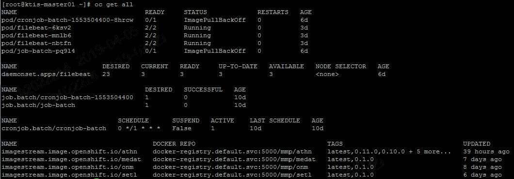

- [1. 개요](#1-%EA%B0%9C%EC%9A%94)
  - [1.1. 목적](#11-%EB%AA%A9%EC%A0%81)
  - [1.2. 범위](#12-%EB%B2%94%EC%9C%84)
  - [1.3. 이해관계자](#13-%EC%9D%B4%ED%95%B4%EA%B4%80%EA%B3%84%EC%9E%90)
  - [1.4. 용어사전](#14-%EC%9A%A9%EC%96%B4%EC%82%AC%EC%A0%84)
- [2. kt 사용자 계정 관리 정책](#2-kt-%EC%82%AC%EC%9A%A9%EC%9E%90-%EA%B3%84%EC%A0%95-%EA%B4%80%EB%A6%AC-%EC%A0%95%EC%B1%85)
  - [2.1. 사용자 계정이란](#21-%EC%82%AC%EC%9A%A9%EC%9E%90-%EA%B3%84%EC%A0%95%EC%9D%B4%EB%9E%80)
  - [2.2. 계정 관리 정책](#22-%EA%B3%84%EC%A0%95-%EA%B4%80%EB%A6%AC-%EC%A0%95%EC%B1%85)
- [3. kt 롤 관리 정책](#3-kt-%EB%A1%A4-%EA%B4%80%EB%A6%AC-%EC%A0%95%EC%B1%85)
- [4. 계정과 롤에 따른 접근 통제 예시](#4-%EA%B3%84%EC%A0%95%EA%B3%BC-%EB%A1%A4%EC%97%90-%EB%94%B0%EB%A5%B8-%EC%A0%91%EA%B7%BC-%ED%86%B5%EC%A0%9C-%EC%98%88%EC%8B%9C)
- [5. RBAC 소개](#5-rbac-%EC%86%8C%EA%B0%9C)
  - [5.1. 롤과 롤바인딩](#51-%EB%A1%A4%EA%B3%BC-%EB%A1%A4%EB%B0%94%EC%9D%B8%EB%94%A9)
  - [5.2. 클러스터롤과 클러스터롤바인딩](#52-%ED%81%B4%EB%9F%AC%EC%8A%A4%ED%84%B0%EB%A1%A4%EA%B3%BC-%ED%81%B4%EB%9F%AC%EC%8A%A4%ED%84%B0%EB%A1%A4%EB%B0%94%EC%9D%B8%EB%94%A9)
    - [5.2.1. 디폴트 클러스터롤과 클러스터롤바인딩](#521-%EB%94%94%ED%8F%B4%ED%8A%B8-%ED%81%B4%EB%9F%AC%EC%8A%A4%ED%84%B0%EB%A1%A4%EA%B3%BC-%ED%81%B4%EB%9F%AC%EC%8A%A4%ED%84%B0%EB%A1%A4%EB%B0%94%EC%9D%B8%EB%94%A9)
- [6. 부록](#6-%EB%B6%80%EB%A1%9D)
  - [6.1. OpenShift 리소스 전체 목록 및 약어](#61-openshift-%EB%A6%AC%EC%86%8C%EC%8A%A4-%EC%A0%84%EC%B2%B4-%EB%AA%A9%EB%A1%9D-%EB%B0%8F-%EC%95%BD%EC%96%B4)
  - [6.2. kt 정책 3가지 권한 상세](#62-kt-%EC%A0%95%EC%B1%85-3%EA%B0%80%EC%A7%80-%EA%B6%8C%ED%95%9C-%EC%83%81%EC%84%B8)
    - [6.2.1. view](#621-view)
    - [6.2.2. edit](#622-edit)
    - [6.2.3. admin](#623-admin)

# 1. 개요

## 1.1. 목적

본 문서는 쿠버네티스 콘솔 작업의 주체인 사용자를 구분하고 CLI 명령어를 통제하기 위한 가이드를 제시한다.

kt 쿠버네티스 환경의 경우 커맨드 서버가 별도 존재하여 해당 서버에 SSH 접속 후 커맨드를 수행하게 된다. 이 때 사용되어진 계정(`OpenShift 계정`, not OS 계정)에는 이미 kt 내부 정책으로 관리되는 롤이 바인딩 되어져 있다. 어떤 계정으로 로그인을 수행했으냐에 따라 행할 수 있는 명령어에도 차이가 발생한다.

본 가이드를 통해 kt 내부 정책을 이해하고 롤 생성과 수정에 대한 작업 시 필요한 절차 등을 이해하도록 하자.

> 실제 개발 과정 시 개발자가 콘솔을 통해서 명령어를 직접 날릴 일은 흔치 않을 것이다. 긴급 작업이나 콘솔 작업이 필요한 특별한 경우에만 사용하도록 한다.

## 1.2. 범위

본 문서는 아래 주제들에 대해 다룬다.

- RBAC에 대한 이해
- kt 사용자(계정)/롤 관리 정책 이해
- 계정 별 권한 범위 및 한계
- 롤 생성 및 수정 가이드

## 1.3. 이해관계자

쿠버네티스 콘솔 환경에 직접 접속하여 oc 명령어를 수행하는 서비스 개발자 및 담당자는 해당 가이드를 숙지해야 한다.

## 1.4. 용어사전

| 용어 | 정의                      |
| ---- | ------------------------- |
| RBAC | Role Based Access Control |
| SSH  | Secure Shell              |
| OC   | Openshift Console         |
| SA   | Service Account           |

# 2. kt 사용자 계정 관리 정책

kt OpenShift 환경에서 프로젝트를 시작하게 되면 인프라를 통해 프로젝트(네임스페이스)와 해당 vmfhwprxm에서 사용할 수 있는 OpenShift 계정을 부여 받게 된다.

해당 계정에는 이미 kt 내부 정책으로 관리되는 롤이 바인딩 되어져 있고 이에 따라 CLI 명령어 등이 통제가 된다.

본 챕터에서는 사용자 계정의 정의와 kt 사용자 계정 관리 정책에 대해 기술한다.

> **[ 참고 ]**
>
> - 네임스페이스는 쿠버네티스 환경에서 지칭하는 용어이고, OpenShift 환경에서는 프로젝트라 부른다.
>
> - 프로젝트는 시스템 단위로 부여된다.

## 2.1. 사용자 계정이란

여기서 말하는 사용자 계정이란 프로젝트 생성 시 같이 부여된 OpenShift 계정을 말한다.

OpenShift 웹 콘솔 혹은 CLI 환경에 로그인을 수행하고 OpenShift 내 각종 리소스들에 대한 CRUD 작업을 수행하는 주체이다.

> [ 참고 ]
>
> kt 환경 특성 상 서버 접근 시 STG Client를 이용하게 되는데, 이 때 사용하는 OS 계정과는 관련이 없으니 혼동하지 않도록 주의한다.

## 2.2. 계정 관리 정책

프로젝트 초기 구성 시 인프라부서로부터 아래 예시와 같이 해당 프로젝트에서 사용할 계정을 부여 받는다. 계정을 부여받지 못했거나 추가 계정이 필요할 경우 인프라부서에 요청한다.

아래는 이에 대한 예시로 foo 라는 프로젝트에 부여된 계정 목록을 나타낸다.

| 프로젝트명 | OpenShift 사용자 계정 | 바인딩 되어 있는 롤 |
| ---------- | --------------------- | ------------------- |
| foo        | foo-admin             | admin               |
|            | foo-edit              | edit                |
|            | foo-view              | view                |

> 사용자 계정 포맷 : 프로젝트명-롤명

# 3. kt 롤 관리 정책

위 도표에서 보는 것처럼 사용자 계정에는 <u>kt 롤 관리 정책으로 정해진 3개의 롤이 이미 바인딩</u> 되어져 있다. 해당 롤은 쿠버네티스에서 제공하는 기본 롤들로 롤에 따라 수행할 수 있는 범위가 정해진다.

> 각 롤 별 상세 권한 목록은 문서 하단의 [부록]을 참조

| 롤    | 요약                             | 설명                                                                                            |
| ----- | -------------------------------- | ----------------------------------------------------------------------------------------------- |
| admin | 네임스페이스 전체 통제 권한 허용 | ResourceQuotas와 네임스페이스 리소스 자체를 제외한 네임스페이스의 리소스를 읽고 수정할 수 있다. |
| edit  | 리소스 수정 허용                 | 네임스페이스의 리소스를 수정할 수 있을 뿐만 아니라 시크릿을 읽고 수정할 수 있다.                |
| view  | 리소스 읽기 전용 접근 허용       | 롤, 롤바인딩, 시크릿을 제외한 네임스페이스 내 대부분의 리소스를 읽을 수 있다.                   |

# 4. 계정과 롤에 따른 접근 통제 예시

**[ mmp라는 보험중계 프로젝트에 부여된 mmp-admin 로그인 시 ]**

```sh
# OpenShift 로그인 수행
[root@ktis-master01 ~]# oc login
Authentication required for https://console.c01.cz/container.kt.co.kr:443 (openshift)
Username: mmp-admin
Password:
Login successful.

You have one project on this server: "mmp"

Using project "mmp"
```


> 부여된 계정으로 로그인 성공 시 mmp 라는 하나의 프로젝트만을 볼 수 있다.
>
> (실제 해당 클러스터에는 여러 프로젝트가 있다.)

```sh
# 현재 로그인 된 계정 확인
[root@ktis-master01 ~]# oc config current-context
mmp/console-c01-cz-container-kt-co-kr:443/mmp-admin

[root@ktis-master01 ~]# oc whoami
admin
```


> 현재 사용 중인 계정이 mmp 프로젝트의 mmp-admin 임을 알 수 있다.

**[ 타 네임스페이스 접근 불가 예시 ]**

```sh
# mmp 프로젝트에 mmp-admin 계정으로 로그인 시 타 네임스페이스 접근 불가
[root@ktis-master01 ~]# oc get ns
No resource found.
Error from server (Forbidden): namespaces is forbidden: User "mmp-admin" cannot list namespaces at the cluster scope: no RBAC policy matched.
```


> kt 롤 관리 정책에 따라 다른 네임스페이스 목록을 나열하는 것이 불가능하다.

**[ 타 네임스페이스 내 리소스 접근 불가 예시 ]**

```sh
# mmp 프로젝트에 mmp-admin 계정으로 로그인 시 타 네임스페이스 내 리소스 접근 불가
$ oc get all --all-namespaces
No resources found.
Error from server (Forbidden) : pods is forbidden: User "mmp-admin" cannot list pods...
Error from server (Forbidden) : services is forbidden: User "mmp-admin" cannot list services...
# (아래 그림 참조)
```


> 다른 네임스페이스 내 리소스 목록을 나열하는 것이 불가능하다.

**[ 내가 속한 네임스페이스만 접근 가능한 예시 ]**

```sh
# 오직 나의 프로젝트 내 리소스만 조회 가능
$ oc get all
NAME
pod/cronjob-batch-...
pod/filebeat-...
# (아래 그림 참조)
```



> 오직 나의 프로젝트 내에 있는 리소스들에 대해서만 조회가 가능하다.

**[ OpenShift 웹 콘솔 확인 예시 ]**


> 보험중계(mmp) 프로젝트에 부여된 계정 `mmp-admin` 으로 로그인 시 자신의 프로젝트 외 다른 프로젝트를 볼 수 없게 된다. (좌측)
>
> 이에 비해 `cluster-admin` 권한을 가진 계정 `admin` 으로 로그인 시 클러스터 내 모든 프로젝트를 볼 수 있다. (우측)

각 프로젝트에 부여된 계정에는 (위에서 설명한 기본 클러스터롤 중) `admin`, `edit`, `view` 롤 중 하나가 바인딩 되어져 있다.

각 프로젝트에서 어떤 계정으로 `oc login` 을 수행했느냐에 따라 결과가 달라지게 된다. 아래 도표는 3가지 클러스터롤이 수행할 수 있는 전반적인 액션에 대해 설명하고 있다.

> 상세한 내용은 문서 끝부분 [부록A]를 참고한다.3. 롤 생성과 수정

# 5. RBAC 소개

Role Based Access Control의 약자로 역할 기반 접근 제어로 풀이된다.

사용자(User, ServiceAccount, Group)의 역할(Role)을 보고 사용자가 액션(get, create, etc.)을 수행할 수 있는지 여부를 결정할 때 핵심 요소로 사용한다.

사용자는 하나 이상의 역할과 연관되며 각 역할은 특정 리소스에 대한 액션을 수행한다.

RBAC 인증 규칙은 4가지 리소스로 구성되며 2가지 그룹으로 묶을 수 있다.

| within a namespace    | cluster-wide                         |
| --------------------- | ------------------------------------ |
| 롤(Role)              | 클러스터롤(ClusterRole)              |
| 롤바인딩(RoleBinding) | 클러스터롤바인딩(ClusterRoleBinding) |

`롤(Role)` 은 **특정 API나 resources에 대해 취할 수 있는 액션(verbs)을 명시해둔 명세서**이며, `바인딩(Binding)` 은 **누가 이를 수행할 수 있는지를 정의**한다.

이를 도식화하면 아래와 같다.

**[ Pods에 대한 읽기 권한을 바인딩한 예 ]**


| 계정 구분            | 설명                              |
| -------------------- | --------------------------------- |
| User                 | 개별 사용자                       |
| Service Account (SA) | Pod가 사용하는 시스템 계정        |
| Group                | 사용자 또는 ServiceAccount의 그룹 |

## 5.1. 롤과 롤바인딩

먼저 Role은 액션의 범위(Scope)가 네임스페이스 내로 한정이 된다.

**[ Role 예시와 설명 ]**

```yaml
kind: Role
apiVersion: rbac.authorization.k8s.io/v1
metadata:
  namespace: uptown
  name: pod-reader
rules:
  - apiGroups: ['']
    resources: ['pods']
    verbs: ['get', 'list']
```

> 한줄 요약 : (해당 롤을 바인딩한 사용자는) uptown 네임스페이스의 pods 리소스를 읽을 수 있다.

- kind: Role
  - 공통 설정으로 kind와 apiVersion을 명시한다.
- metadata.namespace: uptown / name: pod-reader
  - 이 Role이 속한 네임스페이스와 Role의 이름을 명시한다.
- rules:
  - 이 Role이 가지는 권한에 대해 기술한다.
- resources: ["pods"]
  - resources에는 어떤 자원에 접근 가능한지를 명시하는데 예시에서는 pods에만 접근 가능하다는 의미이다.
    (리소스 목록은 부록A 참조)
- verbs: ["get", "list"]
  - verbs는 어떤 동작이 가능한지를 설정하는 부분이다. 예시에서는 get과 list 권한만 가능하다는 의미이다.

**[ 설정 가능한 verbs ]**

| verbs            | 의미                          |
| ---------------- | ----------------------------- |
| create           | 새로운 리소스 생성            |
| get              | 개별 리소스 조회              |
| list             | 여러 건의 리소스 조회         |
| update           | 기존 리소스 전체 업데이트     |
| patch            | 기존 리소스 중 일부 내용 변경 |
| delete           | 개별 리소스 삭제              |
| deletecollection | 여러 리소스 삭제              |

## 5.2. 클러스터롤과 클러스터롤바인딩

클러스터롤(ClusterRole)은 특정 네임스페이스에 국한되지 않는 **클러스터 전체에 대한 권한**을 관리한다. 그래서 <u>네임스페이스와 연관 없는 리소스</u>나 `/healthz` 와 같이 <u>리소스가 아닌 URL</u>에 대한 권한을 지정할 수 있다.

롤바인딩을 생성하고 클러스터롤을 참조하게 하여 네임스페이스의 리소스를 접근하게 할 수 있지만 클러스터 수준 리소스에 대한 접근 권한을 부여하려면 항상 클러스터 롤바인딩을 사용해야 한다.

**[ClusterRole 예시와 설명]**

```yaml
kind: ClusterRole
apiVersion: rbac.authorization.k8s.io/v1
metadata:
  name: read-clusterrole
rules:
  - apiGroups: ['']
    resources: ['pods']
    verbs: ['get', 'list']
```

> 한줄 요약 : (해당 롤을 바인딩한 사용자는) 클러스터 내 모든 네임스페이스의 pods 리소스를 읽을 수 있다.

- kind: ClusterRole
  - 공통설정으로 kind와 apiVersion을 나타낸다. (단, kind 부분이 ClusterRole로 되어 있다.)
- metadata.namespace
  - 특정 네임스페이스에 한정되지 않기 때문에 namespace 부분이 생략되어 있다.
- 그 외는 Role 예시와 같으나 의미는 클러스터 내 전체 네임스페이스의 포드에 대해 get, list가 가능함을 나타낸다.

### 5.2.1. 디폴트 클러스터롤과 클러스터롤바인딩

쿠버네티스는 자체적으로 API 서버가 시작될 때마다 업데이트 되는 클러스터롤 및 클러스터롤바인딩의 **기본 세트**를 제공한다.

```sh
$ kubectl get clusterrolebindings
cluster-admin
system:basic-user
system:controller:attachdetach-controller
...

$ kubectl get clusterroles
cluster-admin
system:basic-user
system:discovery
admin
edit
view
...
```

이렇게 기본 세트의 클러스터롤을 사용하는 이유로 사용자 실수에 의한 삭제를 막을 수 있기 때문이다. 또한 새로운 버전의 쿠버네티스가 클러스터롤 및 바인딩의 다른 구성을 사용하는 경우 모든 디폴트 롤과 바인딩이 다시 만들어지기 때문에 사용자가 일일이 맞춰줄 필요가 없기 때문이다.

필요 시 서비스 계정(ServiceAccount)을 생성하고 클러스터 롤 바인딩(ClusterRoleBinding)을 통해 권한을 부여한다.

# 6. 부록

## 6.1. OpenShift 리소스 전체 목록 및 약어

| API GROUPS                 | RESOURCES                           | ABBREBIATION |
| -------------------------- | ----------------------------------- | ------------ |
| ""                         | configmaps                          | CM           |
|                            | endpoints                           | E            |
|                            | persistentvolumeclaims              | PVC          |
|                            | pods                                | P            |
|                            | pods/log                            | P            |
|                            | pods/status                         | P            |
|                            | pods/attach                         | P            |
|                            | pods/exec                           | P            |
|                            | pods/portforward                    | P            |
|                            | pods/proxy                          | P            |
|                            | replicationcontrollers              | RC           |
|                            | replicationcontrollers/scale        | RC           |
|                            | replicationcontrollers/status       | RC           |
|                            | serviceaccounts                     | SA           |
|                            | secrets                             | S            |
|                            | services                            | S            |
|                            | services/proxy                      | S            |
|                            | bindings                            | B            |
|                            | events                              | E            |
|                            | limitranges                         | LR           |
|                            | resourcequotas                      | RQ           |
|                            | resourcequotas/status               | RQ           |
|                            | namespaces                          | NS           |
|                            | namespaces/status                   | NS           |
|                            | resourcequotausages                 | RES          |
| apps                       | daemonsets                          | DS           |
|                            | deployments                         | D            |
|                            | deployments/scale                   | D            |
|                            | deployments/rollback                | D            |
|                            | replicasets                         | RS           |
|                            | replicasets/scale                   | RS           |
|                            | statefulsets                        | SS           |
|                            | statefulsets/scale                  | SS           |
| autoscaling                | horizontalpodautoscalers            | HPA          |
| batch                      | cronjobs                            | CJ           |
|                            | jobs                                | J            |
| extensions                 | daemonsets                          | DS           |
|                            | deployments                         | D            |
|                            | deployments/rollback                | D            |
|                            | deployments/scale                   | D            |
|                            | ingresses                           | I            |
|                            | networkpolicies                     | NP           |
|                            | replicasets                         | RS           |
|                            | replicasets/scale                   | RS           |
|                            | replicationcontrollers/scale        | RC           |
| policy                     | poddisruptionbudgets                | PDB          |
| networking.k8s.io          | networkpolicies                     | NP           |
| authorization.k8s.io       | localsubjectaccessreviews           | LSA          |
| rbac.authorization.k8s.io  | roles                               | R            |
|                            | rolebindings                        | RB           |
| authorization.openshift.io | roles                               | R            |
|                            | rolebindings                        | RB           |
|                            | rolebindingrestrictions             | RBR          |
|                            | localresourceaccessreviews          | LRA          |
|                            | localsubjectaccessreviews           | LSA          |
|                            | subjectrulesreviews                 | SRR          |
|                            | resourceaccessreviews               | RAR          |
|                            | subjectaccessreviews                | SAR          |
| security.openshift.io      | podsecuritypolicyreviews            | PSP          |
|                            | podsecuritypolicyselfsubjectreviews | PSP          |
|                            | podsecuritypolicysubjectreviews     | PSP          |
| build.openshift.io         | buildconfigs                        | BC           |
|                            | buildconfigs/webhooks               | BC           |
|                            | builds                              | B            |
|                            | builds/log                          | B            |
|                            | builds/clone                        | B            |
|                            | builds/details                      | B            |
|                            | buildconfigs/instantiate            | BC           |
|                            | buildconfigs/instantiatebinary      | BC           |
|                            | buildlogs                           | BUI          |
|                            | jenkins                             | JEN          |
| apps.openshift.io          | deploymentconfigs                   | DC           |
|                            | deploymentconfigs/scale             | DC           |
|                            | deploymentconfigrollbacks           | DEP          |
|                            | deploymentconfigs/instantiate       | DC           |
|                            | deploymentconfigs/rollback          | DC           |
|                            | deploymentconfigs/log               | DC           |
|                            | deploymentconfigs/status            | DC           |
| image.openshift.io         | imagestreamimages                   | ISI          |
|                            | imagestreammappings                 | ISM          |
|                            | imagestreams                        | IS           |
|                            | imagestreams/secrets                | IS           |
|                            | imagestreams/status                 | IS           |
|                            | imagestreams/layers                 | IS           |
|                            | imagestreamtags                     | IST          |
|                            | imagestreamimports                  | ISI          |
| project.openshift.io       | projects                            | PR           |
| quota.openshift.io         | appliedclusterresourcequotas        | ACR          |
| route.openshift.io         | routes                              | RT           |
|                            | routes/custom-host                  | RT           |
|                            | routes/status                       | RT           |
| template.openshift.io      | processedtemplates                  | PRO          |
|                            | templateconfigs                     | TEM          |
|                            | templateinstances                   | TI           |
|                            | templates                           | T            |

## 6.2. kt 정책 3가지 권한 상세

kt OpenShift 환경에서 사용하는 view, edit, admin 클러스터롤의 리소스 권한 목록은 각각 아래와 같다.

### 6.2.1. view

```sh
$ kubectl describe clusterrole view
Name:         view
Labels:       kubernetes.io/bootstrapping=rbac-defaults
Annotations:  rbac.authorization.kubernetes.io/autoupdate=true
PolicyRule:
  Resources                                Non-Resource URLs  Resource Names  Verbs
  ---------                                -----------------  --------------  -----
  bindings                                 []                 []              [get list watch]
  configmaps                               []                 []              [get list watch]
  endpoints                                []                 []              [get list watch]
  events                                   []                 []              [get list watch]
  limitranges                              []                 []              [get list watch]
  namespaces/status                        []                 []              [get list watch]
  namespaces                               []                 []              [get list watch]
  persistentvolumeclaims                   []                 []              [get list watch]
  pods/log                                 []                 []              [get list watch]
  pods/status                              []                 []              [get list watch]
  pods                                     []                 []              [get list watch]
  replicationcontrollers/scale             []                 []              [get list watch]
  replicationcontrollers/status            []                 []              [get list watch]
  replicationcontrollers                   []                 []              [get list watch]
  resourcequotas/status                    []                 []              [get list watch]
  resourcequotas                           []                 []              [get list watch]
  serviceaccounts                          []                 []              [get list watch]
  services                                 []                 []              [get list watch]
  controllerrevisions.apps                 []                 []              [get list watch]
  daemonsets.apps                          []                 []              [get list watch]
  deployments.apps/scale                   []                 []              [get list watch]
  deployments.apps                         []                 []              [get list watch]
  replicasets.apps/scale                   []                 []              [get list watch]
  replicasets.apps                         []                 []              [get list watch]
  statefulsets.apps/scale                  []                 []              [get list watch]
  statefulsets.apps                        []                 []              [get list watch]
  horizontalpodautoscalers.autoscaling     []                 []              [get list watch]
  cronjobs.batch                           []                 []              [get list watch]
  jobs.batch                               []                 []              [get list watch]
  daemonsets.extensions                    []                 []              [get list watch]
  deployments.extensions/scale             []                 []              [get list watch]
  deployments.extensions                   []                 []              [get list watch]
  ingresses.extensions                     []                 []              [get list watch]
  networkpolicies.extensions               []                 []              [get list watch]
  replicasets.extensions/scale             []                 []              [get list watch]
  replicasets.extensions                   []                 []              [get list watch]
  replicationcontrollers.extensions/scale  []                 []              [get list watch]
  networkpolicies.networking.k8s.io        []                 []              [get list watch]
  poddisruptionbudgets.policy              []                 []              [get list watch]
```

### 6.2.2. edit

```sh
$ kubectl describe clusterrole edit
Name:         edit
Labels:       kubernetes.io/bootstrapping=rbac-defaults
Annotations:  rbac.authorization.kubernetes.io/autoupdate=true
PolicyRule:
  Resources                                Non-Resource URLs  Resource Names  Verbs
  ---------                                -----------------  --------------  -----
  serviceaccounts                          []                 []              [create delete deletecollection get list patch update watch impersonate]
  configmaps                               []                 []              [create delete deletecollection get list patch update watch]
  endpoints                                []                 []              [create delete deletecollection get list patch update watch]
  persistentvolumeclaims                   []                 []              [create delete deletecollection get list patch update watch]
  pods/attach                              []                 []              [create delete deletecollection get list patch update watch]
  pods/exec                                []                 []              [create delete deletecollection get list patch update watch]
  pods/portforward                         []                 []              [create delete deletecollection get list patch update watch]
  pods/proxy                               []                 []              [create delete deletecollection get list patch update watch]
  pods                                     []                 []              [create delete deletecollection get list patch update watch]
  replicationcontrollers/scale             []                 []              [create delete deletecollection get list patch update watch]
  replicationcontrollers                   []                 []              [create delete deletecollection get list patch update watch]
  secrets                                  []                 []              [create delete deletecollection get list patch update watch]
  services/proxy                           []                 []              [create delete deletecollection get list patch update watch]
  services                                 []                 []              [create delete deletecollection get list patch update watch]
  controllerrevisions.apps                 []                 []              [create delete deletecollection get list patch update watch]
  daemonsets.apps                          []                 []              [create delete deletecollection get list patch update watch]
  deployments.apps/rollback                []                 []              [create delete deletecollection get list patch update watch]
  deployments.apps/scale                   []                 []              [create delete deletecollection get list patch update watch]
  deployments.apps                         []                 []              [create delete deletecollection get list patch update watch]
  replicasets.apps/scale                   []                 []              [create delete deletecollection get list patch update watch]
  replicasets.apps                         []                 []              [create delete deletecollection get list patch update watch]
  statefulsets.apps/scale                  []                 []              [create delete deletecollection get list patch update watch]
  statefulsets.apps                        []                 []              [create delete deletecollection get list patch update watch]
  horizontalpodautoscalers.autoscaling     []                 []              [create delete deletecollection get list patch update watch]
  cronjobs.batch                           []                 []              [create delete deletecollection get list patch update watch]
  jobs.batch                               []                 []              [create delete deletecollection get list patch update watch]
  daemonsets.extensions                    []                 []              [create delete deletecollection get list patch update watch]
  deployments.extensions/rollback          []                 []              [create delete deletecollection get list patch update watch]
  deployments.extensions/scale             []                 []              [create delete deletecollection get list patch update watch]
  deployments.extensions                   []                 []              [create delete deletecollection get list patch update watch]
  ingresses.extensions                     []                 []              [create delete deletecollection get list patch update watch]
  networkpolicies.extensions               []                 []              [create delete deletecollection get list patch update watch]
  replicasets.extensions/scale             []                 []              [create delete deletecollection get list patch update watch]
  replicasets.extensions                   []                 []              [create delete deletecollection get list patch update watch]
  replicationcontrollers.extensions/scale  []                 []              [create delete deletecollection get list patch update watch]
  networkpolicies.networking.k8s.io        []                 []              [create delete deletecollection get list patch update watch]
  poddisruptionbudgets.policy              []                 []              [create delete deletecollection get list patch update watch]
  bindings                                 []                 []              [get list watch]
  events                                   []                 []              [get list watch]
  limitranges                              []                 []              [get list watch]
  namespaces/status                        []                 []              [get list watch]
  namespaces                               []                 []              [get list watch]
  pods/log                                 []                 []              [get list watch]
  pods/status                              []                 []              [get list watch]
  replicationcontrollers/status            []                 []              [get list watch]
  resourcequotas/status                    []                 []              [get list watch]
  resourcequotas                           []                 []              [get list watch]

```

### 6.2.3. admin

```sh
$ kubectl describe clusterrole admin
Name:         admin
Labels:       kubernetes.io/bootstrapping=rbac-defaults
Annotations:  rbac.authorization.kubernetes.io/autoupdate=true
PolicyRule:
  Resources                                       Non-Resource URLs  Resource Names  Verbs
  ---------                                       -----------------  --------------  -----
  serviceaccounts                                 []                 []              [create delete deletecollection get list patch update watch impersonate]
  configmaps                                      []                 []              [create delete deletecollection get list patch update watch]
  endpoints                                       []                 []              [create delete deletecollection get list patch update watch]
  persistentvolumeclaims                          []                 []              [create delete deletecollection get list patch update watch]
  pods/attach                                     []                 []              [create delete deletecollection get list patch update watch]
  pods/exec                                       []                 []              [create delete deletecollection get list patch update watch]
  pods/portforward                                []                 []              [create delete deletecollection get list patch update watch]
  pods/proxy                                      []                 []              [create delete deletecollection get list patch update watch]
  pods                                            []                 []              [create delete deletecollection get list patch update watch]
  replicationcontrollers/scale                    []                 []              [create delete deletecollection get list patch update watch]
  replicationcontrollers                          []                 []              [create delete deletecollection get list patch update watch]
  secrets                                         []                 []              [create delete deletecollection get list patch update watch]
  services/proxy                                  []                 []              [create delete deletecollection get list patch update watch]
  services                                        []                 []              [create delete deletecollection get list patch update watch]
  controllerrevisions.apps                        []                 []              [create delete deletecollection get list patch update watch]
  daemonsets.apps                                 []                 []              [create delete deletecollection get list patch update watch]
  deployments.apps/rollback                       []                 []              [create delete deletecollection get list patch update watch]
  deployments.apps/scale                          []                 []              [create delete deletecollection get list patch update watch]
  deployments.apps                                []                 []              [create delete deletecollection get list patch update watch]
  replicasets.apps/scale                          []                 []              [create delete deletecollection get list patch update watch]
  replicasets.apps                                []                 []              [create delete deletecollection get list patch update watch]
  statefulsets.apps/scale                         []                 []              [create delete deletecollection get list patch update watch]
  statefulsets.apps                               []                 []              [create delete deletecollection get list patch update watch]
  horizontalpodautoscalers.autoscaling            []                 []              [create delete deletecollection get list patch update watch]
  cronjobs.batch                                  []                 []              [create delete deletecollection get list patch update watch]
  jobs.batch                                      []                 []              [create delete deletecollection get list patch update watch]
  daemonsets.extensions                           []                 []              [create delete deletecollection get list patch update watch]
  deployments.extensions/rollback                 []                 []              [create delete deletecollection get list patch update watch]
  deployments.extensions/scale                    []                 []              [create delete deletecollection get list patch update watch]
  deployments.extensions                          []                 []              [create delete deletecollection get list patch update watch]
  ingresses.extensions                            []                 []              [create delete deletecollection get list patch update watch]
  networkpolicies.extensions                      []                 []              [create delete deletecollection get list patch update watch]
  replicasets.extensions/scale                    []                 []              [create delete deletecollection get list patch update watch]
  replicasets.extensions                          []                 []              [create delete deletecollection get list patch update watch]
  replicationcontrollers.extensions/scale         []                 []              [create delete deletecollection get list patch update watch]
  networkpolicies.networking.k8s.io               []                 []              [create delete deletecollection get list patch update watch]
  poddisruptionbudgets.policy                     []                 []              [create delete deletecollection get list patch update watch]
  rolebindings.rbac.authorization.k8s.io          []                 []              [create delete deletecollection get list patch update watch]
  roles.rbac.authorization.k8s.io                 []                 []              [create delete deletecollection get list patch update watch]
  localsubjectaccessreviews.authorization.k8s.io  []                 []              [create]
  bindings                                        []                 []              [get list watch]
  events                                          []                 []              [get list watch]
  limitranges                                     []                 []              [get list watch]
  namespaces/status                               []                 []              [get list watch]
  namespaces                                      []                 []              [get list watch]
  pods/log                                        []                 []              [get list watch]
  pods/status                                     []                 []              [get list watch]
  replicationcontrollers/status                   []                 []              [get list watch]
  resourcequotas/status                           []                 []              [get list watch]
  resourcequotas                                  []                 []              [get list watch]
```
