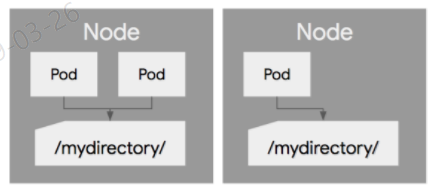
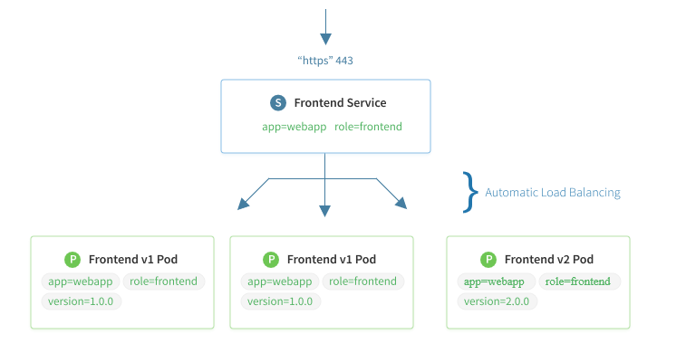

- [1. 개요](#1-%EA%B0%9C%EC%9A%94)
  - [1.1. 목적](#11-%EB%AA%A9%EC%A0%81)
  - [1.2. 범위](#12-%EB%B2%94%EC%9C%84)
  - [1.3. 이해관계자](#13-%EC%9D%B4%ED%95%B4%EA%B4%80%EA%B3%84%EC%9E%90)
  - [1.4. 용어사전](#14-%EC%9A%A9%EC%96%B4%EC%82%AC%EC%A0%84)
- [2. kt OpenShift 환경 주요 리소스 목록](#2-kt-openshift-%ED%99%98%EA%B2%BD-%EC%A3%BC%EC%9A%94-%EB%A6%AC%EC%86%8C%EC%8A%A4-%EB%AA%A9%EB%A1%9D)
  - [2.1. Namespace 관리 가이드](#21-namespace-%EA%B4%80%EB%A6%AC-%EA%B0%80%EC%9D%B4%EB%93%9C)
  - [2.2. Service Accounts 관리 가이드](#22-service-accounts-%EA%B4%80%EB%A6%AC-%EA%B0%80%EC%9D%B4%EB%93%9C)
    - [2.2.1. kt Service Accounts 정책](#221-kt-service-accounts-%EC%A0%95%EC%B1%85)
    - [2.2.2. SA 생성 방법](#222-sa-%EC%83%9D%EC%84%B1-%EB%B0%A9%EB%B2%95)
  - [2.3. Role & ClusterRole 관리 가이드](#23-role--clusterrole-%EA%B4%80%EB%A6%AC-%EA%B0%80%EC%9D%B4%EB%93%9C)
  - [2.4. Volume 가이드](#24-volume-%EA%B0%80%EC%9D%B4%EB%93%9C)
    - [2.4.1. emptyDir 볼륨](#241-emptydir-%EB%B3%BC%EB%A5%A8)
      - [2.4.1.1. 소개 및 정의](#2411-%EC%86%8C%EA%B0%9C-%EB%B0%8F-%EC%A0%95%EC%9D%98)
      - [2.4.1.2. 사용방법](#2412-%EC%82%AC%EC%9A%A9%EB%B0%A9%EB%B2%95)
    - [2.4.2. hostPath 볼륨](#242-hostpath-%EB%B3%BC%EB%A5%A8)
      - [2.4.2.1. 소개 및 정의](#2421-%EC%86%8C%EA%B0%9C-%EB%B0%8F-%EC%A0%95%EC%9D%98)
      - [2.4.2.2. 사용방법](#2422-%EC%82%AC%EC%9A%A9%EB%B0%A9%EB%B2%95)
    - [2.4.3. nfs 볼륨](#243-nfs-%EB%B3%BC%EB%A5%A8)
      - [2.4.3.1. 소개 및 정의](#2431-%EC%86%8C%EA%B0%9C-%EB%B0%8F-%EC%A0%95%EC%9D%98)
      - [2.4.3.2. 사용방법](#2432-%EC%82%AC%EC%9A%A9%EB%B0%A9%EB%B2%95)
  - [2.5. Services 가이드](#25-services-%EA%B0%80%EC%9D%B4%EB%93%9C)
    - [2.5.1. Cluster IP 서비스](#251-cluster-ip-%EC%84%9C%EB%B9%84%EC%8A%A4)
      - [2.5.1.1. 소개 및 정의](#2511-%EC%86%8C%EA%B0%9C-%EB%B0%8F-%EC%A0%95%EC%9D%98)
      - [2.5.1.2. 사용 방법](#2512-%EC%82%AC%EC%9A%A9-%EB%B0%A9%EB%B2%95)
    - [2.5.2. 인그레스 리소스](#252-%EC%9D%B8%EA%B7%B8%EB%A0%88%EC%8A%A4-%EB%A6%AC%EC%86%8C%EC%8A%A4)
      - [2.5.2.1. 소개 및 정의](#2521-%EC%86%8C%EA%B0%9C-%EB%B0%8F-%EC%A0%95%EC%9D%98)
      - [2.5.2.2. 사용방법](#2522-%EC%82%AC%EC%9A%A9%EB%B0%A9%EB%B2%95)
  - [2.6. configmaps 사용 가이드](#26-configmaps-%EC%82%AC%EC%9A%A9-%EA%B0%80%EC%9D%B4%EB%93%9C)
    - [2.6.1. 소개 및 정의](#261-%EC%86%8C%EA%B0%9C-%EB%B0%8F-%EC%A0%95%EC%9D%98)
    - [2.6.2. 사용방법](#262-%EC%82%AC%EC%9A%A9%EB%B0%A9%EB%B2%95)
  - [2.7. deployments 사용 가이드](#27-deployments-%EC%82%AC%EC%9A%A9-%EA%B0%80%EC%9D%B4%EB%93%9C)
    - [2.7.1. 소개 및 정의](#271-%EC%86%8C%EA%B0%9C-%EB%B0%8F-%EC%A0%95%EC%9D%98)
    - [2.7.2. 사용방법](#272-%EC%82%AC%EC%9A%A9%EB%B0%A9%EB%B2%95)
  - [2.8. cronjobs 사용 가이드](#28-cronjobs-%EC%82%AC%EC%9A%A9-%EA%B0%80%EC%9D%B4%EB%93%9C)
    - [2.8.1. 소개 및 정의](#281-%EC%86%8C%EA%B0%9C-%EB%B0%8F-%EC%A0%95%EC%9D%98)
    - [2.8.2. 사용방법](#282-%EC%82%AC%EC%9A%A9%EB%B0%A9%EB%B2%95)
- [3. [부록] 쿠버네티스 리소스 전체 목록 및 약어](#3-%EB%B6%80%EB%A1%9D-%EC%BF%A0%EB%B2%84%EB%84%A4%ED%8B%B0%EC%8A%A4-%EB%A6%AC%EC%86%8C%EC%8A%A4-%EC%A0%84%EC%B2%B4-%EB%AA%A9%EB%A1%9D-%EB%B0%8F-%EC%95%BD%EC%96%B4)

# 1. 개요

## 1.1. 목적

쿠버네티스 환경에서 어플리케이션을 구동시키기 위해서는 다양한 쿠버네티스 객체(또는 리소스)가 필요하다. 포드를 배포하는 디플로이먼트부터 같은 기능을 하는 여러 포드를 하나로 묶어주는 서비스, RBAC의 기본이 되는 Service Account, 롤과 롤바인딩 등 다양하게 존재한다.

본 가이드는 이들 중 kt OpenShift 환경에서 주로 사용되는 대표적인 리소스들의 사용법 및 취급 시 주의사항 등에 대해 기술한다.

## 1.2. 범위

본 문서는 아래 주제들에 대해 다룬다.

- kt OpenShift 환경의 주요 리소스 목록
- 리소스 정의
- 리소스 사용 방법
- kt OpenShift 환경 특화 내용

## 1.3. 이해관계자

kt OpenShift 환경에 시스템을 올리기 위해 yaml 파일을 작성하는 모든 개발자 및 담당자는 해당 가이드를 숙지해야 한다.

## 1.4. 용어사전

| 용어 | 정의                        |
| ---- | --------------------------- |
| SA   | Service Account             |
| RBAC | Role Based Access Control   |
| NAS  | Network Attatched Storage   |
| GCE  | Google Compute Engine       |
| AWS  | Amazon Web Service          |
| NFS  | Network File System         |
| DNS  | Domain Name System          |
| FQDN | Fully Qualified Domain Name |

# 2. kt OpenShift 환경 주요 리소스 목록

kt OpenShift 환경의 주요 리소스 목록은 아래와 같다. 전체 목록은 해당 가이드 하단에 첨부된 "[부록] 쿠버네티스 리소스 전체 목록 및 약어" 부분을 참고하기 바란다.

- Namesapce
- Volume
- Services
- Service Accounts
- Role & Cluster Roles
- ConfigMaps
- Deployments
- CronJob

## 2.1. Namespace 관리 가이드

Namespace (OpenShift 환경에서는 `Project` 라 부름) 는 시스템 단위로 할당되며, 직접적인 생성은 kt 정책 상 불가하고, Cloud아키텍트 조직(가칭)에 요청하여 할당 받는다.

## 2.2. Service Accounts 관리 가이드

쿠버네티스는 API 서버에 접속하는 두 가지 유형의 클라이언트를 구분한다.

| Type | Subject                                            | Mechanism       |
| ---- | -------------------------------------------------- | --------------- |
| 휴먼 | 사용자                                             | OpenShift 계정  |
| 포드 | 더 구체적으로, 포드 내부에서 실행하는 어플리케이션 | Service Account |

이 중 포드에서는 Service Accounts (SA) 라는 매커니즘을 사용한다.

모든 포드는 포드에서 실행 중인 어플리케이션을 식별할 수 있는 SA와 연관된다. SA는 Kubernetes 리소스이며 그 말은 즉슨 API 서버를 통해 생성, 업데이트 또는 삭제가 가능하다는 의미와 같다.

SA를 별도 생성을 하지 않으면 포드는 프로젝트 생성 시 같이 생성되는 `default` SA를 사용하게 된다. default SA는 클러스터 상태를 볼 수 없으며 추가 권한을 부여하지 않는 한 어떤 식으로든 클러스터를 수정할 수 없다.

이런 동작 원리를 가지게 된 배경에는 클러스터 보안이 있다.

클러스터 메타 데이터를 읽을 필요가 없는 포드는 클러스터에 배포된 리소스를 검색하거나 수정할 수 없는 SA에서 실행해야 한다.

반면, 리소스 메타 데이터를 검색해야 하는 포드는 해당 객체의 메타 데이터를 읽기 가능한 SA에서 실행해야 하고, 메타 데이터 수정이 필요한 포드는 수정 권한이 있는 SA에서 실행해야 한다.

### 2.2.1. kt Service Accounts 정책

아래에 해당하는 경우가 아니라면 default SA를 사용한다.

- 어플리케이션에서 쿠버네티스 API 서버와 통신이 필요한 경우
- 어플리케이션에서 쿠버네티스 메타 데이터 조회가 필요한 경우
- 어플리케이션에서 쿠버네티스 메타 데이터 수정이 필요한 경우

SA 생성 후 kt 지정 롤 중 하나를 바인딩한다.

- admin / edit / view

### 2.2.2. SA 생성 방법

```sh
# Service Account 생성
$ oc create sa foo
serviceaccount "foo" create

# Role Binding 수행
$ cat > xxx-rolebinding.yaml
---
kind: RoleBinding
apiVersion: rbac.authorization.k8s.io/v1
metadata:
name: xxx_rolebinding
namespace: millet
subjects:
- kind: ServiceAccount
name: custom-sa
namespace: millet
roleRef:
apiGroup: rbac.authorization.k8s.io
kind: ClusterRole
name: admin	# kt 롤 관리 정책 중 admin 롤을 적용한 예시
---
$ oc create -f tiller_rolebinding.yaml
rolebinding "tiller_rolebinding" create
```

## 2.3. Role & ClusterRole 관리 가이드

kt 롤 관리 정책에 의거해 admin, edit, view 3개의 롤을 이용한다.

자세한 사항은 "사용자 관리 가이드" 내 [kt 롤 관리 정책](http://gitlab.msa.kt.com/coe-istio-master/msa-bunker/blob/master/deliverables/12.%20%EC%82%AC%EC%9A%A9%EC%9E%90%20%EB%B0%8F%20%EB%A6%AC%EC%86%8C%EC%8A%A4%20%EA%B4%80%EB%A6%AC%20%EA%B0%80%EC%9D%B4%EB%93%9C/%EC%82%AC%EC%9A%A9%EC%9E%90%20%EA%B4%80%EB%A6%AC%20%EA%B0%80%EC%9D%B4%EB%93%9C.md#3-kt-%EB%A1%A4-%EA%B4%80%EB%A6%AC-%EC%A0%95%EC%B1%85) 을 참고한다.

## 2.4. Volume 가이드

쿠버네티스 포드는 내부에서 실행되는 프로세스가 CPU, RAM, 네트워크 인터페이스 등의 리소스를 공유하는 논리적 호스트와 유사하다. 그 과정에서 디스크 역시 공유할 것이라 생각할 수 있지만, 사실은 그렇지 않다. 파일 시스템은 컨테이너의 이미지에서 제공되기 때문에 포드의 각 컨테이너는 고유의 분리된 파일 시스템이 있다.

컨테이너는 빌드할 때 이미지에 추가된 파일 세트로 시작한다. 이전 컨테이너가 죽고 새로운 컨테이너가 구동될 때, 이전 컨테이너가 파일 시스템에 기록한 내용은 새 컨테이너에 표시되지 않는다.

컨테이너가 어느 노드에서 뜨던, 죽었다 새로 구동됐던 실제 데이터가 있는 디렉토리를 보존하고 싶을 경우 볼륨을 정의하여 사용한다.

쿠버네티스의 볼륨은 포드의 컴포넌트이므로 컨테이너와 마찬가지로 포드의 스펙에 정의되고 포드의 라이프사이클과 동일하게 움직인다. 이는 포드가 시작될 때 볼륨이 작성되고 포드가 삭제될 때 볼륨이 삭제됨을 의미한다.

컨테이너와 볼륨이 동일한 포드에 있다 해도 컨테이너는 해당 파일에 액세스할 수 없으며 볼륨 마운트를 컨테이너 스펙에 정의해야 비로소 액세스가 가능하다.

볼륨 타입을 3가지로 분류하면 아래와 같다.

| temp     | local    | network                                                      |
| -------- | -------- | ------------------------------------------------------------ |
| emptyDir | hostPath | nfs<br />gitRepo<br />iSCSI<br />gcePersistentDisk<br />etc. |

### 2.4.1. emptyDir 볼륨

#### 2.4.1.1. 소개 및 정의

> 동일한 포드에서 실행 중인 컨테이너 간에 파일 공유가 필요할 경우 emptyDir을 사용한다.

emptyDir은 포드가 생성될 때 생성되고, 포드가 삭제 될 때 같이 삭제되는 임시 볼륨이다. 포드가 생성될 때 아무 내용이 없기 때문에 emptyDir이라고 한다.

쿠버네티스에서 볼륨이란 포드에 종속되는 디스크이다. 컨테이너 단위가 아닌 포드 단위이기 때문에, 그 포드에 속해 있는 여러 개의 컨테이너가 공유해서 사용할 수 있다.

#### 2.4.1.2. 사용방법

아래 yaml 은 간단한 emptyDir 볼륨의 예시이다.

Pod 내 2개의 컨테이너가 있고, 첫 번째 컨테이너 html-generator에 의해 생성된 index.html 파일을 두 번째 컨테이너인 nginx가 서비스하는 프로그램이다.

```yaml
apiVersion: v1
kind: Pod
metadata:
  name: my-volume-test
spec:
  containers:
    - image: emoket/html-generator:1.0
      name: html-generator
      volumeMounts:
        - name: html
          mountPath: /usr/share/nginx/html
    - image: nginx:alpine
      name: web-server
      volumeMounts:
        - name: html
          mountPath: /usr/share/nginx/html
          readOnly: true
      ports:
        - containerPort: 80
          protocol: TCP
  volumes:
    - name: html
      emptyDir: {}
      #  medium: Memory
```

- 볼륨으로 사용한 emptyDir 볼륨은 포드를 호스팅하는 워커노드의 실제 디스크에 생성됐으므로 노드 디스크 유형에 따라 성능이 달라진다. 위 예시 마지막에 `medium: Memory` 로 설정해 디스크 대신 메모리에 있는 tmpfs 파일 시스템을 이용할 수도 있다.

### 2.4.2. hostPath 볼륨

#### 2.4.2.1. 소개 및 정의

> 워커노드 파일 시스템에 액세스가 필요할 경우 hostPath를 사용한다.

hostPath 볼륨은 영구 스토리지 유형의 한 종류로 포드가 죽으면 삭제되는 emptyDir과 다르게 포드가 죽어도 삭제되지 않는다.

> 단, 이러한 정책이 노드 레벨에서 이루어지기 때문에 포드가 다른 노드에서 기동될 경우, 이전 노드에서 사용한 hostPath의 파일 내용에는 엑세스가 불가능하다.



#### 2.4.2.2. 사용방법

아래는 노드의 /tmp 디렉토리를 hostPath 볼륨을 이용하여 /data/shared 디렉토리에 마운트 하여 사용하는 예제이다.

```yaml
apiVersion: v1
kind: Pod
metadata:
  name: volume-hostpath-simple
spec:
  containers:
    - name: my-redis
      image: emoket/redis
      volumeMounts:
        - name: my-redis-path
          mountPath: /data/shared
  volumes:
    - name: my-redis-path
      hostPath:
        path: /tmp
        type: Directory
```

### 2.4.3. nfs 볼륨

#### 2.4.3.1. 소개 및 정의

> 모든 클러스터 노드에서 액세스가 필요할 경우 nfs 볼륨을 사용한다.

포드에서 실행 중인 애플리케이션이 디스크에 데이터를 유지해야 하고 포드가 다른 노드로 다시 예약된 경우에도 동일한 데이터를 사용할 수 있어야 하는 경우 위에서 언급한 emptyDir, hostPath 볼륨을 사용할 수 없다. 모든 클러스터 노드에서 액세스할 수 있어야 하므로 NAS 유형에 저장해야 한다.

GCE, AWS 등 다양한 옵션이 존재하나 kt의 경우 nfs를 사용한다.

> NFS stands for Network File System – it's a shared filesystem that can be accessed over the network.

쿠버네티스가 NFS를 운영하지 않고 포드가 액세스 하는 구조이기 때문에 nfs 볼륨 사용 전 미리 nfs 서버를 구성해 둬야 한다.

#### 2.4.3.2. 사용방법

```yaml
# Create a pod that reads and writes to the
# NFS server via an NFS volume.

kind: Pod
apiVersion: v1
metadata:
  name: pod-using-nfs
spec:
  # Add the server as an NFS volume for the pod
  volumes:
    - name: nfs-volume
      nfs:
        # URL for the NFS server
        server: 10.108.211.244 # Change this!
        path: /

  # In this container, we'll mount the NFS volume
  # and write the date to a file inside it.
  containers:
    - name: app
      image: alpine

      # Mount the NFS volume in the container
      volumeMounts:
        - name: nfs-volume
          mountPath: /var/nfs

      # Write to a file inside our NFS
      command: ['/bin/sh']
      args: ['-c', 'while true; do date >> /var/nfs/dates.txt; sleep 5; done']
```

## 2.5. Services 가이드

쿠버네티스에서는 포드가 새로 기동될 때마다 IP주소와 Port가 변하기 때문에 고정된 엔드포인트로 호출을 하기가 어렵다. 또한 여러 포드에 같은 애플리케이션을 운용할 경우 이 포드 간의 로드밸런싱을 지원해 줘야 하는데 이러한 역할을 하는 리소스가 서비스이다.

쿠버네티스 서비스는 동일한 서비스를 제공하는 포드 그룹에 단일 진입점을 만들어주고 서비스가 존재하는 동안 절대로 변경되지 않는 IP주소와 Port가 생기게 된다. 또한 여러 포드를 묶어서 로드밸런싱 처리가 가능하고 고유한 DNS 이름을 가질 수 있다.

### 2.5.1. Cluster IP 서비스

#### 2.5.1.1. 소개 및 정의

> 클러스터 안에서만 유효한 서비스 호출일 경우 Cluster IP 타입을 사용한다.



#### 2.5.1.2. 사용 방법

아래는 80과 443 포트로 들어오는 연결을 허용하고 `app=webapp` 라벨셀렉터에 매칭되는 포드들로 연결시키는 예시이다.

```yaml
apiVersion: v1
kind: Service
metadata:
  name: simple01-web
  labels:
    app: simple01-web
    version: 1.0.0
    chart: simple01-1.0.0
    release: simple01
spec:
  type: ClusterIP
  ports:
    - port: 80
      targetPort: http
      protocol: TCP
      name: http
  selector:
    app: simple01-web
    version: 1.0.0
    chart: simple01-1.0.0
    release: simple01
```

[ 서비스의 클러스터 IP 확인 ]

```sh
$ kubectl get svc
NAME         TYPE        CLUSTER-IP       EXTERNAL-IP   PORT(S)           AGE
service-foo  ClusterIP   10.105.245.138   <none>        80/TCP, 443/TCP   4d
```

- 서비스로 할당된 IP주소가 10.105.245.138 임을 알 수 있다. 이 주소는 클러스터의 IP주소이기 때문에 클러스터 안에서만 유효하다.

### 2.5.2. Ingress

#### 2.5.2.1. 소개 및 정의

클러스터 외부에서 내부로 접근하는 요청들을 어떻게 처리할지 정의해둔 규칙들의 모음을 Ingress라 하고 실제 규칙에 맞는 동작을 수행하는 주체를 Ingress Controller라 한다.

**[ Ingress 제공 기능 ]**

- 외부에서 접근 가능한 URL을 사용할 수 있게 한다.
- 트래픽 로드밸런싱 지원
- SSL 인증서 처리
- 도메인 기반 가상 호스팅 제공

#### 2.5.2.2. 사용방법

```yaml
apiVersion: extensions/v1beta1
kind: Ingress
metadata:
  name: waxen-ibex-simple02
  labels:
    app: simple02
    version: 1.0.0
    chart: simple02-1.0.0
    release: waxen-ibex
spec:
  rules:
    - host: simple02-package.container.ipc.kt.com
      http:
        paths:
          - path: /
            backend:
              serviceName: simple02-web
              servicePort: http
```

## 2.6. configmaps 사용 가이드

### 2.6.1. 소개 및 정의

컨테이너 이미지에서 사용하는 환경변수와 같은 세부 정보를 별도로 분리해서 사용하고자 할 때 configmap을 사용한다.


### 2.6.2. 사용방법

```yaml
apiVersion: v1
kind: ConfigMap
metadata:
  name: simple01-redis-config
data:
  redis-config: |
    maxmemory 128mb
    maxmemory-policy allkeys-lru
```

## 2.7. deployments 사용 가이드

### 2.7.1. 소개 및 정의

포드를 띄우는 주체로 deployment 오브젝트를 정의한다. 실제 구동은 deployment > replicaset > pod 순으로 생성된다.

deployment 정의 시 labels 항목은 아래와 같은 포맷을 유지하도록 한다.

```yaml
app: simple01-web
version: 1.0.0
chart: simple01-1.0.0
release: simple01
```

### 2.7.2. 사용방법

```yaml
apiVersion: apps/v1beta2
kind: Deployment
metadata:
  name: simple01-web-1.0.0
  labels:
    app: simple01-web
    version: 1.0.0
    chart: simple01-1.0.0
    release: simple01
spec:
  replicas: 1
  selector:
    matchLabels:
      app: simple01-web
      version: 1.0.0
      chart: simple01-1.0.0
      release: simple01
  template:
    metadata:
      labels:
        app: simple01-web
        version: 1.0.0
        chart: simple01-1.0.0
        release: simple01
    spec:
      containers:
        - name: web
          image: 'ktis-bastion01.container.ipc.kt.com:5000/millet/web-sample:1.0.0'
          imagePullPolicy: Always
          env:
            - name: spring.profiles.active
              value: 'dev'
            - name: target.was.service.name
              value: 'simple01-was'

          ports:
            - containerPort: 8080
              name: http
              protocol: TCP
          livenessProbe:
            httpGet:
              path: /actuator/health
              port: http
          readinessProbe:
            httpGet:
              path: /actuator/health
              port: http
          resources: {}
      nodeSelector: {}
      affinity: {}
      tolerations: []
```

## 2.8. cronjobs 사용 가이드

### 2.8.1. 소개 및 정의

cronjob은 job을 시간 기준으로 관리한다. 지정된 시간에 한 번 혹은 주기적으로 job을 실행하며, 복수개의 job을 실행할 수도 있다.

cronjob은 job을 생성하는 역할만 하고 실제 동작은 job에서 수행된다.

### 2.8.2. 사용방법

```yaml
apiVersion: batch/v1beta1
kind: CronJob
metadata:
  name: intent-bunny-batch
  labels:
    app: intent-bunny
    version: 1.0.0
    chart: simple05-1.0.0
    release: intent-bunny
spec:
  schedule: '*/5 * * * *'	# crontab
  failedJobsHistoryLimit: 3
  concurrencyPolicy: Allow
  jobTemplate:
    metadata:
      labels:
        appName: intent-bunny
        svcName: intent-bunny-batch
        version: 1.0.0
        chart: simple05-1.0.0
        release: intent-bunny
    spec:
      template:
        metadata:
          labels:
            appName: intent-bunny
            svcName: intent-bunny-batch
            version: 1.0.0
            chart: simple05-1.0.0
            release: intent-bunny
        spec:
          containers:
            - name: batch
              image: 'ktis-bastion01.container.ipc.kt.com:5000/millet/batch-sample:1.0.0'
              imagePullPolicy: Always
              args: [--job.name=simpleJob]
              env:
                - name: POSTGRES_ENV_DB
                  value: 'helm_sample'
                - name: POSTGRES_ENV_IP
                  value: 'simple05-postgresql'
                - name: POSTGRES_ENV_PORT
                  value: '5432'
                - name: spring.profiles.active
                  value: 'dev'
          restartPolicy: Never
```

# 3. [부록] 쿠버네티스 리소스 전체 목록 및 약어

| API GROUPS                 | RESOURCES                           | ABBREBIATION |
| -------------------------- | ----------------------------------- | ------------ |
| ""                         | configmaps                          | CM           |
|                            | endpoints                           | E            |
|                            | persistentvolumeclaims              | PVC          |
|                            | pods                                | P            |
|                            | pods/log                            | P            |
|                            | pods/status                         | P            |
|                            | pods/attach                         | P            |
|                            | pods/exec                           | P            |
|                            | pods/portforward                    | P            |
|                            | pods/proxy                          | P            |
|                            | replicationcontrollers              | RC           |
|                            | replicationcontrollers/scale        | RC           |
|                            | replicationcontrollers/status       | RC           |
|                            | serviceaccounts                     | SA           |
|                            | secrets                             | S            |
|                            | services                            | S            |
|                            | services/proxy                      | S            |
|                            | bindings                            | B            |
|                            | events                              | E            |
|                            | limitranges                         | LR           |
|                            | resourcequotas                      | RQ           |
|                            | resourcequotas/status               | RQ           |
|                            | namespaces                          | NS           |
|                            | namespaces/status                   | NS           |
|                            | resourcequotausages                 | RES          |
| apps                       | daemonsets                          | DS           |
|                            | deployments                         | D            |
|                            | deployments/scale                   | D            |
|                            | deployments/rollback                | D            |
|                            | replicasets                         | RS           |
|                            | replicasets/scale                   | RS           |
|                            | statefulsets                        | SS           |
|                            | statefulsets/scale                  | SS           |
| autoscaling                | horizontalpodautoscalers            | HPA          |
| batch                      | cronjobs                            | CJ           |
|                            | jobs                                | J            |
| extensions                 | daemonsets                          | DS           |
|                            | deployments                         | D            |
|                            | deployments/rollback                | D            |
|                            | deployments/scale                   | D            |
|                            | ingresses                           | I            |
|                            | networkpolicies                     | NP           |
|                            | replicasets                         | RS           |
|                            | replicasets/scale                   | RS           |
|                            | replicationcontrollers/scale        | RC           |
| policy                     | poddisruptionbudgets                | PDB          |
| networking.k8s.io          | networkpolicies                     | NP           |
| authorization.k8s.io       | localsubjectaccessreviews           | LSA          |
| rbac.authorization.k8s.io  | roles                               | R            |
|                            | rolebindings                        | RB           |
| authorization.openshift.io | roles                               | R            |
|                            | rolebindings                        | RB           |
|                            | rolebindingrestrictions             | RBR          |
|                            | localresourceaccessreviews          | LRA          |
|                            | localsubjectaccessreviews           | LSA          |
|                            | subjectrulesreviews                 | SRR          |
|                            | resourceaccessreviews               | RAR          |
|                            | subjectaccessreviews                | SAR          |
| security.openshift.io      | podsecuritypolicyreviews            | PSP          |
|                            | podsecuritypolicyselfsubjectreviews | PSP          |
|                            | podsecuritypolicysubjectreviews     | PSP          |
| build.openshift.io         | buildconfigs                        | BC           |
|                            | buildconfigs/webhooks               | BC           |
|                            | builds                              | B            |
|                            | builds/log                          | B            |
|                            | builds/clone                        | B            |
|                            | builds/details                      | B            |
|                            | buildconfigs/instantiate            | BC           |
|                            | buildconfigs/instantiatebinary      | BC           |
|                            | buildlogs                           | BUI          |
|                            | jenkins                             | JEN          |
| apps.openshift.io          | deploymentconfigs                   | DC           |
|                            | deploymentconfigs/scale             | DC           |
|                            | deploymentconfigrollbacks           | DEP          |
|                            | deploymentconfigs/instantiate       | DC           |
|                            | deploymentconfigs/rollback          | DC           |
|                            | deploymentconfigs/log               | DC           |
|                            | deploymentconfigs/status            | DC           |
| image.openshift.io         | imagestreamimages                   | ISI          |
|                            | imagestreammappings                 | ISM          |
|                            | imagestreams                        | IS           |
|                            | imagestreams/secrets                | IS           |
|                            | imagestreams/status                 | IS           |
|                            | imagestreams/layers                 | IS           |
|                            | imagestreamtags                     | IST          |
|                            | imagestreamimports                  | ISI          |
| project.openshift.io       | projects                            | PR           |
| quota.openshift.io         | appliedclusterresourcequotas        | ACR          |
| route.openshift.io         | routes                              | RT           |
|                            | routes/custom-host                  | RT           |
|                            | routes/status                       | RT           |
| template.openshift.io      | processedtemplates                  | PRO          |
|                            | templateconfigs                     | TEM          |
|                            | templateinstances                   | TI           |
|                            | templates                           | T            |
