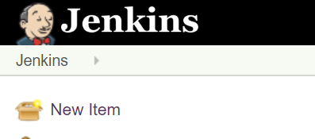
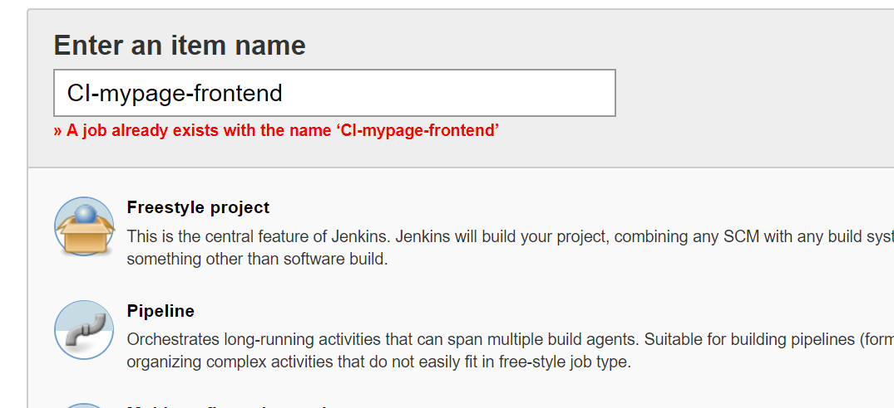
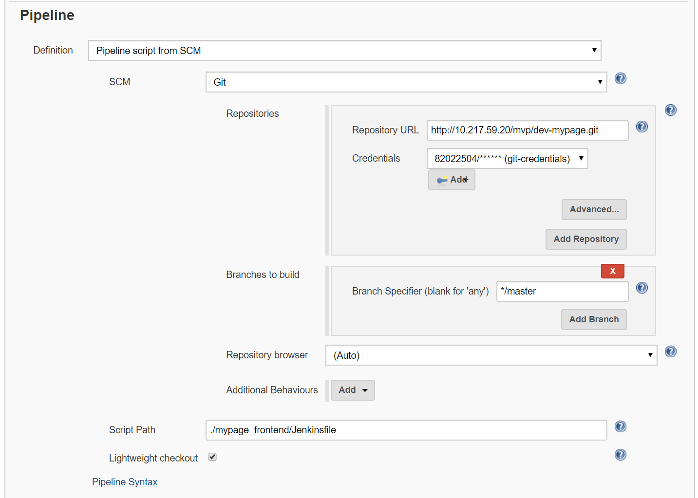

# CI (Continuous Integration)

## 사전작업

### Step 1. host 파일 수정

```sh
############### for OpenShift 장비
10.217.59.16      ktis-console.container.ipc.kt.com # OpenShift Console
10.217.59.20      gitlab.msa.kt.com # GitLab
```

> 구성된 장비에 따라 변경될 수 있음.

### Step 2. OpenShift Console 로그인

​	

> 부여받은 Username, Password로 로그인

### Step 3. Jenkins 화면

- host 파일 등록 작업

>  **위 route 정보의 HOST/PORT 주소를 host 파일에 등록 필수!!**

```sh
############### for jenkins browser 접속
10.217.59.30      jenkins-demo-emoket-emoket.container.ipc.kt.com
```


- OpenShift 계정으로 로그인

  > 부여 받은 계정으로 로그인

  

- Jenkins 메인 화면 확인

  > 정상적으로 로그인 시 Jenkins 메인 화면을 볼 수 있다.

  


### Step 4. Jenkins job 구성

> 참조 프로젝트 http://gitlab.msa.kt.com/devops/devopsjava 
> http://gitlab.msa.kt.com/mvp/dev-mypage.git

- Jenkins Job생성 
  
  Jenkins : New Item을 클릭한다.
  
  
  
  잡명을 입력하고 pipeline을 선택한후 잡을 생성 한다.
  
  

- Pipeline 구성

  pipeline definition을 `Pipeline script from SCM `을 선택한다.
 
  Repository URL에 gitlab프로젝트 URL을 설정한다.
 
  Credentials 에 gitlab의 계정 정보를 설정한다. 
 
  Script Path에 Jenkins파일의 위치를 상대경로로 입력 한다.
 
 

### Step 5. Jenkins File 구성

- POD 설정
  - Jenkins는 배포 수행시 Slave로 배포를 수행할 Pod를 띄워 배포를 수행한다.
  - Jenkins Master와 Slave간에 통신을 하려면 기본적으로 jnlp(java network launch protocol)노드를 띄워야 한다.
  - Jenkins Build잡을 수행할 POD를 설정 한다.
  - Container는 사용자의 용도에 맞게 이미지를 지정해서 수행 할 수 있다.
  - Groovy포멧 혹은 yaml형식으로 사용할수 있다.
   
**Groovy 포멧**
```
podTemplate(label: label, 
containers: [
containerTemplate(name: 'ant', image: 'ktis-bastion01.container.ipc.kt.com:5000/frekele/ant', ttyEnabled: true, command: 'cat'),
containerTemplate(name: 'docker', image: 'ktis-bastion01.container.ipc.kt.com:5000/admin/docker:stable', ttyEnabled: true, command: 'cat'),
containerTemplate(name: 'kubectl', image: 'ktis-bastion01.container.ipc.kt.com:5000/lachlanevenson/k8s-kubectl:v1.8.0', command: 'cat', ttyEnabled: true),
containerTemplate(name: 'jnlp', image: 'ktis-bastion01.container.ipc.kt.com:5000/jenkins/jnlp-slave:alpine', args: '${computer.jnlpmac} ${computer.name}')
```
**yaml 포멧**

```
	kubernetes {
      label 'test-pod'
      defaultContainer 'jnlp'
      yaml """
apiVersion: v1
kind: Pod
spec:
  containers:
  - name: frontend-test
    image: centos:7
    command:
    - cat
    tty: true
  - name: backend-test
    image: centos:7
    command:
    - cat
    tty: true   
  volumes:
  - name: sharedvolume
    emptyDir: {}
    mountPath: '/opt/app/shared'
"""
```


 - pipeline.properties 설정
    설정 파일 pipeline.properties의 설정정보를 읽어와 변수에 값을 지정하여 사용한다.
		
```
def props = readProperties  file:'mypage_frontend/pipeline.properties'
def gitSrc = props['gitSrc']
def dockerRegistry = props['dockerRegistry']
def image = props['image']
def deployment = props['deployment']
def service = props['service']
def selector = props['selector']
def namespace = props['namespace'] 
```

 - Stage 구성 
   - Stage 전체 구성
     1. Get Source
     2. Static Analysis
     3. Unit Test
     4. Build Maven project
     5. Build Docker image
     6. Image Inspection
     7. Deploy to Cluster
     8. notifySuccessful/notifyFailed
  - Get Source<br/>
   git에서 원본 소스를 가져온다.
		
```
stage('Get Source') {
git url: "http://10.217.59.20/mvp/dev-mypage.git",
    credentialsId: 'git-credentials',
    branch: 'master'
    commitId = sh(script: 'git rev-parse --short HEAD', returnStdout: true).trim()
}
```
> commitId image tag명

> kubernetes pod의 이미지 변경을 위해서는 같은 이미지 명으로는 이미지가 변경 되지 않는다. 
> 항상 이전 이미지 명과 다른 uniq한 이미지 명을 사용해야 하기 때문에 git의 commitId 값을 이미지 명의 뒤에 붙힌다.
> 이미지를 가져오는 정책은 *uniq한 이미지 명*과 *imagePullPolicy: Always* 를 사용하는 것을 권고한다.

   gitlab 의 계정정보는 jenkins credential로 저장하여 전달한다.
  - Static Analysis<br/>
    _소스 정적 분석은 후에 추가할 예정 예)Sonarqube, codeprism_
  - Unit Test<br/>
    _Xunit의 UnitTest구문을 추가한다. 예)java: maven junit test 구문_
  - Build Maven project<br/>
    maven build 구문을 추가한다. 사전 설정: settings.xml 혹은 nexus repository 관련 parameter
```
        stage('maven build project') {
	       container('maven') {
	       	    dir("demo") {
     	        def mvnSettings = 'settings.xml'
      		    	sh "mvn clean install --settings ${mvnSettings}"
			}
		}
	}
```

> settings.xml 관리방법에 대해 효율적인 방법을 고민이 필요하다.
> 현재는 git 상에서 settings.xml을 관리하는 방법을 사용했다. 

  - Build Docker image<br/>
    도커 이미지를 빌드/태깅/푸쉬를 진행 한다.
	
```
	docker.withRegistry("${dockerRegistry}", 'registry-credentials') {
		  sh "docker build -t ${image}:${tag} ."
  		  sh "docker push ${image}:${tag}"
		  sh "docker tag ${image}:${tag} ${image}:latest"
		  sh "docker push ${image}:latest"
	  	}
```

    - 도커 registry 계정정보는 jenkins credential을 통해 전달 한다.

  - Image Inspection<br/>
      _도커 이미지를 검사한다. 예) VA(IBM Volunarity Advisor))_
  - Deploy to Cluster<br/>
    빌드된 이미지로 Deployment의 이미지를 변경 한다.

```
sh "kubectl -n ${namespace} set image deployment ${selector} mypage-frontend=${image}:${tag}"
sh "kubectl -n ${namespace} rollout status deployment ${selector}"
```
  - notifySuccessful/notifyFailed<br/>
    _빌드의 성공/실패시 유관자들에게 공유 한다. 추후 slack/teams/mattermost등의 솔루션과 연동이 필요하다._

