# Jenkins 설치 

## 사전작업

### Step 1. host 파일 수정

```sh
############### for OpenShift 장비
10.217.59.16      ktis-console.container.ipc.kt.com # OpenShift Console
10.217.59.20      gitlab.msa.kt.com # GitLab
```

> 구성된 장비에 따라 변경될 수 있음.

### Step 2. OpenShift Console 로그인

​	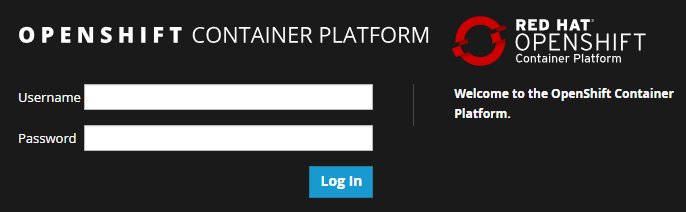

> 부여받은 Username, Password로 로그인

## Jenkins 구성

### Step 1. Catalog 선택

- Service Catalog View > **CI/CD**

  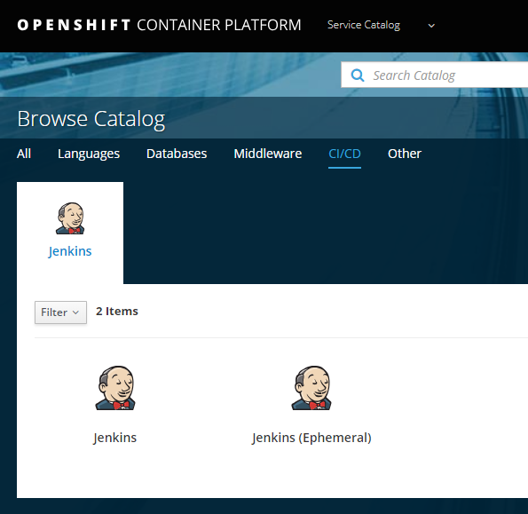

### Step 2. Jenkins 설치

- CI/CD > **Jenkins** 선택 (Not Ephemeral) > Next

  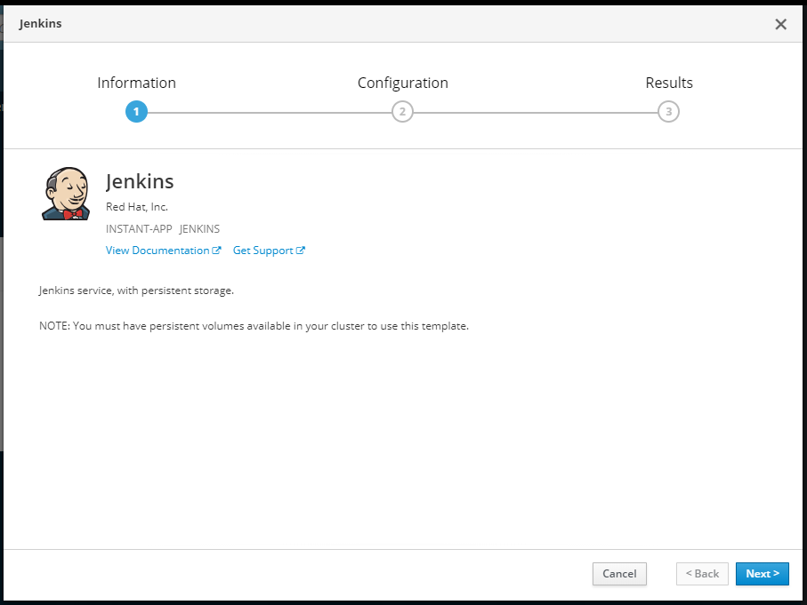

- 상세항목 설정 > Create

  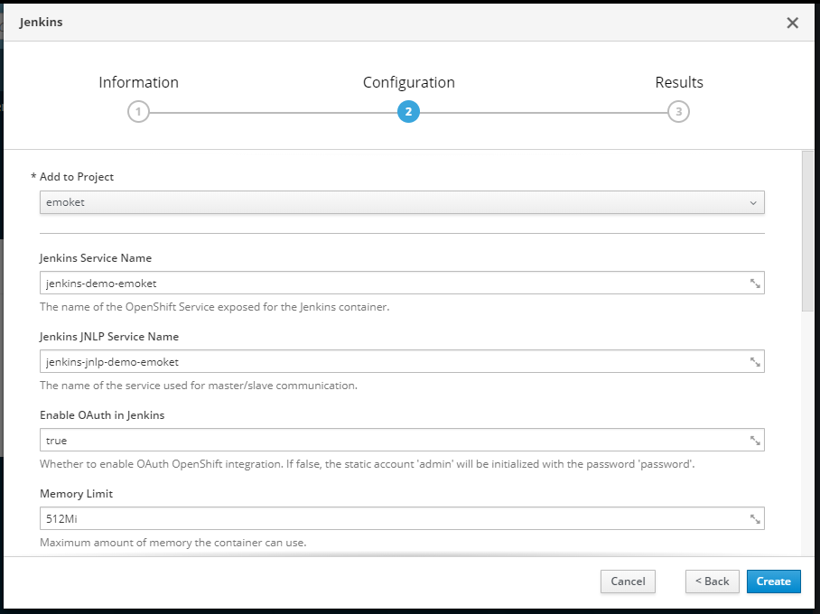

  - **Add to Project** (필수)

    > **프로젝트 namespace**를 선택 예)보험 중계 프로젝트: mmp 선택

    나머지는 Default 값으로 설정 (or 프로젝트 필요에 의해 변경 가능)

  - **PV 용량**은 가급적 **`10Gi` 이상**으로 선택

- Jenkins 설치 성공

  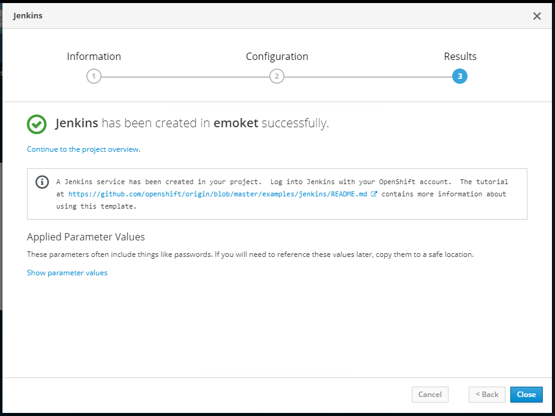

### Step 3. PV 생성

> OpenShift의 Service Catalog를 통해 Jenkins를 설치하면 Kubernetes 상에서 바로 구동 가능하도록  대부분의 Kubernetes 객체들이 생성이 된다.
>
> 단, Persistent Volume은 생성되지 않기 때문에 추가로 설정해 줘야 한다.

- Cluster Console View로 전환

  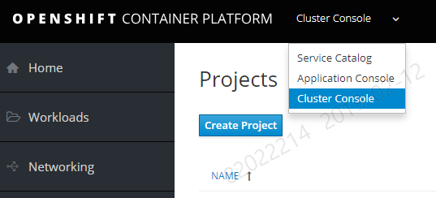

- 좌측 메뉴 > Storage > Persistent Volume Claims 확인

  Jenkins 설치 시 자동으로 만들어진 PVC를 확인할 수 있다.

  > 단, 최초 설치 시 STATUS는 아래처럼 Bound 상태는 아니다. PV 생성 후 PVC와 연결되면 Bound 상태로 변경됨.

  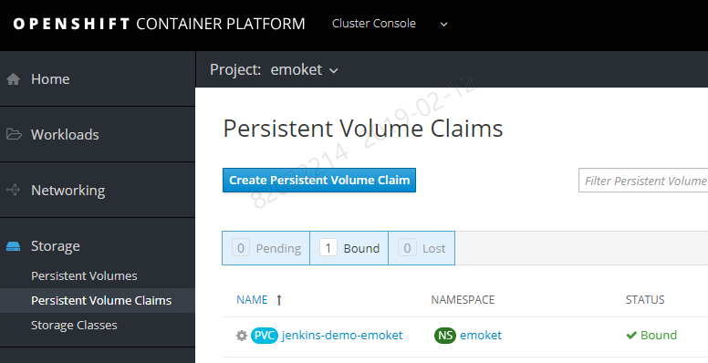

- 좌측 메뉴 > Storage > Persistent Volumes > Create Persistent Volume 선택 > (속석값 입력 후) > (하단의) Create 버튼 클릭

  > PV 를 생성하기 위한 기본 yaml 포맷을 제공해 준다. (kind: PersistentVolume)

  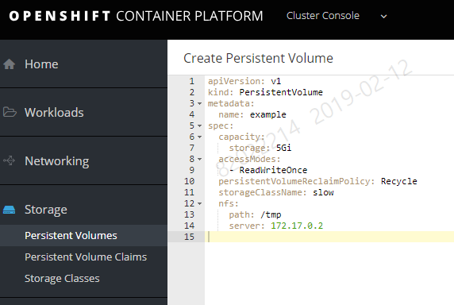

  - 아래 예시와 같이 각 속성값들을 입력한다.

    ```yaml
    apiVersion: v1
    kind: PersistentVolume
    metadata:
      name: jenkins-demo-emoket-pv # 생성될 PV의 이름으로 임의로 설정
      labels: # PVC의 labels값과 동일하게 설정(하위 항목 포함)
        app: jenkins-persistent
        template: jenkins-persistent-template
        type: jenkins-demo-emoket
    spec:
      capacity:
        storage: 10Gi # (중요) PVC에 기입된 storage 값과 동일하게 설정
      nfs: # nfs를 사용하기 위한 항목으로 nfs 서버 주소와 path를 입력
        server: ktis-nfs.container.ipc.kt.com
        path: /srv/nfs/msa/jenkins
      accessModes: # PVC에 기입된 값과 동일하게 설정
        - ReadWriteOnce
      claimRef: # (중요) PVC 참조 정보로 PVC name, namespace를 정확히 입력
        kind: PersistentVolumeClaim
        namespace: DEVOPS
        name: jenkins-demo-emoket
      persistentVolumeReclaimPolicy: Retain # Retain 값으로 변경
      storageClassName: slow
    ```

- Persistent Volume Claims 상태 확인 `Bound` 

  > PVC와 PV가 정상 연결되면 STATUS는 아래처럼 Bound 상태로 확인됨.

  

### Step 4. OpenShift Console 확인

```sh
oc get all -n {MY-NAMESPACE}

ex)
oc get all -n emoket
```

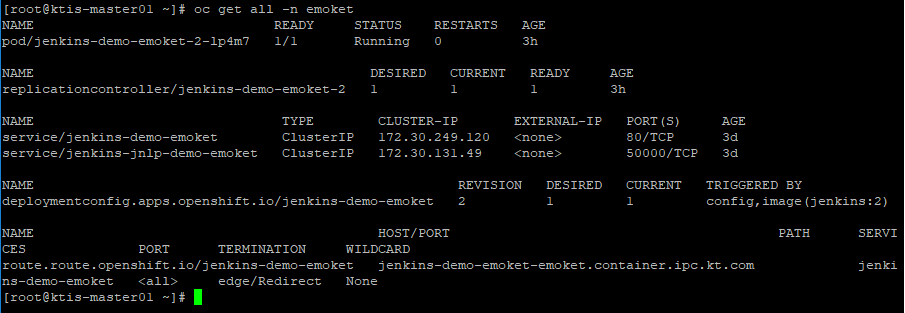

> (위 부터 순서대로)
>
> - pod 정보
> - replication controller 정보
> - service 정보
> - deployment config 정보
> - route 정보

### Step 5. Jenkins 화면

- host 파일 등록 작업

>  **위 route 정보의 HOST/PORT 주소를 host 파일에 등록 필수!!**

```sh
############### for jenkins browser 접속
10.217.59.30      jenkins-demo-emoket-emoket.container.ipc.kt.com
```

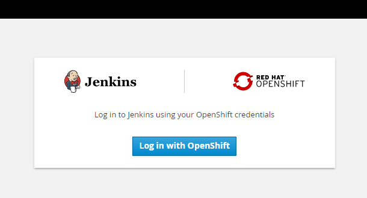

- OpenShift 계정으로 로그인

  > 부여 받은 계정으로 로그인

  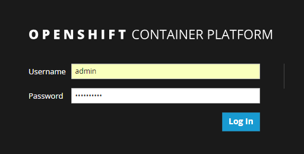

- Jenkins 메인 화면 확인

  > 정상적으로 로그인 시 Jenkins 메인 화면을 볼 수 있다.

  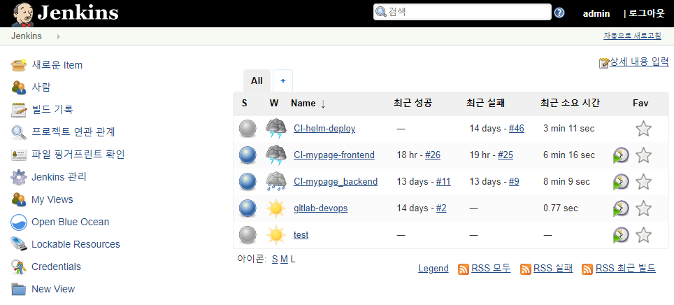

### Step 6. Jenkins 구성

- Jenkins Plugin 설정 

  Jenkins > Manage Jenkins > Plugin Manager 에서 다음 플러그인을 확인한다.

  필수 플러그인 : Pipeline Utility Steps
  유용한 플러그인 : Blue Ocean 
  
  > 초기 설치시 상위의 플러그인은 기본 설치 되어 있다.
  
  
  
- Jenkins 전역 시스템 설정 
Jenkins > Manage Jenkins > Configure System 에서 아래와 같이 설정을 진행한다.

  - Jenkins Location 설정
  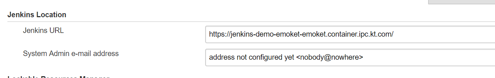
  **Jenkins Location** 에 Jenkins Router의 정보를  입력한다.
  
  - Pipeline Model Definition 설정
  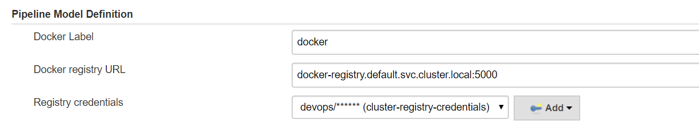  
  **Pipeline Model Definition** 에 cluster docker registry 정보를 입력한다.
  Credential은 `Add`버튼 클릭 후 아래와 같이 cluster docker login id/password를 입력 한다.
  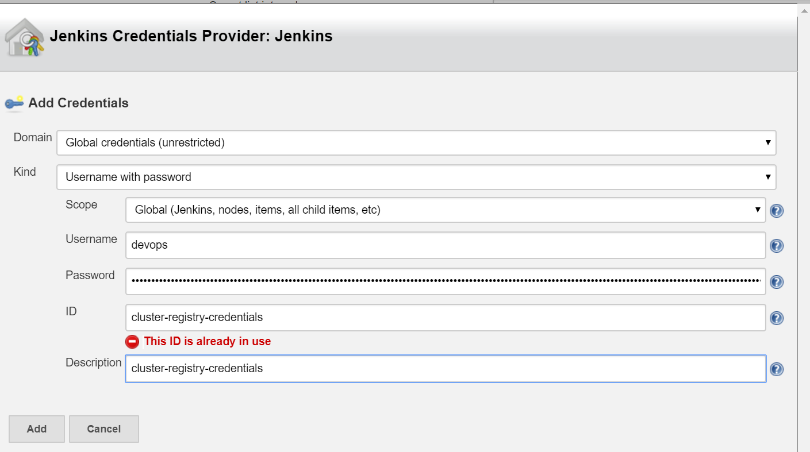
  Cluster Docker login token정보는 Openshift console Secret을 통해 확인할 수 있다.
   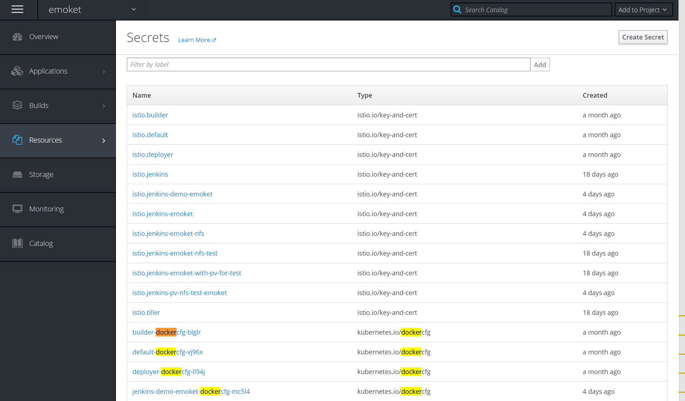
   여기서는 default-docker-cfg 정보를 사용한다.
   default-docker-cfg를 틀릭한다음에 `reveal Secret`버튼을 누르면 토큰 정보를 확인할 수 있다.
   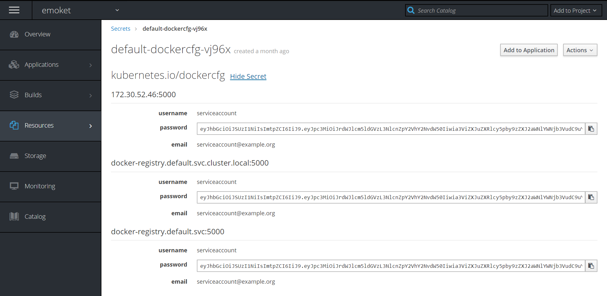
   >Jenkins의 credential은 id/password정보를 저장하는 방법으로 pipeline등에서 추후에 사용이 가능하다.
   >
   > cluster docker registry는 openshift에 있는 서비스 명으로 입력하면 되나, 
   > 현재 알수 없는 이슈로 상기와 같이 {svc명}.cluster.local 을 입력해야 정상 접속 됨
   > 추후, 이슈 해결시 {svc명}으로 변경할 예정임

  - Cloud 설정 
   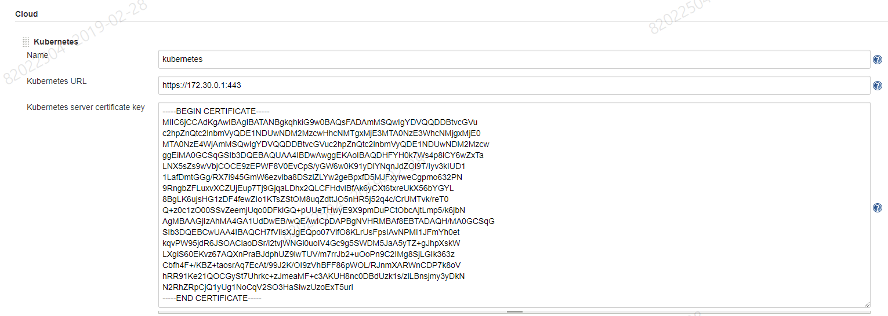
  
  Cluster > Kubernetes > name 을 *kubernetes*로 지정한다.
  
  > Jenkins 빌드 과정에서 kubernetes 로 명명된 환경을 찾는 것으로 보여지며
  > 이름이 다를 경우 
  > **ERROR: Cloud does not exist: kubernetes** 와 같은 에러가 발생 한다.


- Jenkins 권한 설정
 Jenkins Role Binding 
  - Jenkins 권한은 별도의 service account 미지정시 {project namespace}:default를 사용한다.
