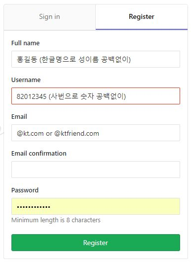

# Millet TF gitLab 사용자 계정 등록 방법

### 방화벽 작업

http://10.217.59.20:80

### hosts 파일 등록

10.217.59.20      gitlab.msa.kt.com

### 사용자 등록

- Full name: 본인 이름
- Username: 사번
- Email: *@kt.com, *@ktfriend.com
- Password: 8자리 이상

### 사용자 Confirm

#### (AS_IS) 1일 2회 관리자가 확인 후 수동 Confirm 처리

- Full name, Username, Email 이메일 정보 이상 시 Delete 처리

#### (TO_BE) 사내 메일 서버 연동 후 Confirm 메일 확인 후 자동 등록 처리

- Full name, Username 정보 이상 시 Delete 처리

### 기 등록자 변경 가이드

- Full name, Email 정보는 User Settings-Profile-Main Settings에서 변경 가능하다.
- Username의 경우 Admin만이 가능하다.