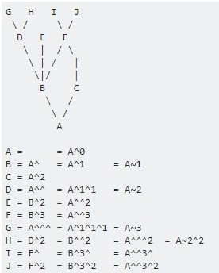

# git 주요 Command


### git 설정과 초기화

- 전역 설정 정보 조회

```bash
git config --global --list
```


- 저장소 별 설정 정보 조회

```bash
git config --list
```


- 저장소 사용자명과 이메일 정보 설정하기

```bash
git config --global user.name 82023121
git config --global user.email herasoo@kt.com
```


- windows  경우 mac과 협업 시

```bash
git config --global core.autocrlf true
git config --global core.safecrlf false
```


- mac 경우 window와 협업 시

```bash
git config --global core.autocrlf true input
git config --global core.safecrlf false
```


- git 저장소 초기화

```bash
git init # 현재 디렉토리에 .git 디렉토리를 만든다.
git init test # 현재 디렉토리에 test라는 디렉토리를 만들고 그 안에 .git 디렉토리를 만든다.
```


- 기 존재하는 git 저장소 복제

```bash
git clone http://gitlab.msa.kt.com/coe-istio-master/msa-bunker.git
```

이 경우 현재 디렉토리에 `msa-bunker`라는 디렉토리를 만들고 그 안에 .git 디렉토리를 만든다.


- Windows 자격 증명 관리자 초기화

```bash
git credential-manager uninstall
```


- git 저장소 삭제
  - git 저장소 내 .git 파일 삭제


### git 저장소 구성 요소

*아래 3가지 구성 요소를 합쳐 Local 저장소(working tree)라고 한다.*

- Working Directory

> 워킹 디렉토리는 실제 파일로 존재한다.
>
> 나머지 Index, HEAD의 경우 효율적인 형태로 .git 디렉토리에 있어 사람이 알아보기 어렵다.

- Index (Staging Area)

> Index는 **바로 다음에 커밋할** 것들이다. 

- HEAD

> HEAD는 현재 브랜치를 가리키는 포인터이며, 브랜치에 담긴 커밋 중 가장 마지막 커밋을 가리킨다. 
>
> 지금의 HEAD가 가리키는 커밋은 바로 다음 커밋의 부모가 된다.
>
> 단순하게 생각하면 HEAD는 *로컬 저장소 내 현재 브랜치의 마지막 커밋 스냅샷*이다.
>
> 커밋한적이 없다면 HEAD 정보는 없다.


### git 기본 사용법

- git status

```bash
git status # Show the working tree status
```


- 파일 추가(to stage)

```bash
git add work.txt
git add . # git add * # 해당 directory 내 모두 add
```

- 파일 삭제(to unstage)

```bash
git rm --cached work.txt  # --cached: only remove from the index
git rm --cached -r . # 해당 directory 내 모두
# 또는 커밋 버전이 존재하면
git reset HEAD~ work.txt # git reset --mixed HEAD work.txt
```

- git commit

```bash
git commit -m '커밋 메시지'
git commit -am '커밋 메시지'  # -a: all changed files commit으로 add 과정을 포함한다.
git commit -m '커밋 메시지2' --amend # 마지막 커밋 버전으로 메시지 수정하기. 잦은 수정, 커밋에 따른 History를 명료하게 하기 위함이다.
```


- git reset: `Reset current HEAD to the specified state`

>  `checkout` 명령처럼 HEAD가 가리키는 브랜치를 바꾸지는 않는다. HEAD는 계속 현재 브랜치를 가리키고 있고, 현재 브랜치가 가리키는 커밋을 바꾼다. HEAD가 `master` 브랜치를 가리키고 있다면(즉 `master` 브랜치를 checkout 하고 작업하고 있다면) `git reset 9e5e6a4` 명령은 `master` 브랜치가 `9e5e6a4`를 가리키게 한다.

3단계 Type의 reset이 존재한다.

1.  `git reset --soft HEAD~` HEAD의 커밋 버전 HEAD-1을 가리킨다. 즉 커밋 이전 상태로 되돌이킨다.
2.  `git reset --mixed HEAD~`  `git reset HEAD~`HEAD의 커밋 버전 HEAD-1을 가리키고 Index의 상태 또한 커밋 버전 HEAD-1을 가리키도록 되돌이킨다. 즉 add 이전 상태로 되돌이킨다.
3.  `git reset --hard HEAD~`  HEAD의 커밋 버전 HEAD-1을 가리키고 Index의 상태  및  Working Directory까지 HEAD-1 커밋 버전으로 가리켜 되돌이킨다.


```bash
git reset work.text # git reset --mixed HEAD work.txt
# git reset --hard HEAD work.txt # fatal: Cannot do hard reset with paths. 동작 안함
```

> `reset` 명령을 실행할 때 파일 경로를 줄 수도 있다.  HEAD는 포인터인데 경로에 따라 파일별로 기준이 되는 커밋을 부분적으로 적용하는 건 불가능하다. 하지만, Index나 워킹 디렉토리는 일부분만 갱신할 수 있다. 따라서 2, 3단계는 가능하다. (git bash 경우 2단계만 가능하다.)


```bash
# 특정 버전으로 Rollback 하기 (사용주의)
# HEAD, Index, Working Dir을 특정 버전으로 돌리고 remote origin에 반영하기
# Remote의 protected branch 설정에 따라 push 시 Maintainer 권한이 필요하다
git reset --hard HEAD~
git push --force origin master
```


- git checkout:  `Switch branches or restore working tree files`

```bash
git checkout dev
git checkout -b dev master  # master branch로 부터 dev branch를 생성하고 checkout
```

>  HEAD는 현재 브랜치를 가리키는 포인터라고 설명을 했는데 바로 HEAD가 바라보고 있는 브랜치 정보 자체를 바꾸는 것이다.  Workding Directory와 Index는 checkout 한 브랜치의 파일 목록과 파일 내용으로 채워진다.


```bash
git checkout HEAD work.txt
# git reset --hard HEAD work.txt # 동일한 효과
# git checkout -- work.txt # 동일한 효과, 작업 폴더의 변경 사항을 버리기
```

> `checkout` 명령을 실행할 때 파일 경로를 줄 수도 있다. `reset` 명령과 비슷하게 HEAD는 움직이지 않는다. 
>
> Index의 내용이 해당 커밋 버전으로 변경될 뿐만 아니라 워킹 디렉토리의 파일도 해당 커밋 버전으로 변경된다. 다만, 이미 Index에 추가된 내용과 새로 생성한 파일은 그대로 남는다.


- git diff

커밋 간 파일 간 차이를 비교해준다.

```bash
git diff 			# Working Directory vs Index
git diff --cached	# Index vs HEAD
git diff HEAD 		# Working Directory vs HEAD
```


### git 이력 조회

- 자주 사용되는 로그 조회 ALIAS 설정

```bash
alias gl='git log --oneline --graph -20'
alias gll='git log --format=medium -20 --author=herasoo' # 내가 commit한 정보만 보기
```


- file 단위 이력 조회

```bash
git log <filename>
git log -p -5 --word-diff <filename> # file의 diff 정보 출력
```


- git rebase: ` Reapply commits on top of another base tip` 잦은 커밋으로 또는 의미없는 커밋으로 커밋 버전이 복잡하여 단순화하고 싶을 때 사용할 수 있다. (이미 커밋한 히스토리를 변경 또는 삭제)
  - -i: —interactive
  - git rebase -i [수정을 시작할 커밋의 이전 커밋]

```bash
$ gl
* f3457f5 (HEAD -> master) third commit
* 4afa25c second commit
* 1b1fd18 first commit
* 6518c22 lasted

$ git rebase -i HEAD~4
pick 6518c22 lasted
pick 1b1fd18 first commit
pick 4afa25c second commit
pick f3457f5 third commit

--------------------------------------

pick 6518c22 lasted           # use commit
pick 1b1fd18 first commit
squash 4afa25c second commit  # use commit, but meld into previous commit
pick f3457f5 third commit
# reword: use commit, but edit the commit messasge 
# drop: remove commit
--------------------------------------

# This is a combination of 2 commits.
# This is the 1st commit message:

first commit

# This is the commit message #2:

second commit

$ gl
* 37991de (HEAD -> master) third commit
* 389eaef first commit second commit
* 6518c22 lasted
```


### git 브랜치

- git branch 조회

```bash
git branch 		# 지역 브랜치
git branch -r	# 원격 브랜치
git branch -a   # 지역+원격 브랜치
```


- git branch 생성

```bash
git branch dev # git checkout dev로 이어진다.
```


- git merge

```bash
git merge dev	# 다른 브랜치 dev를 현재 브랜치(ex. master)로 합치기
```


- git branch 삭제

```bash
git branch -d dev	# dev 브랜치가 현재 브랜치(ex. master)에 merge가 된 경우 삭제한다.
git branch -D dev   # merge 여부 무관하게 삭제할 때
git push origin :dev # 원격 dev 브랜치 삭제
```


### git 원격 저장소

- git 원격 저장소 조회

```bash
git remote -v
```


- git 원격 저장소 추가

```bash
git remote add origin https://github.com/herasoo/gitTest.git
git push -u origin master  # -u: set upstream으로 설정
```


- git push

```bash
git push origin master  # 로컬 브랜치 master를 원격저장소의 동일한 이름의 원격 브랜치에 push
# git push origin master1:master2  # 로컬 브랜치 master1를 원격저장소의 원격 브랜치에 master2에 push
```


- git pull

```bash
git pull origin # origin 저장소의 변경사항을 가져와서 merge, 즉 fetch + merge 개념
# git pull
```


- git fetch

```bash
git fetch origin
# git fetch
```

pull 을 실행하면, 원격 저장소의 내용을 가져와 자동으로 병합 작업을 실행하게 됩니다. 그러나 단순히 원격 저장소의 내용을 확인만 하고 로컬 데이터와 병합은 하고 싶지 않은 경우에는 fetch 명령어를 사용할 수 있습니다. 이 때 가져온 최신 커밋 이력은 이름 없는 브랜치로 로컬에 가져오게 됩니다. *이 브랜치는 `FETCH_HEAD`의 이름으로 체크아웃 할 수도 있습니다.*원격지에 있는 변경 사항을 병합하기전 리뷰할 때 유용하다.


### git tag

단순히 특정 커밋에 대한 포인터이다. 이 포인터를 통해 특정 버전으로 소스를 돌리거나 받을 수 있다.

```bash
# 조회하기
git tag
git tag --list 'v1.4.2.*'

# tag 생성
git tag v0.1
git tag -a 'v0.1' -m 'version 0.1'
git tag v0.1 4afa25c # 특정 커밋 버전의 tag 생성

# tag 삭제
git tag -d v0.1
git push origin :/refs/tags/v0.1 # remote에 있는 tag 삭제 1
git push origin --delete v0.1 # remote에 있는 tag 삭제 2

# git tag push
git push origin v0.1
git push origin --tags # 모든 tag를 push

# checkout tags
git checkout tags/<tag_name>	# 확인만 할 때
git checkout tags/<tag_name> -b <branch_name> # 변경 작업이 필요할 때는 branch 생성 필요

```


### git 기타

- ^ (caret) and ~ (tilde)

`ref~`(`ref~1`) 은 커밋의 첫번째 부모 버전을 나타낸다. `ref~2` means the commit's first parent's first parent. `ref~3` means the commit's first parent's first parent's first parent. And so on.

`ref^` is shorthand for `ref^1` and means the commit's first parent. But where the two differ is that `ref^2` means the commit's **second parent(두번쨰 부모)**(remember, commits can have two parents when they are a merge).



