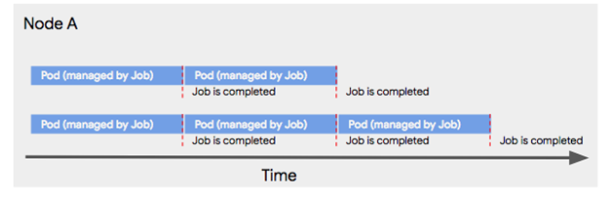

# << job & cronjob >>


### 개정이력

| 날짜       | 변경내용                  | 작성자 | 비고 |
| ---------- | ------------------------- | ------ | ---- |
| 2019.02.25 | 최초 작성                 | 송양종 |      |
| 2019.02.26 | backofflimit 외 일부 수정 | 송양종 |      |


### 1. 개념

배치와 같이 한번 실행되고 끝나는 형태의 작업을 job 이란 컨트롤러를 이용해서 수행 시킬 수 있다.

deployment 가 수행되면 아래와 같이 구성이 되는 것을 볼 수 있다.

```
Deployment > Replicaset > Pod
```

job 이나 cronjob 도 아래와 같은 구조로 pod가 실행 된다.
```
Cronjob > Job > Pod
```

그러므로 job에서 수행되는 pod 역시 job 에서 관리된다. 즉,  job 이 종료되면 pod 도 같이 종료되며, pod가 비정상 종료되는 경우에도 job 에 의해서 관리(재실행 또는 종료)된다.  job 의 성공여부는 프로세스 exit 코드(0이면 성공, 그외 실패)에 의해서 관리되는데 실패시 설정에 따라 재실행여부를 결정 할 수 있다.


### 2. job 실행

#### yaml 파일

```yaml
cat > 11.job_busybox.yaml
---
apiVersion: batch/v1
kind: Job
metadata:
  name: example
  namespace: dev-song
spec:
  #selector: {}
  template:
    metadata:
      name: pi
    spec:
      containers:
        - name: pi
          image: ktis-bastion01.container.ipc.kt.com:5000/busybox:latest
          args:
            - /bin/sh
            - '-c'
            - date; echo Hello from the Kubernetes cluster
      restartPolicy: Never
```


#### yaml file 실행 및 확인

```bash
$ kubectl -n dev-song create -f 11.job_busybox.yaml
$ kubectl -n dev-song get pod
NAME                        READY     STATUS      RESTARTS   AGE
example-9ppd2               0/1       Completed   0          14m
userlist-854857c9dd-b9v9b   2/2       Running     6          11d
```


#### 유용한 옵션들

- .spec.template.spec.restartPolicy: OnFailure
  OnFailure : 실패시 해당 파드가 재실행됨

- .spec.template.spec.restartPolicy: Never
  실패하더라도 재실행되지 않으며 새로운 파드로 실행됨.

- .spec.successfulJobsHistoryLimit: 3   (default 3)
  성공적으로 종료된 pod의 보관 갯수 이다.  
  성공적으로 종료된 pod 는 최종 3개까지만 보관한다.
  4번째 생성이되면 가장 오래된 pod 가 delete 된다.

- .spec.failedJobsHistoryLimit: 1
  실패로 종료된 pod의 보관 갯수 이다.  

- .spec.backofflimit: 2

  job 실패시 재시작 횟수이다.  2번까지 재시작 된다.

- .spec.ttlSecondsAfterFinished: 50

  job 종료이후 유지되는 pod 기간 설정(초), (k8s 1.12 버젼 이후 지원) 

- .spec.parallelism  & .spec.completions:
  만약 여러작업을 순차성 없이 병렬로 처리하기를 원한다면 parallelism 에 동시 실행할 수 있는 pod 의 수를 지정할 수 있다. 또한 completion 횟수 만큼 반복해서 실행된다. 아래 그림은 completion이 5, parallelism이 2일때, 하나의 노드에서 실행되는 파드 순서이다. 




####  job 실패인경우

- 실패인 상황을 가정하기 위해서 return -1 유발함( return 0  이 아닌경우는 실패임)

```yaml
cat > 11.job_busybox.yaml
---
apiVersion: batch/v1.12
kind: Job
metadata:
  name: example
  namespace: dev-song
spec:
  #selector: {}
  ttlSecondsAfterFinished: 50
  template:
    metadata:
      name: pi
    spec:
      containers:
        - name: pi
          image: ktis-bastion01.container.ipc.kt.com:5000/busybox:latest
          args:
            - /bin/sh
            - '-c'
            - date; echo Hello from the Kubernetes cluster; return -1
      restartPolicy: Never
```


확인
```bash
$ kubectl -n dev-song get pod
NAME                               READY     STATUS      RESTARTS   AGE
example-4hxzm                      0/1       Error       0          24s
example-qh4x8                      0/1       Error       0          14s
example-qvxlc                      0/1       Error       0          28s

# job 실패인경우 에러발생시 3개까지만 시도함.(backofflimit 으로 설정변경 가능)
```


### 3. cronjob

job 을 주기적으로 자동화 해서 실행할 필요가 있을때는 cronjob 컨트롤러로 실행한다.

job 컨트롤러에 unix cron 명령어와 같은 schedule 을 추가하여 운영할 수 있다.

```yaml
cat > 12.cronjob_busybox.yaml
---
apiVersion: batch/v1beta1
kind: CronJob
metadata:
  name: example-cronjob
  namespace: dev-song
spec:
  #schedule: '@daily'
  schedule: "*/5 * * * *"
  jobTemplate:
    spec:
      template:
        spec:
          containers:
            - name: hello
              image: ktis-bastion01.container.ipc.kt.com:5000/busybox:latest
              args:
                - /bin/sh
                - '-c'
                - date; echo Hello from the Kubernetes cluster; return 0
          restartPolicy: OnFailure
          restartPolicy: Never
```


#### cronjob 실행 및 확인


```bash
$ kubectl -n dev-song create -f 12.cronjob_busybox.yaml

$ kubectl -n dev-song get cronjob
NAME              SCHEDULE      SUSPEND   ACTIVE    LAST SCHEDULE   AGE
example-cronjob   */5 * * * *   False     0         42s             31m

$ kubectl -n dev-song get job
NAME                         DESIRED   SUCCESSFUL   AGE
example-cronjob-1551079500   1         1            10m
example-cronjob-1551079800   1         1            5m
example-cronjob-1551080100   1         1            51s

$ kubectl -n dev-song get pod
NAME                               READY     STATUS      RESTARTS   AGE
example-cronjob-1551079200-cd2qm   0/1       Completed   0          13m
example-cronjob-1551079500-6d2bf   0/1       Completed   0          8m
example-cronjob-1551079800-7prbj   0/1       Completed   0          3m

# 성공한 pod 는 3개까지만 보관한다.(.spec.successfulJobsHistoryLimit: 3)

```


#### 참고 yaml

```yaml
apiVersion: batch/v1beta1
kind: CronJob
metadata:
  name: curator
  labels:
    app: curator
spec:
  schedule: "0 1 * * *"            ← 매일 새벽1시에 수행하라.
  successfulJobsHistoryLimit: 1    ← 성공적으로 종료된 pod의 보관 갯수
  failedJobsHistoryLimit: 3        ← 실패한 pod 보관 갯수
  concurrencyPolicy: Forbid        ← 동시 작업 금지
  jobTemplate:
    spec:
...
```


