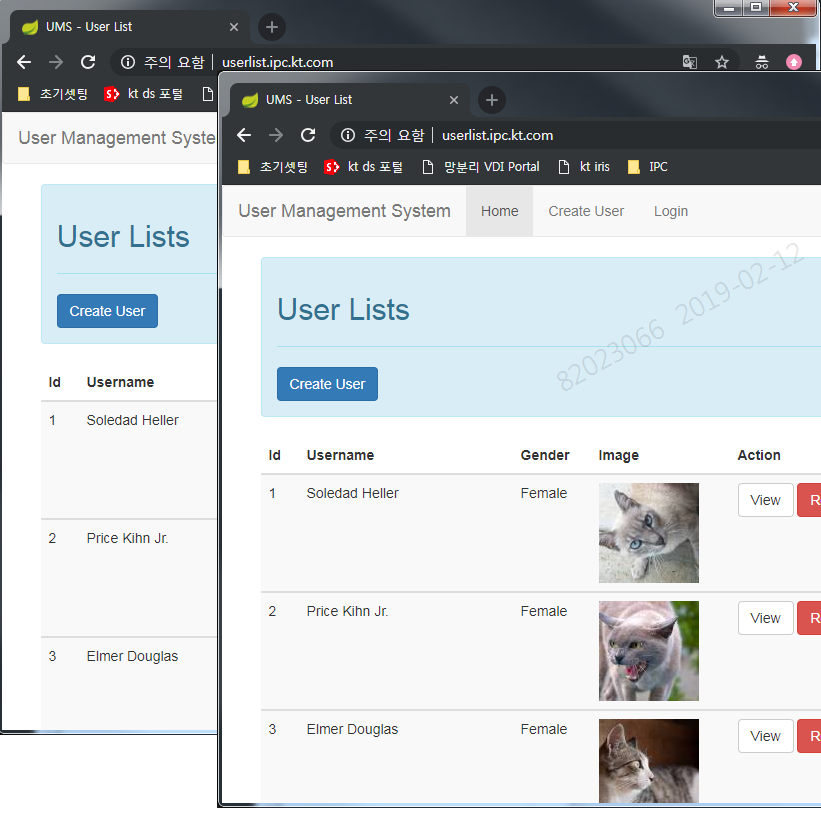
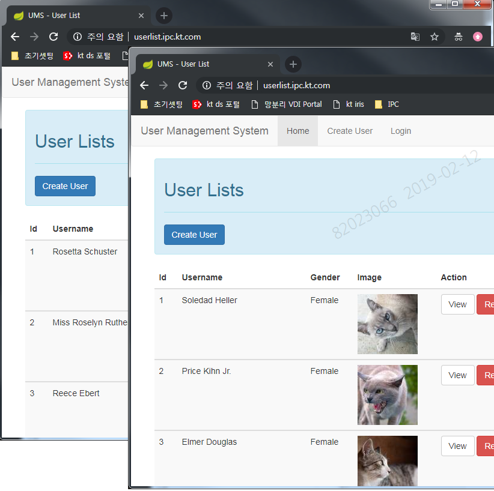

# OpenShift Route sticky/roundrobin 분석

### 개정이력

| 날짜       | 변경내용  | 작성자 | 비고 |
| ---------- | --------- | ------ | ---- |
| 2019.02.12 | 최초 작성 | 송양종 |      |
|            |           |        |      |


### 1. 분석내용요약

- non-istio 환경에서 routing 설정시 기본적으로 sticy session 임 
- yaml 파일내 설정값으로 rountrobin session 설정으로 변경 가능
- 또한 command 로도 설정 변경 가능


### 2. 테스트를 위한 yaml file 설정

#### 11.userlist-deployment.yaml

```bash
$ cd /root/song/userlist/non-istio

---
cat > 11.userlist-deployment.yaml

---
apiVersion: apps/v1
kind: Deployment
metadata:
  name: userlist
  labels:
    app: userlist
spec:
  replicas: 1
  selector:
    matchLabels:
      app: userlist
  template:
    metadata:
      labels:
        app: userlist
      #annotations:
      #  sidecar.istio.io/inject: "true"
    spec:
      containers:
      - name: userlist
        image: ktis-bastion01.container.ipc.kt.com:5000/ssongman/userlist:v1
        ports:
        - containerPort: 8181
        #readinessProbe:
        #  httpGet:
        #    path: /
        #    port: 8181
        #  #initialDelaySeconds: 5
        #  periodSeconds: 1
```


#### 12.userlist-svc.yaml
```
cat > 12.userlist-svc.yaml
---
apiVersion: v1
kind: Service
metadata:
  name: userlist-svc
spec:
  selector:
    app: userlist
  ports:
  - name: http
    protocol: TCP
    port: 80
    targetPort: 8181

```


#### 13.userlist-gateway-vs.yaml


```bash
cat > 13.userlist-gateway-vs.yaml
---
apiVersion: networking.istio.io/v1alpha3
kind: Gateway
metadata:
  name: userlist-gateway
spec:
  selector:
    istio: ingressgateway
    #app: istio-ingressgateway
  servers:
  - port:
      number: 80
      name: http
      protocol: HTTP
    hosts:
    #- "*"
    - "userlist.ipc.kt.com"
---
apiVersion: networking.istio.io/v1alpha3
kind: VirtualService
metadata:
  name: userlist-virtualserivce
spec:
  hosts:
  #- "*"
  - "userlist.ipc.kt.com"
  gateways:
  - userlist-gateway
  http:
  - match:
    - uri:
        #prefix: /
        exact: /
    route:
    - destination:
        host: userlist-svc
        port:
          number: 80
```


#### 14.userlist-route.yaml

```bash
cat > 14.userlist-route.yaml
---
apiVersion: route.openshift.io/v1
#apiVersion: v1
kind: Route
metadata:
  annotations:
    openshift.io/host.generated: 'true'

    ##### sticky session #####
    # haproxy.router.openshift.io/balance: sticky
    # haproxy.router.openshift.io/disable_cookies: 'false'

    ##### roundrobin session #####
    haproxy.router.openshift.io/balance: roundrobin
    haproxy.router.openshift.io/disable_cookies: 'true'

  labels:
  name: userlist-route
  # namespace: istio-system
spec:
  host: userlist.ipc.kt.com
  port:
    targetPort: http
  to:
    kind: Service
    # name: istio-ingressgateway
    # name: userlist-svc.dev-song.svc.cluster.local
    name: userlist-svc
    weight: 100
  wildcardPolicy: None
status:
  ingress:
    - conditions:
        - status: 'True'
          type: Admitted
      host: userlist.ipc.kt.com
      routerName: router
      wildcardPolicy: None

```


#### hosts file 수정

- master 에서 curl 명령 테스트를 위해 아래와 같이 url  등록

```bash
vi /etc/hosts

127.0.0.1   localhost localhost.localdomain localhost4 localhost4.localdomain4
::1         localhost localhost.localdomain localhost6 localhost6.localdomain6
10.217.59.16 jenkins-devops.kt.com
10.217.59.20 gitlab.msa.kt.com
10.217.59.20 gitlab.msa.kt.com
10.217.59.33 mypage2.ipc.kt.com
10.217.59.30 userlist.ipc.kt.com     <-- 추가
```


### 3. 실행 테스트

#### 기본 실행 명령

```bash
cat > readme.txt
---
#### istio-system ####
alias oi='oc -nistio-system'

#### dev-song ####
alias os='oc -ndev-song'

os create -f 11.userlist-deployment.yaml
os create -f 12.userlist-svc.yaml
os create -f 13.userlist-gateway-vs.yaml
os create -f 14.userlist-route.yaml

os delete -f 11.userlist-deployment.yaml
os delete -f 12.userlist-service.yaml
os delete -f 13.userlist-gateway-vs.yaml
os delete -f 14.userlist-route.yaml

os apply -f 11.userlist-deployment.yaml
os apply -f 12.userlist-service.yaml
os apply -f 13.userlist-gateway-vs.yaml
os apply -f 14.userlist-route.yaml

# service test
curl userlist-svc.dev-song.svc.cluster.local/users/1
while true; do curl userlist-svc.dev-song.svc.cluster.local/users/1; echo ""; sleep 1; done

# routing test
curl userlist.ipc.kt.com/users/1
while true; do curl userlist.ipc.kt.com/users/1; echo ""; sleep 1; done
```


#### 설정 변경 테스트 - yaml 파일 

- scale out 
  - replicas =2 로 설정 변경
- route yaml file내의 annotations 부분에서의 설정으로 session 설정 테스트
```bash
metadata:
  annotations:
    openshift.io/host.generated: 'true'

    ##### sticky session #####
    # haproxy.router.openshift.io/balance: sticky
    # haproxy.router.openshift.io/disable_cookies: 'false'

    ##### roundrobin session #####
    haproxy.router.openshift.io/balance: roundrobin
    haproxy.router.openshift.io/disable_cookies: 'true'
```

- 위 부분 변경후 apply 테스트 -- 이상없이 잘 변경 됨.
  - sticky session test 결과



  - roundrobin session test 결과




#### 설정 변경 테스트 - command 

```bash
##### sticky session
os annotate routes userlist-route haproxy.router.openshift.io/disable_cookies='false'
os annotate routes userlist-route haproxy.router.openshift.io/balance='sticky'

##### roundrobin session
os annotate routes userlist-route haproxy.router.openshift.io/disable_cookies='true'
os annotate routes userlist-route haproxy.router.openshift.io/balance='roundrobin'

```

- 테스트 완료


