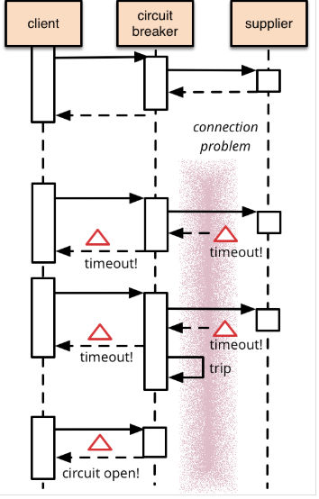

# 트래픽 장애 제어 가이드


 ### 개요



컨테이너 클러스터 환경에서 어플리케이션은 Micro Services 간에 트래픽이 자주 발생한다. (기존 VM 장비의 WAS 인스턴스에서 여러가지 서비스가 monolic하게 동작하였던 것과 비교하여 보자.) 위 그림을 예시로 supplier 서버에 장애가 생겨 항상 Timeout이 발생하는 경우, supplier 서버를 호출한 client 서버는 Timeout이 발생할 때까지 응답이 밀리게 된다. 응답이 밀리는 동안 요청이 계속 쌓여 결국 client 서버까지 요청이 과하게 밀려 장애가 발생할 수 있다. 이러한 상황에 circuit breaker를 두어 장애 전파를 막을 수 있다.

Micro Service Architecture에서 Micro Services간 트래픽이 많고 트래픽에 대한 관리가 중요하다. circuit breaker를 두어 Micro Services간 장애 전파 방지를 할 수 있다. 그러나  circuit breaker를 실제 적용함에 있어 쓰레드 개수 및 세마포어 사용여부, 캐싱 여부 등에 따라 성능 최적화 작업에 주의해야 한다.


### Spring boot

#### dependency 추가

```xml
<properties>
    <spring-cloud.version>Greenwich.SR1</spring-cloud.version>
</properties>

<dependencies>
    <dependency>
        <groupId>org.springframework.cloud</groupId>
        <artifactId>spring-cloud-starter-netflix-hystrix</artifactId>
    </dependency>
</dependencies>

<dependencyManagement>
    <dependencies>
        <dependency>
            <groupId>org.springframework.cloud</groupId>
            <artifactId>spring-cloud-dependencies</artifactId>
            <version>${spring-cloud.version}</version>
            <type>pom</type>
            <scope>import</scope>
        </dependency>
    </dependencies>
</dependencyManagement>
```


#### java main() 클래스 설정

@EnableCircuitBreaker 클래스 annotation

```java
@SpringBootApplication
@EnableCircuitBreaker
public class Svc1Application {

	public static void main(String[] args) {
		SpringApplication.run(Svc1Application.class, args);
	}
	
	
	@Bean
	public RestTemplate restTemplate() {
		
		HttpComponentsClientHttpRequestFactory httpComponentsClientHttpRequestFactory = new HttpComponentsClientHttpRequestFactory();
		
		// default timeout setting
		httpComponentsClientHttpRequestFactory.setReadTimeout(1000*10);
		httpComponentsClientHttpRequestFactory.setConnectTimeout(1000*3);
		
		return new RestTemplate(httpComponentsClientHttpRequestFactory);
	}
}
```


#### application.yaml 추가 (default 전역 설정)

```yaml
hystrix:
  command:
    default:
      execution.isolation.thread.timeoutInMilliseconds: 5000
      metrics.rollingStats.timeInMilliseconds: 10000
      circuitBreaker.requestVolumeThreshold: 20
      circuitBreaker.errorThresholdPercentage: 50
      circuitBreaker.sleepWindowInMilliseconds: 5000
  threadpool:
    default:
      coreSize: 10
```

- execution.isolation.thread.timeoutInMilliseconds

Hystrix 가 적용된 메서드의 타임아웃을 지정한다. 이 타임아웃 내에 메서드가 완료되지못하면 서킷브레이커가 닫혀있다고 하더라도 fallback 메서드가 호출된다. 보통 외부 API 를 호출하게되면 RestTemplate 과 같은 http client에도 connect, read timeout 등을 지정하게하는데 hystrix timeout은 이를 포함하고 여유를 좀 더 두어 잡는다. 기본값은 1초(1000)

- metrics.rollingStats.timeInMilliseconds

서킷 브레이커가 열리기위한 조건을 체크할 시간이다. 아래에서 살펴볼 몇가지 조건들과 함께 조건을 정의하게되는데 "10초간 20건의 호출 중 50% 실패하면 서킷 브레이커 발동" 이라는 조건이 정의되어있다면 여기서 10초를 맡는다. 기본값은 10초(10000)

- circuitBreaker.requestVolumeThreshold

서킷 브레이커가 열리기 위한 최소 요청조건이다. 즉 이 값이 20으로 설정되어있다면 10초간 19개의 요청이 들어와서 19개가 전부 실패하더라도 서킷 브레이커는 열리지않는다. 기본값은 20

- circuitBreaker.errorThresholdPercentage

서킷 브레이커가 발동할 에러 퍼센트를 지정한다. 기본값은 50

- circuitBreaker.sleepWindowInMilliseconds

서킷 브레이커가 열렸을때 얼마나 지속될지를 설정한다. 기본값은 5초(5000). 회로가 열린 동안, 모든 요청에 대해서 fallback method을 바로 실행한다.  지정된 시간이 지난 후 하나의 요청을 원래 method로 실행(`HALF OPEN`). 이 요청이 실패한다면 `OPEN`으로 두고, 이 요청이 성공한다면 `CLOSED`로 상태를 변경한다.

- coreSize

circuitBreaker 동작 방식에는 Thread 방식과 Semaphore 방식이 있다. Thread 를 이용할 경우 ThreadPool 개수, core size를 지정하는 속성이다. Netflix에서는 특별한 케이스가 아닌 이상 Thread 방식을 권장한다.(디폴트 설정도 Thread 방식이다.) 기본값은 10


#### java method 설정

@HystrixCommand를 method 단위 annotation하고 동일한 파라미터와 리턴값을 값을 갖는 fallbackMethod 를 구현한다. circuit breaker가 OPEN되면 호출되는 method이다.

```java
@PostMapping(value = "/members", consumes= {MediaType.APPLICATION_FORM_URLENCODED_VALUE,MediaType.APPLICATION_JSON_UTF8_VALUE}, produces = MediaType.APPLICATION_JSON_UTF8_VALUE)
@HystrixCommand(fallbackMethod = "createMemberFallback",
					commandProperties = {@HystrixProperty(name = "execution.isolation.thread.timeoutInMilliseconds", value = "3000")
										,@HystrixProperty(name = "metrics.rollingStats.timeInMilliseconds", value = "10000")
										,@HystrixProperty(name = "circuitBreaker.requestVolumeThreshold", value = "20")
										,@HystrixProperty(name = "circuitBreaker.errorThresholdPercentage", value = "50")
										,@HystrixProperty(name = "circuitBreaker.sleepWindowInMilliseconds", value = "5000")
					},
					threadPoolProperties = {@HystrixProperty(name = "coreSize", value = "10")											
					}
	)
public ResponseEntity<Response> createMember(Request req) {

    logger.info("req => " + req.toString());

    req.setId(req.getId()+"_members");

    logger.info("# svc2 http://" + svc2Host + ":" + svc2Port + "/svc2/api/members/api2 POST 호출");

    // RestTemplate을 이용하여 svc2 서비스 Http Request 호출하기
    HttpHeaders headers = new HttpHeaders();
    headers.setContentType(MediaType.APPLICATION_JSON_UTF8);
    HttpEntity<Request> requestHttpEntity = new HttpEntity<Request>(req, headers);

    logger.info("# requestHttpEntity.getBody().toString(): " + requestHttpEntity.getBody().toString());
    logger.info("# properties - services.host.svc2: " + svc2Host);
    logger.info("# properties - services.port.svc2: " + svc2Port);

    ResponseEntity<Response> responseEntity = restTemplate.exchange("http://" + svc2Host + ":" + svc2Port + "/svc2/api/members/api2", HttpMethod.POST, requestHttpEntity, Response.class);
    logger.info("# responseEntity.getBody().toString(): " + responseEntity.getBody().toString());
    responseEntity.getBody().setResultMsg("Member(svc2) user created!!!!");

    //DB Insert
    logger.info("# createConnectionHistory");
    //sqlMapperDao.createConnectionHistory(req);

    return responseEntity;
}

public ResponseEntity<Response> createMemberFallback(Request req) { 

    logger.info("req => " + req.toString());

    req.setId(req.getId()+"_members");

    logger.info("# svc2 http://" + svc2Host + ":" + svc2Port + "/svc2/api/members/api2 POST 호출  Fallback");

    Response response = new Response();
    response.setId(req.getId());
    response.setName(req.getName());
    response.setSecurity_number(req.getSecurity_number());
    response.setResultCode("Fallback");
    response.setResultMsg("svc1=>svc2 Fallback");

    ResponseEntity<Response> responseEntity = new ResponseEntity<Response>(response, HttpStatus.OK);
    return responseEntity;
}
```

- commandKey의 default 값은 method 명이 된다.
- groupKey의 default 값은 class 명이 된다. groupKey는 commandKey의 그룹의 개념으로 단지 reporting, alerting, dashboards, or team/library ownership의 용도로 사용될 뿐이다.

- threadPoolKey의 default 값은 groupKey 값이 된다.
- commandKey, threadPoolKey에 대한 설정값이 정의되지 않았다면 default 키 설정된 값으로 동작한다.
- threadPoolKey 값은 독립된 Thread Pool 사용을 보장하며 동일 키나 정의되지 않아 default  키 사용의 경우 동일한 Thread Pool을 공유함에 주의하여야 한다.


#### java class 설정

클래스 레벨에 hystrix 설정도 가능하다.

```java
@RestController
@RequestMapping("/api/users")
@DefaultProperties(groupKey="",threadPoolKey="",commandProperties= {},threadPoolProperties= {})
public class UserApiController {
```


### Istio


