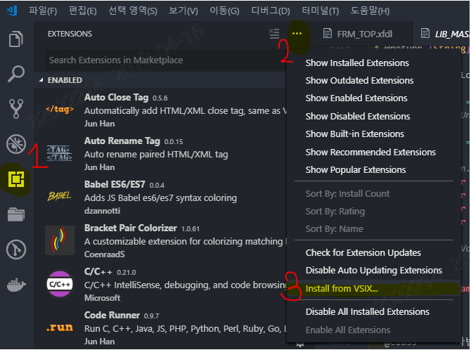
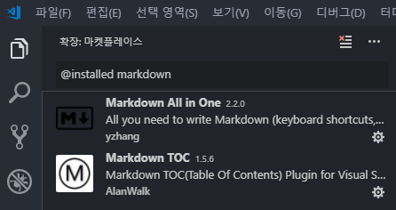
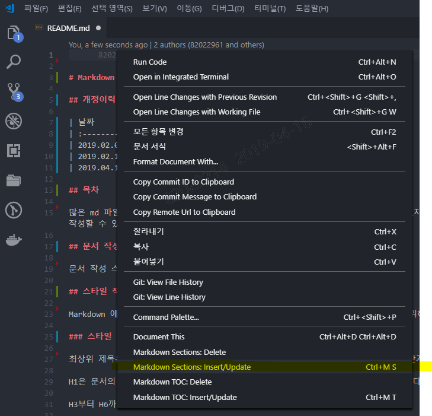
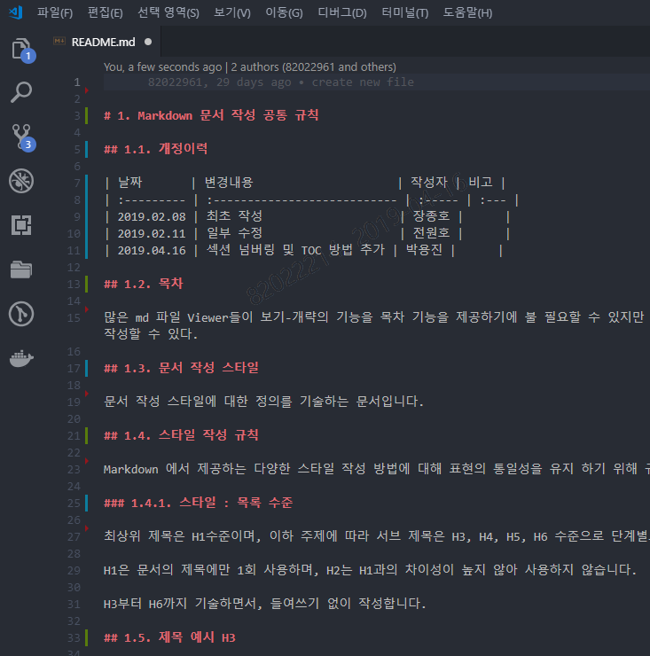
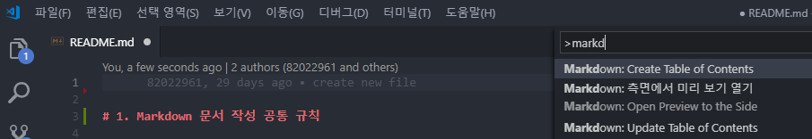
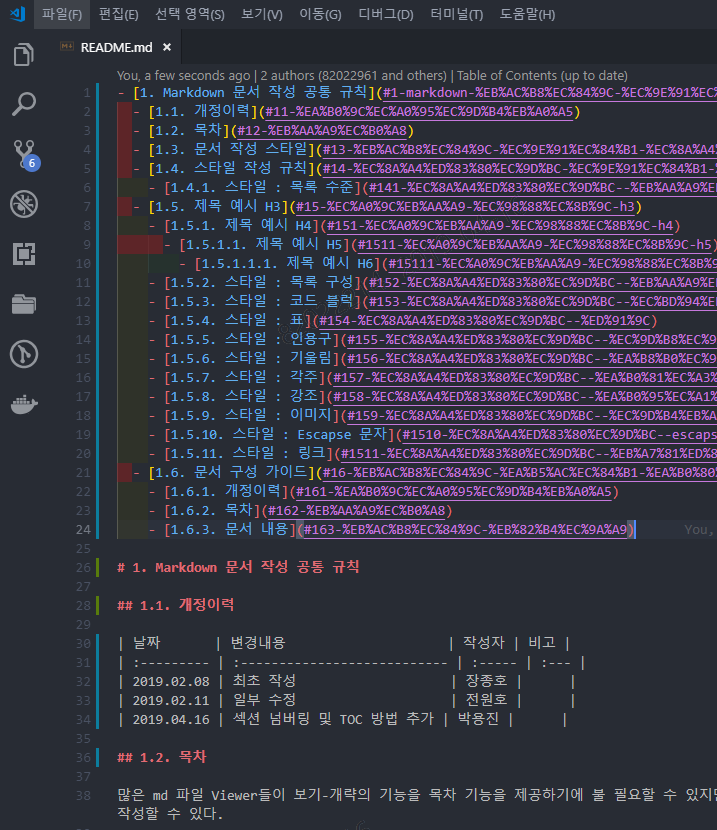
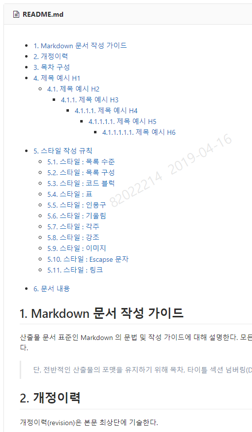
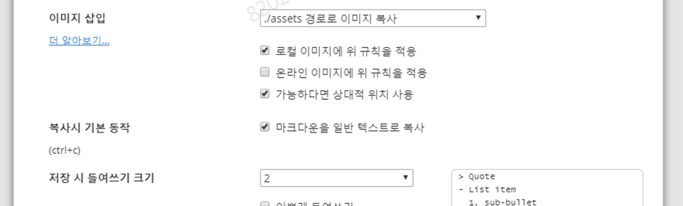

- [1. Markdown 문서 작성 가이드](#1-markdown-%EB%AC%B8%EC%84%9C-%EC%9E%91%EC%84%B1-%EA%B0%80%EC%9D%B4%EB%93%9C)
- [2. 개정이력](#2-%EA%B0%9C%EC%A0%95%EC%9D%B4%EB%A0%A5)
- [3. 목차 구성](#3-%EB%AA%A9%EC%B0%A8-%EA%B5%AC%EC%84%B1)
  - [3.1. 목차 추가 방법](#31-%EB%AA%A9%EC%B0%A8-%EC%B6%94%EA%B0%80-%EB%B0%A9%EB%B2%95)
- [4. 제목 예시 H1](#4-%EC%A0%9C%EB%AA%A9-%EC%98%88%EC%8B%9C-h1)
  - [4.1. 제목 예시 H2](#41-%EC%A0%9C%EB%AA%A9-%EC%98%88%EC%8B%9C-h2)
    - [4.1.1. 제목 예시 H3](#411-%EC%A0%9C%EB%AA%A9-%EC%98%88%EC%8B%9C-h3)
      - [4.1.1.1. 제목 예시 H4](#4111-%EC%A0%9C%EB%AA%A9-%EC%98%88%EC%8B%9C-h4)
        - [4.1.1.1.1. 제목 예시 H5](#41111-%EC%A0%9C%EB%AA%A9-%EC%98%88%EC%8B%9C-h5)
          - [4.1.1.1.1.1. 제목 예시 H6](#411111-%EC%A0%9C%EB%AA%A9-%EC%98%88%EC%8B%9C-h6)
- [5. 스타일 작성 규칙](#5-%EC%8A%A4%ED%83%80%EC%9D%BC-%EC%9E%91%EC%84%B1-%EA%B7%9C%EC%B9%99)
  - [5.1. 목록 수준](#51-%EB%AA%A9%EB%A1%9D-%EC%88%98%EC%A4%80)
  - [5.2. 목록 구성](#52-%EB%AA%A9%EB%A1%9D-%EA%B5%AC%EC%84%B1)
  - [5.3. 코드 블럭](#53-%EC%BD%94%EB%93%9C-%EB%B8%94%EB%9F%AD)
  - [5.4. 표](#54-%ED%91%9C)
  - [5.5. 인용구](#55-%EC%9D%B8%EC%9A%A9%EA%B5%AC)
  - [5.6. 기울림](#56-%EA%B8%B0%EC%9A%B8%EB%A6%BC)
  - [5.7. 각주](#57-%EA%B0%81%EC%A3%BC)
  - [5.8. 강조](#58-%EA%B0%95%EC%A1%B0)
  - [5.9. 이미지](#59-%EC%9D%B4%EB%AF%B8%EC%A7%80)
  - [5.10. Escapse 문자](#510-escapse-%EB%AC%B8%EC%9E%90)
  - [5.11. 링크](#511-%EB%A7%81%ED%81%AC)

# 1. Markdown 문서 작성 가이드

산출물 문서 표준인 Markdown 의 문법 및 작성 가이드에 대해 설명한다. 모든 가이드의 내용이 필수는 아니며, 필요에 따라 추가, 수정이 가능하다.

> 단, 전반적인 산출물의 포맷을 유지하기 위해 목차, 타이틀 섹션 넘버링(Depth), 타이틀 태그 수준은 유지도록 한다.

문장의 끝맺음은 "~하다", "~이다" 등과 같이 사용하고, 존칭 어구를 사용하지 않는다.

| O               | X             |
| --------------- | ------------- |
| ~하다           | ~합니다.      |
| ~이다           | ~입니다.      |
| ~하지 않는다. | ~하지 않습니다. |


# 2. 개정이력

개정이력(revision)은 본문 최상단에 기술한다.

날짜, 변경내용, 작성자, 비고 항목으로 주요한 변경사항에 대해 쉽게 전달 가능할 수 있는 수준에서 작성한다.

| 날짜       | 변경내용                     | 작성자 | 비고 |
| :--------- | :--------------------------- | :----- | :--- |
| 2019.02.08 | 최초 작성                    | 장종호 |      |
| 2019.02.11 | 일부 수정                    | 전원호 |      |
| 2019.04.16 | 섹션 넘버링 및 TOC 방법 추가 | 박용진 |      |

# 3. 목차 구성

목차(TOC `Table Of Contents`)는 문서 내 최상단에 기술한다. H1, H2 등 Head Tag(Ctrl + 1, 2, ...)를 기준으로 `섹션 넘버링` 을 붙이고 클릭 시 해당 섹션으로 이동할 수 있도록 `링크` 를 구성한다.

> 섹션 넘버링 및 목차는 vscode extension 기능으로 손쉽게 구성할 수 있다. (아래 추가 방법 참조)

## 3.1. 목차 추가 방법

**Step 1. vscode 설치**

- [utilities](http://gitlab.msa.kt.com/coe-istio-master/public-documents/tree/master/utilities/vscode) 폴더에서 VSCodeSetup-x64-1.33.1.exe 파일을 다운로드 받아 설치한다.
- extension 2개를 다운로드 한다.
  - yzhang.markdown-all-in-one-2.2.0.vsix
  - AlanWalk.markdown-toc-1.5.6.vsix

**Step 2. extension 설치**

- vscode extension 탭으로 가서 Install from VSIX... 메뉴를 클릭한다.



- 위 2개 extensions를 설치한다.



**Step 3. section numbering 부여**

- 마크다운 문서 작성 후 Context Menu (마우스 우클릭) > Markdown Section: Insert/Update 를 클릭한다.



- H1, H2 등의 Head Tag에 맞춰 자동 넘버링 되는 것을 확인할 수 있다.



**Step 4. TOC 생성**

- 섹션 넘버링이 끝난 상태에서 문서 최상단을 클릭 한 후, F1 (or Ctrl + Shift + P) 를 클릭하여 명령줄 도구를 연다.
- markdown create 라고 입력 시 자동 선택되는 `Markdown: Create Table of Contents` 를 클릭한다.



- 자동으로 TOC가 생성되는 것을 볼 수 있다.



Step 5. GitLab 결과 확인

- 위와 같이 TOC 적용 시 GitLab에서도 링크가 적용되는 것을 볼 수 있다.



# 4. 제목 예시 H1

문서 작성 스타일에 대한 정의를 기술하는 문서이다.

## 4.1. 제목 예시 H2

설명이 필요한 내용은 일반적인 본문 서체로 기술하며, 제목 수준에 상관없이 동일하게 기술한다.

### 4.1.1. 제목 예시 H3

설명이 필요한 내용은 일반적인 본문 서체로 기술하며, 제목 수준에 상관없이 동일하게 기술한다.

#### 4.1.1.1. 제목 예시 H4

설명이 필요한 내용은 일반적인 본문 서체로 기술하며, 제목 수준에 상관없이 동일하게 기술한다.

##### 4.1.1.1.1. 제목 예시 H5

###### 4.1.1.1.1.1. 제목 예시 H6

H5 이하 태그는 볼드체와 구분이 어렵기에 가급적 사용하지 않는다.

# 5. 스타일 작성 규칙

Markdown 에서 제공하는 다양한 스타일 작성 방법에 대해 표현의 통일성을 유지 하기 위해 규칙을 정의한다.

## 5.1. 목록 수준

최상위 제목은 H1수준이며, 이하 주제에 따라 서브 제목은 H2, H3, H4 수준으로 단계별로 정의한다.

H5, H6 태그는 볼드체와 구분이 되지 않고 문서 Depth가 깊어 사용하지 않는다.

## 5.2. 목록 구성

목록은 순서가 없는 방식 (Keyword : - ) 과 있는 방식 두 가지를 사용하며, 제목의 하위에만 존재하여 기술한다.

- 제목 없는 목록 예시 1
- 제목 없는 목록 예시 2

1. 순서 있는 목록 예시 1
2. 순서 있는 목록 예시 2

## 5.3. 코드 블럭

코드 또는 실행 커맨드 등은 코드 펜스 영역에 작성하고, 유형을 함께 지정해야 한다.

_(Keyword : ```)_

```bash
docker run -p 8080:8080 -e "SPRING_PROFILES_ACTIVE=local" -it kos-mvp/usagedata
```

## 5.4. 표

Markdown 문서에서 제공하는 표 형식에 따라 작성하시면 된다.

GitLab에서는 좌측 정렬 밖에 표시되지 않으므로 굳이 center, right로 align을 조정하지 않는다.

| Head1 | Head2 | Head3 |
| ----- | ----- | ----- |
|       |       |       |
|       |       |       |
|       |       |       |

## 5.5. 인용구

추가 설명이 필요한 경우 사용한다.

_(Keyword : >)_

> 인용구의 내용은 작성 예제이다.

## 5.6. 기울림

추가 설명이 필요한 경우 사용한다.

_(Keyword : \*keyword\*)_

_기울림 예제_

## 5.7. 각주

추가 설명이 필요한 경우 사용한다.

문서 하단 부분에 각주를 두어 단어에 대한 추가 설명 부분을 분리할 수 있다.

_\[^Keyword\]_

_[^Keyword\] : Keyword 설명_

> 저는 kt [^kos] 시스템 무선 오더 영역 개발업무를 담당하고 있다.
>
> ...
>
> 문서하단 부분에
>
> ---
>
> [^kos]: Kt One System의 약자로 kt 유무선 상품 BSS시스템

## 5.8. 강조

강조 구문에 `표현할 때 사용`합니다. **볼드체를 추가**하여 사용 가능하다.

_(Keyword : \`keyword\`)_

_(Keyword : \*\*keyword\*\*)_

## 5.9. 이미지

Markdown 에서 제공하는 이미지 테그() 형태로 기술하는 것이 규칙이다.

이미지 파일은 상대적 위치로 작성하여, 현재 문서 파일의 하위에 ".assets" 경로에 이미지 파일을 두고 사용한다.

Typora 툴을 사용하는 경우에는 아래와 같은 옵션 설정으로 쉽게 복사 붙여넣기 등을 활용하여 작성할 수 있다. 이미지 사이즈 조정은 현재 동작하지 않으니, 이미지 크기이 필요한 경우 미리 편집하여 첨부하여야 한다.



## 5.10. Escapse 문자

Markdown 내 특수문자 #, -, `,\* 등을 표기할 때 \을 앞에 붙인다.

## 5.11. 링크

\[표시문자\]\(URL\)

URL

[구글](https://www.google.com)

https://www.google.com
