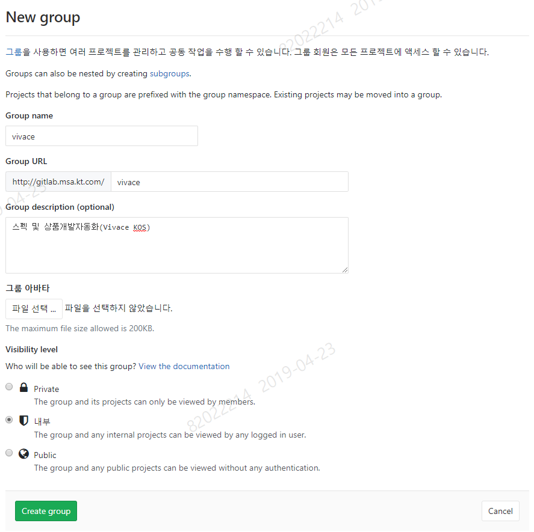
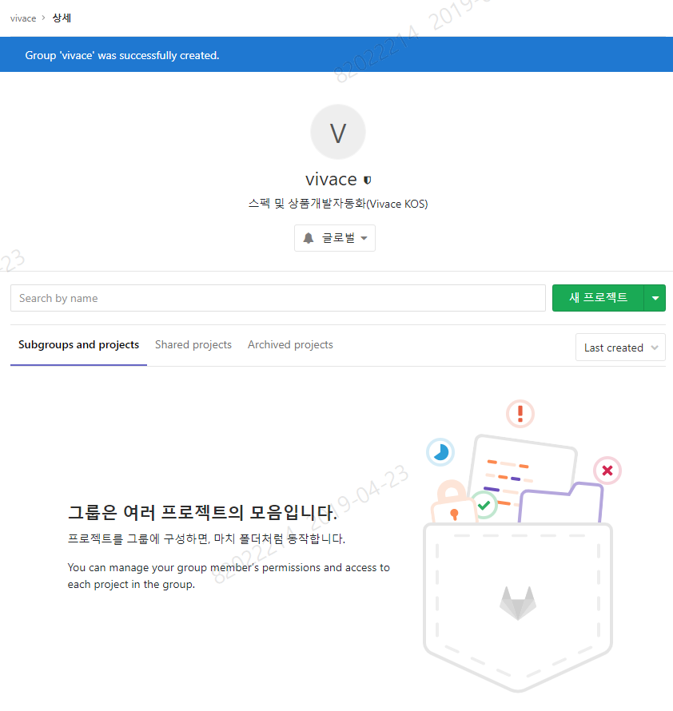
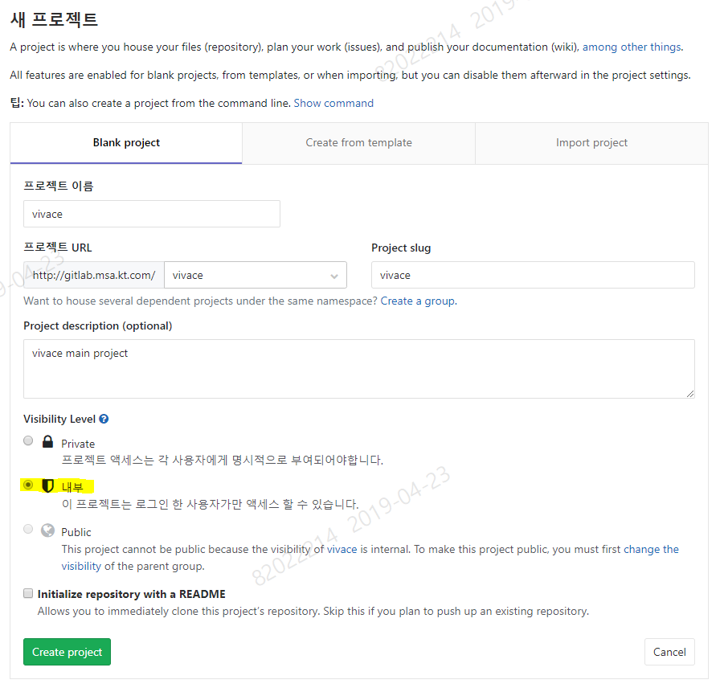
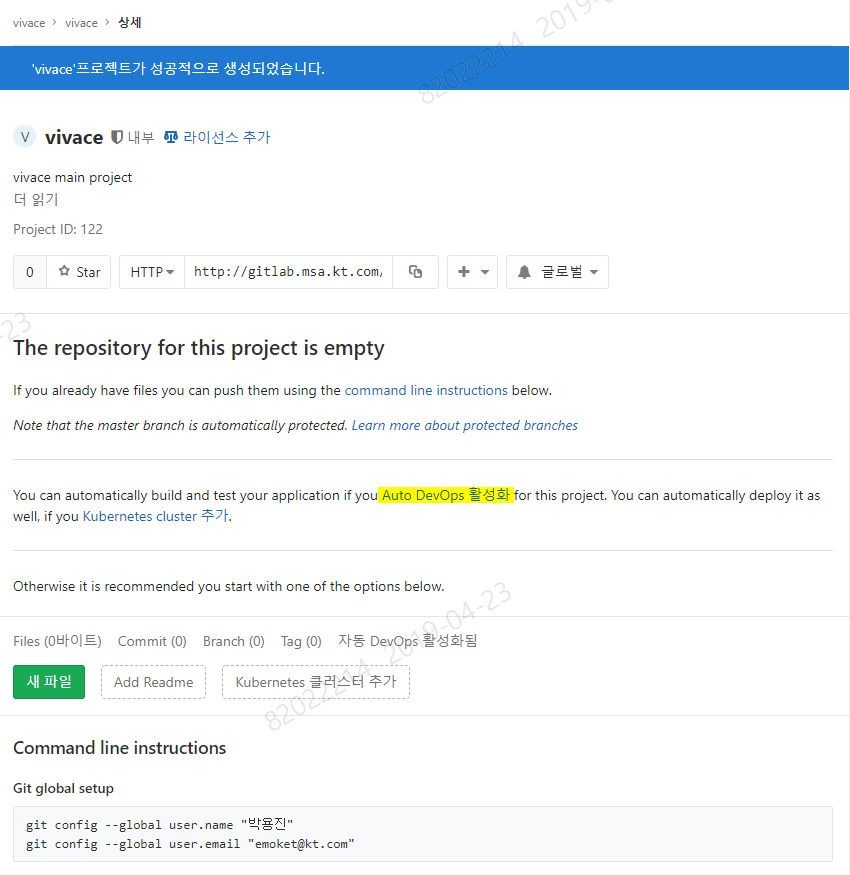
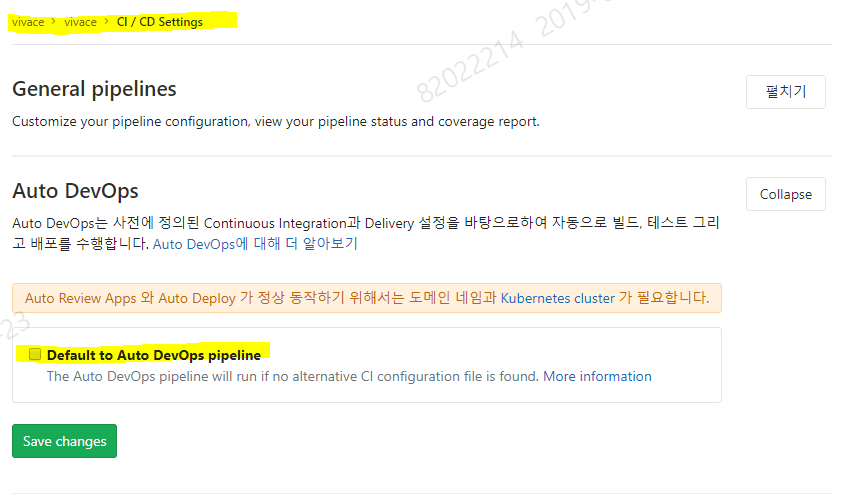
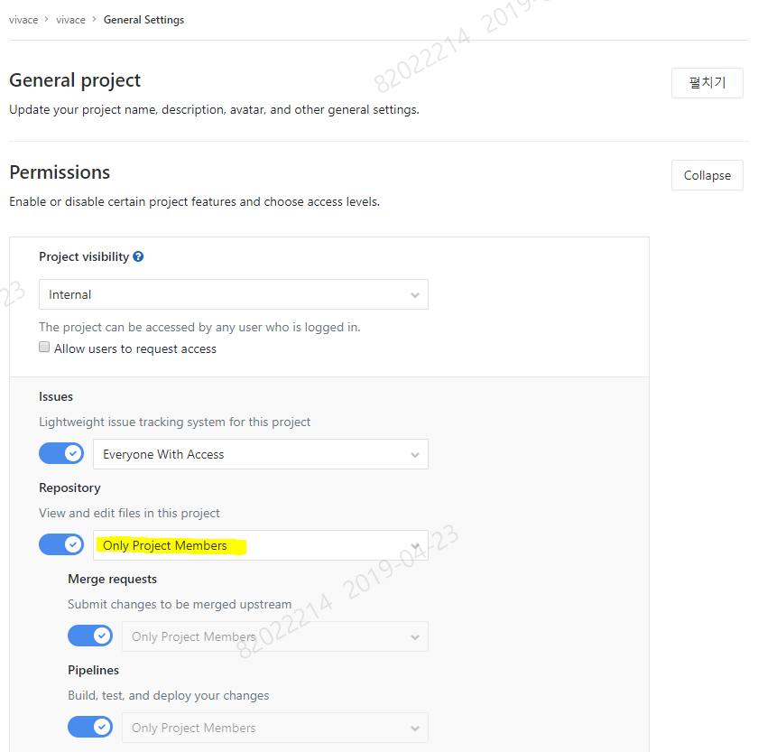
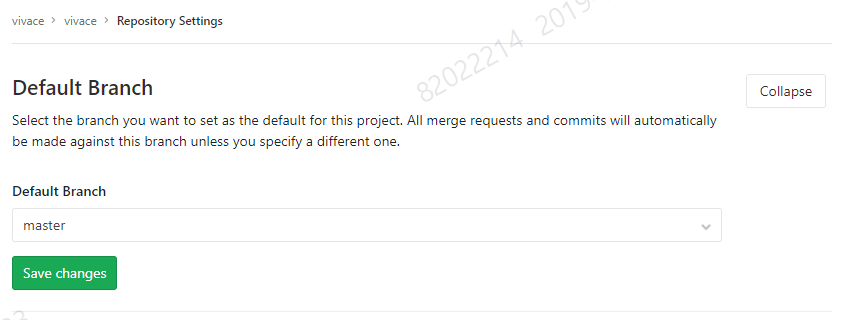
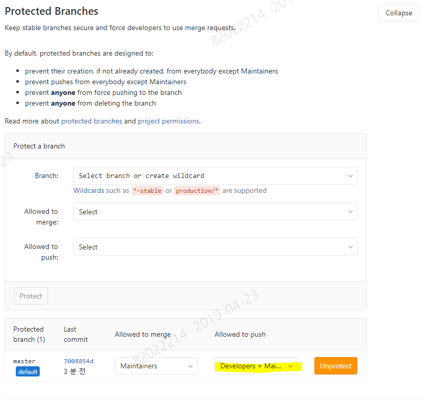
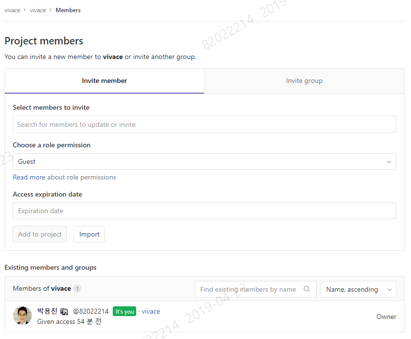

# 1. Naming 규칙

Group/Project 명은 `알파벳 소문자 + 하이픈(-)`만을 사용한다.

둘 모두 동일한 이름으로 해도 무방하다.

> ex) msa-bunker, vivace, uptown-girl, downtown-boy

# 2. Group 생성

Group 생성 시 Visiblity level을 `Internal(내부)`로 설정한다.

# 3. Project 생성

Project 생성 시  Visiblity level을 `Internal(내부)`로 설정하고, default README.md 파일을 만들고자 하면 아래 `Initialize repository with a README` 체크박스를 체크한다.

# 4. Auto DevOps 옵션 끄기

프로젝트 생성 후 `Auto DevOps 활성화` 링크를 클릭하여 GitLab 자체에 있는 CI/CD 옵션을 끈다.

`Default to Auto DevOps pipeline` 체크해제

# 5. Project Permissions 설정

# 6. Default Branch 선택

Branch는 master 하나를 유지하도록 한다.

# 7. 역할 별 Push 정책 설정

Push는 Developers + Maintainer로 설정한다.

# 8. Project Members 추가

Project 에 투입된 인력들을 역할에 맞게 추가한다.

| 구분        | 역할                                                      |
| ----------- | --------------------------------------------------------- |
| Developers  | 소스 수정 + Merge Request (MR)를 Maintainers 에게 보낸다. |
| Maintainers | Developers 역할 + MR을 수행한다.                          |

