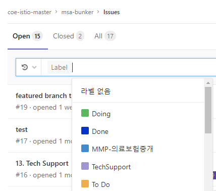

# WBS 기준 산출물이 위치합니다.

### 01. Transformation 방안 수립

### 02. Agile 방법론

### 03. Welcome pack 구성

### 04. 교육 수행 가이드 라인

### 05. 개발 구축 가이드 라인

### 06. 시스템 연동 가이드

### 07. 테스트 가이드 라인

### 08. 배포 가이드 라인

### 09. 로깅 가이드 라인

### 10. 관제 모니터링 가이드 라인

### 11. 보안 가이드 라인

### 12. 사용자 및 리소스 관리 가이드

### 13. Tech Support

### 14. Markdown 문서 작성 가이드

### 15. GitLab Project 생성 가이드

---

## Tech Support 요청 방법

Cluster 환경에서 프로젝트 수행 시 필요할 수 있는 기술적 지원이나 문의 사항(FAQ)을 관리하고, 이를 서비스로 제공할 수 있는 방법을 안내 드립니다.

기술지원(Tech Support)은 요청된 지원 이력과 조치 이력을 기록하여 유사한 프로젝트들에 도움이 되고자 하는데 목적을 두고 운영합니다.

따라서, 아래 On-line 지원 요청 사이트를 확인하여 문의 전 유사 사항을 확인하시고, 없는 경우 등록 진행을 부탁 드리겠습니다.

### 1. 접속 방법

Cluster 환경에 대한 프로젝트 별 지원이 필요한 경우 현재 접속된 Gitlab의 `Issue 관리 기능`을 활용합니다.

#### 1.1. URL

<http://gitlab.msa.kt.com/coe-istio-master/msa-bunker>

> 위 URL은 아직 DNS 서비스가 배정되지 않아, 접속하고자하는 PC의 hosts 파일에
>
> `10.217.59.20 gitlab.msa.kt.com` 을 등록하여야 합니다.

### 2. 프로젝트 Label 확인 및 생성

다양한 프로젝트로부터 요청이 들어오기 때문에 각 프로젝트를 구분할 수 있도록 `Label`을 지정합니다. `Label`은 초기 프로젝트 생성 시 함께 생성되나, 없을 경우 생성하도록 합니다.

> 2019.05 기준) Label이 자동생성을 위한 작업이 진행중입니다.
>
> 아래 사항에 따라, Label 생성을 진행해야 합니다.

#### 2.1 Label 확인

- 프로젝트 좌측 상단에 Issues -> Labels 를 선택.
- 프로젝트 명칭의 Label이 존재하는지 확인.

#### 2.2 Label 생성

- 프로젝트 명칭의 Label이 없다면, 우측 상단의 `New Label`을 선택합니다.

- Title : `단위서비스명-단위서비스한글명`
- Description : 프로젝트 설명
- Background Color : 무관

### 3. Issue 생성

기술 요청이 필요한 문의 사항을 Gitlab의 `Issue` 생성 기능으로 제공합니다. Gitlab에 접근 가능한 사용자는 소속과 대상에 관계 없이 등록하실 수 있습니다.

#### 3.1. Issue 생성

등록은 좌측의 Issues -> List를 선택하고, 우측의 `New Issue`를 선택합니다.

#### 3.2. Issue 내용

- Title : 기술지원 요청 제목
- Description : 자유 양식으로 필요한 사항을 상세하게 기술
- Assignee : Arsenal-DEV PM 김병갑 차장 또는 미지정.
- Due date : 지원 요청 최종 완료 예정일
- Milestone : 미지정.
- Labels : `프로젝트` Label, `TechSupport` Label

### 4. 진행 및 결과 확인

요청된 기술지원(Tech Support)은 다양한 방법으로 필터링 하여, 검색이 가능합니다.

키워드로 검색하거나 label, assignee 등으로 지정 필터링도 가능합니다.

#### 4.1. 진행 결과 확인

Tech Support의 진행사항을 확인하고, 해당 내용들은 `Comment`에 이력을 남겨 온라인과 오프라인 지원을 지속할 수 있습니다.

#### 4.2. 진행 종료

기술 지원이 완료된 경우 Close Issue 를 선택하여 종료 할 수 있으며 종료는 요청자, 지원자 관계 없이 가능합니다. 지원 사항이 불충분하거나, 지속된 내용이 필요할 경우 Reopen 할 수 있습니다.

