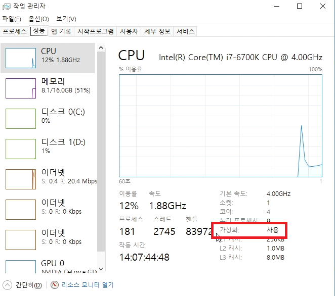
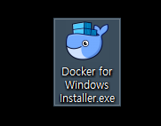
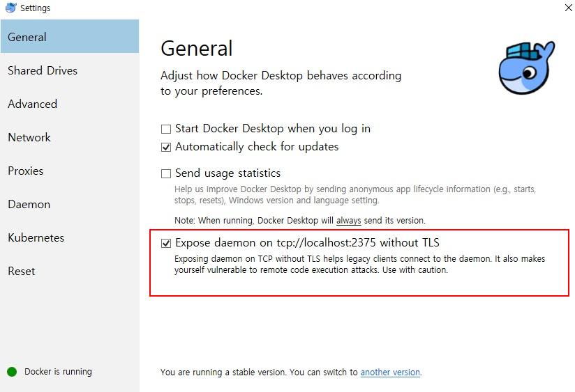
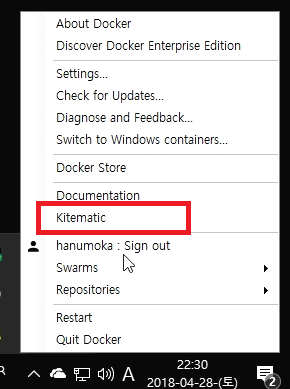
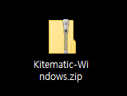
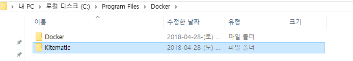
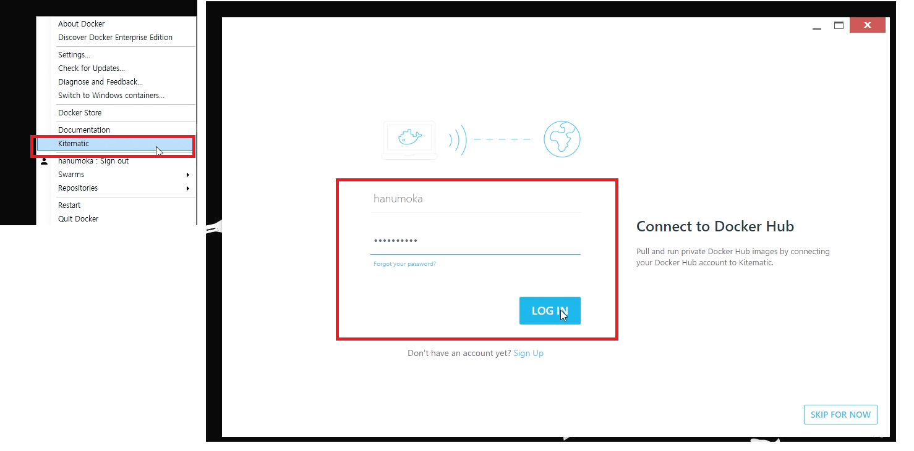
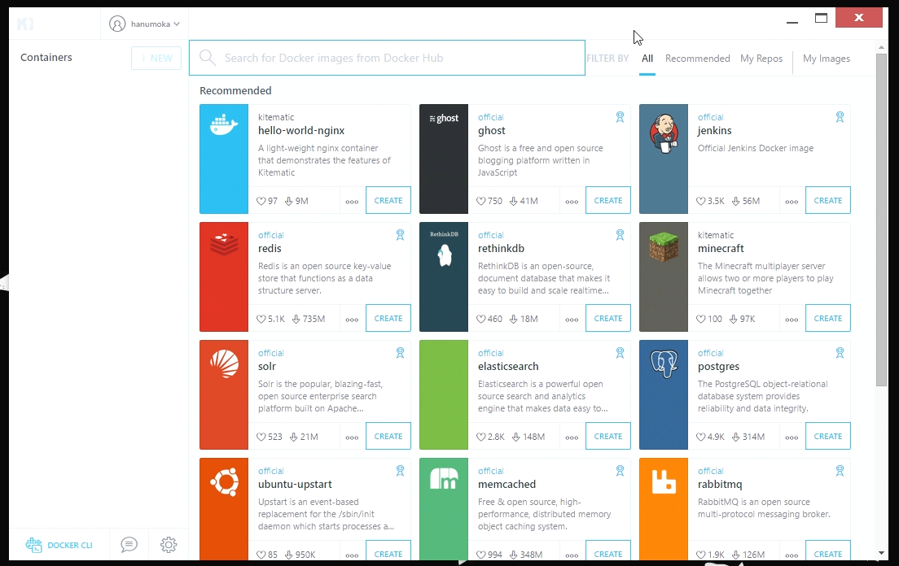
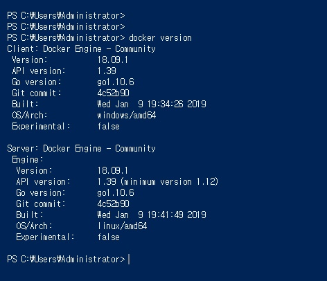

## Window10 pro Docker 설치하기

Windows10 pro에 docker를 설치하는 방법이다. Windows10 pro는 Docker Tool Box를 설치하지 않는다. Windows10 Pro 에는 hyper-V가 기본 탑재되어 있다.

> **사내망의 경우 외부 폐쇄 네트워크 제약으로 DLP 프로그램 설치 전에 작업하도록 한다.**

#### 1. 사전 준비

- "작업관리자-성능" 탭을 확인하여 CPU가 가상화를 지원하는지 확인한다.

- "Windows 설정-Windows 기능 켜기/끄기"에서 Hyper-V 기능을 활성화 한다

#### 2. Window10 pro Docker 설치하기

[https://download.docker.com/win/stable/Docker for Windows Installer.exe](https://download.docker.com/win/stable/Docker%20for%20Windows%20Installer.exe)

설치 진행 중 윈도우는 로그아웃을 요청하며 다시 로그인 후 다시 도커가 시작되고 있는것을 확인 할 수 있다.

Docker가 시작되는대 조금 시간이 걸리며, Docker가 시작되면 아래처럼 로그인 창이 열린다. 
<https://hub.docker.com/> 에서 간단히 이메일을 통해 계정을 만든 뒤, 그 계정을 통하여 로그인 하면 Docker를 사용 할 수 있다.

윈도우 시스템 트레이 'Docker Desktop' 우 클릭 - Settings에 들어가서 아래와 같이 without TLS 옵션을 활성화시킨다. (참고로 사내망의 경우 폐쇄 네트워크로 인해 우 클릭 메뉴 진입이 불가하다. 그래서 DLP 설치 전 작업하기를 바란다.)

#### 3. Kitematic 설치하기 (선택사항)

Kitematic is a simple application for managing Docker containers on Mac, Linux and Windows.

Docker 이미지 검색과 이를 컨네이터로 실행 관리하는 Tool이다.

아래와 같이 .zip 파일을 다운로드 받고 압축해제하여 폴더명을 Kitematic로 변경하고 C:\Program Files\Docker 폴더로 이동 시키자.

Kitematic을 실행해보자.

#### 4. Docker 설치 확인

Kitematic 좌측 하단 부 "Docker CLI" 버튼 또는 Window Powershell을 연다.

#### 5. Kubenetes 설치하기(선택사항)

Single node cluster 설치가 가능하다. (외부 인터넷 필요)

