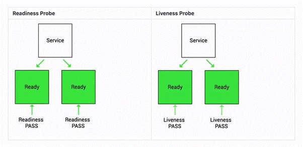

# liveness or readiness probe


## 1. 개념

 k8s 는 컨테이너의 상태를 주기적으로 체크 해서 문제가 있는 컨테이너를 자동으로 재시작 하거나 서비스에서 제외할 수 있다. 





### 1)	Rediness probe

-	Readiness probe는 k8s 에게 app이 트래픽을 전송할 준비가 되는 시기를 인지시킨다.
-	k8s는  서비스가 파드로 트래픽을 보내기 전에 readiness probe pass 인지를 확인한다.
-	만약 readiness 가 실패한다면, k8s 는 다시 pass 될때까지 파드로 트래픽을 보내는 것을 중지 한다.

### 2)	Liveness probe

-	Liveness probes 는 k8s 에게 app 이 살아있는지 죽었는지 인지시킨다.
-	즉, 주기적으로 체크해서 응답이 없으면 kubelet 을 통해서 컨테이너를 자동으로 재시작시킨다.
-	Liveness fail 시에는 다시 pass할때까지 k8s 는 파드를 restart 시킨다. ? 매우 중요
-	앱이 다시 준비될때까지 조사가 시작되지 않는다는 점을 명심해야 함. 그렇지 않으면 앱이 계속해서 restart 됨.  

### 3)	두개 차이점

- Liveness probe는 컨테이너의 상태가 비정상이라고 판단하면, 해당 Pod를 재시작

- Readiness probe는 컨테이너가 비정상일 경우에는 해당 Pod를 사용할 수 없음으로 표시하고, 서비스등에서 제외


## 2. 시나리오
###  시나리오1

- 만약 App 이 warm up 되고 시작되는데 1분이 소요되는 시나리오를 상상해 보자.

- 비록 프로세스가 이미 시작되었더라도 서비스는 파드가 running 되기전까지는 작동하지 않는다.

- scale out 의 상황에서도 마찬가지이다. scale out 시 카피된 파드가 완전히 준비되기 전까지는 트래픽을 받을 수 없다.

- 하지만 컨테이너내부의 프로세스가 시작되자마자 트래픽을 보내기 시작하는 것이 기본값이다.

- readiness probe 를 사용하므로서, k8s 는 app 이 완전히 start 될때가지 서비스를 대기할  수 있다.


### 시나리오2

-	deadlock 과 같은 nasty case 의 app 이 있다고 상상해 보자.
-	기본적으로 프로세스는 계속 살아 있기 때문에, k8s 모든상황이 정상(fine) 이라고 생각하며 broken pod 에게도 request 보내는것을 계속 진행한다.
-	liveness probe 를 이용함으로써, k8s 는 app 이 request를 받을 수 있는지 판단할 수 있다.  만약 liveness fail 이면 pod 를 restart 시킨다.


## 3. 3가지 조사방법
### 1) HTTP
-	가장 많이 사용하는 방식으로 HTTP GET 을 이용하 컨테이너의 상태를 체크함
-	지정된 URL 로 HTTP GET 요청하여 HTTP 응답코드가 200~300 사이이면 정상으로 판단, 그외 값이면 비정상으로 판단
```
readinessProbe:
  httpGet:
    path: /readiness
    port: 8080
```
-	DDos 공격등을 받을 수 있으므로 필요하다면 서비스포트와 porbe 포트를 분리해서 구성할수 있다.

### 2) Command
-	컨테이너 상태체크를 쉘 명령으로 수행한다.
-	결과값이 0 이면 성공, 0이 아니면 실패로 간주
```
livenessProbe:
  exec:
    command:
    - cat
    - /tmp/healthy
  initialDelaySeconds: 5
  periodSeconds: 5
```

### 3) TCP
-	지정된 포트에 tcp 연결을 시도하여 연결 성공시 컨테이너 정상으로 판단.
```
livenessProbe:
  exec:
    command:
    - cat
    - /tmp/healthy
  initialDelaySeconds: 5
  periodSeconds: 5
```


## 4. Configuring Probes
-	initialDelaySeconds
    . initialDelaySecond 에 설정된 값 만큼 대기 후 컨테이너의 헬스체크 함. 
    . 이렇게 하는 이유는 컨테이너가 기동되면서 애플리케이션이 기동될텐데 설정정보나 각종 초기화 작업이 필요하기 때문임. 
    . 만약 이 과정을 무시하면 컨테이너가 기동중에 헬스체크를 하게 되므로 시간을 주는 것임.
-	periodSeconds
    . periodSeconds 주기 단위로 컨테이너 헬스체크 함.
-	timeoutSeconds
    . timeout 을 명시
-	successThreshold
    . 해당 횟수만큼만 헬스체크를 시도함.
-	failureThreshold
    . 실패횟수를 명시함. 해당 횟수만큼만 헬스체크를 시도하고 이후엔 시도하지 않음


## 5. 샘플 yaml file
### liveness probe
```
apiVersion: v1
kind: Pod
metadata:
  labels:
    test: liveness
  name: liveness-http
spec:
  containers:
  - name: liveness
    image: k8s.gcr.io/liveness
    args:
    - /server
    livenessProbe:
      httpGet:
        path: /healthz
        port: 8080
        httpHeaders:
        - name: X-Custom-Header
          value: Awesome
      initialDelaySeconds: 3
      periodSeconds: 3
```

### readiness probe
```
readinessProbe:
  exec:
    command:
    - cat
    - /tmp/healthy
  initialDelaySeconds: 5
  periodSeconds: 5
```